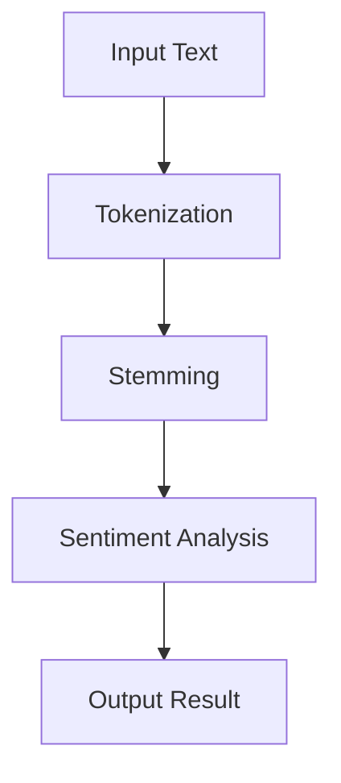

## 17.6. Natural Language Processing (NLP) with Elixir

Natural Language Processing (NLP) is a field of artificial intelligence that focuses on the interaction between computers and humans through natural language. In this section, we will explore how Elixir, a functional programming language known for its concurrency and fault-tolerance, can be leveraged for NLP tasks. We will delve into text processing techniques, useful libraries, integration with external NLP services, and practical applications such as chatbots and language translation.

### Text Processing

Text processing is the foundation of NLP, involving the conversion of raw text into a format that can be analyzed. Let's explore some key text processing techniques:

#### Tokenization

Tokenization is the process of breaking down text into smaller units called tokens, which can be words, phrases, or symbols. This is a crucial step in NLP as it allows for the analysis of text at a granular level.

```elixir
defmodule Tokenizer do
  @doc """
  Tokenizes a given string into words.
  """
  def tokenize(text) do
    String.split(text, ~r/\W+/)
  end
end

# Example usage
text = "Elixir is a dynamic, functional language."
tokens = Tokenizer.tokenize(text)
IO.inspect(tokens) # ["Elixir", "is", "a", "dynamic", "functional", "language"]
```

#### Stemming

Stemming reduces words to their base or root form. This helps in normalizing text for analysis by reducing inflected words to a common base form.

```elixir
defmodule Stemmer do
  @doc """
  A simple stemming function that removes common suffixes.
  """
  def stem(word) do
    word
    |> String.downcase()
    |> String.replace(~r/(ing|ed|ly)$/, "")
  end
end

# Example usage
word = "running"
stemmed_word = Stemmer.stem(word)
IO.inspect(stemmed_word) # "run"
```

#### Sentiment Analysis

Sentiment analysis involves determining the emotional tone behind words. It is used to understand the sentiment expressed in a piece of text.

```elixir
defmodule SentimentAnalyzer do
  @positive_words ["happy", "joy", "love", "excellent"]
  @negative_words ["sad", "hate", "terrible", "bad"]

  @doc """
  Analyzes the sentiment of a given text.
  """
  def analyze_sentiment(text) do
    words = String.split(text, ~r/\W+/)
    score = Enum.reduce(words, 0, fn word, acc ->
      cond do
        word in @positive_words -> acc + 1
        word in @negative_words -> acc - 1
        true -> acc
      end
    end)

    cond do
      score > 0 -> :positive
      score < 0 -> :negative
      true -> :neutral
    end
  end
end

# Example usage
text = "I love Elixir, it's excellent!"
sentiment = SentimentAnalyzer.analyze_sentiment(text)
IO.inspect(sentiment) # :positive
```

### Libraries and Tools

Elixir offers several libraries and tools that facilitate NLP tasks. Let's explore some of the most useful ones:

#### Stemmer

The `Stemmer` library in Elixir provides functions for stemming words, making it easier to perform text normalization.

```elixir
# Add Stemmer to your mix.exs dependencies
defp deps do
  [
    {:stemmer, "~> 1.0"}
  ]
end

# Example usage
word = "running"
stemmed_word = Stemmer.stem(word)
IO.inspect(stemmed_word) # "run"
```

#### Elasticlunr

`Elasticlunr` is a small, full-text search library for Elixir, inspired by Lunr.js. It can be used for indexing and searching text, which is useful in building search engines and performing text analysis.

```elixir
# Add Elasticlunr to your mix.exs dependencies
defp deps do
  [
    {:elasticlunr, "~> 0.1.0"}
  ]
end

# Example usage
index = Elasticlunr.new()
index = Elasticlunr.add(index, %{id: 1, title: "Elixir programming", content: "Elixir is a dynamic, functional language."})
results = Elasticlunr.search(index, "functional")
IO.inspect(results) # [%{id: 1, score: 0.5}]
```

### Integration with NLP Services

While Elixir provides powerful tools for NLP, integrating with external services can enhance its capabilities. Let's explore how to connect with popular NLP APIs:

#### Google NLP API

Google's NLP API offers a suite of tools for analyzing text, including sentiment analysis, entity recognition, and syntax analysis.

```elixir
defmodule GoogleNLP do
  @api_url "https://language.googleapis.com/v1/documents:analyzeSentiment"

  def analyze_sentiment(text, api_key) do
    body = %{
      document: %{
        type: "PLAIN_TEXT",
        content: text
      }
    }
    |> Jason.encode!()

    headers = [
      {"Content-Type", "application/json"},
      {"Authorization", "Bearer #{api_key}"}
    ]

    HTTPoison.post(@api_url, body, headers)
  end
end

# Example usage
api_key = "your_google_api_key"
text = "Elixir is amazing!"
{:ok, response} = GoogleNLP.analyze_sentiment(text, api_key)
IO.inspect(response.body)
```

#### IBM Watson NLP

IBM Watson provides a robust set of NLP tools, including language translation and sentiment analysis.

```elixir
defmodule IBMWatsonNLP do
  @api_url "https://api.us-south.natural-language-understanding.watson.cloud.ibm.com/instances/your-instance-id/v1/analyze"

  def analyze_text(text, api_key) do
    body = %{
      text: text,
      features: %{
        sentiment: %{}
      }
    }
    |> Jason.encode!()

    headers = [
      {"Content-Type", "application/json"},
      {"Authorization", "Basic #{Base.encode64("apikey:#{api_key}")}"}
    ]

    HTTPoison.post(@api_url, body, headers)
  end
end

# Example usage
api_key = "your_ibm_watson_api_key"
text = "Elixir is amazing!"
{:ok, response} = IBMWatsonNLP.analyze_text(text, api_key)
IO.inspect(response.body)
```

### Applications

NLP can be applied in various domains to create innovative solutions. Let's explore some practical applications:

#### Chatbots

Chatbots can engage in conversations with users, providing information, answering questions, and performing tasks. Elixir's concurrency model makes it ideal for handling multiple chatbot interactions simultaneously.

```elixir
defmodule Chatbot do
  def respond(input) do
    case input do
      "hello" -> "Hi there! How can I help you today?"
      "bye" -> "Goodbye! Have a great day!"
      _ -> "I'm sorry, I didn't understand that."
    end
  end
end

# Example usage
IO.puts(Chatbot.respond("hello")) # "Hi there! How can I help you today?"
```

#### Content Analysis

Content analysis involves extracting meaningful information from text, such as identifying topics, entities, and sentiments. This can be used in applications like news aggregation, social media monitoring, and market research.

```elixir
defmodule ContentAnalyzer do
  def analyze(text) do
    # Perform tokenization, sentiment analysis, etc.
    tokens = Tokenizer.tokenize(text)
    sentiment = SentimentAnalyzer.analyze_sentiment(text)

    %{tokens: tokens, sentiment: sentiment}
  end
end

# Example usage
text = "Elixir is a powerful language for building scalable applications."
analysis = ContentAnalyzer.analyze(text)
IO.inspect(analysis)
```

#### Language Translation

Language translation involves converting text from one language to another. While Elixir doesn't have built-in translation capabilities, it can integrate with external APIs to perform translation tasks.

```elixir
defmodule Translator do
  @api_url "https://translation.googleapis.com/language/translate/v2"

  def translate(text, target_lang, api_key) do
    params = URI.encode_query(%{
      q: text,
      target: target_lang,
      key: api_key
    })

    HTTPoison.get("#{@api_url}?#{params}")
  end
end

# Example usage
api_key = "your_google_translate_api_key"
text = "Hello, world!"
{:ok, response} = Translator.translate(text, "es", api_key)
IO.inspect(response.body)
```

### Visualizing NLP Processes

To better understand the flow of NLP processes in Elixir, let's visualize a simple NLP pipeline using a flowchart:


```mermaid
graph TD;
    A[Input Text] --> B[Tokenization];
    B --> C[Stemming];
    C --> D[Sentiment Analysis];
    D --> E[Output Result];
```

**Description:** This flowchart represents a basic NLP pipeline where input text undergoes tokenization, stemming, and sentiment analysis, resulting in an output that can be used for further processing or decision-making.

### Knowledge Check

To reinforce your understanding of NLP with Elixir, consider the following questions:

- How does tokenization aid in text analysis?
- Why is stemming important in NLP?
- What are some practical applications of sentiment analysis?
- How can Elixir's concurrency model benefit chatbot development?

### Embrace the Journey

Remember, this is just the beginning of your journey into NLP with Elixir. As you explore more complex NLP tasks, you'll discover the power and flexibility Elixir offers for building scalable and efficient applications. Keep experimenting, stay curious, and enjoy the journey!

## Quiz Time!



### What is tokenization in NLP?

- [x] Breaking down text into smaller units called tokens
- [ ] Converting text into binary data
- [ ] Translating text from one language to another
- [ ] Compressing text for storage

> **Explanation:** Tokenization is the process of breaking down text into smaller units called tokens, which can be words, phrases, or symbols.

### Which library in Elixir is used for stemming words?

- [x] Stemmer
- [ ] Elasticlunr
- [ ] Poison
- [ ] ExUnit

> **Explanation:** The `Stemmer` library in Elixir provides functions for stemming words, making it easier to perform text normalization.

### What is the purpose of sentiment analysis?

- [x] Determining the emotional tone behind words
- [ ] Translating text into multiple languages
- [ ] Compressing text for efficient storage
- [ ] Encrypting text for security

> **Explanation:** Sentiment analysis involves determining the emotional tone behind words, helping to understand the sentiment expressed in a piece of text.

### How does Elixir's concurrency model benefit chatbot development?

- [x] It allows handling multiple interactions simultaneously
- [ ] It speeds up the translation process
- [ ] It enhances the accuracy of sentiment analysis
- [ ] It reduces the size of text data

> **Explanation:** Elixir's concurrency model allows handling multiple chatbot interactions simultaneously, making it ideal for developing scalable chatbots.

### Which API can be used for language translation in Elixir?

- [x] Google Translate API
- [ ] IBM Watson API
- [ ] Elasticlunr
- [ ] ExUnit

> **Explanation:** The Google Translate API can be used for language translation tasks in Elixir.

### What is the first step in a basic NLP pipeline?

- [x] Tokenization
- [ ] Sentiment Analysis
- [ ] Stemming
- [ ] Translation

> **Explanation:** Tokenization is typically the first step in a basic NLP pipeline, breaking down text into tokens for further processing.

### Which Elixir library is inspired by Lunr.js for full-text search?

- [x] Elasticlunr
- [ ] Stemmer
- [ ] Poison
- [ ] ExUnit

> **Explanation:** `Elasticlunr` is a small, full-text search library for Elixir, inspired by Lunr.js.

### What does stemming achieve in text processing?

- [x] Reduces words to their base or root form
- [ ] Splits text into sentences
- [ ] Converts text into binary format
- [ ] Encrypts text for security

> **Explanation:** Stemming reduces words to their base or root form, helping in normalizing text for analysis.

### Which of the following is a practical application of NLP?

- [x] Chatbots
- [ ] Image Processing
- [ ] Video Compression
- [ ] Audio Filtering

> **Explanation:** Chatbots are a practical application of NLP, engaging in conversations with users and performing tasks.

### True or False: Elixir has built-in translation capabilities.

- [ ] True
- [x] False

> **Explanation:** Elixir does not have built-in translation capabilities, but it can integrate with external APIs to perform translation tasks.


