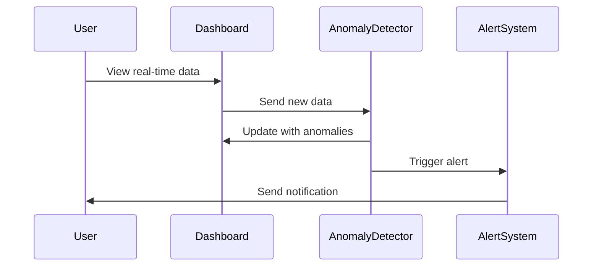

## 17.7. Real-Time Analytics and Anomaly Detection

In the realm of data science and machine learning, real-time analytics and anomaly detection are crucial for maintaining the health and security of systems. Elixir, with its concurrency model and fault-tolerant design, provides a robust platform for implementing these capabilities. In this section, we will explore how to leverage Elixir for real-time analytics and anomaly detection, focusing on monitoring systems, anomaly detection algorithms, and alerting mechanisms.

### Monitoring Systems

Monitoring systems are essential for visualizing live data and understanding the current state of a system. They provide insights into performance, usage patterns, and potential issues. Implementing effective monitoring systems involves creating dashboards that can display real-time data and update dynamically as new data arrives.

#### Implementing Dashboards for Live Data Visualization

Dashboards are the front-end of monitoring systems, providing a visual representation of data that is easy to interpret. In Elixir, we can use the Phoenix framework to build web-based dashboards that update in real-time using channels and websockets.

```elixir
defmodule MyAppWeb.DashboardChannel do
  use Phoenix.Channel

  def join("dashboard:lobby", _message, socket) do
    {:ok, socket}
  end

  def handle_in("new_data", %{"data" => data}, socket) do
    broadcast!(socket, "update", %{"data" => data})
    {:noreply, socket}
  end
end
```

In this example, we define a Phoenix channel that listens for incoming data and broadcasts updates to all connected clients. This allows the dashboard to reflect real-time changes as they occur.

#### Visualizing Data with Charts

To visualize data effectively, we can integrate charting libraries such as Chart.js or D3.js with our Phoenix application. These libraries provide a wide range of chart types, from simple line charts to complex heatmaps.

```html
<canvas id="myChart" width="400" height="400"></canvas>
<script>
  var ctx = document.getElementById('myChart').getContext('2d');
  var myChart = new Chart(ctx, {
      type: 'line',
      data: {
          labels: ['January', 'February', 'March', 'April', 'May', 'June', 'July'],
          datasets: [{
              label: '# of Votes',
              data: [12, 19, 3, 5, 2, 3, 7],
              borderWidth: 1
          }]
      }
  });
</script>
```

This HTML snippet demonstrates how to create a simple line chart using Chart.js. By updating the data dynamically through Phoenix channels, we can ensure that the chart reflects the latest information.

### Anomaly Detection Algorithms

Anomaly detection involves identifying patterns in data that do not conform to expected behavior. These anomalies can indicate potential issues such as security breaches, system failures, or fraudulent activities.

#### Identifying Outliers and Unusual Patterns

There are several algorithms for detecting anomalies, each with its strengths and weaknesses. Common approaches include statistical methods, clustering, and machine learning models.

##### Statistical Methods

Statistical methods involve defining a normal range for data and flagging any points outside this range as anomalies. This approach is simple and effective for data with a well-defined distribution.

```elixir
defmodule AnomalyDetection do
  def detect_anomalies(data, threshold) do
    mean = Enum.sum(data) / length(data)
    std_dev = :math.sqrt(Enum.sum(Enum.map(data, fn x -> :math.pow(x - mean, 2) end)) / length(data))

    Enum.filter(data, fn x -> abs(x - mean) > threshold * std_dev end)
  end
end
```

In this Elixir module, we calculate the mean and standard deviation of a dataset and identify points that deviate significantly from the mean.

##### Clustering

Clustering algorithms, such as k-means, group data points into clusters based on similarity. Points that do not belong to any cluster are considered anomalies.

```elixir
defmodule KMeans do
  def cluster(data, k) do
    # Implementation of k-means clustering
  end

  def detect_anomalies(data, clusters) do
    Enum.filter(data, fn point -> not in_any_cluster?(point, clusters) end)
  end

  defp in_any_cluster?(point, clusters) do
    Enum.any?(clusters, fn cluster -> distance(point, cluster) < threshold end)
  end

  defp distance(point1, point2) do
    :math.sqrt(Enum.sum(Enum.zip_with(point1, point2, fn x, y -> :math.pow(x - y, 2) end)))
  end
end
```

This module outlines a basic structure for implementing k-means clustering in Elixir. The `detect_anomalies` function identifies points that do not fit into any cluster.

##### Machine Learning Models

Machine learning models, such as neural networks or support vector machines, can learn complex patterns in data and identify anomalies based on deviations from these patterns.

```elixir
defmodule NeuralNetwork do
  def train(data) do
    # Train a neural network model
  end

  def predict(model, data) do
    # Use the model to predict anomalies
  end
end
```

In this module, we define functions for training a neural network model and using it to predict anomalies. This approach is powerful but requires more computational resources and data.

### Alerting Mechanisms

Once anomalies are detected, it is crucial to notify users or systems promptly. Alerting mechanisms can be implemented using various methods, such as email notifications, SMS alerts, or integration with monitoring tools.

#### Notifying Users or Systems When Anomalies Are Detected

Elixir's concurrency model makes it well-suited for handling multiple alerting channels simultaneously. We can use libraries like Swoosh for email notifications or ExTwilio for SMS alerts.

```elixir
defmodule Alerting do
  use Swoosh.Mailer, otp_app: :my_app

  def send_email_alert(to, subject, body) do
    new_email()
    |> to(to)
    |> from("alert@myapp.com")
    |> subject(subject)
    |> text_body(body)
    |> deliver()
  end

  def send_sms_alert(to, message) do
    ExTwilio.Message.create(to: to, from: "+1234567890", body: message)
  end
end
```

This module demonstrates how to send email and SMS alerts using Swoosh and ExTwilio. By integrating these alerts with our anomaly detection system, we can ensure that users are informed of potential issues in real-time.

### Use Cases

Real-time analytics and anomaly detection have numerous applications across various domains. Here are a few examples:

- **System Monitoring**: Detecting performance issues or failures in IT infrastructure.
- **Cybersecurity**: Identifying unauthorized access or data breaches.
- **Operations Management**: Monitoring production lines for inefficiencies or malfunctions.

### Visualizing Real-Time Analytics and Anomaly Detection

To better understand the flow of data and the detection of anomalies, we can use a sequence diagram to illustrate the process.



This diagram shows how data flows from the user to the dashboard, where it is analyzed for anomalies. If an anomaly is detected, an alert is triggered and sent to the user.

### Knowledge Check

Before we conclude, let's reinforce what we've learned with a few questions:

- What are the key components of a monitoring system in Elixir?
- How can statistical methods be used for anomaly detection?
- What are the advantages of using machine learning models for anomaly detection?
- How can Elixir's concurrency model benefit alerting mechanisms?

### Try It Yourself

To deepen your understanding, try modifying the code examples provided:

- Experiment with different chart types and data sources in the dashboard.
- Implement a new anomaly detection algorithm, such as a decision tree or isolation forest.
- Integrate additional alerting channels, such as Slack or webhook notifications.

### Conclusion

Real-time analytics and anomaly detection are powerful tools for maintaining the health and security of systems. By leveraging Elixir's capabilities, we can build robust solutions that provide timely insights and alerts. Remember, this is just the beginning. As you progress, you'll discover more advanced techniques and applications. Keep experimenting, stay curious, and enjoy the journey!

## Quiz: Real-Time Analytics and Anomaly Detection



### What is the primary purpose of a monitoring system in Elixir?

- [x] To visualize live data and understand the current state of a system
- [ ] To store historical data for future analysis
- [ ] To replace traditional databases
- [ ] To generate random data for testing

> **Explanation:** Monitoring systems are designed to provide insights into performance, usage patterns, and potential issues by visualizing live data.

### Which Elixir framework is commonly used to build web-based dashboards?

- [x] Phoenix
- [ ] Ecto
- [ ] Nerves
- [ ] ExUnit

> **Explanation:** The Phoenix framework is commonly used to build web-based dashboards in Elixir, leveraging channels and websockets for real-time updates.

### What is a common approach for detecting anomalies in data?

- [x] Statistical methods
- [ ] Sorting algorithms
- [ ] Data compression
- [ ] Encryption

> **Explanation:** Statistical methods are a common approach for detecting anomalies by defining a normal range for data and flagging points outside this range.

### How can clustering algorithms help in anomaly detection?

- [x] By grouping data points into clusters and identifying points that do not belong to any cluster
- [ ] By encrypting data points to ensure security
- [ ] By sorting data points in ascending order
- [ ] By compressing data points to save space

> **Explanation:** Clustering algorithms group data points into clusters based on similarity, and points that do not belong to any cluster are considered anomalies.

### What is a benefit of using machine learning models for anomaly detection?

- [x] They can learn complex patterns in data and identify anomalies based on deviations from these patterns
- [ ] They require minimal computational resources
- [ ] They are always more accurate than statistical methods
- [ ] They eliminate the need for data preprocessing

> **Explanation:** Machine learning models can learn complex patterns in data and identify anomalies based on deviations from these patterns, making them powerful tools for anomaly detection.

### Which library can be used for sending email notifications in Elixir?

- [x] Swoosh
- [ ] Ecto
- [ ] Phoenix
- [ ] Nerves

> **Explanation:** Swoosh is a library in Elixir used for sending email notifications, making it suitable for alerting mechanisms.

### What is the role of the AlertSystem in the sequence diagram?

- [x] To trigger alerts and send notifications to users
- [ ] To store historical data
- [ ] To generate random data
- [ ] To replace traditional databases

> **Explanation:** The AlertSystem in the sequence diagram is responsible for triggering alerts and sending notifications to users when anomalies are detected.

### How can Elixir's concurrency model benefit alerting mechanisms?

- [x] By handling multiple alerting channels simultaneously
- [ ] By encrypting alerts for security
- [ ] By sorting alerts in ascending order
- [ ] By compressing alerts to save space

> **Explanation:** Elixir's concurrency model allows it to handle multiple alerting channels simultaneously, making it well-suited for implementing alerting mechanisms.

### What is a use case for real-time analytics and anomaly detection?

- [x] System monitoring
- [ ] Data compression
- [ ] Sorting algorithms
- [ ] Encryption

> **Explanation:** Real-time analytics and anomaly detection are used in system monitoring to detect performance issues or failures in IT infrastructure.

### True or False: Anomaly detection can only be performed using machine learning models.

- [ ] True
- [x] False

> **Explanation:** Anomaly detection can be performed using various methods, including statistical methods, clustering, and machine learning models.


