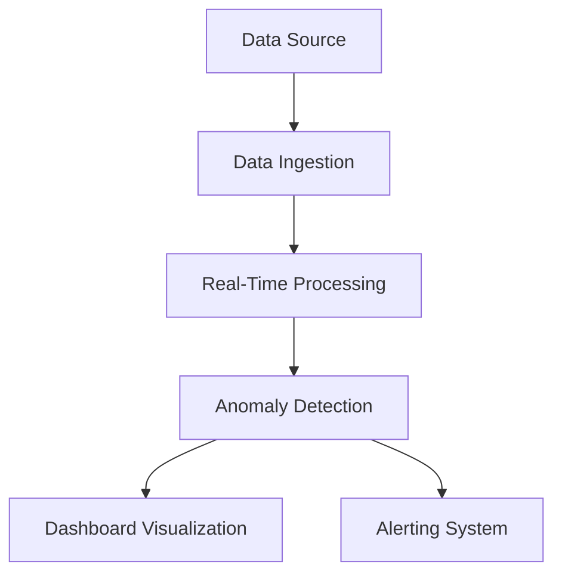

## 17.7. Real-Time Analytics and Anomaly Detection

In the rapidly evolving landscape of data-driven decision-making, real-time analytics and anomaly detection have become crucial components for organizations aiming to maintain operational efficiency, security, and customer satisfaction. Elixir, with its robust concurrency model and fault-tolerant architecture, offers a powerful platform for implementing these systems. In this section, we will delve into the concepts, techniques, and tools necessary to build effective real-time analytics and anomaly detection systems using Elixir.

### Monitoring Systems

Monitoring systems are the backbone of real-time analytics, providing the ability to visualize, track, and analyze data as it flows through your application. In Elixir, we can leverage various tools and libraries to build efficient monitoring systems.

#### Implementing Dashboards for Live Data Visualization

Dashboards are an essential component of monitoring systems, offering a visual representation of data that aids in quick decision-making. In Elixir, Phoenix LiveView is a powerful tool for building interactive, real-time dashboards.

**Example: Building a Simple Dashboard with Phoenix LiveView**

```elixir
defmodule MyAppWeb.DashboardLive do
  use Phoenix.LiveView

  def mount(_params, _session, socket) do
    {:ok, assign(socket, :metrics, fetch_metrics())}
  end

  def handle_info(:update_metrics, socket) do
    {:noreply, assign(socket, :metrics, fetch_metrics())}
  end

  defp fetch_metrics do
    # Simulate fetching real-time metrics
    %{
      cpu_usage: :rand.uniform(100),
      memory_usage: :rand.uniform(100),
      request_count: :rand.uniform(1000)
    }
  end
end
```

In this example, we use `Phoenix.LiveView` to create a live dashboard that updates metrics in real-time. The `fetch_metrics/0` function simulates the retrieval of real-time data, which could be replaced with actual data sources in a production environment.

**Try It Yourself:** Modify the `fetch_metrics/0` function to pull data from a real-time source, such as a database or an external API.

#### Visualizing Data with Charts

Visual representations such as charts can enhance the understanding of complex data patterns. Libraries like `Chartkick` can be integrated with Phoenix to create dynamic charts.

**Example: Integrating Chartkick**

```elixir
defmodule MyAppWeb.PageView do
  use MyAppWeb, :view
  use Chartkick, otp_app: :my_app
end

# In your template (e.g., .html.eex)
<%= line_chart @metrics, id: "metrics-chart" %>
```

### Anomaly Detection Algorithms

Anomaly detection involves identifying patterns in data that do not conform to expected behavior. This can be critical in various domains such as fraud detection, network security, and system performance monitoring.

#### Identifying Outliers and Unusual Patterns

In Elixir, we can implement anomaly detection algorithms using libraries such as `Nx` for numerical computations and `EXLA` for accelerated machine learning.

**Example: Simple Statistical Anomaly Detection**

```elixir
defmodule AnomalyDetector do
  def detect_anomalies(data) do
    mean = Enum.sum(data) / length(data)
    std_dev = :math.sqrt(Enum.sum(Enum.map(data, fn x -> :math.pow(x - mean, 2) end)) / length(data))

    Enum.filter(data, fn x -> abs(x - mean) > 2 * std_dev end)
  end
end
```

This example demonstrates a basic statistical approach to anomaly detection, where we calculate the mean and standard deviation of the data and identify points that deviate significantly from the mean.

**Try It Yourself:** Experiment with different thresholds for anomaly detection and explore more sophisticated algorithms such as clustering or machine learning models.

#### Machine Learning-Based Anomaly Detection

For more complex scenarios, machine learning models can be employed to detect anomalies. Elixir's interoperability with Python and other languages allows us to leverage existing machine learning libraries.

**Example: Integrating Python with Elixir for Anomaly Detection**

```elixir
defmodule PythonAnomalyDetector do
  def detect_anomalies(data) do
    {:ok, pid} = :python.start_link(python_path: 'path/to/python/scripts')
    :python.call(pid, :anomaly_detector, :detect, [data])
  end
end
```

In this example, we use the `:python` library to call a Python script that performs anomaly detection, allowing us to harness the power of Python's machine learning ecosystem.

### Alerting Mechanisms

Once anomalies are detected, it's crucial to have a robust alerting mechanism to notify users or systems promptly.

#### Notifying Users or Systems When Anomalies Are Detected

Alerting can be implemented using various communication channels such as email, SMS, or webhooks. In Elixir, libraries like `Swoosh` for email and `ExTwilio` for SMS can be utilized.

**Example: Sending Email Alerts with Swoosh**

```elixir
defmodule AlertSender do
  import Swoosh.Email

  def send_alert(email, message) do
    new()
    |> to(email)
    |> from("alerts@myapp.com")
    |> subject("Anomaly Detected")
    |> text_body(message)
    |> MyApp.Mailer.deliver()
  end
end
```

This example demonstrates how to send an email alert using `Swoosh`. The `send_alert/2` function constructs an email and sends it using the configured mailer.

**Try It Yourself:** Implement SMS or webhook notifications for alerting, and customize the alert messages based on the severity of the anomaly.

### Use Cases

Real-time analytics and anomaly detection have a wide range of applications across various industries. Let's explore some common use cases.

#### System Monitoring

In system monitoring, real-time analytics can help track system performance metrics such as CPU usage, memory consumption, and network activity. Anomaly detection can identify unusual spikes in resource usage, indicating potential issues.

#### Cybersecurity

In cybersecurity, anomaly detection is used to identify suspicious activities such as unauthorized access attempts or data breaches. Real-time analytics enables security teams to respond quickly to threats.

#### Operations Management

In operations management, real-time analytics can optimize processes by monitoring key performance indicators (KPIs) and detecting deviations from expected patterns. This can lead to improved efficiency and cost savings.

### Visualizing Real-Time Analytics and Anomaly Detection

To better understand the flow of data and the interaction between various components in a real-time analytics and anomaly detection system, we can use diagrams to visualize the architecture.


```mermaid
flowchart TD
    A[Data Source] --> B[Data Ingestion]
    B --> C[Real-Time Processing]
    C --> D[Anomaly Detection]
    D --> E[Dashboard Visualization]
    D --> F[Alerting System]
```

**Diagram Description:** This flowchart illustrates a typical architecture for real-time analytics and anomaly detection. Data is ingested from various sources, processed in real-time, and anomalies are detected. Results are visualized on a dashboard, and alerts are sent when anomalies are found.

### Summary

In this section, we've explored the implementation of real-time analytics and anomaly detection systems using Elixir. We've covered the creation of monitoring dashboards, the application of anomaly detection algorithms, and the development of alerting mechanisms. Real-time analytics and anomaly detection are powerful tools for maintaining operational efficiency and security in various domains.

### Key Takeaways

- Elixir's concurrency model and fault-tolerant architecture make it ideal for real-time analytics.
- Dashboards can be built using Phoenix LiveView for live data visualization.
- Anomaly detection can be implemented using statistical methods or machine learning models.
- Alerting mechanisms can notify users or systems of detected anomalies through various channels.

### References and Further Reading

- [Phoenix LiveView Documentation](https://hexdocs.pm/phoenix_live_view/Phoenix.LiveView.html)
- [Nx: Numerical Elixir](https://github.com/elixir-nx/nx)
- [Swoosh Email Library](https://hexdocs.pm/swoosh/readme.html)
- [Python Integration with Elixir](https://hexdocs.pm/python/)

## Quiz Time!



### What is a primary benefit of using Elixir for real-time analytics?

- [x] Concurrency model and fault tolerance
- [ ] Extensive machine learning libraries
- [ ] Built-in data visualization tools
- [ ] Native support for Python integration

> **Explanation:** Elixir's concurrency model and fault tolerance make it ideal for real-time analytics, allowing efficient handling of concurrent data streams.

### Which tool can be used to build interactive real-time dashboards in Elixir?

- [x] Phoenix LiveView
- [ ] Ecto
- [ ] ExUnit
- [ ] Swoosh

> **Explanation:** Phoenix LiveView is used to build interactive, real-time dashboards in Elixir.

### What is a simple statistical method for anomaly detection?

- [x] Calculating mean and standard deviation
- [ ] Using supervised learning models
- [ ] Implementing a neural network
- [ ] Applying clustering algorithms

> **Explanation:** Calculating mean and standard deviation is a basic statistical method for detecting anomalies by identifying data points that deviate significantly from the mean.

### Which library is used for sending email alerts in Elixir?

- [x] Swoosh
- [ ] ExTwilio
- [ ] GenServer
- [ ] Phoenix

> **Explanation:** Swoosh is a library used for sending email alerts in Elixir.

### What is a common use case for anomaly detection in cybersecurity?

- [x] Identifying unauthorized access attempts
- [ ] Optimizing resource allocation
- [ ] Monitoring CPU usage
- [ ] Visualizing data trends

> **Explanation:** Anomaly detection in cybersecurity is commonly used to identify unauthorized access attempts, enhancing security measures.

### How can Elixir leverage machine learning models for anomaly detection?

- [x] By integrating with Python libraries
- [ ] By using built-in Elixir machine learning libraries
- [ ] By employing GenServer processes
- [ ] By utilizing Phoenix LiveView

> **Explanation:** Elixir can leverage machine learning models for anomaly detection by integrating with Python libraries, allowing access to a wide range of ML tools.

### What is a key component of a monitoring system in real-time analytics?

- [x] Dashboards for data visualization
- [ ] ExUnit for testing
- [ ] GenServer for concurrency
- [ ] Ecto for database interaction

> **Explanation:** Dashboards for data visualization are a key component of a monitoring system in real-time analytics, providing insights into data patterns.

### Which Elixir library is used for numerical computations?

- [x] Nx
- [ ] Phoenix
- [ ] Swoosh
- [ ] ExUnit

> **Explanation:** Nx is used for numerical computations in Elixir, enabling advanced data processing capabilities.

### What is the purpose of alerting mechanisms in anomaly detection?

- [x] Notifying users or systems of detected anomalies
- [ ] Visualizing data trends
- [ ] Performing data ingestion
- [ ] Conducting statistical analysis

> **Explanation:** Alerting mechanisms notify users or systems of detected anomalies, enabling prompt responses to potential issues.

### True or False: Anomaly detection is only applicable in cybersecurity.

- [ ] True
- [x] False

> **Explanation:** Anomaly detection is applicable in various domains, including cybersecurity, system monitoring, and operations management.



Remember, this is just the beginning. As you progress, you'll build more complex and interactive real-time analytics systems. Keep experimenting, stay curious, and enjoy the journey!
