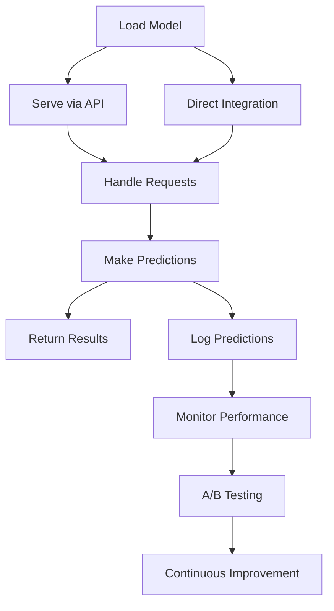

## 17.8. Deployment of ML Models in Elixir Applications

Deploying machine learning (ML) models in Elixir applications involves several key considerations, including serving models, ensuring scalability and performance, and implementing A/B testing for continuous improvement. In this section, we will explore these aspects in detail, providing insights and practical guidance for expert software engineers and architects.

### Serving Models

Serving ML models effectively is crucial for integrating intelligent features into applications. In Elixir, you can serve models by exposing them via APIs or integrating them directly into your application.

#### Exposing Models via APIs

One common approach to serving ML models is to expose them through RESTful or GraphQL APIs. This method allows you to decouple the model from the application, enabling easier updates and maintenance.

**Example: Serving a Model with Phoenix**

```elixir
defmodule MyAppWeb.ModelController do
  use MyAppWeb, :controller

  def predict(conn, %{"input" => input}) do
    # Load the model (e.g., from a file or database)
    model = load_model()

    # Make a prediction
    prediction = model |> predict(input)

    # Respond with the prediction
    json(conn, %{prediction: prediction})
  end

  defp load_model do
    # Logic to load your ML model
  end

  defp predict(model, input) do
    # Logic to make a prediction using the model
  end
end
```

In this example, we define a `ModelController` in a Phoenix application that handles prediction requests. The model is loaded and used to make predictions based on the input provided by the client.

#### Direct Integration

For applications where latency is a critical factor, directly integrating the model into the Elixir application can be beneficial. This approach reduces the overhead of network communication, providing faster predictions.

**Example: Direct Model Integration**

```elixir
defmodule MyApp.Model do
  def predict(input) do
    # Load the model once and store it in memory
    model = load_model()

    # Use the model to make a prediction
    model |> predict(input)
  end

  defp load_model do
    # Logic to load your ML model
  end

  defp predict(model, input) do
    # Logic to make a prediction using the model
  end
end
```

In this example, the model is loaded once and stored in memory, allowing for quick predictions without the need for repeated loading.

### Scalability and Performance

When deploying ML models, scalability and performance are critical considerations. Elixir's concurrency model and the BEAM VM provide powerful tools for optimizing these aspects.

#### Optimizing for Low-Latency Predictions

To achieve low-latency predictions, consider the following strategies:

- **Use of Concurrency:** Leverage Elixir's lightweight processes to handle multiple prediction requests concurrently. This can be achieved using `Task.async` and `Task.await` for non-blocking operations.

- **Caching Predictions:** Implement caching mechanisms to store frequently requested predictions, reducing the need for repeated computations.

- **Efficient Data Handling:** Use Elixir's efficient data structures, such as binaries and maps, to handle input and output data efficiently.

**Example: Using Concurrency for Predictions**

```elixir
defmodule MyApp.Predictor do
  def predict(inputs) do
    inputs
    |> Enum.map(&Task.async(fn -> predict_single(&1) end))
    |> Enum.map(&Task.await/1)
  end

  defp predict_single(input) do
    # Logic to make a single prediction
  end
end
```

In this example, we use `Task.async` to handle multiple prediction requests concurrently, improving the application's responsiveness.

#### Load Balancing and Horizontal Scaling

To handle increased traffic, consider implementing load balancing and horizontal scaling. This can be achieved by deploying multiple instances of your application and distributing requests across them.

**Example: Load Balancing with Nginx**

```nginx
http {
    upstream myapp {
        server 127.0.0.1:4000;
        server 127.0.0.1:4001;
    }

    server {
        listen 80;

        location / {
            proxy_pass http://myapp;
        }
    }
}
```

In this Nginx configuration, we define an upstream group `myapp` with two server instances. Requests are distributed across these instances, providing load balancing.

### A/B Testing and Continuous Improvement

A/B testing is a powerful technique for evaluating different models and configurations. By comparing the performance of different versions, you can continuously improve your ML models.

#### Implementing A/B Testing

To implement A/B testing, you can route a portion of your traffic to different model versions and compare their performance.

**Example: A/B Testing with Feature Flags**

```elixir
defmodule MyApp.FeatureFlag do
  def enabled?(:new_model) do
    # Logic to determine if the new model should be used
    :rand.uniform() < 0.5
  end
end

defmodule MyApp.Predictor do
  def predict(input) do
    if MyApp.FeatureFlag.enabled?(:new_model) do
      new_model_predict(input)
    else
      old_model_predict(input)
    end
  end

  defp new_model_predict(input) do
    # Logic for prediction using the new model
  end

  defp old_model_predict(input) do
    # Logic for prediction using the old model
  end
end
```

In this example, we use a feature flag to randomly route 50% of the traffic to a new model. This allows us to compare the performance of the new model against the old one.

#### Monitoring and Feedback

Continuous monitoring and feedback are essential for A/B testing. Use logging and analytics tools to collect data on model performance and user interactions.

**Example: Monitoring with Logger**

```elixir
defmodule MyApp.Monitor do
  require Logger

  def log_prediction(input, prediction, model_version) do
    Logger.info("Prediction made with #{model_version}: #{prediction} for input #{input}")
  end
end
```

In this example, we use Elixir's `Logger` module to log predictions, including the model version used. This data can be analyzed to assess model performance.

### Case Studies

Let's explore some real-world examples of deploying ML models in Elixir applications.

#### Case Study 1: Real-Time Fraud Detection

A financial services company implemented a real-time fraud detection system using Elixir. The system processes transaction data and uses an ML model to identify potential fraud.

- **Serving Models:** The model is exposed via a RESTful API, allowing integration with various transaction processing systems.
- **Scalability:** The system uses Elixir's concurrency model to handle high transaction volumes, ensuring low-latency predictions.
- **A/B Testing:** Different models are tested to improve detection accuracy, with continuous monitoring of false positives and negatives.

#### Case Study 2: Personalized Recommendations

An e-commerce platform deployed a personalized recommendation engine using Elixir. The engine analyzes user behavior and provides product recommendations.

- **Direct Integration:** The model is integrated directly into the application, providing real-time recommendations with minimal latency.
- **Performance Optimization:** Caching is used to store popular recommendations, reducing computation time.
- **Continuous Improvement:** User feedback is collected to refine the recommendation algorithm, with A/B testing used to evaluate different approaches.

### Visualizing the Deployment Process

To better understand the deployment process, let's visualize the workflow using a Mermaid.js diagram.



**Diagram Description:** This flowchart illustrates the process of deploying ML models in Elixir applications. Models are loaded and served via APIs or integrated directly. Requests are handled, predictions are made, and results are returned. Predictions are logged for monitoring and performance analysis, enabling A/B testing and continuous improvement.

### Key Takeaways

- **Serving Models:** Expose models via APIs or integrate them directly for low-latency predictions.
- **Scalability and Performance:** Leverage Elixir's concurrency model and efficient data handling to optimize performance.
- **A/B Testing:** Implement A/B testing to evaluate different models and configurations, using monitoring and feedback for continuous improvement.
- **Real-World Applications:** Explore case studies to understand practical applications of deploying ML models in Elixir.

### Embrace the Journey

Deploying ML models in Elixir applications is a rewarding journey that combines the power of functional programming with the intelligence of machine learning. As you explore these concepts, remember to experiment, iterate, and continuously improve your solutions. Stay curious, and enjoy the process of building intelligent, scalable applications with Elixir.

## Quiz: Deployment of ML Models in Elixir Applications



### What is a common approach to serving ML models in Elixir applications?

- [x] Exposing them via APIs
- [ ] Embedding them in HTML
- [ ] Using them as database triggers
- [ ] Compiling them into JavaScript

> **Explanation:** Exposing ML models via APIs is a common approach as it allows for decoupling and easier updates.

### What is a benefit of directly integrating ML models into Elixir applications?

- [x] Reduced latency
- [ ] Increased network traffic
- [ ] More complex deployment
- [ ] Higher memory usage

> **Explanation:** Direct integration reduces the overhead of network communication, leading to faster predictions.

### Which Elixir feature is leveraged for handling multiple prediction requests concurrently?

- [x] Lightweight processes
- [ ] Heavyweight threads
- [ ] Synchronous calls
- [ ] Blocking I/O

> **Explanation:** Elixir's lightweight processes allow for efficient concurrency, enabling multiple requests to be handled simultaneously.

### What is the purpose of A/B testing in ML model deployment?

- [x] To compare different models and configurations
- [ ] To increase server load
- [ ] To reduce code complexity
- [ ] To eliminate user feedback

> **Explanation:** A/B testing allows for the evaluation of different models and configurations to improve performance.

### What tool can be used for load balancing in Elixir applications?

- [x] Nginx
- [ ] PostgreSQL
- [ ] Redis
- [ ] Phoenix

> **Explanation:** Nginx is a popular tool for load balancing, distributing requests across multiple server instances.

### How can caching improve ML model performance?

- [x] By storing frequently requested predictions
- [ ] By increasing computation time
- [ ] By reducing server capacity
- [ ] By complicating data handling

> **Explanation:** Caching reduces the need for repeated computations, improving performance by storing frequently requested predictions.

### What is a key consideration for optimizing low-latency predictions?

- [x] Efficient data handling
- [ ] Complex algorithms
- [ ] High memory usage
- [ ] Synchronous processing

> **Explanation:** Efficient data handling is crucial for optimizing low-latency predictions, ensuring quick processing of input and output data.

### What is the role of feature flags in A/B testing?

- [x] To route traffic to different model versions
- [ ] To increase prediction accuracy
- [ ] To simplify code structure
- [ ] To reduce server load

> **Explanation:** Feature flags are used to route traffic to different model versions, enabling A/B testing and performance comparison.

### What is a benefit of using Elixir's Logger module in ML model deployment?

- [x] Monitoring and performance analysis
- [ ] Increasing code complexity
- [ ] Reducing application speed
- [ ] Eliminating error handling

> **Explanation:** The Logger module is useful for monitoring and performance analysis, providing insights into model predictions and performance.

### True or False: Direct integration of ML models in Elixir applications always results in higher latency.

- [ ] True
- [x] False

> **Explanation:** Direct integration typically results in lower latency due to reduced network communication overhead.




