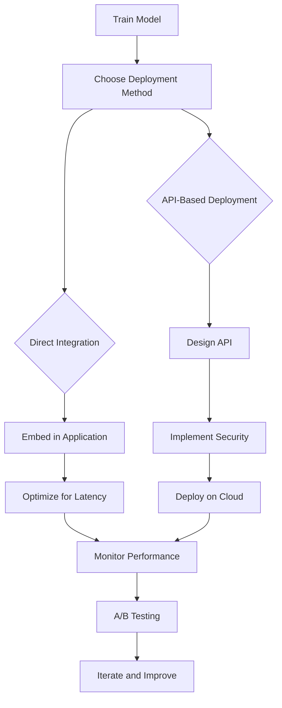

## 17.8. Deployment of ML Models in Elixir Applications

Deploying machine learning (ML) models in Elixir applications is a crucial step in transforming theoretical models into practical, real-world solutions. This process involves serving models, ensuring scalability and performance, conducting A/B testing, and learning from case studies. In this section, we will delve into these aspects, providing expert guidance for deploying ML models effectively in Elixir applications.

### Serving Models

The first step in deploying ML models is to decide how to serve them. There are two primary approaches: exposing models via APIs and integrating them directly into applications.

#### Exposing Models via APIs

One of the most common methods of serving ML models is through APIs. This approach involves deploying the model as a standalone service that can be accessed over the network. This method offers several advantages, including language agnosticism, ease of scaling, and separation of concerns.

**Steps to Expose Models via APIs:**

1. **Model Serialization:** Serialize the trained model using a format that can be easily loaded and used in Elixir. Common formats include ONNX, PMML, or custom binary formats.

2. **API Design:** Use Phoenix or another web framework to create a RESTful or GraphQL API. Define endpoints for model predictions, health checks, and versioning.

3. **Integration with Elixir:** Use ports or NIFs (Native Implemented Functions) to integrate the model with Elixir if it is not natively supported. This allows Elixir to communicate with models implemented in other languages like Python or C++.

4. **Deployment:** Deploy the API on a scalable infrastructure, such as AWS, Google Cloud, or Azure, ensuring it can handle the expected load.

5. **Security:** Implement authentication and authorization mechanisms to secure the API.

**Example: Exposing a Model with Phoenix**

```elixir
defmodule MyAppWeb.ModelController do
  use MyAppWeb, :controller

  def predict(conn, %{"input" => input}) do
    # Load the serialized model
    model = load_model("path/to/model.onnx")

    # Perform prediction
    prediction = model |> predict(input)

    # Return the prediction as JSON
    json(conn, %{prediction: prediction})
  end

  defp load_model(path) do
    # Logic to load the model from the given path
  end

  defp predict(model, input) do
    # Logic to perform prediction using the model
  end
end
```

#### Integrating Models Directly

For applications where low latency is crucial, integrating models directly into the Elixir application might be more suitable. This approach involves embedding the model logic within the application code, reducing the overhead of network calls.

**Considerations for Direct Integration:**

- **Latency:** Direct integration reduces latency since predictions are made within the application without network overhead.
- **Complexity:** This approach can increase complexity, especially if the model is implemented in a language other than Elixir.
- **Resource Utilization:** Ensure the application has sufficient resources (CPU, memory) to handle model inference efficiently.

### Scalability and Performance

Scalability and performance are critical factors when deploying ML models, especially in production environments where response times and throughput are essential.

#### Optimizing for Low-Latency Predictions

To optimize for low-latency predictions, consider the following strategies:

1. **Batch Processing:** Process multiple inputs in a single request to reduce the overhead of repeated model loading and inference.

2. **Caching:** Use caching mechanisms to store frequently requested predictions, reducing the need for repeated inference.

3. **Concurrency:** Leverage Elixir's concurrency model to handle multiple prediction requests simultaneously. Use GenServers or Tasks to manage concurrent processes efficiently.

4. **Hardware Acceleration:** Utilize hardware acceleration, such as GPUs or TPUs, for model inference if supported by the model framework.

5. **Load Balancing:** Implement load balancing to distribute prediction requests across multiple instances of the model service.

**Example: Using GenServer for Concurrency**

```elixir
defmodule MyApp.ModelServer do
  use GenServer

  def start_link(_) do
    GenServer.start_link(__MODULE__, %{}, name: __MODULE__)
  end

  def predict(input) do
    GenServer.call(__MODULE__, {:predict, input})
  end

  def init(state) do
    model = load_model("path/to/model.onnx")
    {:ok, %{state | model: model}}
  end

  def handle_call({:predict, input}, _from, state) do
    # Perform prediction
    prediction = predict(state.model, input)
    {:reply, prediction, state}
  end

  defp load_model(path) do
    # Logic to load the model from the given path
  end

  defp predict(model, input) do
    # Logic to perform prediction using the model
  end
end
```

### A/B Testing and Continuous Improvement

A/B testing is a powerful technique for evaluating different models or configurations in a production environment. It allows you to compare the performance of two or more variations to determine which performs better.

#### Implementing A/B Testing

1. **Define Metrics:** Identify the key metrics that will be used to evaluate model performance, such as accuracy, latency, or user engagement.

2. **Randomization:** Randomly assign users or requests to different model variants to ensure unbiased results.

3. **Data Collection:** Collect data on the performance of each variant, ensuring sufficient sample size for statistical significance.

4. **Analysis:** Analyze the results to determine which variant performs better and make informed decisions on model deployment.

5. **Iterate:** Continuously iterate on the model and configurations based on A/B testing results to improve performance.

**Example: A/B Testing with Plug Middleware**

```elixir
defmodule MyAppWeb.Plugs.ABTesting do
  import Plug.Conn

  def init(default), do: default

  def call(conn, _opts) do
    # Randomly assign variant
    variant = if :rand.uniform() > 0.5, do: :model_a, else: :model_b

    # Store variant in session
    conn
    |> put_session(:variant, variant)
    |> assign(:variant, variant)
  end
end
```

### Case Studies

Exploring real-world case studies can provide valuable insights into the deployment of ML models in Elixir applications. Here, we present a few examples of successful deployments.

#### Case Study 1: Real-Time Fraud Detection

A financial services company deployed an ML model for real-time fraud detection using Elixir. The model was exposed via an API, allowing integration with existing systems. The deployment leveraged Elixir's concurrency model to handle high volumes of transactions, ensuring low-latency predictions.

**Key Takeaways:**

- **Concurrency:** Elixir's concurrency model allowed the system to handle thousands of transactions per second.
- **Scalability:** The API-based deployment enabled easy scaling to accommodate increasing transaction volumes.
- **Security:** Strong authentication and authorization mechanisms ensured secure access to the model.

#### Case Study 2: Personalized Recommendations

An e-commerce platform integrated an ML model for personalized product recommendations directly into their Elixir application. This approach reduced latency, providing real-time recommendations to users as they browsed the site.

**Key Takeaways:**

- **Low Latency:** Direct integration minimized latency, enhancing the user experience.
- **Resource Management:** Efficient resource management ensured the application could handle peak loads without degradation in performance.
- **Continuous Improvement:** A/B testing was used to continuously refine the recommendation model, improving conversion rates.

### Visualizing the Deployment Process

To better understand the deployment process, let's visualize it using a flowchart.


```mermaid
flowchart TD
    A[Train Model] --> B[Choose Deployment Method]
    B --> C{API-Based Deployment}
    B --> D{Direct Integration}
    C --> E[Design API]
    E --> F[Implement Security]
    F --> G[Deploy on Cloud]
    D --> H[Embed in Application]
    H --> I[Optimize for Latency]
    I --> J[Monitor Performance]
    G --> J
    J --> K[A/B Testing]
    K --> L[Iterate and Improve]
```

### Summary

Deploying ML models in Elixir applications involves several critical steps, from serving models to ensuring scalability and performance. By leveraging Elixir's strengths, such as concurrency and fault-tolerance, we can build robust and efficient ML solutions. Continuous improvement through A/B testing and learning from real-world case studies further enhances the deployment process.

### Try It Yourself

To solidify your understanding, try modifying the code examples provided. Experiment with different model formats, API designs, and concurrency strategies. Consider implementing A/B testing in a sample application to see how different model configurations perform.

### References and Links

- [Phoenix Framework Documentation](https://hexdocs.pm/phoenix)
- [ONNX Model Format](https://onnx.ai/)
- [Elixir Ports and NIFs](https://elixir-lang.org/getting-started/ports.html)
- [AWS Deployment Guide](https://aws.amazon.com/getting-started/)
- [A/B Testing Best Practices](https://www.optimizely.com/optimization-glossary/ab-testing/)

### Knowledge Check

1. What are the two primary methods for serving ML models in Elixir applications?
2. How can you optimize an ML model for low-latency predictions?
3. What is the purpose of A/B testing in ML model deployment?
4. How can Elixir's concurrency model benefit ML model deployment?
5. Describe a real-world scenario where direct integration of an ML model would be beneficial.

## Quiz Time!



### What is one advantage of exposing ML models via APIs?

- [x] Language agnosticism
- [ ] Increased latency
- [ ] Reduced security
- [ ] Complexity in deployment

> **Explanation:** Exposing ML models via APIs allows them to be accessed by applications written in different programming languages, providing language agnosticism.

### Which Elixir feature is beneficial for handling multiple prediction requests simultaneously?

- [x] Concurrency model
- [ ] Pattern matching
- [ ] Immutable data structures
- [ ] Protocols

> **Explanation:** Elixir's concurrency model, which includes GenServers and Tasks, allows for efficient handling of multiple concurrent processes.

### What is a key benefit of direct integration of ML models in Elixir applications?

- [x] Reduced latency
- [ ] Increased network overhead
- [ ] Easier scaling
- [ ] Language agnosticism

> **Explanation:** Direct integration of ML models reduces network overhead, resulting in lower latency predictions.

### What is the purpose of A/B testing?

- [x] To compare the performance of different model variations
- [ ] To increase the latency of predictions
- [ ] To secure the API
- [ ] To serialize the model

> **Explanation:** A/B testing is used to evaluate and compare the performance of different models or configurations in a production environment.

### Which tool can be used for hardware acceleration in model inference?

- [x] GPUs
- [ ] GenServer
- [ ] Plug
- [ ] Phoenix

> **Explanation:** GPUs (Graphics Processing Units) can be used for hardware acceleration to speed up model inference.

### What is a common format for model serialization?

- [x] ONNX
- [ ] JSON
- [ ] XML
- [ ] CSV

> **Explanation:** ONNX (Open Neural Network Exchange) is a common format used for model serialization.

### What should be implemented to secure an API serving ML models?

- [x] Authentication and authorization
- [ ] Increased latency
- [ ] Direct integration
- [ ] Hardware acceleration

> **Explanation:** Authentication and authorization mechanisms are crucial to secure an API and control access to the ML models.

### What is a key consideration when deploying ML models directly into Elixir applications?

- [x] Resource utilization
- [ ] Increased network overhead
- [ ] Language agnosticism
- [ ] Easier scaling

> **Explanation:** When deploying ML models directly into Elixir applications, it's important to ensure that the application has sufficient resources (CPU, memory) to handle model inference efficiently.

### What is a benefit of using caching in ML model deployment?

- [x] Reduces the need for repeated inference
- [ ] Increases latency
- [ ] Decreases security
- [ ] Complicates the deployment process

> **Explanation:** Caching can store frequently requested predictions, reducing the need for repeated inference and improving performance.

### Is Elixir's concurrency model beneficial for ML model deployment?

- [x] True
- [ ] False

> **Explanation:** Elixir's concurrency model is beneficial for ML model deployment as it allows handling multiple prediction requests simultaneously, improving scalability and performance.



Remember, deploying ML models in Elixir applications is just the beginning of your journey. As you continue to explore and experiment, you'll uncover new techniques and strategies to enhance your deployments. Keep learning, stay curious, and enjoy the process!
