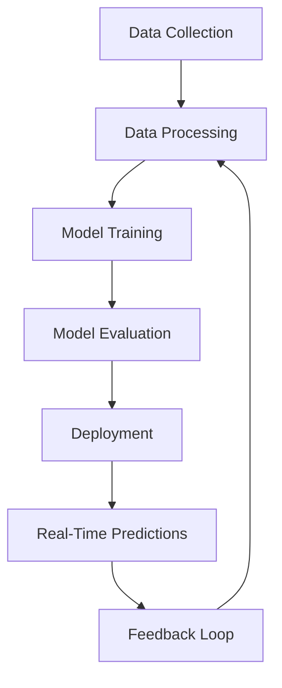

## 17.9. Case Studies and Practical Examples

In this section, we delve into the practical applications of Elixir in the realm of machine learning (ML) and data science. We will explore how companies are leveraging Elixir for ML tasks, highlight success stories, and discuss the challenges and solutions encountered in ML projects using Elixir. This comprehensive guide aims to provide expert software engineers and architects with insights into the real-world applications of Elixir in ML and data science.

### Industry Applications

Elixir, known for its concurrency and fault-tolerance capabilities, is increasingly being adopted in the field of machine learning and data science. Let's explore some industry applications where Elixir has made a significant impact.

#### 1. Real-Time Data Processing

Elixir's ability to handle concurrent processes makes it ideal for real-time data processing tasks. Companies in the finance and telecommunications sectors are using Elixir to process large volumes of data in real-time, enabling them to make timely decisions and provide instant insights.

**Example: Financial Market Analysis**

A financial services company implemented an Elixir-based system to analyze stock market data in real-time. By leveraging Elixir's concurrency model, they were able to process thousands of transactions per second, providing traders with up-to-the-minute insights and enabling them to make informed decisions quickly.

```elixir
defmodule MarketAnalyzer do
  use GenServer

  def start_link(initial_state) do
    GenServer.start_link(__MODULE__, initial_state, name: __MODULE__)
  end

  def init(initial_state) do
    {:ok, initial_state}
  end

  def handle_info({:new_data, data}, state) do
    # Process new market data
    updated_state = process_data(data, state)
    {:noreply, updated_state}
  end

  defp process_data(data, state) do
    # Implement data processing logic here
    state
  end
end
```

#### 2. Predictive Maintenance

In the manufacturing industry, predictive maintenance is crucial for minimizing downtime and reducing costs. Elixir's scalability and fault-tolerance make it an excellent choice for building predictive maintenance systems that analyze sensor data and predict equipment failures.

**Example: Manufacturing Equipment Monitoring**

A manufacturing company developed an Elixir-based system to monitor equipment health and predict failures. By analyzing sensor data in real-time, the system could identify patterns indicative of potential failures, allowing maintenance teams to address issues before they led to costly downtime.

```elixir
defmodule EquipmentMonitor do
  use GenStage

  def start_link(opts) do
    GenStage.start_link(__MODULE__, opts, name: __MODULE__)
  end

  def init(opts) do
    {:producer, opts}
  end

  def handle_demand(demand, state) do
    events = fetch_sensor_data(demand)
    {:noreply, events, state}
  end

  defp fetch_sensor_data(demand) do
    # Fetch and process sensor data
    []
  end
end
```

### Success Stories

Elixir's unique features have led to several success stories in the field of machine learning and data science. Let's explore some of these achievements in performance and innovation.

#### 1. Enhanced Performance in Data Processing

Elixir's ability to handle concurrent processes efficiently has resulted in significant performance improvements in data processing tasks. Companies have reported up to a 10x increase in processing speed when switching from traditional languages to Elixir.

**Example: E-commerce Data Analysis**

An e-commerce company migrated their data analysis pipeline from Python to Elixir, resulting in a dramatic increase in processing speed. By leveraging Elixir's concurrency model, they were able to analyze customer behavior data in real-time, providing personalized recommendations and improving customer satisfaction.

```elixir
defmodule DataPipeline do
  use Flow

  def start_link(data) do
    Flow.from_enumerable(data)
    |> Flow.map(&process_record/1)
    |> Flow.run()
  end

  defp process_record(record) do
    # Implement data processing logic here
    record
  end
end
```

#### 2. Innovation in Machine Learning Models

Elixir's metaprogramming capabilities have enabled companies to innovate in the development of machine learning models. By creating domain-specific languages (DSLs) and macros, developers can build complex models with ease and flexibility.

**Example: Custom ML Model DSL**

A tech startup developed a custom DSL for building machine learning models in Elixir. This DSL allowed data scientists to define models using a simple, expressive syntax, reducing development time and increasing model accuracy.

```elixir
defmodule MLModelDSL do
  defmacro model(name, do: block) do
    quote do
      def unquote(name)() do
        unquote(block)
      end
    end
  end
end

defmodule MyModel do
  import MLModelDSL

  model :predict do
    # Define model logic here
  end
end
```

### Challenges and Solutions

Despite its advantages, using Elixir for machine learning and data science comes with its own set of challenges. Let's explore some common obstacles and the solutions that have been implemented to overcome them.

#### 1. Lack of ML Libraries

One of the main challenges of using Elixir for machine learning is the lack of mature ML libraries compared to languages like Python. However, the Elixir community has been actively working on developing libraries and tools to address this gap.

**Solution: Interoperability with Python**

To overcome the lack of ML libraries, many companies have adopted a hybrid approach, using Elixir for data processing and Python for model training. By leveraging Elixir's interoperability with Python, developers can build robust ML systems that take advantage of the strengths of both languages.

```elixir
defmodule PythonInterop do
  def call_python_script(script, args) do
    System.cmd("python3", [script | args])
  end
end

# Example usage
PythonInterop.call_python_script("train_model.py", ["--data", "dataset.csv"])
```

#### 2. Handling Large Data Sets

Processing large data sets efficiently is a common challenge in data science. Elixir's immutable data structures can lead to increased memory usage, making it difficult to handle large volumes of data.

**Solution: Using Streams and Lazy Evaluation**

To address this challenge, developers can leverage Elixir's streams and lazy evaluation capabilities. By processing data lazily, Elixir can handle large data sets without consuming excessive memory.

```elixir
defmodule LargeDataProcessor do
  def process_large_data(file_path) do
    File.stream!(file_path)
    |> Stream.map(&process_line/1)
    |> Enum.to_list()
  end

  defp process_line(line) do
    # Implement line processing logic here
    line
  end
end
```

### Visualizing Elixir's Role in Machine Learning

To better understand Elixir's role in machine learning, let's visualize the architecture of a typical Elixir-based ML system using Mermaid.js.



**Diagram Description:** This diagram illustrates the flow of data in an Elixir-based machine learning system. Data is collected and processed in real-time, then used to train and evaluate models. Once deployed, the models provide real-time predictions, which are fed back into the system for continuous improvement.

### Knowledge Check

Before we conclude, let's reinforce your understanding with a few questions and exercises.

1. **Question:** What are some advantages of using Elixir for real-time data processing in machine learning applications?
2. **Exercise:** Modify the `MarketAnalyzer` code example to include a simple moving average calculation for stock prices.
3. **Question:** How can Elixir's metaprogramming capabilities be leveraged to innovate in machine learning model development?
4. **Exercise:** Implement a simple DSL for defining linear regression models in Elixir.

### Embrace the Journey

As we explore the intersection of Elixir and machine learning, remember that this is just the beginning. The field is rapidly evolving, and there are countless opportunities to innovate and push the boundaries of what's possible. Keep experimenting, stay curious, and enjoy the journey!

### References and Further Reading

- [Elixir Official Website](https://elixir-lang.org/)
- [Elixir School](https://elixirschool.com/)
- [Machine Learning with Elixir](https://github.com/elixir-nx/nx)

## Quiz: Case Studies and Practical Examples



### What is one advantage of using Elixir for real-time data processing?

- [x] Concurrency and fault-tolerance
- [ ] Extensive ML libraries
- [ ] Built-in machine learning models
- [ ] Native support for GPU processing

> **Explanation:** Elixir's concurrency and fault-tolerance make it ideal for real-time data processing tasks.

### How can Elixir's metaprogramming capabilities benefit machine learning model development?

- [x] By creating domain-specific languages (DSLs)
- [ ] By providing built-in ML algorithms
- [ ] By offering GPU acceleration
- [ ] By supporting deep learning frameworks

> **Explanation:** Elixir's metaprogramming capabilities allow developers to create DSLs, making it easier to define and build complex models.

### What is a common challenge when using Elixir for machine learning?

- [x] Lack of mature ML libraries
- [ ] Poor concurrency support
- [ ] Inability to handle large data sets
- [ ] Limited fault-tolerance

> **Explanation:** One of the main challenges is the lack of mature ML libraries compared to other languages like Python.

### How can Elixir handle large data sets efficiently?

- [x] By using streams and lazy evaluation
- [ ] By using mutable data structures
- [ ] By leveraging built-in ML libraries
- [ ] By using GPU acceleration

> **Explanation:** Elixir can handle large data sets efficiently by using streams and lazy evaluation, which reduce memory usage.

### What is a typical use case for Elixir in the manufacturing industry?

- [x] Predictive maintenance
- [ ] Image recognition
- [ ] Natural language processing
- [ ] Autonomous vehicles

> **Explanation:** Elixir is used for predictive maintenance in the manufacturing industry, analyzing sensor data to predict equipment failures.

### How can Elixir's interoperability with Python be leveraged in ML projects?

- [x] By using Python for model training and Elixir for data processing
- [ ] By replacing Python entirely
- [ ] By using Elixir for GPU processing
- [ ] By using Python for concurrency

> **Explanation:** Elixir's interoperability with Python allows developers to use Python for model training and Elixir for data processing.

### What is a benefit of using Elixir for e-commerce data analysis?

- [x] Real-time processing and personalized recommendations
- [ ] Built-in payment processing
- [ ] Extensive e-commerce libraries
- [ ] Native support for shopping carts

> **Explanation:** Elixir's concurrency model enables real-time processing, allowing for personalized recommendations in e-commerce.

### How can Elixir's fault-tolerance be beneficial in ML applications?

- [x] By ensuring system reliability and uptime
- [ ] By providing built-in ML models
- [ ] By supporting GPU acceleration
- [ ] By offering extensive ML libraries

> **Explanation:** Elixir's fault-tolerance ensures system reliability and uptime, which is crucial for ML applications.

### What is a key feature of Elixir that enhances performance in data processing?

- [x] Concurrency model
- [ ] Built-in ML libraries
- [ ] GPU acceleration
- [ ] Mutable data structures

> **Explanation:** Elixir's concurrency model enhances performance in data processing tasks.

### True or False: Elixir's immutable data structures make it difficult to handle large data sets.

- [x] True
- [ ] False

> **Explanation:** While immutable data structures can lead to increased memory usage, Elixir's streams and lazy evaluation can mitigate this issue.


