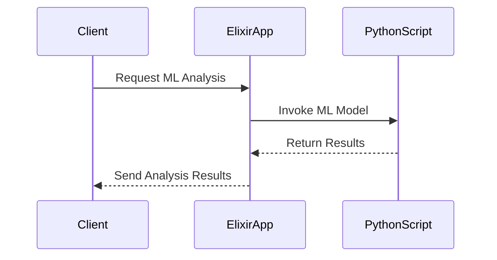

## 17.9. Case Studies and Practical Examples

In this section, we delve into the practical applications of Elixir in the fields of machine learning (ML) and data science. As an expert software engineer or architect, you are likely familiar with the challenges and opportunities presented by these domains. Elixir, with its functional programming paradigm and robust concurrency model, offers unique advantages for ML tasks. Let's explore how companies are leveraging Elixir for innovative solutions, examine success stories, and discuss the challenges and solutions encountered in ML projects.

### Industry Applications

#### Leveraging Elixir for Machine Learning

Elixir's concurrency model, powered by the BEAM virtual machine, allows for efficient handling of concurrent processes, making it an excellent choice for data-intensive tasks. This capability is particularly beneficial in machine learning, where large datasets and parallel computations are common.

**Example: Real-Time Data Processing**

One of the key applications of Elixir in the industry is real-time data processing. Companies dealing with streaming data, such as financial institutions and social media platforms, use Elixir to process and analyze data in real time. The ability to handle thousands of concurrent connections with minimal latency is a significant advantage.

```elixir
defmodule DataProcessor do
  use GenServer

  def start_link(initial_state) do
    GenServer.start_link(__MODULE__, initial_state, name: __MODULE__)
  end

  def init(state) do
    {:ok, state}
  end

  def handle_cast({:process, data}, state) do
    # Perform data processing here
    processed_data = perform_ml_operations(data)
    {:noreply, [processed_data | state]}
  end

  defp perform_ml_operations(data) do
    # Simulate a machine learning operation
    Enum.map(data, &(&1 * 2))
  end
end
```

In this example, a GenServer is used to manage state and process incoming data asynchronously. This pattern is common in Elixir applications that require real-time data processing.

#### Elixir in Predictive Analytics

Predictive analytics is another area where Elixir shines. By leveraging Elixir's ability to handle distributed systems, companies can build scalable predictive models that analyze data from multiple sources.

**Example: Predictive Maintenance**

Manufacturing companies often use predictive analytics to anticipate equipment failures and schedule maintenance. Elixir's concurrent processing capabilities allow for the analysis of sensor data from various machines in real time, improving the accuracy of predictive models.

```elixir
defmodule PredictiveModel do
  def analyze(sensor_data) do
    sensor_data
    |> Enum.map(&extract_features/1)
    |> build_model()
  end

  defp extract_features(data) do
    # Extract relevant features for the model
    %{temperature: data.temperature, vibration: data.vibration}
  end

  defp build_model(features) do
    # Build and return a predictive model
    {:ok, model} = TrainModel.train(features)
    model
  end
end
```

This code snippet demonstrates how Elixir can be used to process sensor data and build predictive models, showcasing its utility in industrial applications.

### Success Stories

#### Achievements in Performance and Innovation

Several companies have reported significant achievements in performance and innovation by adopting Elixir for their machine learning tasks. Let's explore a few success stories.

**Case Study: Financial Services**

A leading financial services company adopted Elixir to enhance its fraud detection system. By leveraging Elixir's concurrency model, the company was able to process transactions in real time and identify fraudulent activities with greater accuracy.

- **Challenge:** The existing system struggled with high latency and false positives.
- **Solution:** By implementing Elixir's GenStage and Flow libraries, the company achieved parallel processing of transaction data, reducing latency and improving detection rates.

**Case Study: Social Media Analytics**

A social media analytics firm used Elixir to analyze user interactions and sentiment in real time. The firm was able to scale its operations and provide insights to clients faster than ever before.

- **Challenge:** Handling the massive volume of data generated by users.
- **Solution:** Elixir's ability to handle concurrent connections and process data streams efficiently allowed the firm to scale its operations and deliver real-time insights.

### Challenges and Solutions

#### Overcoming Obstacles in ML Projects with Elixir

While Elixir offers many advantages, there are challenges that companies may face when implementing it for machine learning tasks. Let's discuss some common obstacles and their solutions.

**Challenge: Integration with Existing ML Libraries**

One of the challenges is integrating Elixir with existing machine learning libraries, which are predominantly written in Python. This can be addressed by using Elixir's interoperability features.

- **Solution:** Use Ports and NIFs (Native Implemented Functions) to integrate Elixir with Python libraries, allowing for seamless execution of ML models.

```elixir
defmodule PythonInterop do
  def call_python_script(script, args) do
    Port.open({:spawn, "python3 #{script} #{Enum.join(args, " ")}"}, [:binary])
  end
end
```

This example demonstrates how Elixir can call a Python script using Ports, facilitating integration with Python-based ML libraries.

**Challenge: Handling Large Datasets**

Processing large datasets can be a challenge due to memory constraints. Elixir provides solutions for efficient data handling.

- **Solution:** Use Elixir's Streams and GenStage to process data lazily and in parallel, reducing memory usage and improving performance.

```elixir
defmodule LargeDataProcessor do
  def process_large_dataset(dataset) do
    dataset
    |> Stream.map(&transform_data/1)
    |> Enum.to_list()
  end

  defp transform_data(data) do
    # Transform data for further processing
    data * 2
  end
end
```

By using Streams, Elixir processes data lazily, minimizing memory usage and allowing for the handling of large datasets.

### Visualizing Elixir's Role in Machine Learning

To better understand Elixir's role in machine learning, let's visualize a typical workflow using a sequence diagram.


```mermaid
sequenceDiagram
    participant Client
    participant ElixirApp
    participant PythonScript
    Client->>ElixirApp: Request ML Analysis
    ElixirApp->>PythonScript: Invoke ML Model
    PythonScript-->>ElixirApp: Return Results
    ElixirApp-->>Client: Send Analysis Results
```

This diagram illustrates the interaction between a client, an Elixir application, and a Python script for machine learning analysis. Elixir acts as the orchestrator, managing data flow and processing.

### Try It Yourself

To gain hands-on experience with Elixir in machine learning, try modifying the provided code examples. Experiment with different data processing techniques, integrate additional ML libraries, or implement new predictive models. This will deepen your understanding of Elixir's capabilities and its application in real-world scenarios.

### Knowledge Check

1. **What are the key advantages of using Elixir for real-time data processing?**
   - Concurrency model
   - Low latency
   - Scalability

2. **How can Elixir integrate with Python-based ML libraries?**
   - Using Ports and NIFs

3. **What is a common challenge when handling large datasets in Elixir, and how can it be addressed?**
   - Memory constraints; addressed using Streams and GenStage

4. **In what ways can Elixir improve predictive analytics in industrial applications?**
   - Real-time data processing
   - Improved model accuracy

### Conclusion

Elixir's unique features make it a powerful tool for machine learning and data science applications. By leveraging its concurrency model, scalability, and interoperability, companies can overcome challenges and achieve significant performance improvements. As you explore the potential of Elixir in your own projects, remember to experiment, innovate, and embrace the journey of continuous learning.

## Quiz Time!



### What is one of the key advantages of using Elixir for real-time data processing?

- [x] Concurrency model
- [ ] High memory usage
- [ ] Lack of scalability
- [ ] Slow execution

> **Explanation:** Elixir's concurrency model allows it to handle multiple processes efficiently, making it ideal for real-time data processing.

### How can Elixir integrate with Python-based ML libraries?

- [x] Using Ports and NIFs
- [ ] By rewriting Python libraries in Elixir
- [ ] Through direct execution of Python code
- [ ] By converting Python code to Elixir code

> **Explanation:** Elixir can use Ports and NIFs to communicate with Python scripts and libraries, enabling integration with Python-based ML tools.

### What is a common challenge when handling large datasets in Elixir, and how can it be addressed?

- [x] Memory constraints; addressed using Streams and GenStage
- [ ] Lack of concurrency; addressed using GenServer
- [ ] Slow processing; addressed using NIFs
- [ ] High latency; addressed using Ports

> **Explanation:** Memory constraints can be a challenge when handling large datasets, but Elixir's Streams and GenStage allow for efficient, lazy processing.

### In what ways can Elixir improve predictive analytics in industrial applications?

- [x] Real-time data processing
- [x] Improved model accuracy
- [ ] Increased memory usage
- [ ] Reduced scalability

> **Explanation:** Elixir's ability to process data in real time and handle concurrent operations can enhance predictive analytics by improving model accuracy and responsiveness.

### What is the purpose of using GenServer in Elixir applications?

- [x] To manage state and handle asynchronous processes
- [ ] To execute Python scripts
- [ ] To convert data into binary format
- [ ] To handle HTTP requests

> **Explanation:** GenServer is used in Elixir to manage state and handle asynchronous processes, making it a core component of concurrent applications.

### What is the role of Elixir in the sequence diagram provided?

- [x] Orchestrator
- [ ] Data storage
- [ ] Client interface
- [ ] ML model executor

> **Explanation:** In the sequence diagram, Elixir acts as the orchestrator, managing the flow of data and communication between the client and the Python script.

### What is a benefit of using Streams in Elixir for data processing?

- [x] Reduced memory usage
- [ ] Increased latency
- [ ] Simplified data structures
- [ ] Enhanced error handling

> **Explanation:** Streams in Elixir allow for lazy data processing, which reduces memory usage by processing data elements only as needed.

### How can Elixir's concurrency model benefit social media analytics?

- [x] By handling massive volumes of user data efficiently
- [ ] By increasing the complexity of data processing
- [ ] By reducing the number of concurrent connections
- [ ] By simplifying user interface design

> **Explanation:** Elixir's concurrency model enables efficient handling of large volumes of data, which is crucial for social media analytics.

### What is a challenge when integrating Elixir with existing ML libraries?

- [x] Language interoperability
- [ ] Lack of concurrency support
- [ ] High memory usage
- [ ] Slow execution speed

> **Explanation:** Integrating Elixir with existing ML libraries, often written in Python, requires addressing language interoperability challenges.

### True or False: Elixir is not suitable for handling real-time data processing tasks.

- [ ] True
- [x] False

> **Explanation:** False. Elixir is well-suited for real-time data processing tasks due to its concurrency model and ability to handle multiple connections efficiently.



Remember, this is just the beginning. As you progress, you'll build more complex and interactive machine learning applications with Elixir. Keep experimenting, stay curious, and enjoy the journey!
