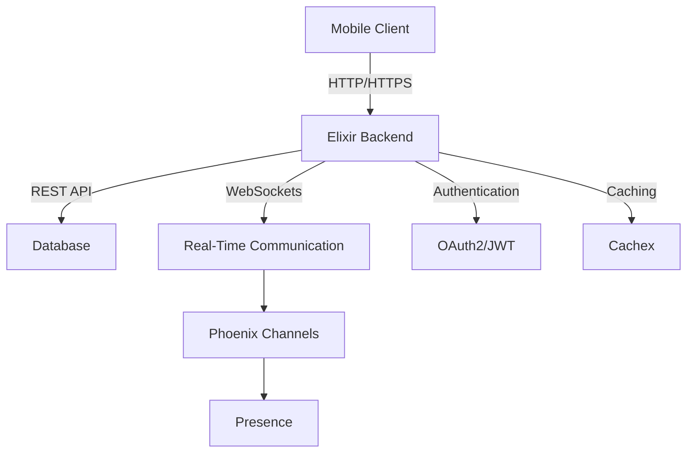

## 18.1. Overview of Mobile Backend Services

In the rapidly evolving landscape of mobile applications, the backend services play a crucial role in ensuring seamless user experiences. Elixir, with its robust features and capabilities, emerges as a powerful tool for building mobile backend services. In this section, we will delve into the role of Elixir in mobile development, its advantages, and the architectural considerations necessary for designing effective mobile backend services.

### Role of Elixir in Mobile Development

Elixir is a functional, concurrent language built on the Erlang VM (BEAM), known for its ability to handle massive concurrency and fault tolerance. These features make Elixir an excellent choice for developing backend services for mobile applications. Let's explore how Elixir contributes to mobile development:

#### Building Robust Backend Services

Elixir's concurrency model, based on the Actor model, allows developers to build highly concurrent applications that can handle numerous simultaneous connections. This is particularly beneficial for mobile applications that require real-time data synchronization and updates.

- **Concurrency and Parallelism**: Elixir's lightweight processes enable efficient handling of concurrent tasks, which is essential for mobile applications that need to manage multiple user sessions and real-time data updates.

- **Fault Tolerance**: Elixir's "Let It Crash" philosophy, inherited from Erlang, ensures that applications can recover from failures gracefully. This is crucial for mobile applications that require high availability and reliability.

- **Scalability**: Elixir's ability to scale horizontally makes it ideal for mobile backend services that need to handle increasing loads as the user base grows.

#### Real-Time Communication

One of the standout features of Elixir is its support for real-time communication, which is a critical requirement for many mobile applications. Whether it's a chat application, live updates, or collaborative tools, Elixir provides the necessary tools to implement real-time features effectively.

- **Phoenix Channels**: Phoenix, a web framework built on Elixir, offers Channels for real-time communication. Channels allow developers to implement WebSockets easily, enabling bidirectional communication between the client and server.

- **Presence**: Phoenix also provides a Presence feature, which helps track user presence and state across distributed nodes. This is particularly useful for applications that require real-time user tracking and notifications.

### Advantages of Using Elixir for Mobile Backend Services

Elixir offers several advantages when it comes to building mobile backend services. Let's explore these benefits in detail:

#### Real-Time Communication

Elixir's support for real-time communication is one of its most significant advantages. With Phoenix Channels, developers can easily implement WebSockets, enabling real-time data synchronization between the client and server. This is essential for applications like chat apps, live updates, and collaborative tools.

#### Scalability

Elixir's ability to handle massive concurrency and scale horizontally makes it an excellent choice for mobile backend services. As the user base grows, Elixir applications can scale seamlessly to accommodate the increased load, ensuring a smooth user experience.

#### Fault Tolerance

Elixir's "Let It Crash" philosophy ensures that applications can recover from failures gracefully. This is crucial for mobile applications that require high availability and reliability. Elixir's supervision trees allow developers to define strategies for restarting failed processes, ensuring that the application remains operational even in the face of errors.

#### Performance

Elixir's performance is another key advantage. The language's lightweight processes and efficient concurrency model allow it to handle numerous simultaneous connections without compromising performance. This is particularly beneficial for mobile applications that require real-time data updates and synchronization.

#### Developer Productivity

Elixir's syntax and functional programming paradigm promote developer productivity. The language's expressive syntax and powerful abstractions make it easy to write clean, maintainable code. Additionally, Elixir's tooling, such as Mix and ExUnit, further enhance developer productivity by providing robust build and testing tools.

### Architectural Considerations for Mobile Backend Services

When designing mobile backend services with Elixir, several architectural considerations must be taken into account to ensure optimal performance and scalability. Let's explore these considerations in detail:

#### Designing APIs for Mobile Apps

APIs are the backbone of mobile applications, enabling communication between the client and server. When designing APIs for mobile apps, it's essential to consider factors such as performance, security, and scalability.

- **RESTful APIs**: RESTful APIs are a common choice for mobile applications due to their simplicity and scalability. Elixir, with its Phoenix framework, provides robust support for building RESTful APIs.

- **GraphQL**: For applications that require more flexibility in data retrieval, GraphQL can be a suitable choice. Elixir's Absinthe library provides a powerful GraphQL implementation, allowing developers to build flexible and efficient APIs.

- **Authentication and Authorization**: Security is a critical consideration when designing APIs for mobile apps. Implementing robust authentication and authorization mechanisms, such as OAuth2 and JWT, is essential to protect sensitive data.

#### Handling Real-Time Data

Real-time data synchronization is a common requirement for many mobile applications. Elixir's Phoenix Channels provide a powerful tool for implementing real-time features, enabling bidirectional communication between the client and server.

- **WebSockets**: WebSockets are a key technology for real-time communication, allowing persistent connections between the client and server. Phoenix Channels make it easy to implement WebSockets, enabling real-time data updates and synchronization.

- **Presence**: Phoenix's Presence feature allows developers to track user presence and state across distributed nodes. This is particularly useful for applications that require real-time user tracking and notifications.

#### Ensuring Scalability and Fault Tolerance

Scalability and fault tolerance are critical considerations for mobile backend services. Elixir's concurrency model and supervision trees provide robust support for building scalable and fault-tolerant applications.

- **Horizontal Scaling**: Elixir's ability to scale horizontally allows applications to handle increasing loads as the user base grows. This is essential for mobile applications that need to accommodate a large number of simultaneous connections.

- **Supervision Trees**: Elixir's supervision trees allow developers to define strategies for restarting failed processes, ensuring that the application remains operational even in the face of errors. This is crucial for maintaining high availability and reliability.

#### Performance Optimization

Performance is a critical consideration for mobile backend services. Elixir's lightweight processes and efficient concurrency model allow it to handle numerous simultaneous connections without compromising performance.

- **Efficient Data Structures**: Choosing the right data structures can have a significant impact on performance. Elixir provides a range of efficient data structures, such as lists, maps, and tuples, that can be used to optimize performance.

- **Caching**: Implementing caching mechanisms can significantly improve performance by reducing the need for repeated data retrieval. Elixir's Cachex library provides a powerful caching solution that can be used to optimize performance.

### Code Examples

Let's explore some code examples to illustrate the concepts discussed above.

#### Implementing a Simple RESTful API with Phoenix

```elixir
defmodule MyAppWeb.Router do
  use MyAppWeb, :router

  pipeline :api do
    plug :accepts, ["json"]
  end

  scope "/api", MyAppWeb do
    pipe_through :api

    get "/users", UserController, :index
    post "/users", UserController, :create
    get "/users/:id", UserController, :show
    put "/users/:id", UserController, :update
    delete "/users/:id", UserController, :delete
  end
end
```

In this example, we define a simple RESTful API with endpoints for managing users. The `UserController` handles the logic for each endpoint, providing CRUD operations for user data.

#### Implementing Real-Time Communication with Phoenix Channels

```elixir
defmodule MyAppWeb.UserSocket do
  use Phoenix.Socket

  channel "room:*", MyAppWeb.RoomChannel

  def connect(_params, socket, _connect_info) do
    {:ok, socket}
  end

  def id(_socket), do: nil
end

defmodule MyAppWeb.RoomChannel do
  use Phoenix.Channel

  def join("room:lobby", _message, socket) do
    {:ok, socket}
  end

  def handle_in("new_msg", %{"body" => body}, socket) do
    broadcast!(socket, "new_msg", %{body: body})
    {:noreply, socket}
  end
end
```

In this example, we define a simple Phoenix Channel for real-time communication. The `RoomChannel` handles incoming messages and broadcasts them to all connected clients.

### Visualizing Elixir's Role in Mobile Backend Services

To better understand Elixir's role in mobile backend services, let's visualize the architecture of a typical mobile backend service built with Elixir.



**Diagram Description:** This diagram illustrates the architecture of a mobile backend service built with Elixir. The mobile client communicates with the Elixir backend via HTTP/HTTPS, utilizing REST APIs for data retrieval and WebSockets for real-time communication. The backend interacts with a database for data storage and implements authentication mechanisms for security. Caching is used to optimize performance.

### References and Links

- [Elixir Lang](https://elixir-lang.org/): Official Elixir website with comprehensive documentation and resources.
- [Phoenix Framework](https://www.phoenixframework.org/): Official website for the Phoenix framework, providing resources and documentation for building web applications with Elixir.
- [Absinthe GraphQL](https://absinthe-graphql.org/): Official website for the Absinthe GraphQL library, providing resources and documentation for building GraphQL APIs with Elixir.
- [Cachex](https://hexdocs.pm/cachex/Cachex.html): Documentation for the Cachex library, providing a powerful caching solution for Elixir applications.

### Knowledge Check

- What are the key advantages of using Elixir for mobile backend services?
- How does Elixir's concurrency model benefit mobile applications?
- What role do Phoenix Channels play in real-time communication?
- How can caching improve the performance of mobile backend services?
- What architectural considerations are important when designing APIs for mobile apps?

### Embrace the Journey

Remember, building mobile backend services with Elixir is just the beginning. As you progress, you'll discover more advanced techniques and patterns that will enhance your applications. Keep experimenting, stay curious, and enjoy the journey!

### Quiz: Overview of Mobile Backend Services



### What is one of the key advantages of using Elixir for mobile backend services?

- [x] Real-time communication
- [ ] Limited scalability
- [ ] Lack of concurrency
- [ ] High memory usage

> **Explanation:** Elixir's support for real-time communication is one of its most significant advantages, enabling real-time data synchronization between the client and server.

### How does Elixir's concurrency model benefit mobile applications?

- [x] Efficient handling of concurrent tasks
- [ ] Increased memory usage
- [ ] Reduced performance
- [ ] Limited fault tolerance

> **Explanation:** Elixir's concurrency model, based on the Actor model, allows efficient handling of concurrent tasks, which is essential for mobile applications that need to manage multiple user sessions and real-time data updates.

### What role do Phoenix Channels play in real-time communication?

- [x] Enable bidirectional communication between client and server
- [ ] Limit data synchronization
- [ ] Increase latency
- [ ] Reduce scalability

> **Explanation:** Phoenix Channels enable bidirectional communication between the client and server, allowing real-time data synchronization and updates.

### How can caching improve the performance of mobile backend services?

- [x] By reducing the need for repeated data retrieval
- [ ] By increasing data retrieval times
- [ ] By limiting data storage
- [ ] By reducing concurrency

> **Explanation:** Implementing caching mechanisms can significantly improve performance by reducing the need for repeated data retrieval, optimizing the application's efficiency.

### What architectural considerations are important when designing APIs for mobile apps?

- [x] Performance, security, and scalability
- [ ] Limited data retrieval
- [ ] Increased latency
- [ ] Reduced fault tolerance

> **Explanation:** When designing APIs for mobile apps, it's essential to consider factors such as performance, security, and scalability to ensure optimal functionality and user experience.

### What is the "Let It Crash" philosophy in Elixir?

- [x] A strategy for handling failures gracefully
- [ ] A method for increasing concurrency
- [ ] A technique for reducing memory usage
- [ ] A way to limit scalability

> **Explanation:** Elixir's "Let It Crash" philosophy ensures that applications can recover from failures gracefully, maintaining high availability and reliability.

### How does Elixir's supervision trees contribute to fault tolerance?

- [x] By defining strategies for restarting failed processes
- [ ] By increasing memory usage
- [ ] By reducing concurrency
- [ ] By limiting scalability

> **Explanation:** Elixir's supervision trees allow developers to define strategies for restarting failed processes, ensuring that the application remains operational even in the face of errors.

### What is the role of Phoenix Presence in mobile applications?

- [x] Tracking user presence and state across distributed nodes
- [ ] Limiting real-time communication
- [ ] Increasing latency
- [ ] Reducing scalability

> **Explanation:** Phoenix Presence helps track user presence and state across distributed nodes, which is particularly useful for applications that require real-time user tracking and notifications.

### How does Elixir's horizontal scaling benefit mobile backend services?

- [x] Allows applications to handle increasing loads
- [ ] Limits data retrieval
- [ ] Increases latency
- [ ] Reduces fault tolerance

> **Explanation:** Elixir's ability to scale horizontally allows applications to handle increasing loads as the user base grows, ensuring a smooth user experience.

### True or False: Elixir's lightweight processes compromise performance.

- [ ] True
- [x] False

> **Explanation:** Elixir's lightweight processes do not compromise performance; instead, they allow the language to handle numerous simultaneous connections efficiently.


