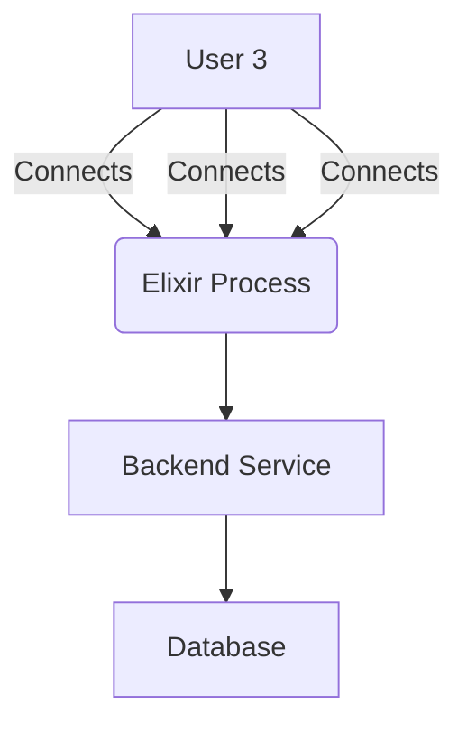
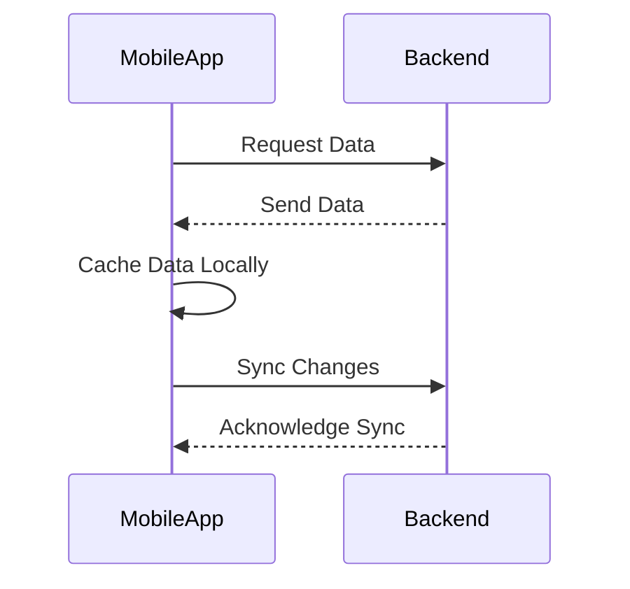

## 18.1. Overview of Mobile Backend Services

As mobile applications continue to dominate the technology landscape, the demand for robust, efficient, and scalable backend services has never been greater. Elixir, with its functional programming paradigm and powerful concurrency capabilities, emerges as a strong contender for building mobile backend services. In this section, we will explore the role of Elixir in mobile development, its advantages, and the architectural considerations necessary for designing APIs and services tailored for mobile applications.

### Role of Elixir in Mobile Development

Elixir is a dynamic, functional language designed for building scalable and maintainable applications. It runs on the Erlang VM (BEAM), which is known for its low-latency, distributed, and fault-tolerant systems. These characteristics make Elixir an excellent choice for developing mobile backend services that require real-time communication, high availability, and resilience.

#### Building Robust Backend Services for Mobile Applications

Mobile applications often require backend services to handle tasks such as data storage, authentication, real-time updates, and communication between users. Elixir's concurrency model, based on the Actor model, allows developers to build systems that can handle thousands of concurrent connections with ease. This is particularly beneficial for mobile applications that need to maintain real-time communication with servers.

**Key Features of Elixir for Mobile Backend Services:**

1. **Concurrency:** Elixir's lightweight processes make it possible to handle numerous connections simultaneously, making it ideal for chat applications, live updates, and other real-time features.

2. **Fault Tolerance:** The "Let it crash" philosophy of Erlang/Elixir ensures that applications can recover from errors gracefully, maintaining uptime and reliability.

3. **Scalability:** Elixir's distributed nature allows for horizontal scaling, which is crucial for mobile applications experiencing variable loads.

4. **Real-Time Communication:** With tools like Phoenix Channels, Elixir facilitates real-time, bidirectional communication between clients and servers.

5. **Maintainability:** Elixir's syntax and functional nature promote clean, maintainable code, reducing the complexity of managing backend services.

### Advantages of Using Elixir for Mobile Backend Services

#### Real-Time Communication

Real-time communication is a cornerstone of modern mobile applications, enabling features such as instant messaging, live notifications, and collaborative tools. Elixir, with the Phoenix framework, provides robust support for WebSockets and real-time communication through Phoenix Channels.

```elixir
# Example of setting up a Phoenix Channel for real-time communication

defmodule MyAppWeb.UserSocket do
  use Phoenix.Socket

  channel "room:*", MyAppWeb.RoomChannel

  # Socket connection logic
  def connect(_params, socket, _connect_info) do
    {:ok, socket}
  end

  def id(_socket), do: nil
end

defmodule MyAppWeb.RoomChannel do
  use Phoenix.Channel

  def join("room:" <> _room_id, _params, socket) do
    {:ok, socket}
  end

  def handle_in("new_msg", %{"body" => body}, socket) do
    broadcast(socket, "new_msg", %{body: body})
    {:noreply, socket}
  end
end
```

In this example, we define a Phoenix Channel that allows clients to join a "room" and send messages. The `handle_in` function handles incoming messages and broadcasts them to all connected clients in the room.

#### Scalability

Elixir's ability to handle thousands of lightweight processes concurrently makes it inherently scalable. This scalability is crucial for mobile backend services that must support a growing number of users and devices without compromising performance.

**Diagram: Visualizing Elixir's Scalability with Lightweight Processes**


```mermaid
graph TD;
    A[User 1] -->|Connects| B(Elixir Process)
    A[User 2] -->|Connects| B(Elixir Process)
    A[User 3] -->|Connects| B(Elixir Process)
    B --> C[Backend Service]
    C --> D[Database]
```

*This diagram illustrates how multiple users can connect to Elixir processes, which handle requests and communicate with backend services and databases.*

#### Fault Tolerance

Elixir's fault tolerance is rooted in its use of the BEAM VM and the OTP framework. The "Let it crash" philosophy encourages developers to design systems that can recover from failures automatically. Supervisors in Elixir monitor processes and restart them if they crash, ensuring that the system remains operational.

**Code Example: Implementing a Supervisor for Fault Tolerance**

```elixir
defmodule MyApp.Application do
  use Application

  def start(_type, _args) do
    children = [
      {MyApp.Worker, []}
    ]

    opts = [strategy: :one_for_one, name: MyApp.Supervisor]
    Supervisor.start_link(children, opts)
  end
end

defmodule MyApp.Worker do
  use GenServer

  def start_link(_args) do
    GenServer.start_link(__MODULE__, :ok, name: __MODULE__)
  end

  def init(:ok) do
    {:ok, %{}}
  end

  # Example of a GenServer call that might crash
  def handle_call(:crash, _from, state) do
    {:stop, :crash, state}
  end
end
```

In this example, we define a simple GenServer worker that can crash. The supervisor ensures that if the worker crashes, it will be restarted automatically.

### Architectural Considerations for Mobile Backend Services

When designing backend services for mobile applications, several architectural considerations must be taken into account to ensure optimal performance and user experience.

#### Designing APIs and Services for Mobile Apps

APIs are the backbone of mobile applications, facilitating communication between the client and server. Designing efficient and responsive APIs is crucial for providing a seamless user experience.

**Best Practices for API Design:**

1. **RESTful Architecture:** Use RESTful principles to design APIs that are easy to understand and use. This includes using standard HTTP methods (GET, POST, PUT, DELETE) and status codes.

2. **GraphQL for Flexibility:** Consider using GraphQL for more flexible queries, allowing clients to request exactly the data they need.

3. **Versioning:** Implement API versioning to ensure backward compatibility as the API evolves.

4. **Rate Limiting:** Protect your backend services from abuse by implementing rate limiting to control the number of requests a client can make.

5. **Authentication and Authorization:** Secure your APIs with robust authentication and authorization mechanisms, such as OAuth2 or JWT.

**Code Example: A Simple RESTful API Endpoint in Phoenix**

```elixir
defmodule MyAppWeb.UserController do
  use MyAppWeb, :controller

  alias MyApp.Accounts
  alias MyApp.Accounts.User

  def index(conn, _params) do
    users = Accounts.list_users()
    render(conn, "index.json", users: users)
  end

  def create(conn, %{"user" => user_params}) do
    case Accounts.create_user(user_params) do
      {:ok, %User{} = user} ->
        conn
        |> put_status(:created)
        |> render("show.json", user: user)

      {:error, changeset} ->
        conn
        |> put_status(:unprocessable_entity)
        |> render(MyAppWeb.ChangesetView, "error.json", changeset: changeset)
    end
  end
end
```

In this example, we define a simple RESTful API with two endpoints: one for listing users and another for creating a new user. The `create` action handles both successful and unsuccessful user creation scenarios.

#### Handling Real-Time Data and Notifications

Real-time data and notifications are essential for many mobile applications, providing users with up-to-date information and alerts. Elixir's Phoenix framework makes it easy to implement these features using WebSockets and channels.

**Example: Sending Real-Time Notifications with Phoenix**

```elixir
defmodule MyAppWeb.NotificationChannel do
  use Phoenix.Channel

  def join("notifications:" <> _user_id, _params, socket) do
    {:ok, socket}
  end

  def handle_in("notify", %{"message" => message}, socket) do
    broadcast(socket, "notify", %{message: message})
    {:noreply, socket}
  end
end
```

In this example, we define a channel for sending notifications to users. The `handle_in` function broadcasts the notification message to all connected clients.

#### Data Synchronization and Offline Support

Mobile applications often need to work offline and synchronize data when a connection is available. Designing backend services to support offline functionality requires careful consideration of data synchronization strategies.

**Strategies for Data Synchronization:**

1. **Conflict Resolution:** Implement conflict resolution strategies to handle data conflicts when synchronizing.

2. **Incremental Updates:** Use incremental updates to minimize data transfer and improve synchronization efficiency.

3. **Local Caching:** Cache data locally on the device to provide offline access and improve performance.

4. **Background Sync:** Implement background synchronization to update data without interrupting the user experience.

**Diagram: Data Synchronization Workflow**


```mermaid
sequenceDiagram
    participant MobileApp
    participant Backend
    MobileApp->>Backend: Request Data
    Backend-->>MobileApp: Send Data
    MobileApp->>MobileApp: Cache Data Locally
    MobileApp->>Backend: Sync Changes
    Backend-->>MobileApp: Acknowledge Sync
```

*This diagram illustrates the workflow of data synchronization between a mobile application and a backend service.*

### Conclusion

Elixir's features make it an excellent choice for building mobile backend services that are robust, scalable, and capable of real-time communication. By leveraging Elixir's concurrency model, fault tolerance, and scalability, developers can create backend services that meet the demands of modern mobile applications. As you continue to explore Elixir's capabilities, remember to consider architectural best practices and design patterns that enhance the performance and reliability of your mobile backend services.

### Try It Yourself

To deepen your understanding, try modifying the code examples provided in this section. Experiment with adding new features to the Phoenix Channels or extending the RESTful API with additional endpoints. Consider implementing a simple mobile application that communicates with your Elixir backend to see these concepts in action.

## Quiz Time!



### What is a key advantage of using Elixir for mobile backend services?

- [x] Real-time communication
- [ ] Complex UI rendering
- [ ] Native mobile app development
- [ ] Hardware integration

> **Explanation:** Elixir excels in real-time communication due to its concurrency model and support for WebSockets.

### Which Elixir feature is crucial for handling thousands of concurrent connections?

- [x] Lightweight processes
- [ ] Heavyweight threads
- [ ] Monolithic architecture
- [ ] Static typing

> **Explanation:** Elixir's lightweight processes allow it to handle numerous concurrent connections efficiently.

### What is the "Let it crash" philosophy in Elixir?

- [x] Encouraging systems to recover from failures automatically
- [ ] Avoiding any crashes in the system
- [ ] Writing code that never fails
- [ ] Using exceptions for error handling

> **Explanation:** The "Let it crash" philosophy focuses on building systems that can recover from failures automatically.

### Which framework in Elixir is used for real-time communication?

- [x] Phoenix
- [ ] Ecto
- [ ] Plug
- [ ] Nerves

> **Explanation:** Phoenix is the framework in Elixir that provides support for real-time communication through channels.

### What is a common strategy for API versioning?

- [x] Implementing versioning in the URL
- [ ] Avoiding versioning altogether
- [ ] Using random version numbers
- [ ] Hardcoding versions in the client

> **Explanation:** Implementing versioning in the URL is a common strategy to ensure backward compatibility.

### Which of the following is NOT a benefit of using Elixir for mobile backend services?

- [ ] Scalability
- [x] High memory usage
- [ ] Fault tolerance
- [ ] Real-time communication

> **Explanation:** Elixir is known for its scalability, fault tolerance, and real-time communication, not high memory usage.

### What is the purpose of a Supervisor in Elixir?

- [x] To monitor and restart processes if they crash
- [ ] To handle HTTP requests
- [ ] To manage database connections
- [ ] To compile Elixir code

> **Explanation:** A Supervisor in Elixir is used to monitor and restart processes if they crash, ensuring system reliability.

### How can you implement real-time notifications in Elixir?

- [x] Using Phoenix Channels
- [ ] Using Ecto queries
- [ ] Using Plug
- [ ] Using GenServer

> **Explanation:** Phoenix Channels are used for implementing real-time notifications in Elixir.

### What is a key consideration when designing APIs for mobile apps?

- [x] Implementing authentication and authorization
- [ ] Using complex algorithms
- [ ] Avoiding RESTful principles
- [ ] Hardcoding data

> **Explanation:** Implementing authentication and authorization is crucial for securing APIs for mobile apps.

### True or False: Elixir is a static typing language.

- [ ] True
- [x] False

> **Explanation:** Elixir is a dynamically typed language, which allows for more flexibility during development.



Remember, this is just the beginning. As you progress, you'll build more complex and interactive mobile backend services. Keep experimenting, stay curious, and enjoy the journey!


