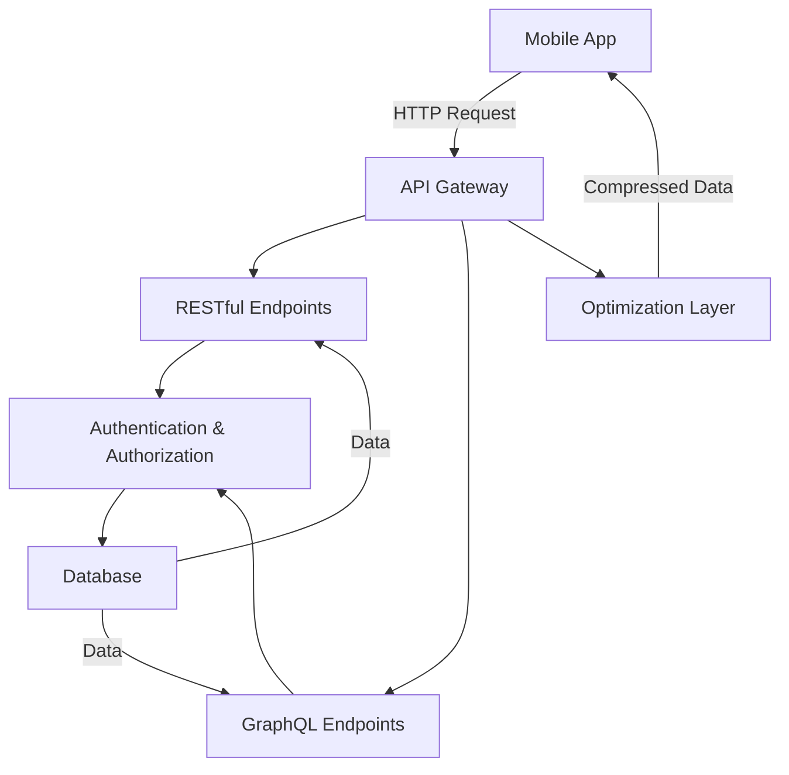

## 18.2. Building APIs for Mobile Apps

In today's mobile-first world, building efficient and scalable APIs is crucial for delivering seamless experiences to users. Elixir, with its powerful concurrency model and functional programming paradigm, offers a robust platform for developing APIs that cater to the unique needs of mobile applications. In this section, we will delve into the intricacies of building APIs using Elixir, focusing on RESTful and GraphQL approaches, implementing secure authentication and authorization, and optimizing APIs for mobile environments.

### RESTful APIs

REST (Representational State Transfer) is an architectural style that leverages HTTP methods to perform CRUD (Create, Read, Update, Delete) operations. RESTful APIs are stateless, scalable, and can be easily consumed by mobile applications.

#### Designing Endpoints for Data Retrieval and Manipulation

When designing RESTful APIs, it's essential to define clear and intuitive endpoints. Each endpoint should represent a resource, and HTTP methods should be used to perform operations on these resources.

**Example: Designing a RESTful API for a To-Do Application**

```elixir
defmodule TodoAPI.Router do
  use Plug.Router

  plug :match
  plug :dispatch

  get "/todos" do
    send_resp(conn, 200, "List of todos")
  end

  post "/todos" do
    send_resp(conn, 201, "Todo created")
  end

  get "/todos/:id" do
    send_resp(conn, 200, "Todo details for #{id}")
  end

  put "/todos/:id" do
    send_resp(conn, 200, "Todo #{id} updated")
  end

  delete "/todos/:id" do
    send_resp(conn, 204, "")
  end
end
```

In this example, we define endpoints for listing, creating, retrieving, updating, and deleting to-do items. Each endpoint corresponds to a specific HTTP method and path.

#### Key Considerations for RESTful API Design

- **Resource Naming**: Use nouns to represent resources (e.g., `/users`, `/orders`).
- **HTTP Methods**: Use GET for retrieval, POST for creation, PUT/PATCH for updates, and DELETE for deletions.
- **Status Codes**: Return appropriate HTTP status codes to indicate the result of the operation (e.g., 200 for success, 404 for not found).
- **Versioning**: Implement versioning to manage changes in the API without breaking existing clients.

### GraphQL APIs

GraphQL is a query language for APIs that allows clients to request exactly the data they need. This flexibility is particularly beneficial for mobile applications, where bandwidth and performance are critical.

#### Providing Flexible Queries Using GraphQL with Absinthe

Absinthe is a GraphQL toolkit for Elixir that enables developers to build robust GraphQL APIs.

**Example: Building a GraphQL API with Absinthe**

```elixir
defmodule MyAppWeb.Schema do
  use Absinthe.Schema

  query do
    field :todos, list_of(:todo) do
      resolve &Resolvers.Todo.list_todos/3
    end

    field :todo, :todo do
      arg :id, non_null(:id)
      resolve &Resolvers.Todo.get_todo/3
    end
  end

  object :todo do
    field :id, :id
    field :title, :string
    field :completed, :boolean
  end
end
```

In this example, we define a GraphQL schema with queries for listing all to-dos and retrieving a specific to-do by ID. The `Resolvers.Todo` module contains the logic for fetching data from the database.

#### Key Considerations for GraphQL API Design

- **Schema Design**: Define a clear and concise schema that represents the data model.
- **Resolvers**: Implement resolvers to handle data fetching and manipulation.
- **Pagination**: Implement pagination to efficiently handle large datasets.
- **Error Handling**: Provide meaningful error messages to help clients debug issues.

### Authentication and Authorization

Securing APIs is crucial, especially when dealing with sensitive data. Authentication verifies the identity of the client, while authorization determines what resources the client can access.

#### Implementing Secure Access Controls for Mobile Clients

**Example: Implementing JWT Authentication**

```elixir
defmodule MyAppWeb.Auth do
  @secret "super_secret_key"

  def generate_token(user_id) do
    {:ok, token, _claims} = Joken.encode_and_sign(%{user_id: user_id}, @secret)
    token
  end

  def verify_token(token) do
    case Joken.decode_and_verify(token, @secret) do
      {:ok, claims} -> {:ok, claims["user_id"]}
      {:error, _reason} -> :error
    end
  end
end
```

In this example, we use JSON Web Tokens (JWT) for authentication. The `generate_token/1` function creates a token for a given user ID, and the `verify_token/1` function verifies the token and extracts the user ID.

#### Key Considerations for Authentication and Authorization

- **Token Expiry**: Implement token expiry to enhance security.
- **Role-Based Access Control (RBAC)**: Define roles and permissions to control access to resources.
- **Secure Storage**: Store tokens securely on the client side to prevent unauthorized access.

### Optimizing for Mobile

Mobile applications often face challenges such as limited bandwidth and intermittent connectivity. Optimizing APIs for mobile environments can significantly enhance user experience.

#### Reducing Data Usage

- **Data Compression**: Use gzip or Brotli compression to reduce the size of API responses.
- **Selective Data Retrieval**: Allow clients to request only the data they need to minimize payload size.

#### Handling Intermittent Connectivity

- **Caching**: Implement caching strategies to store data locally and reduce the need for frequent API calls.
- **Retry Logic**: Implement retry logic to handle failed requests due to connectivity issues.

### Visualizing API Architecture

Below is a diagram illustrating the architecture of a typical API for mobile applications, including RESTful and GraphQL endpoints, authentication, and optimization strategies.



### Try It Yourself

Experiment with the code examples provided in this section. Try modifying the endpoints, adding new fields to the GraphQL schema, or implementing additional authentication mechanisms. This hands-on approach will deepen your understanding of API development in Elixir.

### References and Links

- [Elixir Documentation](https://elixir-lang.org/docs.html)
- [Phoenix Framework](https://www.phoenixframework.org/)
- [Absinthe GraphQL](https://hexdocs.pm/absinthe/overview.html)
- [Joken JWT Library](https://hexdocs.pm/joken/readme.html)

### Knowledge Check

- What are the key differences between RESTful and GraphQL APIs?
- How can you implement secure authentication for mobile clients?
- What strategies can be used to optimize APIs for mobile environments?

### Embrace the Journey

Building APIs for mobile apps using Elixir is a rewarding journey. As you continue to explore and experiment, you'll discover new ways to leverage Elixir's powerful features to create efficient and scalable APIs. Remember, this is just the beginning. Keep experimenting, stay curious, and enjoy the journey!

## Quiz: Building APIs for Mobile Apps



### What is the primary advantage of using GraphQL over RESTful APIs?

- [x] Clients can request exactly the data they need.
- [ ] GraphQL is faster than RESTful APIs.
- [ ] GraphQL is easier to implement.
- [ ] GraphQL requires less server resources.

> **Explanation:** GraphQL allows clients to specify exactly what data they need, reducing over-fetching and under-fetching issues common in RESTful APIs.

### Which HTTP method is typically used to update a resource in a RESTful API?

- [ ] GET
- [ ] POST
- [x] PUT
- [ ] DELETE

> **Explanation:** The PUT method is used to update an existing resource in a RESTful API.

### What is the purpose of token expiry in authentication?

- [x] To enhance security by limiting the token's validity period.
- [ ] To make tokens easier to manage.
- [ ] To reduce server load.
- [ ] To simplify token generation.

> **Explanation:** Token expiry enhances security by ensuring that tokens are only valid for a limited time, reducing the risk of unauthorized access.

### What is a common strategy for handling intermittent connectivity in mobile applications?

- [x] Implementing caching strategies.
- [ ] Increasing server capacity.
- [ ] Using more complex algorithms.
- [ ] Reducing API endpoints.

> **Explanation:** Caching strategies help store data locally, reducing the need for frequent API calls and improving performance during intermittent connectivity.

### Which library is commonly used for building GraphQL APIs in Elixir?

- [ ] Phoenix
- [x] Absinthe
- [ ] Ecto
- [ ] Plug

> **Explanation:** Absinthe is a popular library for building GraphQL APIs in Elixir.

### What is the role of the API Gateway in the architecture diagram?

- [x] To route requests to the appropriate endpoints.
- [ ] To store data.
- [ ] To authenticate users.
- [ ] To compress data.

> **Explanation:** The API Gateway routes incoming requests to the appropriate RESTful or GraphQL endpoints.

### How can you reduce data usage in mobile APIs?

- [x] Use data compression techniques.
- [ ] Increase server bandwidth.
- [ ] Use more complex data structures.
- [ ] Reduce the number of endpoints.

> **Explanation:** Data compression techniques like gzip or Brotli can significantly reduce the size of API responses, saving bandwidth.

### What is a key consideration when designing RESTful API endpoints?

- [x] Use nouns to represent resources.
- [ ] Use verbs to represent actions.
- [ ] Use adjectives to describe resources.
- [ ] Use adverbs to modify actions.

> **Explanation:** RESTful API endpoints should use nouns to represent resources, making them intuitive and easy to understand.

### What is the benefit of using JWT for authentication?

- [x] JWTs are stateless and can be easily verified.
- [ ] JWTs are encrypted by default.
- [ ] JWTs require less server resources.
- [ ] JWTs are easier to implement than other methods.

> **Explanation:** JWTs are stateless, meaning they don't require server-side sessions, and they can be easily verified using a secret key.

### True or False: GraphQL APIs do not require versioning.

- [x] True
- [ ] False

> **Explanation:** GraphQL APIs are designed to be flexible and evolve without breaking changes, reducing the need for versioning.


