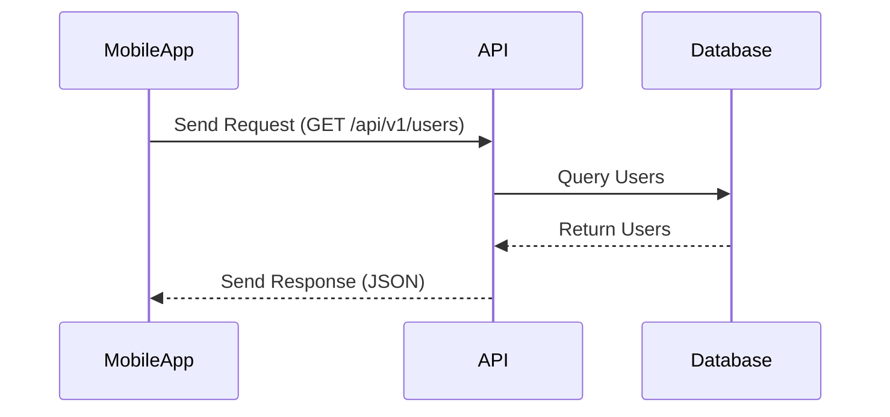

## 18.2. Building APIs for Mobile Apps

In the modern digital landscape, mobile applications are ubiquitous, and the demand for robust and efficient APIs to support them is ever-increasing. Elixir, with its concurrent and fault-tolerant nature, offers a powerful platform for building APIs that can handle the demands of mobile applications. In this section, we will explore how to build APIs for mobile apps using Elixir, focusing on both RESTful and GraphQL approaches, implementing secure authentication and authorization, and optimizing APIs for mobile environments.

### RESTful APIs

RESTful APIs are a popular choice for mobile applications due to their simplicity and scalability. They use standard HTTP methods and status codes, making them easy to understand and implement.

#### Designing Endpoints for Data Retrieval and Manipulation

When designing RESTful APIs, it's crucial to define clear and consistent endpoints that allow clients to interact with your data. Let's go through the key steps in designing RESTful endpoints:

1. **Resource Identification**: Identify the resources your API will expose. For a mobile app, this might include users, posts, comments, etc.

2. **HTTP Methods**: Use HTTP methods to define actions on resources:
   - `GET` for retrieving resources.
   - `POST` for creating resources.
   - `PUT` or `PATCH` for updating resources.
   - `DELETE` for removing resources.

3. **URL Structure**: Design a logical URL structure that reflects the hierarchy and relationships between resources.

4. **Status Codes**: Use appropriate HTTP status codes to indicate the result of an API call.

5. **Versioning**: Implement API versioning to manage changes and ensure backward compatibility.

Here's a simple example of a RESTful API endpoint in Elixir using the Phoenix framework:

```elixir
defmodule MyAppWeb.UserController do
  use MyAppWeb, :controller

  alias MyApp.Accounts
  alias MyApp.Accounts.User

  # GET /api/v1/users
  def index(conn, _params) do
    users = Accounts.list_users()
    render(conn, "index.json", users: users)
  end

  # POST /api/v1/users
  def create(conn, %{"user" => user_params}) do
    case Accounts.create_user(user_params) do
      {:ok, %User{} = user} ->
        conn
        |> put_status(:created)
        |> put_resp_header("location", Routes.user_path(conn, :show, user))
        |> render("show.json", user: user)

      {:error, changeset} ->
        conn
        |> put_status(:unprocessable_entity)
        |> render(MyAppWeb.ChangesetView, "error.json", changeset: changeset)
    end
  end
end
```

In this example, we define two endpoints: one for listing users and another for creating a user. The `index` function handles `GET` requests, while the `create` function handles `POST` requests.

#### Try It Yourself

Experiment with adding more endpoints, such as updating and deleting users. Consider how you might handle errors and validation.

### GraphQL APIs

GraphQL provides a flexible alternative to REST by allowing clients to specify exactly what data they need. This can reduce over-fetching and under-fetching of data, which is particularly beneficial for mobile applications with limited bandwidth.

#### Providing Flexible Queries Using GraphQL with Absinthe

Absinthe is a powerful library for building GraphQL APIs in Elixir. It integrates seamlessly with the Phoenix framework and provides a rich set of features for defining and executing GraphQL queries.

1. **Schema Definition**: Define your GraphQL schema, including types, queries, and mutations.

2. **Resolvers**: Implement resolvers to handle the logic for fetching and manipulating data.

3. **Query Execution**: Use Absinthe to execute queries and return results to clients.

Here's an example of a simple GraphQL schema and resolver using Absinthe:

```elixir
defmodule MyAppWeb.Schema do
  use Absinthe.Schema

  query do
    field :user, :user do
      arg :id, non_null(:id)
      resolve &MyAppWeb.Resolvers.User.find/3
    end
  end

  object :user do
    field :id, :id
    field :name, :string
    field :email, :string
  end
end

defmodule MyAppWeb.Resolvers.User do
  alias MyApp.Accounts

  def find(_parent, %{id: id}, _resolution) do
    case Accounts.get_user(id) do
      nil -> {:error, "User not found"}
      user -> {:ok, user}
    end
  end
end
```

In this example, we define a `user` query that takes an `id` argument and returns a user object. The resolver function `find` fetches the user from the database.

#### Try It Yourself

Extend the schema to include more fields and relationships. Implement mutations for creating and updating users.

### Authentication and Authorization

Securing your API is crucial, especially when dealing with sensitive data in mobile applications. Authentication verifies the identity of users, while authorization determines what resources they can access.

#### Implementing Secure Access Controls for Mobile Clients

1. **Token-Based Authentication**: Use tokens (such as JWT) to authenticate users. Tokens are sent with each request and verified by the server.

2. **Role-Based Access Control (RBAC)**: Implement RBAC to manage user permissions and restrict access to resources.

3. **Secure Communication**: Use HTTPS to encrypt data in transit and protect against eavesdropping.

Here's an example of implementing JWT authentication in a Phoenix application:

```elixir
defmodule MyAppWeb.AuthController do
  use MyAppWeb, :controller

  alias MyApp.Accounts
  alias MyApp.Guardian

  # POST /api/v1/login
  def login(conn, %{"email" => email, "password" => password}) do
    case Accounts.authenticate_user(email, password) do
      {:ok, user} ->
        {:ok, token, _claims} = Guardian.encode_and_sign(user)
        render(conn, "login.json", token: token)

      {:error, _reason} ->
        conn
        |> put_status(:unauthorized)
        |> render("error.json", message: "Invalid credentials")
    end
  end
end
```

In this example, the `login` function authenticates the user and returns a JWT token upon successful login.

#### Try It Yourself

Implement logout functionality by invalidating tokens. Consider how you might handle token expiration and refresh.

### Optimizing for Mobile

Mobile applications often face challenges such as limited bandwidth and intermittent connectivity. Optimizing your API can improve performance and user experience.

#### Reducing Data Usage and Handling Intermittent Connectivity

1. **Data Compression**: Use gzip or Brotli compression to reduce the size of responses.

2. **Efficient Data Structures**: Use efficient data structures and serialization formats (e.g., JSON, MessagePack) to minimize data transfer.

3. **Caching**: Implement caching strategies to reduce server load and improve response times.

4. **Offline Support**: Design your API to support offline access and synchronization when connectivity is restored.

Here's an example of enabling gzip compression in a Phoenix application:

```elixir
# config/config.exs
config :my_app, MyAppWeb.Endpoint,
  http: [compress: true]
```

This simple configuration enables gzip compression for HTTP responses, reducing data usage for mobile clients.

#### Try It Yourself

Experiment with different serialization formats and caching strategies. Consider how you might implement offline support in your mobile app.

### Visualizing API Architecture

To better understand the flow of data and requests in a mobile API, let's visualize a typical architecture using Mermaid.js:


```mermaid
sequenceDiagram
    participant MobileApp
    participant API
    participant Database

    MobileApp->>API: Send Request (GET /api/v1/users)
    API->>Database: Query Users
    Database-->>API: Return Users
    API-->>MobileApp: Send Response (JSON)
```

In this diagram, we see a simple sequence of a mobile app sending a request to the API, the API querying the database, and the API returning a response to the mobile app.

### References and Links

- [Phoenix Framework Documentation](https://hexdocs.pm/phoenix/)
- [Absinthe GraphQL Documentation](https://hexdocs.pm/absinthe/)
- [Guardian JWT Library](https://hexdocs.pm/guardian/)

### Knowledge Check

- What are the benefits of using GraphQL over REST for mobile APIs?
- How does token-based authentication enhance API security?
- What strategies can be used to optimize APIs for mobile environments?

### Embrace the Journey

Building APIs for mobile apps is a rewarding endeavor that requires careful planning and execution. Remember, this is just the beginning. As you progress, you'll build more complex and interactive APIs. Keep experimenting, stay curious, and enjoy the journey!

## Quiz Time!



### What is a key advantage of using GraphQL for mobile APIs?

- [x] It allows clients to request only the data they need.
- [ ] It uses less bandwidth than REST.
- [ ] It automatically handles authentication.
- [ ] It is easier to implement than REST.

> **Explanation:** GraphQL allows clients to specify exactly what data they need, reducing over-fetching and under-fetching.

### Which HTTP method is used to update a resource in a RESTful API?

- [ ] GET
- [ ] POST
- [x] PUT
- [ ] DELETE

> **Explanation:** The `PUT` method is used to update a resource in a RESTful API.

### What is the purpose of JWT in API authentication?

- [x] To securely transmit user identity between client and server.
- [ ] To encrypt all API data.
- [ ] To manage API rate limits.
- [ ] To handle user sessions on the server.

> **Explanation:** JWT (JSON Web Tokens) are used to securely transmit user identity and claims between client and server.

### How can you reduce data usage in mobile APIs?

- [x] Use data compression techniques like gzip.
- [ ] Increase server processing power.
- [ ] Use larger data structures.
- [ ] Disable caching.

> **Explanation:** Data compression techniques like gzip reduce the size of responses, saving bandwidth.

### What is a common challenge faced by mobile applications?

- [x] Intermittent connectivity
- [ ] Unlimited bandwidth
- [ ] Constant server availability
- [ ] No need for authentication

> **Explanation:** Mobile applications often face intermittent connectivity, which requires careful API design to handle.

### How does role-based access control (RBAC) enhance security?

- [x] By restricting user access based on their roles.
- [ ] By encrypting all data.
- [ ] By logging all user actions.
- [ ] By using complex passwords.

> **Explanation:** RBAC restricts user access to resources based on their roles, enhancing security.

### What is a benefit of using efficient data structures in APIs?

- [x] Reduced data transfer size
- [ ] Increased server load
- [ ] More complex code
- [ ] Slower response times

> **Explanation:** Efficient data structures reduce the size of data transferred, improving performance.

### Which library is used for building GraphQL APIs in Elixir?

- [ ] Phoenix
- [x] Absinthe
- [ ] Guardian
- [ ] Ecto

> **Explanation:** Absinthe is a library used for building GraphQL APIs in Elixir.

### What is a key feature of RESTful APIs?

- [x] Use of standard HTTP methods and status codes
- [ ] Automatic data compression
- [ ] Built-in authentication
- [ ] Real-time data updates

> **Explanation:** RESTful APIs use standard HTTP methods and status codes for communication.

### True or False: HTTPS is essential for secure API communication.

- [x] True
- [ ] False

> **Explanation:** HTTPS encrypts data in transit, protecting against eavesdropping and ensuring secure communication.


