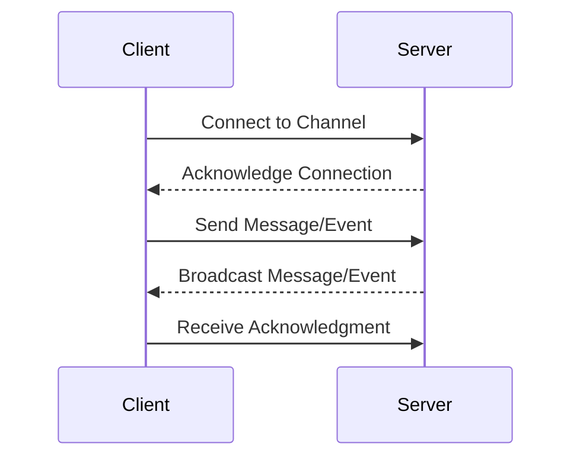

## 18.3. Real-Time Features with Phoenix Channels

In the world of mobile development, real-time communication is no longer a luxury but a necessity. Users expect instant updates, seamless synchronization, and timely notifications. Phoenix Channels, a powerful feature of the Phoenix framework in Elixir, offers a robust solution for implementing real-time features in your mobile applications. In this section, we will delve into the intricacies of using Phoenix Channels to implement push notifications, live updates, and synchronization.

### Introduction to Phoenix Channels

Phoenix Channels provide a way to establish real-time, bidirectional communication between clients and servers. Built on top of WebSockets, Channels allow for efficient data exchange, making them ideal for applications that require instant updates and interactions. Let's explore how Phoenix Channels work and how they can be leveraged to enhance mobile applications.

#### Key Concepts

- **WebSockets**: A protocol that enables full-duplex communication channels over a single TCP connection.
- **PubSub**: A publish-subscribe pattern used by Phoenix Channels to broadcast messages to multiple subscribers.
- **Topics**: Named channels that clients can join to receive messages.
- **Events**: Specific actions or messages sent over a channel.

### Implementing Push Notifications

Push notifications are a critical component of modern mobile applications, allowing servers to send timely alerts to users. With Phoenix Channels, you can implement server-initiated communication to clients efficiently.

#### Setting Up Phoenix Channels for Push Notifications

1. **Create a Channel**: Define a new channel in your Phoenix application to handle push notifications.

```elixir
defmodule MyAppWeb.NotificationChannel do
  use Phoenix.Channel

  def join("notifications:lobby", _message, socket) do
    {:ok, socket}
  end

  def handle_in("new_notification", %{"message" => message}, socket) do
    broadcast!(socket, "new_notification", %{message: message})
    {:noreply, socket}
  end
end
```

2. **Client-Side Integration**: Use a JavaScript client to connect to the channel and listen for notifications.

```javascript
let socket = new Phoenix.Socket("/socket", {params: {userToken: "123"}})
socket.connect()

let channel = socket.channel("notifications:lobby", {})
channel.join()
  .receive("ok", resp => { console.log("Joined successfully", resp) })
  .receive("error", resp => { console.log("Unable to join", resp) })

channel.on("new_notification", payload => {
  alert(`New notification: ${payload.message}`)
})
```

3. **Trigger Notifications**: From the server, push notifications can be triggered based on specific events or conditions.

```elixir
def notify_user(user_id, message) do
  MyAppWeb.Endpoint.broadcast("notifications:lobby", "new_notification", %{message: message})
end
```

#### Considerations for Push Notifications

- **Scalability**: Ensure your server can handle the load of sending notifications to a large number of users.
- **Security**: Implement authentication and authorization to control who can send and receive notifications.
- **User Preferences**: Allow users to customize their notification preferences.

### Live Updates with Phoenix Channels

Live updates allow applications to refresh content in real-time without the need for polling. This feature is particularly useful for applications that display dynamic data, such as news feeds or social media timelines.

#### Implementing Live Updates

1. **Define a Channel for Updates**: Create a channel to handle live updates.

```elixir
defmodule MyAppWeb.UpdatesChannel do
  use Phoenix.Channel

  def join("updates:feed", _message, socket) do
    {:ok, socket}
  end

  def handle_in("fetch_updates", _payload, socket) do
    updates = fetch_latest_updates()
    push(socket, "new_updates", %{updates: updates})
    {:noreply, socket}
  end
end
```

2. **Client-Side Setup**: Connect to the channel and listen for update events.

```javascript
let updatesChannel = socket.channel("updates:feed", {})
updatesChannel.join()
  .receive("ok", resp => { console.log("Joined updates channel", resp) })
  .receive("error", resp => { console.log("Unable to join updates channel", resp) })

updatesChannel.on("new_updates", payload => {
  updateFeed(payload.updates)
})
```

3. **Broadcast Updates**: Use the server to push updates to all connected clients.

```elixir
def broadcast_updates() do
  updates = fetch_latest_updates()
  MyAppWeb.Endpoint.broadcast("updates:feed", "new_updates", %{updates: updates})
end
```

#### Benefits of Live Updates

- **Reduced Latency**: Users receive updates instantly, improving the user experience.
- **Efficiency**: Eliminates the need for frequent polling, reducing server load and bandwidth usage.
- **Engagement**: Keeps users engaged with fresh content.

### Synchronization Across Devices

Synchronization ensures that data remains consistent across multiple devices. With Phoenix Channels, you can implement real-time synchronization to keep user data up-to-date.

#### Implementing Synchronization

1. **Channel for Synchronization**: Create a channel to manage synchronization events.

```elixir
defmodule MyAppWeb.SyncChannel do
  use Phoenix.Channel

  def join("sync:data", _message, socket) do
    {:ok, socket}
  end

  def handle_in("sync_request", %{"data" => data}, socket) do
    # Process and synchronize data
    {:noreply, socket}
  end
end
```

2. **Client-Side Synchronization**: Connect to the channel and handle synchronization events.

```javascript
let syncChannel = socket.channel("sync:data", {})
syncChannel.join()
  .receive("ok", resp => { console.log("Joined sync channel", resp) })
  .receive("error", resp => { console.log("Unable to join sync channel", resp) })

syncChannel.on("sync_update", payload => {
  synchronizeData(payload.data)
})
```

3. **Server-Side Synchronization Logic**: Implement logic to handle synchronization requests and updates.

```elixir
def synchronize_data(data) do
  # Logic to synchronize data across devices
  MyAppWeb.Endpoint.broadcast("sync:data", "sync_update", %{data: data})
end
```

#### Challenges and Solutions

- **Conflict Resolution**: Implement strategies to handle conflicts when data changes on multiple devices simultaneously.
- **Data Consistency**: Ensure that data remains consistent and accurate across all devices.
- **Network Reliability**: Handle network interruptions gracefully to maintain synchronization.

### Visualizing Real-Time Communication

To better understand how Phoenix Channels facilitate real-time communication, let's visualize the process using a sequence diagram.



**Diagram Description**: This sequence diagram illustrates the flow of communication between a client and server using Phoenix Channels. The client connects to a channel, sends messages, and receives broadcasts from the server.

### Try It Yourself

Now that we've covered the basics of implementing real-time features with Phoenix Channels, it's time to experiment. Try modifying the code examples to:

- Implement a chat application where users can send and receive messages in real-time.
- Create a live sports scoreboard that updates scores as they happen.
- Develop a collaborative document editor where multiple users can edit a document simultaneously.

### Knowledge Check

Before we conclude, let's reinforce what we've learned with a few questions:

- How do Phoenix Channels differ from traditional HTTP requests?
- What are the benefits of using WebSockets for real-time communication?
- How can you ensure data consistency when synchronizing across devices?

### Conclusion

Phoenix Channels provide a powerful toolset for implementing real-time features in mobile applications. By leveraging channels, you can create applications that deliver push notifications, live updates, and seamless synchronization, enhancing the user experience and engagement. Remember, this is just the beginning. As you continue to explore and experiment with Phoenix Channels, you'll discover new ways to harness their power in your applications.

## Quiz: Real-Time Features with Phoenix Channels



### What protocol do Phoenix Channels use for real-time communication?

- [x] WebSockets
- [ ] HTTP
- [ ] FTP
- [ ] SMTP

> **Explanation:** Phoenix Channels use WebSockets to establish real-time, bidirectional communication between clients and servers.

### What is the primary advantage of using Phoenix Channels for live updates?

- [x] Reduced latency and efficient data exchange
- [ ] Increased server load
- [ ] Complex implementation
- [ ] Limited scalability

> **Explanation:** Phoenix Channels reduce latency and provide efficient data exchange, making them ideal for live updates.

### How do you define a channel in a Phoenix application?

- [x] By creating a module that uses `Phoenix.Channel`
- [ ] By writing a JavaScript function
- [ ] By configuring a database
- [ ] By setting up an HTTP endpoint

> **Explanation:** A channel is defined by creating a module that uses `Phoenix.Channel` in a Phoenix application.

### What is a key consideration when implementing push notifications?

- [x] Scalability and security
- [ ] Database configuration
- [ ] UI design
- [ ] Code formatting

> **Explanation:** Scalability and security are key considerations when implementing push notifications to ensure efficient and secure communication.

### What is the role of the PubSub pattern in Phoenix Channels?

- [x] To broadcast messages to multiple subscribers
- [ ] To store data in a database
- [ ] To render HTML pages
- [ ] To manage user authentication

> **Explanation:** The PubSub pattern is used to broadcast messages to multiple subscribers in Phoenix Channels.

### How can you handle data conflicts during synchronization?

- [x] Implement conflict resolution strategies
- [ ] Ignore conflicts
- [ ] Use a single device for updates
- [ ] Disable synchronization

> **Explanation:** Implementing conflict resolution strategies is essential to handle data conflicts during synchronization.

### What is a benefit of using live updates in mobile applications?

- [x] Improved user engagement with fresh content
- [ ] Increased bandwidth usage
- [ ] Slower data processing
- [ ] Reduced server efficiency

> **Explanation:** Live updates improve user engagement by providing fresh content without the need for polling.

### How can you ensure network reliability during synchronization?

- [x] Handle network interruptions gracefully
- [ ] Ignore network issues
- [ ] Use only local storage
- [ ] Disable synchronization

> **Explanation:** Handling network interruptions gracefully ensures network reliability during synchronization.

### What is a common use case for Phoenix Channels in mobile applications?

- [x] Real-time chat applications
- [ ] Static web pages
- [ ] Offline data storage
- [ ] Batch processing

> **Explanation:** Real-time chat applications are a common use case for Phoenix Channels due to their need for instant communication.

### True or False: Phoenix Channels can only be used for mobile applications.

- [ ] True
- [x] False

> **Explanation:** Phoenix Channels can be used for both mobile and web applications, providing real-time communication capabilities.


