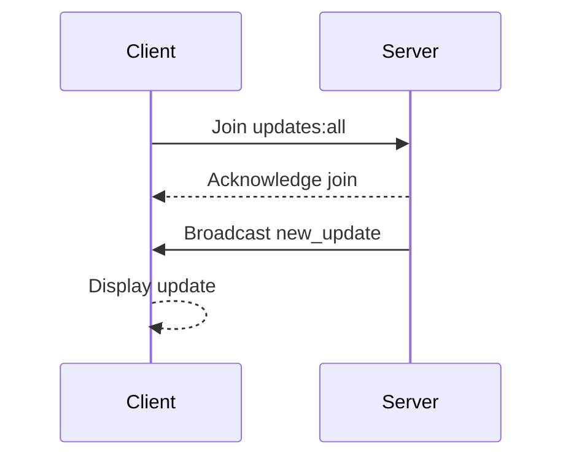
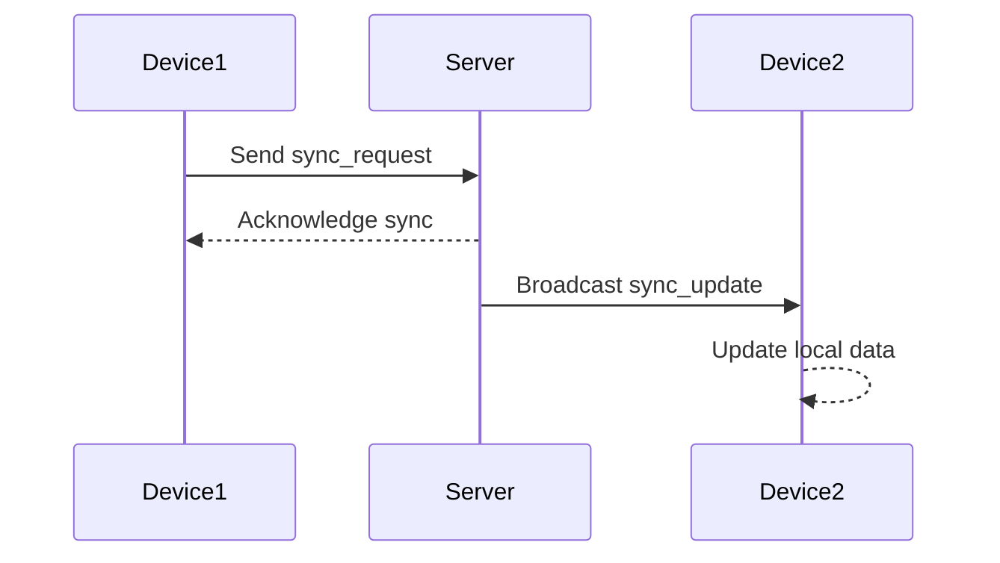

## 18.3. Real-Time Features with Phoenix Channels

In the world of mobile development, real-time features have become a cornerstone for creating engaging and interactive user experiences. Phoenix Channels in Elixir provide a robust framework for implementing these features, enabling real-time communication between the server and clients. In this section, we will delve into the intricacies of using Phoenix Channels to implement push notifications, live updates, and synchronization across devices.

### Introduction to Phoenix Channels

Phoenix Channels are a powerful abstraction for handling bi-directional communication between clients and servers. They are built on top of WebSockets, providing a more flexible and scalable solution for real-time applications. Channels allow you to broadcast messages to multiple clients, handle complex message routing, and manage stateful connections with ease.

#### Key Concepts of Phoenix Channels

- **Topics**: Channels are organized around topics, which are strings that clients subscribe to. Topics help in categorizing messages and routing them to the appropriate clients.
- **PubSub**: Phoenix utilizes a PubSub system for message broadcasting. It allows messages to be published to a topic, and all subscribers to that topic will receive the message.
- **Presence**: A feature of Phoenix Channels that tracks the online presence of users in a topic. It is useful for building features like online user lists and notifications.

### Implementing Push Notifications

Push notifications are a crucial feature for engaging users by delivering timely information directly to their devices. With Phoenix Channels, you can implement server-initiated communication to clients, ensuring that users receive updates even when they are not actively using the app.

#### Setting Up Push Notifications

To set up push notifications with Phoenix Channels, follow these steps:

1. **Configure the Endpoint**: Ensure your Phoenix endpoint is configured to handle WebSocket connections.

   ```elixir
   # config/config.exs
   config :my_app, MyAppWeb.Endpoint,
     url: [host: "localhost"],
     secret_key_base: "SECRET_KEY_BASE",
     render_errors: [view: MyAppWeb.ErrorView, accepts: ~w(html json)],
     pubsub_server: MyApp.PubSub,
     live_view: [signing_salt: "SIGNING_SALT"]
   ```

2. **Define a Channel**: Create a channel module to handle push notifications.

   ```elixir
   defmodule MyAppWeb.NotificationChannel do
     use Phoenix.Channel

     def join("notifications:lobby", _message, socket) do
       {:ok, socket}
     end

     def handle_in("push", %{"message" => message}, socket) do
       broadcast!(socket, "push", %{"message" => message})
       {:noreply, socket}
     end
   end
   ```

3. **Broadcast Notifications**: Use the `broadcast!` function to send notifications to all clients subscribed to the channel.

   ```elixir
   MyAppWeb.Endpoint.broadcast("notifications:lobby", "push", %{"message" => "Hello, World!"})
   ```

4. **Client-Side Implementation**: On the client side, establish a WebSocket connection and listen for messages.

   ```javascript
   import { Socket } from "phoenix"

   let socket = new Socket("/socket", {params: {userToken: "123"}})
   socket.connect()

   let channel = socket.channel("notifications:lobby", {})
   channel.join()
     .receive("ok", resp => { console.log("Joined successfully", resp) })
     .receive("error", resp => { console.log("Unable to join", resp) })

   channel.on("push", payload => {
     console.log("Received push notification:", payload.message)
   })
   ```

#### Try It Yourself

Experiment with modifying the message content or adding additional data to the payload. Consider implementing a feature where users can subscribe to specific types of notifications based on their preferences.

### Live Updates with Phoenix Channels

Live updates are essential for keeping app content fresh and engaging without the need for constant polling. Phoenix Channels enable real-time updates by pushing changes to clients as they occur.

#### Building Live Updates

To build live updates with Phoenix Channels, follow these steps:

1. **Create a Channel for Updates**: Define a channel module to handle live updates.

   ```elixir
   defmodule MyAppWeb.UpdatesChannel do
     use Phoenix.Channel

     def join("updates:all", _message, socket) do
       {:ok, socket}
     end

     def handle_in("new_update", %{"content" => content}, socket) do
       broadcast!(socket, "new_update", %{"content" => content})
       {:noreply, socket}
     end
   end
   ```

2. **Broadcast Live Updates**: Use the `broadcast!` function to send updates to all clients subscribed to the channel.

   ```elixir
   MyAppWeb.Endpoint.broadcast("updates:all", "new_update", %{"content" => "New update available!"})
   ```

3. **Client-Side Implementation**: On the client side, establish a WebSocket connection and listen for updates.

   ```javascript
   import { Socket } from "phoenix"

   let socket = new Socket("/socket", {params: {userToken: "123"}})
   socket.connect()

   let channel = socket.channel("updates:all", {})
   channel.join()
     .receive("ok", resp => { console.log("Joined successfully", resp) })
     .receive("error", resp => { console.log("Unable to join", resp) })

   channel.on("new_update", payload => {
     console.log("Received live update:", payload.content)
   })
   ```

#### Visualizing Live Updates


```mermaid
sequenceDiagram
    participant Client
    participant Server
    Client->>Server: Join updates:all
    Server-->>Client: Acknowledge join
    Server->>Client: Broadcast new_update
    Client-->>Client: Display update
```

This diagram illustrates the sequence of events for broadcasting a live update from the server to the client.

#### Try It Yourself

Modify the channel to handle different types of updates, such as news articles, social media posts, or stock prices. Experiment with filtering updates based on user preferences or location.

### Synchronization Across Devices

Synchronization ensures that data remains consistent across multiple devices, providing a seamless user experience. Phoenix Channels facilitate real-time synchronization by broadcasting changes to all connected clients.

#### Implementing Synchronization

To implement synchronization with Phoenix Channels, follow these steps:

1. **Create a Synchronization Channel**: Define a channel module to handle data synchronization.

   ```elixir
   defmodule MyAppWeb.SyncChannel do
     use Phoenix.Channel

     def join("sync:data", _message, socket) do
       {:ok, socket}
     end

     def handle_in("sync_request", %{"data" => data}, socket) do
       broadcast!(socket, "sync_update", %{"data" => data})
       {:noreply, socket}
     end
   end
   ```

2. **Broadcast Synchronization Updates**: Use the `broadcast!` function to send synchronization updates to all clients.

   ```elixir
   MyAppWeb.Endpoint.broadcast("sync:data", "sync_update", %{"data" => "Updated data!"})
   ```

3. **Client-Side Implementation**: On the client side, establish a WebSocket connection and listen for synchronization updates.

   ```javascript
   import { Socket } from "phoenix"

   let socket = new Socket("/socket", {params: {userToken: "123"}})
   socket.connect()

   let channel = socket.channel("sync:data", {})
   channel.join()
     .receive("ok", resp => { console.log("Joined successfully", resp) })
     .receive("error", resp => { console.log("Unable to join", resp) })

   channel.on("sync_update", payload => {
     console.log("Received synchronization update:", payload.data)
   })
   ```

#### Visualizing Synchronization


```mermaid
sequenceDiagram
    participant Device1
    participant Server
    participant Device2
    Device1->>Server: Send sync_request
    Server-->>Device1: Acknowledge sync
    Server->>Device2: Broadcast sync_update
    Device2-->>Device2: Update local data
```

This diagram illustrates the synchronization process between multiple devices through the server.

#### Try It Yourself

Implement a feature where changes made on one device are immediately reflected on another. Experiment with handling conflicts when multiple devices attempt to update the same data simultaneously.

### Design Considerations

When implementing real-time features with Phoenix Channels, consider the following:

- **Scalability**: Ensure your server can handle a large number of concurrent connections. Utilize Phoenix's built-in PubSub system for efficient message broadcasting.
- **Security**: Secure WebSocket connections with SSL/TLS to protect data in transit. Implement authentication mechanisms to ensure only authorized clients can join channels.
- **Error Handling**: Implement robust error handling on both the client and server sides to gracefully handle connection drops or message delivery failures.
- **Performance**: Optimize message payloads and minimize unnecessary data transmission to improve performance and reduce latency.

### Elixir Unique Features

Elixir's concurrency model and lightweight processes make it particularly well-suited for real-time applications. The BEAM VM, which powers Elixir, provides excellent support for handling thousands of concurrent connections, making it an ideal choice for building scalable real-time systems.

### Differences and Similarities

Phoenix Channels share similarities with other WebSocket-based frameworks, such as Socket.IO in the JavaScript ecosystem. However, Phoenix Channels offer tighter integration with Elixir's concurrency model and the ability to leverage OTP (Open Telecom Platform) features for building fault-tolerant systems.

### Conclusion

Phoenix Channels provide a powerful framework for implementing real-time features in mobile applications. By leveraging channels, you can build engaging and interactive experiences with push notifications, live updates, and synchronization across devices. As you continue to explore the capabilities of Phoenix Channels, remember to experiment, iterate, and refine your implementations to create seamless user experiences.

## Quiz Time!



### What is the primary purpose of Phoenix Channels in Elixir?

- [x] To handle bi-directional communication between clients and servers
- [ ] To manage database connections
- [ ] To render HTML templates
- [ ] To perform asynchronous tasks

> **Explanation:** Phoenix Channels are designed to facilitate real-time, bi-directional communication between clients and servers.

### Which of the following is a key feature of Phoenix Channels?

- [x] Presence
- [ ] ORM
- [ ] Static file serving
- [ ] Template rendering

> **Explanation:** Presence is a feature of Phoenix Channels that tracks the online presence of users in a topic.

### How do you broadcast a message to all clients in a Phoenix Channel?

- [x] Using the `broadcast!` function
- [ ] Using the `send` function
- [ ] Using the `render` function
- [ ] Using the `connect` function

> **Explanation:** The `broadcast!` function is used to send messages to all clients subscribed to a channel.

### What is the role of topics in Phoenix Channels?

- [x] To categorize messages and route them to appropriate clients
- [ ] To manage database transactions
- [ ] To define HTML templates
- [ ] To handle static files

> **Explanation:** Topics in Phoenix Channels help categorize messages and route them to the correct clients.

### What is a common use case for the `Presence` feature in Phoenix Channels?

- [x] Tracking online users
- [ ] Managing database connections
- [ ] Rendering HTML templates
- [ ] Serving static files

> **Explanation:** The `Presence` feature is commonly used to track online users in a channel.

### How can you secure WebSocket connections in Phoenix Channels?

- [x] By using SSL/TLS
- [ ] By using HTTP
- [ ] By using FTP
- [ ] By using SMTP

> **Explanation:** SSL/TLS is used to secure WebSocket connections and protect data in transit.

### What should you consider when implementing real-time features with Phoenix Channels?

- [x] Scalability and security
- [ ] Static file serving
- [ ] HTML rendering
- [ ] CSS styling

> **Explanation:** Scalability and security are important considerations when implementing real-time features.

### Which Elixir feature makes it well-suited for real-time applications?

- [x] Concurrency model and lightweight processes
- [ ] Static typing
- [ ] Synchronous execution
- [ ] Monolithic architecture

> **Explanation:** Elixir's concurrency model and lightweight processes make it well-suited for real-time applications.

### What is a potential challenge when synchronizing data across devices?

- [x] Handling conflicts when multiple devices update the same data
- [ ] Rendering HTML templates
- [ ] Managing static files
- [ ] Creating CSS styles

> **Explanation:** Handling conflicts when multiple devices attempt to update the same data is a potential challenge in synchronization.

### True or False: Phoenix Channels can only be used for WebSocket communication.

- [x] True
- [ ] False

> **Explanation:** Phoenix Channels are specifically designed for WebSocket communication, although they can also fall back to long polling if necessary.



Remember, this is just the beginning. As you progress, you'll build more complex and interactive applications. Keep experimenting, stay curious, and enjoy the journey!
