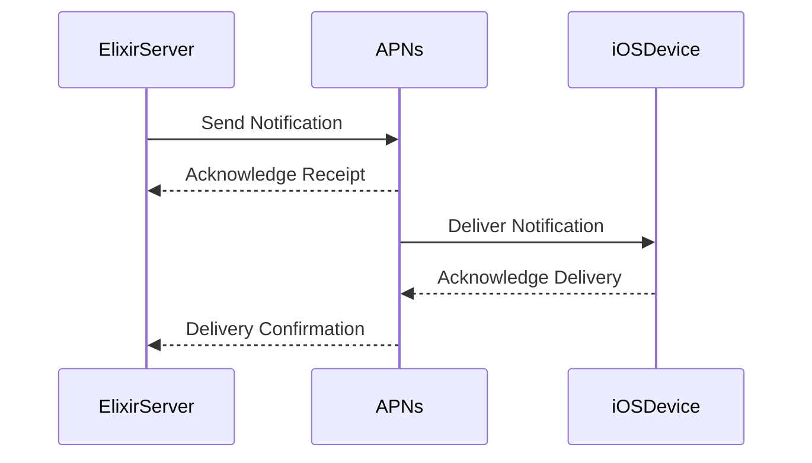

## 18.4. Push Notifications Integration

Push notifications are a crucial component of modern mobile applications, providing a direct channel to engage users with timely updates and information. In this section, we will explore how to integrate push notifications into Elixir applications, focusing on the Apple Push Notification service (APNs) for iOS and Firebase Cloud Messaging (FCM) for Android. We will also discuss best practices for handling notifications effectively and introduce libraries like `Pigeon` to streamline the process.

### Setting Up Push Services

#### Integrating with APNs for iOS

APNs is Apple's service for sending notifications to iOS devices. To integrate APNs into your Elixir application, follow these steps:

1. **Create an Apple Developer Account**: To use APNs, you need an Apple Developer account. Sign up at [Apple Developer](https://developer.apple.com/).

2. **Generate an APNs Certificate**: In the Apple Developer portal, create an App ID and generate an APNs certificate. This certificate is used to authenticate your server with APNs.

3. **Configure Your App**: Ensure your iOS app is configured to receive push notifications. This involves enabling push notifications in the app's capabilities and configuring the app to handle incoming notifications.

4. **Set Up Your Elixir Server**: Use the `Pigeon` library to send notifications from your Elixir server to APNs. Install `Pigeon` by adding it to your `mix.exs` file:

   ```elixir
   defp deps do
     [
       {:pigeon, "~> 1.6"}
     ]
   end
   ```

5. **Configure Pigeon for APNs**: Set up `Pigeon` with your APNs certificate and key:

   ```elixir
   config :pigeon, :apns,
     apns_default: %{
       cert: "path/to/cert.pem",
       key: "path/to/key.pem",
       mode: :dev
     }
   ```

6. **Send a Notification**: Use `Pigeon` to send a notification:

   ```elixir
   notification = %Pigeon.APNS.Notification{
     device_token: "your_device_token",
     alert: "Hello, World!",
     topic: "com.example.yourapp"
   }

   Pigeon.APNS.push(notification)
   ```

#### Integrating with FCM for Android

FCM is Google's service for sending notifications to Android devices. To integrate FCM into your Elixir application, follow these steps:

1. **Create a Firebase Project**: Go to the [Firebase Console](https://console.firebase.google.com/) and create a new project.

2. **Add Firebase to Your Android App**: Follow the instructions in the Firebase Console to add Firebase to your Android app. This includes downloading the `google-services.json` file and adding it to your app.

3. **Obtain FCM Server Key**: In the Firebase Console, navigate to Project Settings > Cloud Messaging and obtain your server key.

4. **Set Up Your Elixir Server**: Use the `Pigeon` library to send notifications from your Elixir server to FCM. Install `Pigeon` by adding it to your `mix.exs` file:

   ```elixir
   defp deps do
     [
       {:pigeon, "~> 1.6"}
     ]
   end
   ```

5. **Configure Pigeon for FCM**: Set up `Pigeon` with your FCM server key:

   ```elixir
   config :pigeon, :fcm,
     fcm_default: %{
       key: "your_fcm_server_key"
     }
   ```

6. **Send a Notification**: Use `Pigeon` to send a notification:

   ```elixir
   notification = %Pigeon.FCM.Notification{
     registration_id: "your_registration_id",
     notification: %{
       title: "Hello",
       body: "World"
     }
   }

   Pigeon.FCM.push(notification)
   ```

### Using Libraries

#### Leveraging `Pigeon` for Notification Handling

`Pigeon` is a popular Elixir library for sending push notifications via APNs and FCM. It abstracts the complexities of interacting with these services, providing a simple and consistent API.

- **Installation**: Add `Pigeon` to your `mix.exs` dependencies as shown earlier.

- **Configuration**: Configure `Pigeon` for APNs and FCM using your credentials.

- **Sending Notifications**: Use `Pigeon`'s API to send notifications. The library handles the communication with APNs and FCM, including retries and error handling.

- **Handling Responses**: `Pigeon` provides callbacks for handling responses from APNs and FCM, allowing you to manage delivery confirmations and errors.

### Best Practices

#### Handling Delivery Confirmations

- **Monitor Responses**: Use `Pigeon`'s response handling to monitor the status of your notifications. This allows you to track delivery success and handle failures appropriately.

- **Retry Failed Deliveries**: Implement retry logic for failed deliveries. `Pigeon` can be configured to automatically retry failed notifications.

#### Managing Tokens

- **Token Expiry**: Device tokens can expire or become invalid. Implement logic to handle token updates and removals.

- **Token Storage**: Store device tokens securely and ensure they are updated regularly.

#### Optimizing Payloads

- **Keep Payloads Small**: Push notification payloads should be as small as possible to ensure quick delivery and processing.

- **Use Data Notifications**: For background updates, use data notifications to minimize user disruption.

### Visualizing Push Notification Workflow

Below is a sequence diagram illustrating the workflow of sending a push notification using `Pigeon` in Elixir:



### Try It Yourself

Experiment with the following code examples by modifying the notification payloads, changing device tokens, or adjusting retry logic. This hands-on approach will deepen your understanding of push notification integration in Elixir.

### Knowledge Check

- **What are the key differences between APNs and FCM?**
- **How does `Pigeon` simplify push notification integration in Elixir?**
- **What are some best practices for managing device tokens?**

### Embrace the Journey

Integrating push notifications in Elixir applications can seem daunting, but with the right tools and practices, it becomes a manageable and rewarding task. Remember, this is just the beginning. As you progress, you'll build more complex and interactive applications. Keep experimenting, stay curious, and enjoy the journey!

## Quiz: Push Notifications Integration



### What is the primary purpose of push notifications in mobile applications?

- [x] To engage users with timely updates and information
- [ ] To store data locally on the device
- [ ] To enhance the app's graphical interface
- [ ] To manage user authentication

> **Explanation:** Push notifications are used to engage users by providing timely updates and information directly to their devices.

### Which library is commonly used in Elixir for handling push notifications?

- [x] Pigeon
- [ ] Phoenix
- [ ] Ecto
- [ ] Plug

> **Explanation:** `Pigeon` is a popular library in Elixir for handling push notifications via APNs and FCM.

### What is a key step in setting up APNs for iOS?

- [x] Generating an APNs certificate
- [ ] Creating a Firebase project
- [ ] Installing Android Studio
- [ ] Configuring a REST API

> **Explanation:** Generating an APNs certificate is essential for authenticating your server with Apple's push notification service.

### How can you handle token expiry in push notifications?

- [x] Implement logic to update and remove expired tokens
- [ ] Ignore expired tokens
- [ ] Use the same token indefinitely
- [ ] Store tokens in a text file

> **Explanation:** Implementing logic to update and remove expired tokens ensures that your notifications are delivered successfully.

### What is the recommended way to keep push notification payloads?

- [x] Small and efficient
- [ ] Large and detailed
- [ ] Encrypted
- [ ] In JSON format only

> **Explanation:** Keeping payloads small and efficient ensures quick delivery and processing of notifications.

### What is the role of `Pigeon` in push notifications?

- [x] It abstracts the complexities of interacting with APNs and FCM
- [ ] It provides a graphical interface for notifications
- [ ] It stores notifications in a database
- [ ] It manages user authentication

> **Explanation:** `Pigeon` simplifies the process of sending notifications by providing a consistent API for interacting with APNs and FCM.

### Which service is used for sending notifications to Android devices?

- [x] Firebase Cloud Messaging (FCM)
- [ ] Apple Push Notification service (APNs)
- [ ] Google Maps API
- [ ] AWS SNS

> **Explanation:** Firebase Cloud Messaging (FCM) is used for sending notifications to Android devices.

### What should you do if a notification delivery fails?

- [x] Implement retry logic
- [ ] Ignore the failure
- [ ] Send an email alert
- [ ] Log the failure and continue

> **Explanation:** Implementing retry logic helps ensure that notifications are eventually delivered.

### What is a common use case for data notifications?

- [x] Background updates
- [ ] Displaying images
- [ ] Playing audio
- [ ] Authenticating users

> **Explanation:** Data notifications are often used for background updates to minimize user disruption.

### True or False: Push notifications can be used to enhance the app's graphical interface.

- [ ] True
- [x] False

> **Explanation:** Push notifications are not used to enhance the app's graphical interface; they are used to engage users with timely updates and information.


