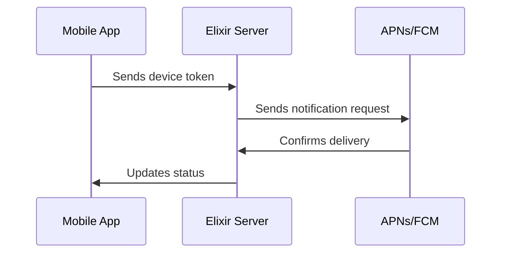

## 18.4. Push Notifications Integration

Push notifications have become a cornerstone of modern mobile applications, providing timely updates and engaging users effectively. In this section, we will explore how to integrate push notifications into your Elixir applications, focusing on the use of Apple Push Notification Service (APNs) for iOS and Firebase Cloud Messaging (FCM) for Android. We will also delve into the use of libraries like `Pigeon` to simplify notification handling, and discuss best practices for managing tokens, optimizing payloads, and ensuring delivery confirmations.

### Setting Up Push Services

#### Integrating with APNs for iOS

Apple Push Notification Service (APNs) is the gateway for sending notifications to iOS devices. Integrating with APNs involves several steps, including configuring your app in the Apple Developer portal, obtaining the necessary certificates, and setting up your server to communicate with APNs.

**Steps to Integrate with APNs:**

1. **Configure Your App in the Apple Developer Portal:**
   - Log in to your Apple Developer account.
   - Navigate to Certificates, Identifiers & Profiles.
   - Create an App ID and enable the Push Notifications service.

2. **Obtain APNs Certificates:**
   - Generate a Certificate Signing Request (CSR) using Keychain Access on your Mac.
   - Create an APNs certificate in the Apple Developer portal using the CSR.
   - Download and install the certificate in your Keychain, then export it as a `.p12` file.

3. **Server-Side Integration:**
   - Use libraries like `Pigeon` to handle communication with APNs.
   - Ensure your server can authenticate with APNs using the `.p12` file or a JWT token.

**Example Code Using Pigeon for APNs:**

```elixir
# Add pigeon to your mix.exs dependencies
defp deps do
  [
    {:pigeon, "~> 1.6"}
  ]
end

# Configure Pigeon with your APNs credentials
config :pigeon, :apns,
  apns_default: %{
    cert: "path/to/cert.pem",
    key: "path/to/key.pem",
    mode: :dev
  }

# Sending a push notification
defmodule MyApp.PushNotifications do
  alias Pigeon.APNS

  def send_push_notification(device_token, payload) do
    notification = %APNS.Notification{
      device_token: device_token,
      alert: payload
    }
    APNS.push(notification)
  end
end
```

#### Integrating with FCM for Android

Firebase Cloud Messaging (FCM) is Google's service for sending notifications to Android devices. Setting up FCM involves configuring your Firebase project and obtaining the server key for authentication.

**Steps to Integrate with FCM:**

1. **Set Up a Firebase Project:**
   - Go to the Firebase Console and create a new project.
   - Add your Android app to the project and download the `google-services.json` file.

2. **Obtain the Server Key:**
   - In the Firebase Console, navigate to Project Settings > Cloud Messaging.
   - Copy the Server Key, which will be used for authentication.

3. **Server-Side Integration:**
   - Use libraries like `Pigeon` to send notifications via FCM.
   - Configure your server with the FCM server key.

**Example Code Using Pigeon for FCM:**

```elixir
# Configure Pigeon with your FCM credentials
config :pigeon, :fcm,
  fcm_default: %{
    key: "your-fcm-server-key"
  }

# Sending a push notification
defmodule MyApp.PushNotifications do
  alias Pigeon.FCM

  def send_push_notification(device_token, payload) do
    notification = %FCM.Notification{
      to: device_token,
      notification: %{
        title: "Hello",
        body: payload
      }
    }
    FCM.push(notification)
  end
end
```

### Using Libraries

Leveraging libraries can significantly simplify the process of integrating push notifications. In Elixir, `Pigeon` is a popular choice for handling both APNs and FCM.

#### Leveraging Pigeon for Notification Handling

`Pigeon` is an Elixir library that provides a unified interface for sending push notifications to both APNs and FCM. It abstracts the complexities of dealing with different push notification services and offers a straightforward API.

**Key Features of Pigeon:**

- **Unified Interface:** Send notifications to APNs and FCM with a consistent API.
- **Asynchronous Delivery:** Notifications are sent asynchronously, improving performance.
- **Error Handling:** Provides detailed error messages for failed deliveries.
- **Token Management:** Automatically handles token expiration and renewal.

**Setting Up Pigeon:**

- Add `Pigeon` to your project's dependencies in `mix.exs`.
- Configure your push services in `config.exs`.
- Use the provided modules (`Pigeon.APNS` and `Pigeon.FCM`) to send notifications.

**Example of Handling Errors in Pigeon:**

```elixir
defmodule MyApp.PushNotifications do
  alias Pigeon.FCM

  def send_push_notification(device_token, payload) do
    notification = %FCM.Notification{
      to: device_token,
      notification: %{
        title: "Hello",
        body: payload
      }
    }

    case FCM.push(notification) do
      {:ok, response} ->
        IO.puts("Notification sent successfully: #{inspect(response)}")
      {:error, reason} ->
        IO.puts("Failed to send notification: #{inspect(reason)}")
    end
  end
end
```

### Best Practices

When integrating push notifications, it's essential to follow best practices to ensure reliable delivery, manage tokens effectively, and optimize payloads.

#### Handling Delivery Confirmations

- **Track Delivery Status:** Use feedback services provided by APNs and FCM to track the delivery status of notifications.
- **Retry Failed Deliveries:** Implement retry logic for failed notifications, considering exponential backoff strategies.

#### Managing Tokens

- **Token Expiration:** Regularly update device tokens as they can expire or change.
- **Token Cleanup:** Remove invalid tokens from your database to avoid unnecessary delivery attempts.

#### Optimizing Payloads

- **Payload Size:** Keep payloads small to ensure they are delivered quickly and reliably.
- **Rich Media:** Use rich media (images, videos) sparingly and only when necessary.

### Visualizing Push Notification Workflow

To better understand the push notification workflow, let's visualize the process using a sequence diagram.


```mermaid
sequenceDiagram
    participant App as Mobile App
    participant Server as Elixir Server
    participant APNs as APNs/FCM
    App->>Server: Sends device token
    Server->>APNs: Sends notification request
    APNs->>Server: Confirms delivery
    Server->>App: Updates status
```

This diagram illustrates the typical flow of a push notification from the mobile app to the server, and finally to the notification service (APNs or FCM).

### References and Links

- [Apple Developer Documentation on APNs](https://developer.apple.com/documentation/usernotifications)
- [Firebase Cloud Messaging Documentation](https://firebase.google.com/docs/cloud-messaging)
- [Pigeon GitHub Repository](https://github.com/codedge-llc/pigeon)

### Knowledge Check

- **What are the key differences between APNs and FCM?**
- **How does Pigeon simplify push notification integration in Elixir?**
- **Why is it important to manage device tokens effectively?**

### Embrace the Journey

Remember, integrating push notifications is just the beginning of engaging your users effectively. As you progress, you'll discover more advanced techniques for personalizing notifications and analyzing user engagement. Keep experimenting, stay curious, and enjoy the journey!

## Quiz Time!



### What is the primary purpose of integrating push notifications in mobile applications?

- [x] To provide timely updates and engage users
- [ ] To increase app size
- [ ] To reduce server load
- [ ] To replace email communication

> **Explanation:** Push notifications are primarily used to provide timely updates and engage users effectively.

### Which service is used for sending notifications to iOS devices?

- [x] Apple Push Notification Service (APNs)
- [ ] Firebase Cloud Messaging (FCM)
- [ ] Simple Notification Service (SNS)
- [ ] Azure Notification Hubs

> **Explanation:** APNs is the service used for sending notifications to iOS devices.

### What is the first step in integrating APNs with your app?

- [x] Configure your app in the Apple Developer portal
- [ ] Obtain the server key
- [ ] Set up a Firebase project
- [ ] Download the `google-services.json` file

> **Explanation:** The first step is to configure your app in the Apple Developer portal.

### Which Elixir library is commonly used for handling push notifications?

- [x] Pigeon
- [ ] Ecto
- [ ] Phoenix
- [ ] Plug

> **Explanation:** Pigeon is a popular Elixir library for handling push notifications.

### What is a best practice for managing device tokens?

- [x] Regularly update and clean up expired tokens
- [ ] Store tokens in plaintext
- [ ] Ignore token expiration
- [ ] Use a single token for all devices

> **Explanation:** Regularly updating and cleaning up expired tokens is essential for effective token management.

### What should you do if a notification delivery fails?

- [x] Implement retry logic with exponential backoff
- [ ] Ignore the failure
- [ ] Send the notification again immediately
- [ ] Switch to email notifications

> **Explanation:** Implementing retry logic with exponential backoff is a best practice for handling delivery failures.

### How can you optimize payloads for push notifications?

- [x] Keep payloads small and concise
- [ ] Include as much information as possible
- [ ] Use only text-based payloads
- [ ] Avoid using rich media

> **Explanation:** Keeping payloads small and concise ensures quick and reliable delivery.

### Which of the following is a key feature of Pigeon?

- [x] Unified interface for APNs and FCM
- [ ] Increases payload size
- [ ] Requires manual token management
- [ ] Only supports APNs

> **Explanation:** Pigeon provides a unified interface for sending notifications to both APNs and FCM.

### What is the role of a sequence diagram in understanding push notification workflow?

- [x] Visualizes the flow of notifications from app to server and service
- [ ] Increases code complexity
- [ ] Reduces server load
- [ ] Simplifies app development

> **Explanation:** A sequence diagram helps visualize the flow of notifications from the app to the server and the notification service.

### True or False: Push notifications can replace email communication entirely.

- [ ] True
- [x] False

> **Explanation:** Push notifications complement email communication but do not replace it entirely.


