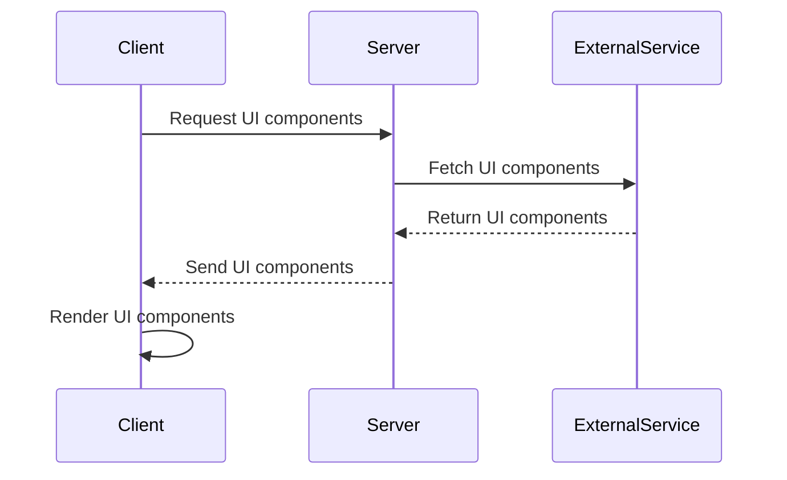

## 18.5. Server-Driven UI Approaches

In the rapidly evolving landscape of mobile application development, the demand for dynamic and personalized user interfaces is ever-increasing. Server-driven UI (SDUI) approaches have emerged as a powerful paradigm to address these needs, allowing developers to deliver dynamic content and UI components directly from the server. This section delves into the intricacies of server-driven UI approaches in Elixir, exploring their benefits, implementation strategies, and how they can be leveraged to create responsive and personalized mobile applications.

### Dynamic Content Delivery

Dynamic content delivery is at the heart of server-driven UI approaches. Unlike traditional client-driven UI models, where the client application is responsible for rendering and managing the UI, server-driven UI shifts this responsibility to the server. This allows for a more flexible and adaptive user experience, as the server can dynamically send UI components or content based on various factors such as user preferences, device capabilities, or contextual information.

#### Key Concepts

- **Server-Driven Architecture**: In a server-driven architecture, the server dictates the UI layout and content, sending instructions to the client on how to render the UI. This can be achieved through various data formats such as JSON, XML, or even custom protocols.
  
- **Dynamic UI Components**: The server can send dynamic UI components to the client, allowing for real-time updates and personalization. This is particularly useful for applications that require frequent content updates or personalized user experiences.

- **Content Personalization**: By leveraging server-driven UI approaches, developers can tailor the UI to individual users, delivering personalized content and experiences based on user data and preferences.

### Benefits of Server-Driven UI

Server-driven UI approaches offer several benefits that make them an attractive choice for modern mobile application development:

- **Reduced App Update Frequency**: By offloading UI logic to the server, developers can reduce the need for frequent app updates. Changes to the UI can be made on the server side and reflected in the client application without requiring a new app release.

- **Personalized User Experiences**: Server-driven UI allows for highly personalized user experiences, as the server can dynamically adjust the UI based on user preferences, behavior, and contextual information.

- **Simplified Client Logic**: With the server handling UI logic, the client application can be simplified, reducing complexity and improving maintainability.

- **Consistent User Experience**: By centralizing UI logic on the server, developers can ensure a consistent user experience across different devices and platforms.

### Implementation Strategies

Implementing server-driven UI approaches in Elixir involves several strategies and considerations. Here, we explore some of the key techniques and best practices for building server-driven UI applications.

#### Using JSON for UI Definition

One of the most common approaches to implementing server-driven UI is using JSON to define UI elements. JSON provides a flexible and lightweight format for representing UI components and their properties, making it an ideal choice for server-driven UI applications.

```elixir
# Example JSON structure for defining a UI component
%{
  "type" => "button",
  "properties" => %{
    "text" => "Click Me",
    "color" => "blue",
    "action" => "navigate",
    "destination" => "/next_page"
  }
}
```

In this example, the server sends a JSON object representing a button component. The client application can parse this JSON and render the button accordingly, using the specified properties.

#### Leveraging Elixir's Concurrency Model

Elixir's concurrency model, based on the Actor model, provides a robust foundation for building server-driven UI applications. By leveraging Elixir's lightweight processes and message-passing capabilities, developers can efficiently handle dynamic content delivery and real-time updates.

```elixir
defmodule UIUpdater do
  use GenServer

  def start_link(initial_state) do
    GenServer.start_link(__MODULE__, initial_state, name: __MODULE__)
  end

  def init(state) do
    {:ok, state}
  end

  def handle_call(:get_ui, _from, state) do
    # Simulate fetching UI components from a database or external service
    ui_components = fetch_ui_components()
    {:reply, ui_components, state}
  end

  defp fetch_ui_components do
    # Placeholder for fetching UI components
    [
      %{"type" => "text", "content" => "Welcome to the app!"},
      %{"type" => "button", "text" => "Get Started", "action" => "start"}
    ]
  end
end
```

In this example, a GenServer is used to manage UI components. The `handle_call/3` function simulates fetching UI components from a database or external service, which can then be sent to the client for rendering.

#### Real-Time Updates with Phoenix Channels

Phoenix Channels provide a powerful mechanism for real-time communication between the server and client, making them an excellent choice for implementing server-driven UI applications. By using Phoenix Channels, developers can push UI updates to the client in real-time, ensuring a responsive and dynamic user experience.

```elixir
defmodule MyAppWeb.UIChannel do
  use Phoenix.Channel

  def join("ui:updates", _message, socket) do
    {:ok, socket}
  end

  def handle_in("request_ui", _payload, socket) do
    # Simulate sending UI updates to the client
    push(socket, "ui_update", %{"type" => "text", "content" => "New content available!"})
    {:noreply, socket}
  end
end
```

In this example, a Phoenix Channel is used to handle real-time UI updates. When the client requests UI updates, the server can push new content to the client using the `push/3` function.

#### Integrating with External Services

Server-driven UI applications often require integration with external services to fetch dynamic content or UI components. Elixir's extensive ecosystem of libraries and tools makes it easy to integrate with various external services, such as REST APIs, databases, or third-party content providers.

```elixir
defmodule ExternalServiceClient do
  @moduledoc """
  A client for interacting with an external service to fetch UI components.
  """

  @api_url "https://api.example.com/ui"

  def fetch_ui_components do
    case HTTPoison.get(@api_url) do
      {:ok, %HTTPoison.Response{status_code: 200, body: body}} ->
        {:ok, Jason.decode!(body)}

      {:error, %HTTPoison.Error{reason: reason}} ->
        {:error, reason}
    end
  end
end
```

In this example, the `ExternalServiceClient` module uses the `HTTPoison` library to fetch UI components from an external API. The fetched components can then be processed and sent to the client for rendering.

### Visualizing Server-Driven UI Architecture

To better understand the server-driven UI architecture, let's visualize the flow of data and interactions between the server and client using a Mermaid.js diagram.



**Diagram Description**: This sequence diagram illustrates the flow of data in a server-driven UI architecture. The client requests UI components from the server, which in turn fetches the components from an external service. The server then sends the components back to the client for rendering.

### Design Considerations

When implementing server-driven UI approaches, there are several design considerations to keep in mind:

- **Network Latency**: Since UI components are fetched from the server, network latency can impact the responsiveness of the application. Consider using caching strategies to mitigate latency issues.

- **Security**: Ensure that the server-driven UI implementation is secure, especially when dealing with sensitive data or user-specific content. Implement authentication and authorization mechanisms to protect user data.

- **Scalability**: As the server handles UI logic, it is crucial to ensure that the server can scale to handle increased load and traffic. Consider using load balancing and distributed architectures to improve scalability.

- **Fallback Mechanisms**: Implement fallback mechanisms to handle cases where the server is unavailable or fails to deliver UI components. This can include displaying cached content or default UI components.

### Elixir Unique Features

Elixir offers several unique features that make it an excellent choice for implementing server-driven UI applications:

- **Concurrency and Fault Tolerance**: Elixir's concurrency model and fault-tolerant design make it well-suited for handling dynamic content delivery and real-time updates.

- **Extensive Ecosystem**: Elixir's ecosystem includes a wide range of libraries and tools for building server-driven UI applications, such as Phoenix Channels for real-time communication and Ecto for database interactions.

- **Functional Programming Paradigm**: Elixir's functional programming paradigm encourages immutability and declarative code, making it easier to reason about and maintain server-driven UI applications.

### Differences and Similarities with Other Patterns

Server-driven UI approaches share similarities with other design patterns, such as the Model-View-Controller (MVC) pattern. Both patterns involve separating concerns and centralizing logic, but server-driven UI focuses on delivering UI components from the server, whereas MVC emphasizes the separation of data, presentation, and control logic.

### Try It Yourself

To get hands-on experience with server-driven UI approaches, try modifying the code examples provided in this section. Experiment with different UI components, data formats, and communication mechanisms to see how they impact the user experience. Consider integrating additional external services or implementing caching strategies to optimize performance.

### Knowledge Check

- **Question**: What are the key benefits of using server-driven UI approaches in mobile development?
- **Exercise**: Implement a simple server-driven UI application using Elixir and Phoenix Channels. Use JSON to define UI components and experiment with real-time updates.

### Embrace the Journey

Remember, server-driven UI approaches are just one of many tools in your development toolkit. As you explore and experiment with these techniques, you'll gain valuable insights into creating dynamic and personalized user experiences. Keep pushing the boundaries, stay curious, and enjoy the journey!

## Quiz: Server-Driven UI Approaches



### What is a primary benefit of server-driven UI approaches?

- [x] Reducing app update frequency
- [ ] Increasing client-side complexity
- [ ] Decreasing server load
- [ ] Limiting personalization options

> **Explanation:** Server-driven UI approaches reduce the need for frequent app updates by allowing UI changes to be made on the server side.

### Which Elixir feature is particularly useful for real-time updates in server-driven UI applications?

- [ ] Ecto
- [x] Phoenix Channels
- [ ] Mix
- [ ] ExUnit

> **Explanation:** Phoenix Channels provide a mechanism for real-time communication between the server and client, making them ideal for server-driven UI applications.

### What is a common data format used to define UI elements in server-driven UI applications?

- [ ] XML
- [x] JSON
- [ ] CSV
- [ ] YAML

> **Explanation:** JSON is a flexible and lightweight format commonly used to define UI elements in server-driven UI applications.

### How does server-driven UI improve user experience?

- [x] By personalizing content based on user preferences
- [ ] By increasing app update frequency
- [ ] By complicating client logic
- [ ] By reducing server-side processing

> **Explanation:** Server-driven UI allows for personalized user experiences by dynamically adjusting the UI based on user preferences and behavior.

### What is a potential challenge when implementing server-driven UI approaches?

- [x] Network latency
- [ ] Simplified client logic
- [ ] Consistent user experience
- [ ] Reduced app update frequency

> **Explanation:** Network latency can impact the responsiveness of server-driven UI applications, as UI components are fetched from the server.

### Which Elixir feature supports concurrency in server-driven UI applications?

- [x] Actor model
- [ ] MVC pattern
- [ ] REST APIs
- [ ] JSON

> **Explanation:** Elixir's concurrency model, based on the Actor model, supports efficient handling of dynamic content delivery and real-time updates.

### What is a key consideration for security in server-driven UI applications?

- [x] Implementing authentication and authorization
- [ ] Increasing network latency
- [ ] Reducing server-side processing
- [ ] Complicating client logic

> **Explanation:** Security is crucial in server-driven UI applications, especially when dealing with sensitive data. Implementing authentication and authorization helps protect user data.

### How can server-driven UI approaches enhance scalability?

- [x] By centralizing UI logic on the server
- [ ] By increasing client-side complexity
- [ ] By reducing server-side processing
- [ ] By limiting personalization options

> **Explanation:** Centralizing UI logic on the server allows for better scalability, as the server can handle increased load and traffic more efficiently.

### What is a fallback mechanism in server-driven UI applications?

- [x] Displaying cached content when the server is unavailable
- [ ] Increasing network latency
- [ ] Complicating client logic
- [ ] Reducing server-side processing

> **Explanation:** Fallback mechanisms, such as displaying cached content, help handle cases where the server is unavailable or fails to deliver UI components.

### True or False: Server-driven UI approaches can only be implemented using JSON.

- [ ] True
- [x] False

> **Explanation:** While JSON is a common format for server-driven UI, other formats like XML or custom protocols can also be used.


