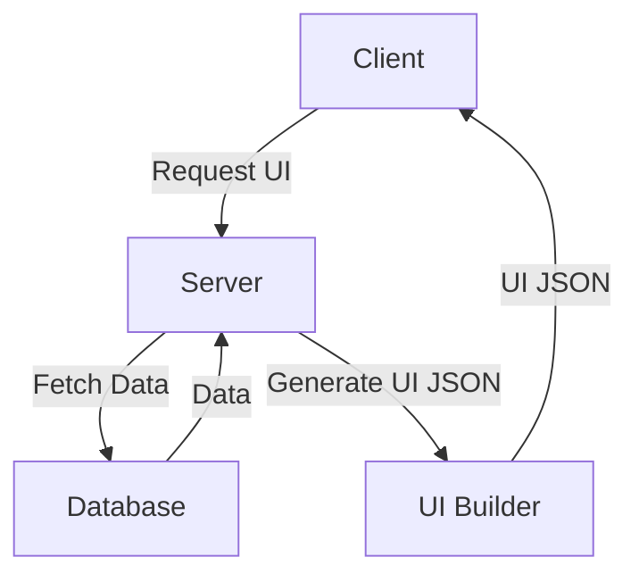

## 18.5. Server-Driven UI Approaches

As mobile applications evolve, the demand for dynamic and personalized user interfaces (UI) grows. Server-Driven UI (SDUI) is an approach that allows developers to send UI components or content directly from the server to the client, enabling dynamic content delivery. This section delves into the intricacies of Server-Driven UI approaches in Elixir, highlighting their benefits, implementation strategies, and how Elixir's unique features can be leveraged for this purpose.

### Dynamic Content Delivery

Dynamic content delivery is at the heart of Server-Driven UI. It involves sending UI components or content from the server to the client, allowing the server to dictate the structure and behavior of the UI. This approach contrasts with traditional client-driven UI, where the client application is responsible for rendering and managing the UI.

#### Key Concepts

1. **Server as the Source of Truth**: In SDUI, the server holds the logic for UI rendering, making it easier to update and manage UI changes centrally.
2. **Decoupled Client and Server**: The client acts as a renderer, interpreting the UI instructions sent by the server.
3. **Dynamic Updates**: Changes in UI can be pushed from the server without requiring app updates, facilitating real-time content adjustments.

#### Benefits of Dynamic Content Delivery

- **Reduced App Update Frequency**: By managing UI logic on the server, developers can push updates without needing users to download new app versions.
- **Personalized User Experiences**: Servers can tailor UI components based on user data, preferences, and behaviors, enhancing user engagement.
- **Consistency Across Platforms**: Ensures uniform UI experiences across different devices and operating systems, as the server controls the UI logic.

### Implementation Strategies

Implementing Server-Driven UI in Elixir involves using data interchange formats like JSON to define UI elements. Elixir's robust concurrency model and functional programming paradigm make it an excellent choice for building scalable SDUI systems.

#### Using JSON for UI Definitions

JSON is a lightweight data interchange format that is easy to parse and generate. It is commonly used for defining UI components in SDUI due to its simplicity and flexibility.

**Example JSON Structure for UI Definition**:

```json
{
  "view": {
    "type": "container",
    "children": [
      {
        "type": "text",
        "value": "Welcome to Elixir App",
        "style": {
          "fontSize": 24,
          "color": "#333333"
        }
      },
      {
        "type": "button",
        "value": "Click Me",
        "action": "navigate",
        "destination": "/nextPage"
      }
    ]
  }
}
```

In this example, the server sends a JSON object that defines a container with a text and a button. The client interprets this JSON to render the UI.

#### Elixir Implementation

Elixir's capabilities can be leveraged to build a server that dynamically constructs and sends these JSON UI definitions.

**Sample Elixir Code for Generating UI JSON**:

```elixir
defmodule UIBuilder do
  @moduledoc """
  A module for building server-driven UI components in JSON format.
  """

  def generate_ui(user) do
    %{
      view: %{
        type: "container",
        children: [
          %{
            type: "text",
            value: "Hello, #{user.name}!",
            style: %{
              fontSize: 24,
              color: "#333333"
            }
          },
          %{
            type: "button",
            value: "Profile",
            action: "navigate",
            destination: "/profile"
          }
        ]
      }
    }
    |> Jason.encode!()
  end
end
```

In this Elixir module, we define a function `generate_ui/1` that takes a user as input and returns a JSON string representing the UI components personalized for that user.

### Advanced Implementation Strategies

#### Using GraphQL for Dynamic UI

GraphQL, an alternative to REST, allows clients to request only the data they need. It can be used to fetch UI components dynamically, providing flexibility and efficiency.

**GraphQL Query Example**:

```graphql
query GetUIComponents($userId: ID!) {
  user(id: $userId) {
    uiComponents {
      type
      value
      style {
        fontSize
        color
      }
      action
      destination
    }
  }
}
```

In this query, the client requests UI components for a specific user, allowing the server to respond with a tailored UI structure.

#### Leveraging Elixir's Concurrency

Elixir's lightweight processes can handle multiple UI requests concurrently, making it ideal for high-traffic applications.

**Concurrent Request Handling in Elixir**:

```elixir
defmodule UIRequestHandler do
  use GenServer

  def start_link(_) do
    GenServer.start_link(__MODULE__, %{}, name: __MODULE__)
  end

  def handle_call({:get_ui, user}, _from, state) do
    ui_json = UIBuilder.generate_ui(user)
    {:reply, ui_json, state}
  end
end
```

Here, a GenServer is used to handle UI requests concurrently, ensuring efficient processing and response times.

### Visualizing Server-Driven UI Architecture

Let's visualize the architecture of a Server-Driven UI system using Mermaid.js:


```mermaid
graph TD;
    A[Client] -->|Request UI| B[Server]
    B -->|Fetch Data| C[Database]
    C -->|Data| B
    B -->|Generate UI JSON| D[UI Builder]
    D -->|UI JSON| A
```

**Diagram Description**: This flowchart illustrates the interaction between the client, server, and database in a Server-Driven UI system. The client requests UI components, the server fetches necessary data, generates UI in JSON format, and sends it back to the client.

### Design Considerations

When implementing Server-Driven UI, consider the following:

- **Network Latency**: Ensure efficient data transfer and minimize latency by optimizing JSON payloads.
- **Security**: Protect sensitive data and ensure secure communication between client and server.
- **Versioning**: Manage different UI versions to support backward compatibility and smooth transitions.
- **Error Handling**: Implement robust error handling to gracefully manage server or network failures.

### Elixir Unique Features

Elixir offers unique features that make it well-suited for Server-Driven UI:

- **Concurrency**: Elixir's actor model and lightweight processes enable efficient handling of concurrent UI requests.
- **Fault Tolerance**: Built-in fault tolerance ensures system reliability, even under high load or failure conditions.
- **Scalability**: Elixir's scalability allows it to handle large-scale applications with ease.

### Differences and Similarities with Client-Driven UI

- **Differences**: In SDUI, the server dictates the UI, while in client-driven UI, the client manages rendering and logic.
- **Similarities**: Both approaches aim to deliver a seamless user experience and can be used together for hybrid solutions.

### Try It Yourself

Experiment with the provided code examples by modifying the JSON structure or Elixir code to create different UI components. Try integrating GraphQL for more dynamic data fetching and explore Elixir's concurrency features for handling multiple requests.

### Knowledge Check

- What are the benefits of Server-Driven UI?
- How does Elixir's concurrency model enhance SDUI?
- What are the key differences between Server-Driven and Client-Driven UI?

### Embrace the Journey

Remember, Server-Driven UI is just one approach to building dynamic and responsive applications. As you explore this approach, consider how it can complement other UI strategies. Keep experimenting, stay curious, and enjoy the journey of creating innovative user experiences with Elixir.

## Quiz Time!



### What is a primary benefit of Server-Driven UI?

- [x] Reducing app update frequency
- [ ] Increasing client-side processing
- [ ] Enhancing static content delivery
- [ ] Decreasing server load

> **Explanation:** Server-Driven UI allows developers to update the UI from the server, reducing the need for frequent app updates.

### How does Elixir's concurrency model benefit Server-Driven UI?

- [x] It allows efficient handling of multiple UI requests.
- [ ] It increases the complexity of the UI logic.
- [ ] It reduces the need for a database.
- [ ] It limits the scalability of applications.

> **Explanation:** Elixir's concurrency model, based on lightweight processes, enables efficient handling of multiple concurrent UI requests.

### Which data format is commonly used for defining UI components in SDUI?

- [x] JSON
- [ ] XML
- [ ] CSV
- [ ] YAML

> **Explanation:** JSON is a lightweight and flexible data format commonly used for defining UI components in Server-Driven UI.

### What is a key difference between Server-Driven and Client-Driven UI?

- [x] Server-Driven UI is controlled by the server, while Client-Driven UI is managed by the client.
- [ ] Server-Driven UI requires more client-side logic.
- [ ] Client-Driven UI reduces the need for server communication.
- [ ] Server-Driven UI is less flexible than Client-Driven UI.

> **Explanation:** In Server-Driven UI, the server dictates the UI structure and behavior, whereas in Client-Driven UI, the client manages these aspects.

### What is a potential challenge of implementing Server-Driven UI?

- [x] Network latency
- [ ] Reduced personalization
- [ ] Increased client-side processing
- [ ] Decreased server control

> **Explanation:** Network latency can be a challenge in Server-Driven UI, as UI components are fetched from the server.

### Which Elixir feature enhances fault tolerance in Server-Driven UI?

- [x] Built-in fault tolerance mechanisms
- [ ] Increased memory usage
- [ ] Complex error handling
- [ ] Limited concurrency

> **Explanation:** Elixir's built-in fault tolerance mechanisms enhance the reliability of Server-Driven UI systems.

### How can GraphQL be used in Server-Driven UI?

- [x] To fetch UI components dynamically
- [ ] To increase server load
- [ ] To reduce UI flexibility
- [ ] To limit data requests

> **Explanation:** GraphQL allows clients to request only the data they need, making it suitable for fetching UI components dynamically.

### What is a design consideration for Server-Driven UI?

- [x] Versioning for backward compatibility
- [ ] Reducing server-side logic
- [ ] Increasing client-side processing
- [ ] Decreasing network security

> **Explanation:** Versioning is important in Server-Driven UI to support backward compatibility and smooth transitions.

### Which Elixir feature supports scalability in Server-Driven UI?

- [x] Lightweight processes
- [ ] Increased memory usage
- [ ] Complex data structures
- [ ] Limited concurrency

> **Explanation:** Elixir's lightweight processes support scalability by efficiently handling multiple concurrent requests.

### True or False: Server-Driven UI ensures consistent UI experiences across different platforms.

- [x] True
- [ ] False

> **Explanation:** Server-Driven UI allows the server to control the UI logic, ensuring consistent experiences across platforms.


