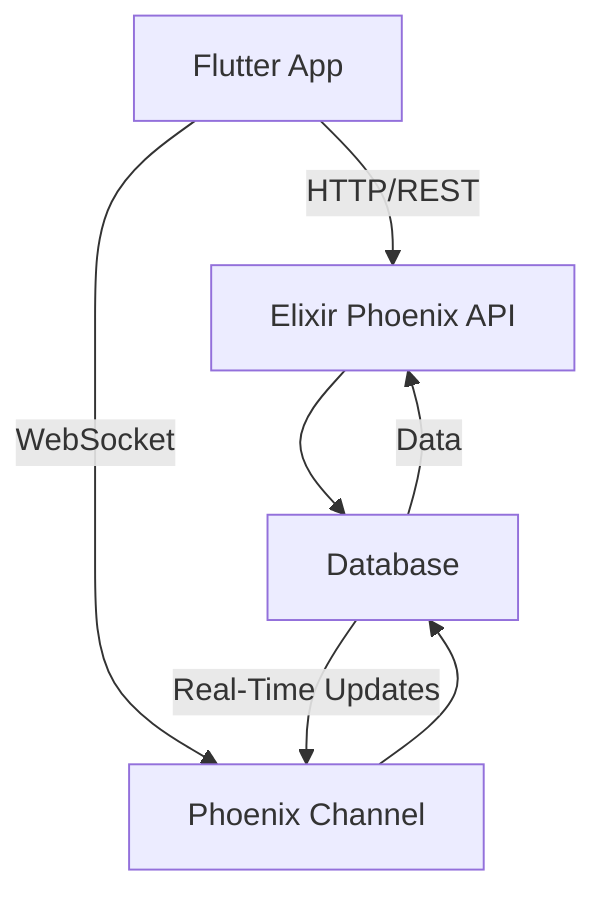

## 18.6. Cross-Platform Development with Flutter and Elixir

Cross-platform development has become a crucial aspect of modern software engineering, allowing developers to create applications that run seamlessly on multiple platforms with a single codebase. In this section, we will explore how Flutter, a popular UI toolkit, can be integrated with Elixir, a functional programming language known for its concurrency and fault-tolerance, to build robust, real-time cross-platform applications.

### Flutter Overview

Flutter is an open-source UI software development toolkit created by Google. It is used to develop applications for Android, iOS, Linux, macOS, Windows, Google Fuchsia, and the web from a single codebase. Flutter is known for its fast development cycle, expressive and flexible UI, and native performance.

#### Key Features of Flutter

- **Hot Reload**: Allows developers to see the results of changes in real-time without restarting the app.
- **Expressive and Flexible UI**: Flutter provides a rich set of customizable widgets to build complex UIs.
- **Native Performance**: Flutter compiles to native ARM code, ensuring high performance on mobile devices.
- **Single Codebase**: Write once, run anywhere approach reduces development time and effort.

### Integrating with Elixir Backends

Elixir is a dynamic, functional language designed for building scalable and maintainable applications. It runs on the Erlang VM, known for its low-latency, distributed, and fault-tolerant systems. Integrating Flutter with Elixir backends can leverage Elixir's strengths in handling concurrent connections and real-time data processing.

#### Connecting Flutter Apps to Elixir APIs

To connect Flutter apps to Elixir backends, we typically use RESTful APIs or GraphQL. Elixir, with its Phoenix framework, provides a robust platform for building these APIs.

**Setting Up a Phoenix API**

1. **Create a New Phoenix Project**: Use the Phoenix generator to scaffold a new project.

   ```bash
   mix phx.new my_app --no-html --no-webpack
   ```

2. **Define API Endpoints**: In the `router.ex` file, define the routes for your API.

   ```elixir
   scope "/api", MyAppWeb do
     pipe_through :api

     get "/users", UserController, :index
     post "/users", UserController, :create
   end
   ```

3. **Implement Controllers**: Create controllers to handle the API requests.

   ```elixir
   defmodule MyAppWeb.UserController do
     use MyAppWeb, :controller

     def index(conn, _params) do
       users = MyApp.Users.list_users()
       json(conn, users)
     end

     def create(conn, %{"user" => user_params}) do
       case MyApp.Users.create_user(user_params) do
         {:ok, user} ->
           conn
           |> put_status(:created)
           |> json(user)
         {:error, changeset} ->
           conn
           |> put_status(:unprocessable_entity)
           |> json(changeset)
       end
     end
   end
   ```

4. **Connect from Flutter**: Use the `http` package in Flutter to make API requests.

   ```dart
   import 'package:http/http.dart' as http;

   Future<void> fetchUsers() async {
     final response = await http.get(Uri.parse('http://localhost:4000/api/users'));

     if (response.statusCode == 200) {
       // Parse the JSON data
     } else {
       throw Exception('Failed to load users');
     }
   }
   ```

#### Real-Time Communication

For real-time features, such as chat applications or live updates, WebSockets are a preferred choice. Elixir's Phoenix framework provides built-in support for WebSockets through Phoenix Channels.

**Implementing WebSocket Connections**

1. **Define a Channel**: In Phoenix, define a channel to handle WebSocket connections.

   ```elixir
   defmodule MyAppWeb.UserChannel do
     use MyAppWeb, :channel

     def join("user:lobby", _message, socket) do
       {:ok, socket}
     end

     def handle_in("new_msg", %{"body" => body}, socket) do
       broadcast!(socket, "new_msg", %{body: body})
       {:noreply, socket}
     end
   end
   ```

2. **Connect from Flutter**: Use the `web_socket_channel` package to connect to the Phoenix Channel.

   ```dart
   import 'package:web_socket_channel/web_socket_channel.dart';

   final channel = WebSocketChannel.connect(
     Uri.parse('ws://localhost:4000/socket/websocket'),
   );

   channel.stream.listen((message) {
     print(message);
   });

   channel.sink.add('{"topic": "user:lobby", "event": "phx_join", "payload": {}, "ref": "1"}');
   ```

3. **Handle Messages**: Listen for messages from the server and update the UI accordingly.

   ```dart
   channel.stream.listen((message) {
     // Update UI with the new message
   });
   ```

### Case Studies

#### Example 1: Real-Time Chat Application

A real-time chat application can be built using Flutter for the front-end and Elixir with Phoenix Channels for the back-end. The application allows users to join chat rooms and send messages in real-time.

- **Flutter Front-End**: Use Flutter's rich set of widgets to build an interactive chat interface.
- **Elixir Back-End**: Use Phoenix Channels to manage WebSocket connections and broadcast messages to all connected clients.

#### Example 2: Live Sports Updates

A live sports update application can provide users with real-time scores and commentary. Flutter's fast rendering and Elixir's concurrent processing capabilities make this possible.

- **Flutter Front-End**: Display live scores and updates using Flutter's flexible UI components.
- **Elixir Back-End**: Use Phoenix to fetch live data from external APIs and push updates to clients via WebSockets.

### Visualizing the Architecture

Below is a diagram illustrating the architecture of a Flutter application integrated with an Elixir backend.



**Diagram Description**: The diagram shows a Flutter app communicating with an Elixir backend via HTTP for standard API requests and WebSockets for real-time updates. The Elixir backend interacts with a database to store and retrieve data.

### Try It Yourself

To get hands-on experience, try modifying the code examples provided:

- **Experiment with API Endpoints**: Add new endpoints to the Phoenix API and connect them from Flutter.
- **Enhance Real-Time Features**: Implement additional real-time features, such as notifications or live data feeds.
- **Customize the UI**: Use Flutter's widget library to create a unique and engaging user interface.

### Knowledge Check

- **What are the benefits of using Flutter for cross-platform development?**
- **How does Elixir's concurrency model enhance real-time communication?**
- **What are Phoenix Channels, and how do they facilitate WebSocket connections?**

### Summary

In this section, we explored the integration of Flutter and Elixir for cross-platform development. We discussed how to set up a Phoenix API, implement real-time communication with WebSockets, and examined case studies demonstrating the power of this combination. By leveraging Flutter's UI capabilities and Elixir's robust backend, developers can create scalable, real-time applications that run on multiple platforms.

Remember, this is just the beginning. As you progress, you'll build more complex and interactive applications. Keep experimenting, stay curious, and enjoy the journey!

## Quiz: Cross-Platform Development with Flutter and Elixir



### What is Flutter primarily used for?

- [x] Building cross-platform applications
- [ ] Creating server-side applications
- [ ] Designing databases
- [ ] Developing operating systems

> **Explanation:** Flutter is a UI toolkit for building natively compiled applications for mobile, web, and desktop from a single codebase.

### How does Elixir enhance real-time communication in applications?

- [x] Through its concurrency model
- [ ] By providing a rich set of UI components
- [ ] By offering native mobile performance
- [ ] By using a single codebase for all platforms

> **Explanation:** Elixir's concurrency model, based on the Erlang VM, allows it to handle numerous simultaneous connections efficiently, making it ideal for real-time communication.

### What is the role of Phoenix Channels in Elixir?

- [x] Facilitating WebSocket connections
- [ ] Managing database transactions
- [ ] Rendering UI components
- [ ] Compiling code to native ARM

> **Explanation:** Phoenix Channels provide a way to handle WebSocket connections in Elixir, enabling real-time features in applications.

### Which package is used in Flutter to make HTTP requests?

- [x] http
- [ ] web_socket_channel
- [ ] dio
- [ ] flutter_http

> **Explanation:** The `http` package is commonly used in Flutter to make HTTP requests to APIs.

### What is the primary advantage of using WebSockets in applications?

- [x] Real-time communication
- [ ] Improved battery life
- [ ] Enhanced graphics rendering
- [ ] Simplified code structure

> **Explanation:** WebSockets enable real-time communication between the client and server, allowing for instant data updates.

### What is the main benefit of using a single codebase in Flutter?

- [x] Reduced development time
- [ ] Increased application size
- [ ] Improved security
- [ ] Enhanced graphics quality

> **Explanation:** A single codebase allows developers to write code once and deploy it across multiple platforms, reducing development time and effort.

### How can Flutter apps connect to Elixir backends?

- [x] Using RESTful APIs or GraphQL
- [ ] Through direct database connections
- [ ] By compiling Elixir code into Flutter
- [ ] Using native mobile SDKs

> **Explanation:** Flutter apps typically connect to Elixir backends using RESTful APIs or GraphQL to fetch and send data.

### What is the purpose of the `web_socket_channel` package in Flutter?

- [x] To connect to WebSocket servers
- [ ] To make HTTP requests
- [ ] To manage state in Flutter apps
- [ ] To render UI components

> **Explanation:** The `web_socket_channel` package is used in Flutter to establish WebSocket connections with servers.

### Which of the following is a key feature of Flutter?

- [x] Hot Reload
- [ ] Native SQL support
- [ ] Built-in authentication
- [ ] Server-side rendering

> **Explanation:** Hot Reload allows developers to see changes in real-time without restarting the app, enhancing the development experience.

### True or False: Elixir is primarily used for front-end development.

- [ ] True
- [x] False

> **Explanation:** Elixir is a back-end language known for its concurrency and fault-tolerance, not typically used for front-end development.


