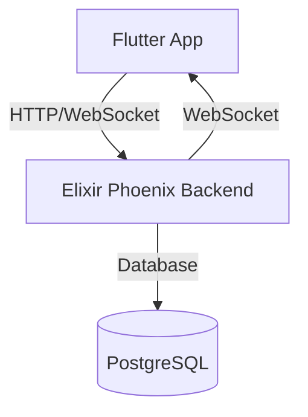

## 18.6. Cross-Platform Development with Flutter and Elixir

In the ever-evolving landscape of mobile application development, the demand for cross-platform solutions has soared. Flutter, a UI toolkit developed by Google, has emerged as a popular choice for building natively compiled applications for mobile, web, and desktop from a single codebase. When paired with Elixir, a functional, concurrent language known for its scalability and fault tolerance, developers can create robust, real-time applications that leverage the strengths of both technologies.

### Flutter Overview

Flutter is a powerful framework that allows developers to create visually appealing applications with a single codebase. It uses the Dart programming language and provides a rich set of pre-designed widgets that adhere to both Material Design and Cupertino style guidelines. Here are some key features of Flutter:

- **Hot Reload**: Flutter's hot reload feature allows developers to see the results of code changes instantly without restarting the application. This speeds up the development process and facilitates rapid prototyping.
- **Expressive and Flexible UI**: Flutter provides a wide array of customizable widgets, enabling developers to create complex and visually appealing user interfaces.
- **Native Performance**: By compiling to native ARM code, Flutter applications achieve high performance comparable to native apps.
- **Cross-Platform Compatibility**: Flutter supports iOS, Android, web, and desktop, allowing developers to target multiple platforms with a single codebase.

### Integrating with Elixir Backends

Elixir, with its robust concurrency model and fault-tolerant design, is an excellent choice for building scalable backends. When integrating Flutter with Elixir, developers can leverage Elixir's capabilities to handle real-time data processing, complex business logic, and seamless communication with Flutter frontends.

#### Connecting Flutter Apps to Elixir APIs

To connect a Flutter application to an Elixir backend, developers typically use RESTful APIs or GraphQL. Here's a step-by-step guide to setting up a basic RESTful API with Elixir's Phoenix framework and consuming it in a Flutter app:

1. **Set up a Phoenix Project**: Start by creating a new Phoenix project to serve as the backend for your Flutter app.

   ```bash
   mix phx.new my_app --no-ecto
   ```

2. **Define API Endpoints**: In your Phoenix application, define the necessary API endpoints. For example, create a simple endpoint to fetch a list of items.

   ```elixir
   defmodule MyAppWeb.ItemController do
     use MyAppWeb, :controller

     def index(conn, _params) do
       items = [%{id: 1, name: "Item 1"}, %{id: 2, name: "Item 2"}]
       json(conn, items)
     end
   end
   ```

3. **Consume the API in Flutter**: Use the `http` package in Flutter to make HTTP requests to the Elixir backend.

   ```dart
   import 'package:http/http.dart' as http;
   import 'dart:convert';

   Future<List<Item>> fetchItems() async {
     final response = await http.get(Uri.parse('http://localhost:4000/api/items'));

     if (response.statusCode == 200) {
       List<dynamic> data = json.decode(response.body);
       return data.map((item) => Item.fromJson(item)).toList();
     } else {
       throw Exception('Failed to load items');
     }
   }

   class Item {
     final int id;
     final String name;

     Item({required this.id, required this.name});

     factory Item.fromJson(Map<String, dynamic> json) {
       return Item(
         id: json['id'],
         name: json['name'],
       );
     }
   }
   ```

#### Real-Time Communication

For applications requiring real-time features, such as chat apps or live notifications, WebSockets are a preferred choice. Elixir's Phoenix framework provides built-in support for WebSockets through Phoenix Channels, enabling seamless real-time communication between the server and Flutter clients.

##### Implementing WebSocket Connections

1. **Set up a Phoenix Channel**: Define a channel in your Phoenix application to handle WebSocket connections.

   ```elixir
   defmodule MyAppWeb.ItemChannel do
     use MyAppWeb, :channel

     def join("items:lobby", _message, socket) do
       {:ok, socket}
     end

     def handle_in("new_item", %{"name" => name}, socket) do
       broadcast!(socket, "new_item", %{name: name})
       {:noreply, socket}
     end
   end
   ```

2. **Connect to the Channel in Flutter**: Use the `phoenix_socket` package in Flutter to connect to the Phoenix channel and listen for messages.

   ```dart
   import 'package:phoenix_socket/phoenix_socket.dart';

   void connectToChannel() async {
     final socket = PhoenixSocket('ws://localhost:4000/socket/websocket');
     await socket.connect();
     final channel = socket.channel('items:lobby');
     channel.join();

     channel.on('new_item', (payload, _ref, _joinRef) {
       print('New item: ${payload['name']}');
     });

     channel.push('new_item', {'name': 'New Flutter Item'});
   }
   ```

### Case Studies

#### Example 1: Real-Time Chat Application

A real-time chat application can benefit immensely from the combination of Flutter and Elixir. Flutter's UI capabilities allow for a sleek and responsive chat interface, while Elixir's Phoenix Channels handle real-time message delivery and presence tracking.

**Architecture Overview:**


```mermaid
graph TD;
    A[Flutter App] -->|HTTP/WebSocket| B[Elixir Phoenix Backend];
    B -->|Database| C[(PostgreSQL)];
    B -->|WebSocket| A;
```

- **Flutter App**: Implements the user interface and handles user interactions.
- **Elixir Phoenix Backend**: Manages user sessions, message broadcasting, and presence tracking.
- **PostgreSQL Database**: Stores user data and chat history.

#### Example 2: Real-Time Inventory Management

For a retail application, real-time inventory management is crucial. Flutter can provide a dynamic user interface for displaying inventory levels, while Elixir can manage real-time updates and notifications when stock levels change.

**Architecture Overview:**


```mermaid
graph TD;
    A[Flutter App] -->|HTTP/WebSocket| B[Elixir Phoenix Backend];
    B -->|Database| C[(PostgreSQL)];
    B -->|WebSocket| A;
```

- **Flutter App**: Displays real-time inventory levels and allows users to place orders.
- **Elixir Phoenix Backend**: Updates inventory levels in real-time and notifies users of changes.
- **PostgreSQL Database**: Stores inventory data and order history.

### Try It Yourself

To get hands-on experience, try modifying the provided code examples to:

- Add authentication to the Flutter app using JWT tokens.
- Implement a new feature in the chat application, such as typing indicators.
- Extend the inventory management system to support multiple warehouses.

### Knowledge Check

- Explain how Flutter's hot reload feature enhances the development process.
- Describe the role of Phoenix Channels in real-time communication.
- How does Elixir's concurrency model benefit real-time applications?

### Summary

In this section, we explored the synergy between Flutter and Elixir for cross-platform mobile development. By leveraging Flutter's UI capabilities and Elixir's robust backend features, developers can create real-time, interactive applications that are both scalable and maintainable. As you continue your journey in mobile development, remember to experiment, stay curious, and enjoy the process!

## Quiz Time!



### What is Flutter primarily used for?

- [x] Building natively compiled applications for mobile, web, and desktop.
- [ ] Creating backend services.
- [ ] Designing databases.
- [ ] Managing server infrastructure.

> **Explanation:** Flutter is a UI toolkit for building natively compiled applications across multiple platforms.

### Which language does Flutter use for development?

- [x] Dart
- [ ] JavaScript
- [ ] Python
- [ ] Ruby

> **Explanation:** Flutter uses the Dart programming language.

### How does Elixir handle real-time communication efficiently?

- [x] Through Phoenix Channels and WebSockets.
- [ ] By using RESTful APIs.
- [ ] By compiling to native code.
- [ ] By using GraphQL.

> **Explanation:** Elixir's Phoenix framework provides built-in support for WebSockets through Phoenix Channels, enabling efficient real-time communication.

### What feature of Flutter allows developers to see changes instantly?

- [x] Hot Reload
- [ ] Cold Start
- [ ] Lazy Loading
- [ ] Code Push

> **Explanation:** Flutter's hot reload feature enables developers to see changes instantly without restarting the application.

### What is a common use case for combining Flutter with Elixir?

- [x] Real-time chat applications
- [ ] Static website hosting
- [ ] Batch data processing
- [ ] Image editing applications

> **Explanation:** Real-time chat applications benefit from Flutter's UI capabilities and Elixir's real-time communication features.

### Which package is used in Flutter to connect to Phoenix Channels?

- [x] phoenix_socket
- [ ] http
- [ ] flutter_websockets
- [ ] dart_channels

> **Explanation:** The `phoenix_socket` package is used in Flutter to connect to Phoenix Channels.

### What is the primary benefit of using Elixir as a backend for Flutter apps?

- [x] Scalability and fault tolerance
- [ ] Rich UI components
- [ ] Native mobile performance
- [ ] Cross-platform compatibility

> **Explanation:** Elixir is known for its scalability and fault tolerance, making it an excellent choice for backend development.

### How do you define API endpoints in a Phoenix application?

- [x] By creating controller modules with action functions.
- [ ] By writing SQL queries directly.
- [ ] By configuring routes in a JSON file.
- [ ] By using Dart scripts.

> **Explanation:** In a Phoenix application, API endpoints are defined by creating controller modules with action functions.

### What is the advantage of using WebSockets over RESTful APIs for real-time communication?

- [x] WebSockets provide a persistent connection for real-time data exchange.
- [ ] WebSockets are easier to implement.
- [ ] WebSockets are faster for batch data processing.
- [ ] WebSockets are more secure.

> **Explanation:** WebSockets provide a persistent connection, allowing real-time data exchange without the need for repeated HTTP requests.

### True or False: Flutter can only be used for mobile applications.

- [ ] True
- [x] False

> **Explanation:** Flutter can be used to build applications for mobile, web, and desktop platforms.




