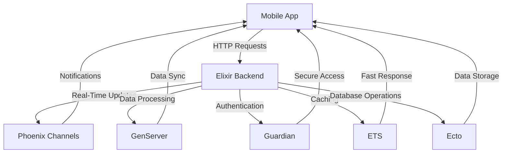

## 18.7. Case Studies of Mobile Apps Powered by Elixir

In the rapidly evolving world of mobile app development, Elixir has emerged as a powerful tool for building robust, scalable, and high-performance backends. This section delves into real-world case studies of mobile applications powered by Elixir, showcasing success stories, challenges faced, and the innovative solutions that have been implemented. We will also explore how Elixir's unique features contribute to performance and scalability, making it an ideal choice for mobile app backends.

### Success Stories

#### 1. **Discord: Real-Time Communication at Scale**

**Overview:** Discord is a popular communication platform that offers voice, video, and text chat for gamers and communities. With millions of users worldwide, Discord requires a backend that can handle real-time communication at scale.

**Elixir's Role:** Discord leverages Elixir for its backend services, particularly for handling real-time events and message processing. Elixir's concurrency model, based on the Actor model, allows Discord to manage thousands of concurrent connections efficiently.

**Key Features:**
- **Scalability:** Elixir's lightweight processes enable Discord to scale horizontally, handling millions of simultaneous users without performance degradation.
- **Fault Tolerance:** The "Let It Crash" philosophy of Elixir ensures that failures are isolated and do not affect the overall system stability.
- **Real-Time Processing:** Elixir's ability to handle real-time data streams is crucial for Discord's voice and video chat features.

**Challenges and Solutions:**
- **Challenge:** Managing a high volume of concurrent connections.
- **Solution:** Utilizing Elixir's lightweight processes and OTP (Open Telecom Platform) to distribute load and ensure reliability.

**Performance and Scalability:**
- Discord's backend can handle millions of concurrent users, thanks to Elixir's efficient process management and fault-tolerant design.

#### 2. **Bleacher Report: Delivering Sports Content in Real-Time**

**Overview:** Bleacher Report is a leading digital destination for sports content and real-time updates. The platform requires a backend that can deliver content quickly and reliably to millions of users.

**Elixir's Role:** Bleacher Report uses Elixir to power its real-time notification system, ensuring that users receive instant updates on scores, news, and highlights.

**Key Features:**
- **Real-Time Notifications:** Elixir's concurrency model allows Bleacher Report to send real-time notifications to users without delay.
- **Scalability:** The platform can handle spikes in traffic during major sporting events, thanks to Elixir's ability to scale horizontally.
- **Reliability:** Elixir's fault-tolerant design ensures that notifications are delivered reliably, even under heavy load.

**Challenges and Solutions:**
- **Challenge:** Handling traffic spikes during major events.
- **Solution:** Implementing a distributed architecture with Elixir to balance load and ensure consistent performance.

**Performance and Scalability:**
- Bleacher Report's notification system can handle millions of notifications per second, providing users with timely updates.

#### 3. **PepsiCo: Streamlining Supply Chain Management**

**Overview:** PepsiCo, a global leader in the food and beverage industry, uses Elixir to streamline its supply chain management processes. The company requires a backend that can handle large volumes of data and provide real-time insights.

**Elixir's Role:** Elixir powers PepsiCo's supply chain management system, enabling real-time data processing and analytics.

**Key Features:**
- **Data Processing:** Elixir's ability to handle large volumes of data in real-time is crucial for PepsiCo's supply chain operations.
- **Scalability:** The system can scale to accommodate the company's global operations.
- **Integration:** Elixir integrates seamlessly with existing systems, providing a unified platform for data management.

**Challenges and Solutions:**
- **Challenge:** Managing large volumes of data across multiple locations.
- **Solution:** Leveraging Elixir's concurrency model to process data in parallel and provide real-time insights.

**Performance and Scalability:**
- PepsiCo's supply chain management system can process millions of data points per second, providing real-time insights and improving operational efficiency.

### Challenges and Solutions

#### Overcoming Mobile-Specific Hurdles with Elixir

While Elixir offers numerous advantages for mobile app backends, developers may encounter specific challenges when integrating Elixir with mobile applications. Here, we explore common hurdles and the solutions that have been implemented to overcome them.

**1. Network Latency and Connectivity Issues**

**Challenge:** Mobile apps often face network latency and connectivity issues, which can impact performance and user experience.

**Solution:** Elixir's lightweight processes and efficient message passing enable developers to implement robust retry mechanisms and handle network failures gracefully. Additionally, using Elixir's GenServer and Task modules allows for asynchronous operations, minimizing the impact of network latency.

**2. Data Synchronization**

**Challenge:** Ensuring data consistency and synchronization between the mobile app and the backend can be challenging, especially in offline scenarios.

**Solution:** Elixir's Phoenix framework provides built-in support for real-time communication through channels, enabling seamless data synchronization. Developers can implement offline-first strategies using Elixir's PubSub system to synchronize data once connectivity is restored.

**3. Security and Authentication**

**Challenge:** Securing mobile app backends and implementing robust authentication mechanisms are critical for protecting user data.

**Solution:** Elixir offers powerful libraries such as Guardian for authentication and Comeonin for password hashing, enabling developers to implement secure authentication workflows. Additionally, Elixir's Plug library provides middleware for handling security concerns such as cross-site request forgery (CSRF) and input validation.

**4. Performance Optimization**

**Challenge:** Optimizing performance for mobile app backends is essential to ensure a smooth user experience.

**Solution:** Elixir's concurrency model and efficient process management allow developers to optimize performance by distributing load across multiple nodes. Additionally, using Elixir's ETS (Erlang Term Storage) for caching and data storage can significantly improve response times.

### Performance and Scalability

Achieving high performance and scalability is a key consideration for mobile app backends. Elixir's unique features make it an ideal choice for handling heavy mobile traffic and ensuring a seamless user experience.

**1. Concurrency and Parallelism**

Elixir's concurrency model, based on the Actor model, allows developers to handle thousands of concurrent connections efficiently. By leveraging Elixir's lightweight processes, developers can implement parallel processing and distribute load across multiple nodes, ensuring high performance under heavy traffic.

**2. Fault Tolerance and Reliability**

Elixir's "Let It Crash" philosophy and OTP framework provide a robust foundation for building fault-tolerant systems. By isolating failures and implementing supervision trees, developers can ensure that mobile app backends remain reliable and resilient, even under adverse conditions.

**3. Real-Time Data Processing**

Elixir's ability to handle real-time data streams is crucial for mobile apps that require instant updates and notifications. By using Elixir's Phoenix framework and channels, developers can implement real-time communication and data synchronization, providing users with a seamless experience.

**4. Horizontal Scalability**

Elixir's lightweight processes and efficient message passing enable developers to scale applications horizontally, accommodating increasing user demand. By distributing load across multiple nodes, developers can ensure consistent performance and reliability, even as traffic grows.

### Visualizing Elixir's Impact on Mobile App Development

To better understand how Elixir contributes to mobile app development, let's visualize the architecture of a typical Elixir-powered mobile app backend.

**Diagram Description:** This diagram illustrates the architecture of a mobile app powered by an Elixir backend. The mobile app communicates with the Elixir backend through HTTP requests. The backend uses Phoenix Channels for real-time updates, GenServer for data processing, Guardian for authentication, ETS for caching, and Ecto for database operations. The backend provides notifications, data synchronization, secure access, fast response times, and data storage to the mobile app.

### Knowledge Check

To reinforce your understanding of Elixir's role in mobile app development, consider the following questions:

1. How does Elixir's concurrency model contribute to handling real-time communication in mobile apps?
2. What are some common challenges faced when integrating Elixir with mobile applications, and how can they be addressed?
3. How does Elixir's "Let It Crash" philosophy enhance the reliability of mobile app backends?
4. What role does Elixir's Phoenix framework play in data synchronization for mobile apps?
5. How can developers optimize performance for Elixir-powered mobile app backends?

### Embrace the Journey

As we have explored in these case studies, Elixir offers a powerful and flexible platform for building mobile app backends. Its unique features, such as concurrency, fault tolerance, and real-time processing, make it an ideal choice for handling the demands of modern mobile applications. Remember, this is just the beginning. As you continue to explore Elixir's capabilities, you'll discover new ways to enhance your mobile app development projects. Keep experimenting, stay curious, and enjoy the journey!

### Quiz: Case Studies of Mobile Apps Powered by Elixir



### How does Elixir's concurrency model benefit mobile app backends?

- [x] It allows handling thousands of concurrent connections efficiently.
- [ ] It simplifies the user interface design.
- [ ] It reduces the need for database indexing.
- [ ] It eliminates the need for authentication.

> **Explanation:** Elixir's concurrency model, based on the Actor model, enables efficient management of thousands of concurrent connections, crucial for mobile app backends.

### What is a common challenge when integrating Elixir with mobile apps?

- [x] Network latency and connectivity issues.
- [ ] Lack of user interface components.
- [ ] Difficulty in implementing animations.
- [ ] Limited support for graphics rendering.

> **Explanation:** Mobile apps often face network latency and connectivity issues, which can impact performance and user experience.

### How does Elixir's "Let It Crash" philosophy improve reliability?

- [x] By isolating failures and implementing supervision trees.
- [ ] By reducing the number of lines of code.
- [ ] By simplifying the user interface.
- [ ] By eliminating the need for testing.

> **Explanation:** Elixir's "Let It Crash" philosophy ensures that failures are isolated and do not affect the overall system stability, enhancing reliability.

### What role does Phoenix play in Elixir-powered mobile apps?

- [x] It provides real-time communication through channels.
- [ ] It handles user interface design.
- [ ] It manages database indexing.
- [ ] It simplifies graphics rendering.

> **Explanation:** Phoenix provides built-in support for real-time communication through channels, enabling seamless data synchronization in mobile apps.

### How can developers optimize performance for Elixir-powered mobile app backends?

- [x] By distributing load across multiple nodes.
- [ ] By reducing the number of user interface components.
- [ ] By simplifying the graphics rendering process.
- [ ] By eliminating the need for animations.

> **Explanation:** Developers can optimize performance by leveraging Elixir's concurrency model to distribute load across multiple nodes, ensuring high performance under heavy traffic.

### What is a key feature of Elixir that supports real-time data processing?

- [x] Phoenix Channels
- [ ] Ecto Queries
- [ ] Plug Middleware
- [ ] Mix Tasks

> **Explanation:** Phoenix Channels provide real-time communication capabilities, essential for real-time data processing in mobile apps.

### How does Elixir handle data synchronization in offline scenarios?

- [x] Using Elixir's PubSub system to synchronize data once connectivity is restored.
- [ ] By storing data in local files.
- [ ] By reducing the amount of data processed.
- [ ] By simplifying the user interface.

> **Explanation:** Elixir's PubSub system enables data synchronization once connectivity is restored, supporting offline-first strategies.

### What library does Elixir offer for secure authentication?

- [x] Guardian
- [ ] Ecto
- [ ] Plug
- [ ] Mix

> **Explanation:** Guardian is a powerful library in Elixir for implementing secure authentication workflows.

### How does Elixir's ETS improve performance?

- [x] By providing efficient caching and data storage.
- [ ] By simplifying user interface design.
- [ ] By reducing the need for animations.
- [ ] By eliminating the need for database indexing.

> **Explanation:** Elixir's ETS (Erlang Term Storage) provides efficient caching and data storage, significantly improving response times.

### True or False: Elixir's lightweight processes enable horizontal scalability.

- [x] True
- [ ] False

> **Explanation:** Elixir's lightweight processes and efficient message passing enable developers to scale applications horizontally, accommodating increasing user demand.



By exploring these case studies and understanding the challenges and solutions, you can leverage Elixir's capabilities to build powerful and scalable mobile app backends. Keep pushing the boundaries of what's possible with Elixir, and continue to innovate in the world of mobile app development.

---
