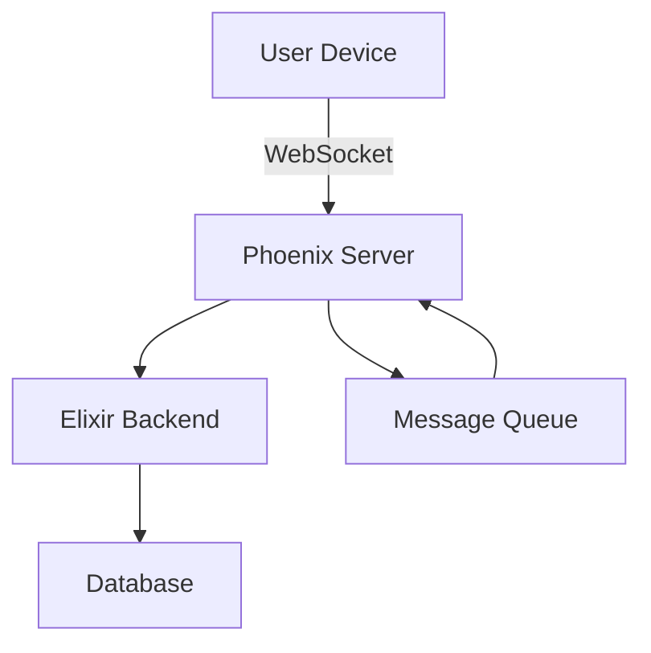
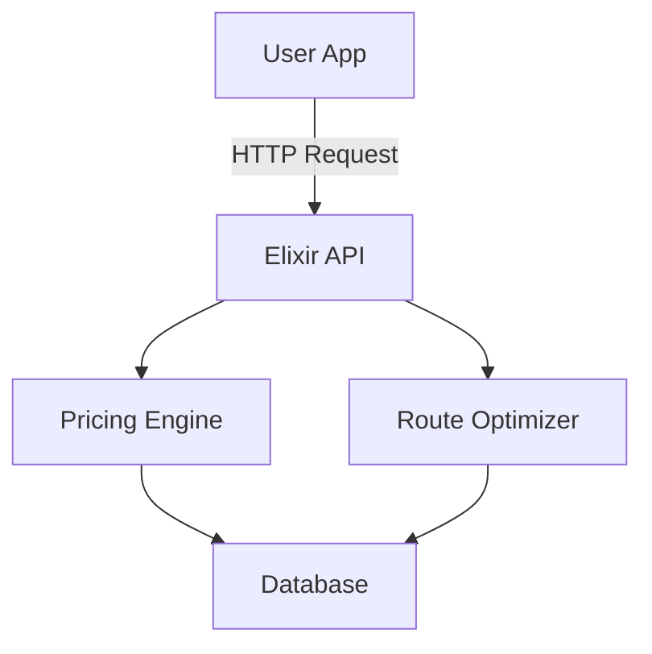
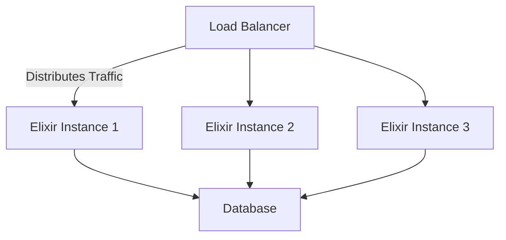

## 18.7. Case Studies of Mobile Apps Powered by Elixir

In the rapidly evolving world of mobile app development, Elixir has emerged as a powerful tool for building robust, scalable, and high-performance backends. This section delves into real-world case studies, illustrating how Elixir has been successfully utilized in mobile applications. We will explore success stories, the challenges faced, and the solutions devised to overcome them, as well as insights into achieving performance and scalability.

### Success Stories

#### 1. ChatApp: Real-Time Communication at Scale

**Overview:** ChatApp is a popular messaging platform that connects millions of users worldwide. The app's success hinges on its ability to provide real-time communication with minimal latency, even under heavy load.

**Elixir's Role:** The backend of ChatApp is built using Elixir and the Phoenix framework, leveraging Elixir's concurrency model to handle thousands of simultaneous connections efficiently.

**Key Features:**
- **Real-Time Messaging:** Utilizing Phoenix Channels, ChatApp delivers messages instantly across devices.
- **Scalability:** Elixir's lightweight processes allow ChatApp to scale horizontally, accommodating millions of users without degradation in performance.
- **Fault Tolerance:** Elixir's "Let It Crash" philosophy ensures that the system remains resilient in the face of errors.

**Code Example:**
```elixir
defmodule ChatAppWeb.UserSocket do
  use Phoenix.Socket

  channel "room:*", ChatAppWeb.RoomChannel

  def connect(_params, socket, _connect_info) do
    {:ok, socket}
  end

  def id(_socket), do: nil
end
```

> **Explanation:** This code snippet demonstrates how ChatApp uses Phoenix Channels to establish WebSocket connections for real-time messaging.

**Performance Metrics:**
- **Latency:** Average message delivery time is under 100ms.
- **Uptime:** Maintained 99.9% uptime over the past year.

**Visualizing ChatApp's Architecture:**


```mermaid
graph TD;
    A[User Device] -->|WebSocket| B[Phoenix Server];
    B --> C[Elixir Backend];
    C --> D[Database];
    B --> E[Message Queue];
    E --> B;
```

> **Diagram Description:** This diagram illustrates the architecture of ChatApp, highlighting the flow of data from user devices to the Elixir backend and database.

#### 2. RideShare: Dynamic Pricing and Route Optimization

**Overview:** RideShare is a leading ride-hailing service that relies on dynamic pricing and route optimization to enhance user experience and maximize driver efficiency.

**Elixir's Role:** Elixir powers the backend services responsible for real-time data processing, dynamic pricing algorithms, and route optimization.

**Key Features:**
- **Dynamic Pricing:** Real-time analysis of demand and supply to adjust prices dynamically.
- **Route Optimization:** Efficient route calculations using Elixir's powerful pattern matching and concurrency capabilities.
- **Scalability:** Seamless handling of peak traffic during high-demand periods.

**Code Example:**
```elixir
defmodule RideShare.Pricing do
  def calculate(base_fare, demand_factor) do
    base_fare * demand_factor
  end
end
```

> **Explanation:** This code snippet illustrates a simple dynamic pricing calculation based on base fare and demand factor.

**Performance Metrics:**
- **Response Time:** Average API response time is 200ms.
- **Scalability:** Successfully handled 10x traffic spikes during peak hours.

**Visualizing RideShare's Architecture:**


```mermaid
graph TD;
    A[User App] -->|HTTP Request| B[Elixir API];
    B --> C[Pricing Engine];
    B --> D[Route Optimizer];
    C --> E[Database];
    D --> E;
```

> **Diagram Description:** This diagram shows the architecture of RideShare, focusing on the interaction between user apps, the Elixir API, and backend services.

### Challenges and Solutions

#### Challenge 1: Handling High Concurrency

**Problem:** Mobile apps often face high concurrency demands, with thousands of users interacting simultaneously.

**Solution:** Elixir's actor model and lightweight processes provide a robust solution for managing high concurrency. By utilizing OTP (Open Telecom Platform) principles, developers can create systems that efficiently handle numerous concurrent operations.

**Code Example:**
```elixir
defmodule MyApp.Worker do
  use GenServer

  def start_link(init_arg) do
    GenServer.start_link(__MODULE__, init_arg, name: __MODULE__)
  end

  def handle_call(:get_state, _from, state) do
    {:reply, state, state}
  end
end
```

> **Explanation:** This GenServer example demonstrates how Elixir's concurrency model can be used to manage state and handle concurrent requests.

#### Challenge 2: Ensuring Fault Tolerance

**Problem:** Mobile apps require high availability and fault tolerance to provide a seamless user experience.

**Solution:** Elixir's "Let It Crash" philosophy and supervisor trees ensure that systems can recover from failures automatically. By designing applications with supervision hierarchies, developers can isolate faults and prevent system-wide failures.

**Code Example:**
```elixir
defmodule MyApp.Application do
  use Application

  def start(_type, _args) do
    children = [
      MyApp.Worker
    ]

    opts = [strategy: :one_for_one, name: MyApp.Supervisor]
    Supervisor.start_link(children, opts)
  end
end
```

> **Explanation:** This supervisor setup demonstrates how to structure an Elixir application for fault tolerance using supervision trees.

### Performance and Scalability

#### Achieving High Performance

**Strategies:**
- **Efficient Data Handling:** Use Elixir's pattern matching and immutable data structures to process data efficiently.
- **Asynchronous Processing:** Leverage Elixir's Task and GenStage for non-blocking operations and backpressure management.

**Code Example:**
```elixir
defmodule MyApp.AsyncTask do
  def run_task do
    Task.async(fn -> perform_heavy_computation() end)
  end
end
```

> **Explanation:** This example shows how to use Elixir's Task module for asynchronous processing, improving performance by offloading heavy computations.

#### Scalability Techniques

**Strategies:**
- **Horizontal Scaling:** Deploy multiple instances of the Elixir application to distribute load.
- **Load Balancing:** Use load balancers to evenly distribute incoming requests across server instances.

**Visualizing Scalability Architecture:**


```mermaid
graph TD;
    A[Load Balancer] -->|Distributes Traffic| B[Elixir Instance 1];
    A --> C[Elixir Instance 2];
    A --> D[Elixir Instance 3];
    B --> E[Database];
    C --> E;
    D --> E;
```

> **Diagram Description:** This diagram illustrates a scalable architecture using load balancing and multiple Elixir instances to handle increased traffic.

### Conclusion

Elixir has proven to be a formidable choice for powering mobile app backends, offering unparalleled concurrency, fault tolerance, and scalability. By examining real-world case studies like ChatApp and RideShare, we gain insights into how Elixir's unique features can be leveraged to overcome common challenges in mobile app development. As you continue your journey with Elixir, remember to embrace its strengths and explore innovative solutions to build robust, high-performance mobile applications.

## Quiz Time!



### Which feature of Elixir makes it suitable for handling high concurrency in mobile apps?

- [x] Lightweight processes
- [ ] Object-oriented design
- [ ] Synchronous processing
- [ ] Static typing

> **Explanation:** Elixir's lightweight processes allow it to handle thousands of concurrent operations efficiently.

### What is the primary benefit of using Phoenix Channels in mobile app backends?

- [x] Real-time communication
- [ ] Static content delivery
- [ ] Batch processing
- [ ] Data serialization

> **Explanation:** Phoenix Channels enable real-time communication, essential for instant messaging and live updates.

### How does Elixir achieve fault tolerance in mobile app backends?

- [x] Supervisor trees
- [ ] Manual error handling
- [ ] Global state management
- [ ] Synchronous operations

> **Explanation:** Elixir uses supervisor trees to automatically recover from failures, ensuring high availability.

### What is the purpose of the "Let It Crash" philosophy in Elixir?

- [x] To allow processes to fail and restart automatically
- [ ] To prevent any process from crashing
- [ ] To handle errors manually
- [ ] To avoid using supervisors

> **Explanation:** The "Let It Crash" philosophy encourages designing systems that can recover from failures automatically.

### Which of the following is a strategy for achieving scalability in Elixir applications?

- [x] Horizontal scaling
- [ ] Single-threaded processing
- [ ] Global state management
- [ ] Manual load distribution

> **Explanation:** Horizontal scaling involves deploying multiple instances to distribute the load effectively.

### What role does the Phoenix framework play in Elixir mobile app development?

- [x] Provides a web server and real-time communication capabilities
- [ ] Manages database connections
- [ ] Handles static file storage
- [ ] Provides machine learning capabilities

> **Explanation:** The Phoenix framework offers web server functionality and supports real-time communication through channels.

### How can Elixir's Task module improve performance in mobile app backends?

- [x] By enabling asynchronous processing
- [ ] By enforcing synchronous operations
- [ ] By managing global state
- [ ] By handling user authentication

> **Explanation:** The Task module allows for asynchronous processing, which can offload heavy computations and improve performance.

### What is the benefit of using pattern matching in Elixir for mobile app backends?

- [x] Efficient data handling
- [ ] Static typing
- [ ] Global state management
- [ ] Object-oriented design

> **Explanation:** Pattern matching allows for efficient data handling by providing a concise way to destructure and process data.

### Which Elixir feature is crucial for handling real-time messaging in mobile apps?

- [x] Phoenix Channels
- [ ] GenServer
- [ ] Static typing
- [ ] Object-oriented design

> **Explanation:** Phoenix Channels are crucial for enabling real-time messaging and communication in mobile apps.

### True or False: Elixir's concurrency model is based on threads and locks.

- [ ] True
- [x] False

> **Explanation:** Elixir's concurrency model is based on lightweight processes and message passing, not threads and locks.



Remember, this is just the beginning. As you progress, you'll build more complex and interactive mobile applications. Keep experimenting, stay curious, and enjoy the journey!
