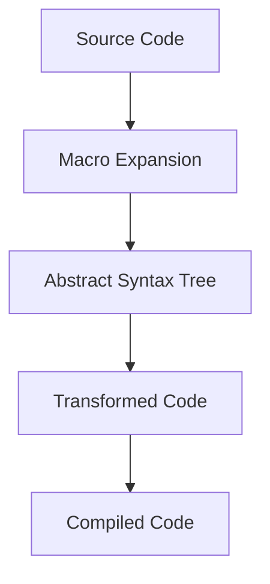

## 19.1. Introduction to Metaprogramming in Elixir

Metaprogramming is a powerful concept that allows developers to write code that writes code. In Elixir, metaprogramming is primarily achieved through macros, which enable the manipulation of code as data. This capability can significantly reduce boilerplate code, facilitate the creation of domain-specific languages (DSLs), and provide a level of abstraction that can make complex systems more manageable. However, with great power comes great responsibility, and metaprogramming can introduce complexity and maintenance challenges if not used judiciously.

### Concepts of Metaprogramming

Metaprogramming involves writing programs that can generate or transform other programs. In Elixir, this is accomplished through macros, which operate on the abstract syntax tree (AST) of the code. By manipulating the AST, macros can introduce new syntax, optimize code, or automate repetitive tasks.

#### Understanding the Abstract Syntax Tree (AST)

The AST is a tree representation of the syntactic structure of source code. Each node in the tree represents a construct occurring in the source code. In Elixir, the AST is a nested tuple structure that can be manipulated by macros.

```elixir
# Example of an AST representation
{:defmodule, [line: 1],
  [{:__aliases__, [line: 1], [:MyModule]},
   [do: {:def, [line: 2],
     [{:my_function, [line: 2], nil},
      [do: {:__block__, [],
        [{:->, [line: 3],
          [[{:x, [line: 3], nil}], {:*, [line: 3], [{:x, [line: 3], nil}, 2]}]}]}]}]]}
```

In this example, the AST represents a simple module with a function that doubles its input. Understanding the AST is crucial for writing effective macros, as it allows you to transform and generate code dynamically.

### Benefits of Metaprogramming

Metaprogramming offers several benefits that can enhance the development process:

- **Reducing Boilerplate**: By automating repetitive code patterns, macros can significantly reduce boilerplate, making codebases cleaner and more maintainable.
- **Creating Domain-Specific Languages (DSLs)**: Macros enable the creation of DSLs tailored to specific problem domains, improving expressiveness and readability.
- **Code Optimization**: Macros can perform compile-time optimizations, resulting in more efficient runtime performance.

#### Example: Reducing Boilerplate with Macros

Consider a scenario where you need to define multiple similar functions. Without macros, this could lead to repetitive code:

```elixir
defmodule MathOperations do
  def add(a, b), do: a + b
  def subtract(a, b), do: a - b
  def multiply(a, b), do: a * b
  def divide(a, b), do: a / b
end
```

Using macros, we can reduce this boilerplate:

```elixir
defmodule MathOperations do
  defmacro define_operations(operations) do
    Enum.map(operations, fn {name, op} ->
      quote do
        def unquote(name)(a, b), do: a unquote(op) b
      end
    end)
  end

  define_operations(add: :+, subtract: :-, multiply: :*, divide: :/)
end
```

### Risks and Considerations

While metaprogramming can be incredibly powerful, it also introduces potential risks:

- **Increased Complexity**: Macros can make code harder to understand and debug, as they introduce an additional layer of abstraction.
- **Maintenance Challenges**: Changes in macro logic can have widespread effects, making maintenance more challenging.
- **Compile-Time Errors**: Errors in macros can lead to compile-time failures, which can be difficult to diagnose.

#### Best Practices for Metaprogramming

To mitigate these risks, consider the following best practices:

- **Use Macros Sparingly**: Only use macros when the benefits outweigh the complexity they introduce.
- **Keep Macros Simple**: Aim for simplicity and clarity in macro definitions to ease understanding and maintenance.
- **Document Macros Thoroughly**: Provide comprehensive documentation for macros to aid future developers in understanding their purpose and usage.

### Visualizing Metaprogramming in Elixir

To better understand how metaprogramming works in Elixir, let's visualize the process of transforming code using macros.



**Diagram Explanation**: This flowchart illustrates the process of metaprogramming in Elixir. The source code is first expanded using macros, resulting in an abstract syntax tree (AST). The AST is then transformed into the final code, which is compiled into executable code.

### Code Examples

Let's explore some practical examples of metaprogramming in Elixir to solidify our understanding.

#### Example 1: Creating a Simple Macro

```elixir
defmodule MyMacros do
  defmacro say_hello(name) do
    quote do
      IO.puts("Hello, #{unquote(name)}!")
    end
  end
end

defmodule Greeter do
  require MyMacros

  def greet do
    MyMacros.say_hello("World")
  end
end

Greeter.greet()
# Output: Hello, World!
```

**Explanation**: In this example, we define a simple macro `say_hello` that takes a name and prints a greeting. The `quote` block is used to generate the code that will be executed at runtime.

#### Example 2: Building a DSL with Macros

```elixir
defmodule QueryDSL do
  defmacro select(fields) do
    quote do
      "SELECT #{unquote(fields)}"
    end
  end

  defmacro from(table) do
    quote do
      "FROM #{unquote(table)}"
    end
  end
end

defmodule QueryBuilder do
  require QueryDSL

  def build_query do
    QueryDSL.select("*") <> " " <> QueryDSL.from("users")
  end
end

IO.puts(QueryBuilder.build_query())
# Output: SELECT * FROM users
```

**Explanation**: This example demonstrates how macros can be used to build a simple DSL for constructing SQL queries. The `select` and `from` macros generate parts of a SQL query, which are then combined in the `build_query` function.

### Try It Yourself

Experiment with the code examples provided by modifying them to suit your needs. Try creating your own macros to automate repetitive tasks or build a simple DSL for a specific problem domain. Remember, practice is key to mastering metaprogramming in Elixir.

### References and Further Reading

- [Elixir Lang - Macros](https://elixir-lang.org/getting-started/meta/macros.html)
- [Metaprogramming Elixir: Write Less Code, Get More Done (and Have Fun!) by Chris McCord](https://pragprog.com/titles/cmelixir/metaprogramming-elixir/)
- [Elixir School - Metaprogramming](https://elixirschool.com/en/lessons/advanced/metaprogramming/)

### Knowledge Check

To reinforce your understanding of metaprogramming in Elixir, consider the following questions:

1. What is the primary purpose of macros in Elixir?
2. How does the abstract syntax tree (AST) relate to metaprogramming?
3. What are some potential risks associated with using macros?
4. How can macros be used to reduce boilerplate code?
5. What are some best practices for writing macros?

### Embrace the Journey

Metaprogramming in Elixir is a powerful tool that can transform the way you write code. As you continue to explore this concept, remember to balance the benefits of abstraction with the potential for increased complexity. Keep experimenting, stay curious, and enjoy the journey of mastering metaprogramming in Elixir!

## Quiz: Introduction to Metaprogramming in Elixir



### What is the primary purpose of macros in Elixir?

- [x] To manipulate the abstract syntax tree (AST) and generate code
- [ ] To execute code at runtime
- [ ] To handle errors in Elixir programs
- [ ] To manage concurrency in Elixir

> **Explanation:** Macros in Elixir are used to manipulate the AST and generate code, allowing for metaprogramming capabilities.

### How does the abstract syntax tree (AST) relate to metaprogramming?

- [x] It represents the structure of the code that macros manipulate
- [ ] It is used to execute code at runtime
- [ ] It is a tool for debugging Elixir programs
- [ ] It is a data structure for managing state in Elixir

> **Explanation:** The AST represents the structure of the code, which macros manipulate to perform metaprogramming tasks.

### What are some potential risks associated with using macros?

- [x] Increased complexity and maintenance challenges
- [ ] Improved code readability and simplicity
- [ ] Reduced compile-time errors
- [ ] Enhanced runtime performance

> **Explanation:** Macros can introduce complexity and maintenance challenges, making code harder to understand and debug.

### How can macros be used to reduce boilerplate code?

- [x] By automating repetitive code patterns
- [ ] By executing code at runtime
- [ ] By managing state in Elixir programs
- [ ] By handling errors in Elixir programs

> **Explanation:** Macros can automate repetitive code patterns, reducing boilerplate and making codebases cleaner.

### What are some best practices for writing macros?

- [x] Use macros sparingly and keep them simple
- [ ] Use macros for all code generation tasks
- [ ] Avoid documenting macros
- [ ] Use macros to handle runtime errors

> **Explanation:** Best practices for writing macros include using them sparingly, keeping them simple, and providing thorough documentation.

### What is a domain-specific language (DSL)?

- [x] A language tailored to a specific problem domain
- [ ] A general-purpose programming language
- [ ] A tool for debugging Elixir programs
- [ ] A data structure for managing state in Elixir

> **Explanation:** A DSL is a language tailored to a specific problem domain, improving expressiveness and readability.

### How can macros facilitate the creation of DSLs?

- [x] By introducing new syntax and abstractions
- [ ] By executing code at runtime
- [ ] By managing state in Elixir programs
- [ ] By handling errors in Elixir programs

> **Explanation:** Macros can introduce new syntax and abstractions, facilitating the creation of DSLs.

### What is the role of the `quote` block in macros?

- [x] To generate code that will be executed at runtime
- [ ] To execute code immediately
- [ ] To handle errors in Elixir programs
- [ ] To manage concurrency in Elixir

> **Explanation:** The `quote` block is used in macros to generate code that will be executed at runtime.

### What is the significance of the `unquote` function in macros?

- [x] It allows for the insertion of values into quoted expressions
- [ ] It executes code at runtime
- [ ] It handles errors in Elixir programs
- [ ] It manages state in Elixir programs

> **Explanation:** The `unquote` function allows for the insertion of values into quoted expressions, enabling dynamic code generation.

### True or False: Macros can perform compile-time optimizations.

- [x] True
- [ ] False

> **Explanation:** Macros can perform compile-time optimizations, resulting in more efficient runtime performance.




