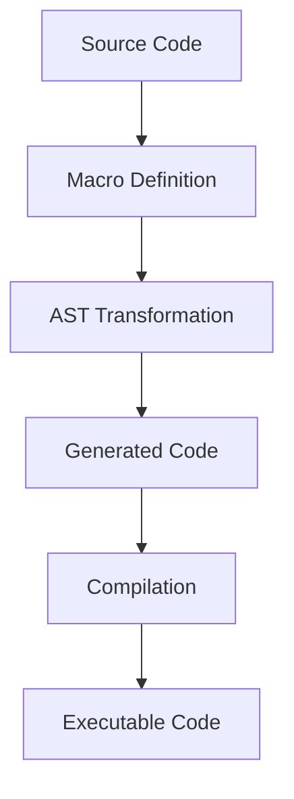

## 19.10. Risks and Limitations of Macros

Elixir macros are a powerful tool that allows developers to extend the language and perform complex code transformations at compile time. While they offer significant advantages, such as reducing boilerplate code and enabling domain-specific languages (DSLs), they also come with inherent risks and limitations. In this section, we will delve into these challenges, providing insights and strategies to mitigate potential issues.

### Understanding Macros in Elixir

Before exploring the risks, it's essential to understand what macros are and how they function in Elixir. Macros are a form of metaprogramming that allows you to write code that generates other code. They operate at compile time, transforming abstract syntax trees (ASTs) to produce the final code that gets executed.

#### Key Concepts

- **Abstract Syntax Tree (AST):** The representation of code structure that macros manipulate.
- **Compile-Time Execution:** Macros execute during compilation, not runtime.
- **Code Generation:** Macros generate and inject code into the program.

### Complexity

One of the primary risks associated with macros is the increased complexity they introduce into the codebase.

#### Increased Difficulty in Understanding and Maintaining Code

Macros can obscure the flow of a program, making it challenging for developers to understand what the code does without diving into the macro definitions. This complexity can lead to maintenance challenges, especially in large codebases or teams with varying levels of expertise.

**Example:**

```elixir
defmodule MyMacro do
  defmacro my_macro do
    quote do
      IO.puts("Hello from macro!")
    end
  end
end

defmodule Example do
  require MyMacro
  MyMacro.my_macro()
end
```

In this example, the macro `my_macro` injects an `IO.puts` call into the `Example` module. While this is straightforward, more complex macros can make it difficult to trace the program's logic.

#### Strategies to Mitigate Complexity

- **Documentation:** Provide comprehensive documentation for macros, explaining their purpose and usage.
- **Limit Scope:** Use macros sparingly and only when necessary.
- **Code Reviews:** Conduct thorough code reviews to ensure macros are used appropriately and understood by the team.

### Compilation Time

Macros execute at compile time, which can lead to longer compilation times, especially if macros are used extensively.

#### Potentially Longer Compile Times

The complexity of macro transformations can increase the time it takes to compile a project. This can be particularly problematic in large projects or when using macros that perform extensive computations or generate large amounts of code.

**Example:**

```elixir
defmodule HeavyMacro do
  defmacro heavy_macro do
    quote do
      for _ <- 1..1_000_000 do
        IO.puts("Heavy computation")
      end
    end
  end
end
```

The `heavy_macro` example demonstrates how a macro that generates a large loop can significantly impact compile time.

#### Strategies to Mitigate Compilation Time

- **Optimize Macros:** Ensure macros are efficient and avoid unnecessary computations.
- **Profile Compilation:** Use tools to profile and identify bottlenecks in the compilation process.
- **Incremental Compilation:** Leverage Elixir's incremental compilation to minimize recompilation of unchanged code.

### Debugging Challenges

Debugging code that involves macros can be more challenging than regular code due to the transformation of code at compile time.

#### Harder to Trace Errors in Generated Code

When an error occurs in code generated by a macro, it can be difficult to trace back to the source of the problem. This is because the error message may not directly point to the macro definition but rather to the generated code.

**Example:**

```elixir
defmodule ErrorMacro do
  defmacro faulty_macro do
    quote do
      IO.puts(unknown_variable)
    end
  end
end

defmodule Example do
  require ErrorMacro
  ErrorMacro.faulty_macro()
end
```

In this example, the error message will point to the use of `unknown_variable`, but the actual issue originates from the `faulty_macro`.

#### Strategies to Mitigate Debugging Challenges

- **Use `IO.inspect`:** Insert `IO.inspect` statements within macros to inspect the generated code.
- **Macro Expansion:** Use the `Macro.expand/2` function to view the expanded code and understand what the macro generates.
- **Error Handling:** Implement error handling within macros to provide more informative error messages.

### Visualizing Macro Execution

To better understand how macros work and the potential pitfalls, let's visualize the process of macro execution and code generation.



**Diagram Description:** This diagram illustrates the flow of macro execution in Elixir. The source code includes macro definitions, which transform the AST into generated code. This code is then compiled into executable code.

### Risks of Overusing Macros

While macros are powerful, overusing them can lead to several issues:

- **Obfuscated Code:** Excessive macro use can make code difficult to read and understand.
- **Increased Maintenance:** More macros mean more code to maintain and potentially refactor.
- **Compatibility Issues:** Changes in Elixir's syntax or AST representation can break macros.

### Best Practices for Using Macros

To harness the power of macros while minimizing risks, consider the following best practices:

- **Use Macros Judiciously:** Only use macros when they provide a clear benefit over functions.
- **Keep Macros Simple:** Avoid complex logic within macros to reduce the risk of errors.
- **Test Thoroughly:** Write comprehensive tests for code that uses macros to catch potential issues early.
- **Stay Updated:** Keep up with changes in Elixir's syntax and AST to ensure macros remain compatible.

### Try It Yourself

To gain hands-on experience with macros, try modifying the examples provided:

1. **Simplify the Heavy Macro:** Reduce the loop size in the `heavy_macro` example to see how it affects compile time.
2. **Add Error Handling:** Modify the `faulty_macro` to include error handling and provide a more informative error message.
3. **Expand a Macro:** Use `Macro.expand/2` to view the expanded code of a macro you create.

### Further Reading

For more information on macros and metaprogramming in Elixir, consider the following resources:

- [Elixir's Official Documentation on Macros](https://elixir-lang.org/getting-started/meta/macros.html)
- [Programming Elixir ≥ 1.6](https://pragprog.com/titles/elixir16/programming-elixir-1-6/) by Dave Thomas
- [Metaprogramming Elixir](https://pragprog.com/titles/cmelixir/metaprogramming-elixir/) by Chris McCord

### Knowledge Check

To reinforce your understanding of macros and their limitations, consider the following questions:

1. What are the primary risks associated with using macros in Elixir?
2. How can you mitigate the complexity introduced by macros?
3. What strategies can help reduce the compilation time when using macros?
4. How can you debug errors in code generated by macros?
5. Why is it important to use macros judiciously?

### Conclusion

Macros are a powerful feature of Elixir that can significantly enhance your code's capabilities. However, they come with risks and limitations that require careful consideration and management. By understanding these challenges and implementing best practices, you can effectively leverage macros while maintaining a clean and maintainable codebase.

Remember, this is just the beginning. As you progress, you'll build more complex and interactive applications using Elixir's powerful features. Keep experimenting, stay curious, and enjoy the journey!

## Quiz: Risks and Limitations of Macros



### What is one of the primary risks of using macros in Elixir?

- [x] Increased complexity in understanding code
- [ ] Reduced execution speed
- [ ] Limited functionality
- [ ] Lack of support for concurrency

> **Explanation:** Macros can make code more complex and harder to understand, which is a significant risk.

### How can you mitigate the complexity introduced by macros?

- [x] Provide comprehensive documentation
- [ ] Use macros for all repetitive tasks
- [ ] Avoid using macros altogether
- [ ] Rely on external libraries

> **Explanation:** Comprehensive documentation helps others understand the purpose and usage of macros, reducing complexity.

### What is a potential downside of using macros extensively?

- [x] Longer compilation times
- [ ] Increased runtime errors
- [ ] Decreased code readability
- [ ] Limited code reuse

> **Explanation:** Extensive use of macros can lead to longer compilation times due to the complexity of code transformations.

### How can you debug errors in code generated by macros?

- [x] Use `IO.inspect` to view generated code
- [ ] Ignore the errors and proceed
- [ ] Use runtime debugging tools
- [ ] Rely on external debugging libraries

> **Explanation:** `IO.inspect` can help you view the generated code and understand where errors originate.

### Why should macros be used judiciously?

- [x] To maintain code readability and simplicity
- [ ] To increase code execution speed
- [ ] To reduce the need for testing
- [ ] To ensure compatibility with all Elixir versions

> **Explanation:** Using macros judiciously helps maintain code readability and simplicity, preventing unnecessary complexity.

### What is one way to reduce the compilation time of macros?

- [x] Optimize macro logic
- [ ] Use more complex macros
- [ ] Avoid using macros altogether
- [ ] Increase hardware resources

> **Explanation:** Optimizing macro logic can help reduce compilation time by making transformations more efficient.

### How can you view the expanded code of a macro?

- [x] Use `Macro.expand/2`
- [ ] Use `IO.puts`
- [ ] Use `Enum.map`
- [ ] Use `List.flatten`

> **Explanation:** `Macro.expand/2` allows you to view the expanded code of a macro, helping you understand its transformations.

### What is a common challenge when debugging macros?

- [x] Tracing errors back to the macro definition
- [ ] Finding the right library to use
- [ ] Understanding runtime errors
- [ ] Managing external dependencies

> **Explanation:** Errors in generated code can be difficult to trace back to the macro definition, posing a debugging challenge.

### How can you ensure macros remain compatible with Elixir updates?

- [x] Stay updated with changes in Elixir's syntax and AST
- [ ] Avoid using macros
- [ ] Use only built-in macros
- [ ] Rely on third-party libraries

> **Explanation:** Staying updated with Elixir's syntax and AST changes ensures that macros remain compatible with new versions.

### True or False: Macros execute at runtime in Elixir.

- [ ] True
- [x] False

> **Explanation:** Macros execute at compile time, not runtime, transforming code before it is executed.




