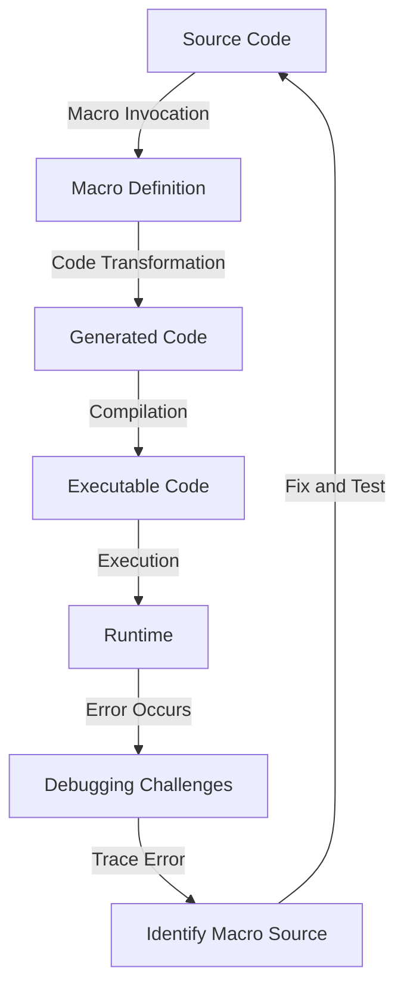

## 19.10. Risks and Limitations of Macros in Elixir

Metaprogramming in Elixir, particularly through the use of macros, is a powerful tool that allows developers to write code that writes code. This can lead to more expressive and flexible programs. However, with great power comes great responsibility. Macros can introduce complexity, extend compilation times, and create debugging challenges. In this section, we will explore these risks and limitations in detail, providing insights and strategies to mitigate them.

### Understanding Macros in Elixir

Before diving into the risks, it's essential to understand what macros are and how they function in Elixir. Macros are a form of metaprogramming that allows you to transform Elixir's abstract syntax tree (AST) at compile time. This means you can define new language constructs, create domain-specific languages (DSLs), and perform code transformations.

#### How Macros Work

Macros are defined using the `defmacro` keyword. They take Elixir code as input, manipulate it, and return transformed code. Here's a simple example of a macro:

```elixir
defmodule MyMacros do
  defmacro say_hello(name) do
    quote do
      IO.puts("Hello, #{unquote(name)}!")
    end
  end
end

defmodule Greeter do
  require MyMacros
  MyMacros.say_hello("World")
end
```

In this example, the `say_hello` macro generates code that prints a greeting. The `quote` block captures the code, and `unquote` injects the value of `name` into the quoted expression.

### Risks and Limitations

#### Complexity

One of the most significant risks of using macros is the increased complexity they introduce. Macros can make code harder to read and understand, especially for developers who are not familiar with the macro's implementation.

- **Code Readability**: Macros can obscure the flow of code, making it difficult to trace what the code is doing at a glance. This can lead to a steeper learning curve for new team members or when revisiting code after some time.
  
- **Maintenance Challenges**: As codebases grow, maintaining macro-heavy code can become burdensome. Changes to macros can have widespread effects, potentially introducing bugs in unexpected places.

To mitigate these issues, it's crucial to document macros thoroughly and use them judiciously. Consider whether a macro is the best solution or if a simpler function could suffice.

#### Compilation Time

Macros execute during the compilation phase, transforming code before it runs. While this can lead to optimized and efficient code, it can also increase compilation times, especially in large projects with extensive macro usage.

- **Performance Impact**: Heavy use of macros can slow down the development cycle, as developers must wait longer for code to compile. This can be particularly problematic in continuous integration environments where quick feedback is essential.

To manage compilation time, monitor the performance impact of macros and optimize them as needed. Avoid unnecessary complexity in macro definitions and consider breaking down large macros into smaller, more manageable pieces.

#### Debugging Challenges

Debugging macro-generated code can be challenging. Since macros transform code before it runs, errors may not be immediately apparent in the source code.

- **Error Tracing**: When an error occurs in macro-generated code, the stack trace may not point directly to the issue, making it harder to diagnose and fix problems.

- **Testing Difficulties**: Testing macros can be complex, as they often require specific conditions or inputs to trigger the generated code paths.

To overcome these challenges, use Elixir's built-in tools to inspect the generated code. The `Macro.to_string/1` function can help visualize the transformed code, making it easier to understand and debug. Additionally, write comprehensive tests for macros to ensure they behave as expected under various conditions.

### Best Practices for Using Macros

While macros have their risks, they are also a powerful tool when used correctly. Here are some best practices to follow:

1. **Use Macros Sparingly**: Only use macros when necessary. If a problem can be solved with a function or module attribute, prefer those over macros.

2. **Document Thoroughly**: Provide clear documentation for each macro, including its purpose, usage, and any potential side effects.

3. **Test Extensively**: Write tests that cover all possible scenarios for your macros. This will help catch errors early and ensure the macro behaves as expected.

4. **Optimize for Performance**: Keep an eye on compilation times and optimize macros to minimize their impact on performance.

5. **Review Regularly**: Periodically review macro usage in your codebase to ensure they are still necessary and beneficial.

### Visualizing Macro Risks

To better understand the flow and impact of macros, let's visualize the process using a flowchart. This diagram illustrates the transformation of code through macros and highlights potential areas where complexity and debugging challenges can arise.


```mermaid
graph TD;
    A[Source Code] -->|Macro Invocation| B[Macro Definition];
    B -->|Code Transformation| C[Generated Code];
    C -->|Compilation| D[Executable Code];
    D -->|Execution| E[Runtime];
    E -->|Error Occurs| F[Debugging Challenges];
    F -->|Trace Error| G[Identify Macro Source];
    G -->|Fix and Test| A;
```

**Diagram Description**: The flowchart depicts the journey of source code through macro invocation, transformation, and execution. It highlights the potential for debugging challenges when errors occur in the generated code.

### Try It Yourself

To deepen your understanding of macros and their risks, try modifying the example macro provided earlier. Experiment with different inputs and observe how the generated code changes. Use `Macro.to_string/1` to inspect the transformations and practice tracing any errors that arise.

### Further Reading

For more information on macros and metaprogramming in Elixir, consider the following resources:

- [Elixir Official Documentation on Macros](https://elixir-lang.org/getting-started/meta/macros.html)
- [Programming Elixir 1.6](https://pragprog.com/titles/elixir16/programming-elixir-1-6/) by Dave Thomas
- [Metaprogramming Elixir](https://pragprog.com/titles/cmelixir/metaprogramming-elixir/) by Chris McCord

### Knowledge Check

To reinforce your understanding of the risks and limitations of macros, consider the following questions:

- What are the primary risks associated with using macros in Elixir?
- How can you mitigate the complexity introduced by macros?
- What tools can help you debug macro-generated code?

### Embrace the Journey

Remember, macros are a powerful tool in Elixir, but they come with their own set of challenges. By understanding the risks and limitations, you can use macros effectively and responsibly. Keep experimenting, stay curious, and enjoy the journey of mastering Elixir's metaprogramming capabilities!

## Quiz Time!



### What is one of the primary risks of using macros in Elixir?

- [x] Increased complexity and maintenance challenges
- [ ] Reduced code execution speed
- [ ] Decreased readability of functions
- [ ] Limited functionality compared to functions

> **Explanation:** Macros can introduce complexity and make code harder to maintain, especially if not documented or used judiciously.

### How can you mitigate the complexity introduced by macros?

- [x] Document macros thoroughly and use them sparingly
- [ ] Avoid using functions and rely solely on macros
- [ ] Increase the number of macros in your codebase
- [ ] Ignore macro-related errors during development

> **Explanation:** Documenting macros and using them only when necessary can help reduce complexity and improve code maintainability.

### What is a common challenge when debugging macro-generated code?

- [x] Errors may not be immediately apparent in the source code
- [ ] Macros always produce incorrect code
- [ ] Functions cannot be used alongside macros
- [ ] Macros eliminate the need for debugging

> **Explanation:** Debugging macro-generated code can be challenging because errors may not be obvious in the source code, requiring additional tools to trace.

### Which function can help visualize transformed code in Elixir?

- [x] Macro.to_string/1
- [ ] IO.inspect/1
- [ ] Enum.map/2
- [ ] String.split/2

> **Explanation:** The `Macro.to_string/1` function can be used to visualize the transformed code, aiding in debugging and understanding macros.

### What is a potential impact of heavy macro usage on compilation?

- [x] Increased compilation time
- [ ] Decreased runtime performance
- [ ] Improved code readability
- [ ] Reduced code functionality

> **Explanation:** Heavy use of macros can lead to longer compilation times, affecting the development cycle.

### How can you optimize macros for performance?

- [x] Break down large macros into smaller pieces
- [ ] Avoid testing macros
- [ ] Use macros for all code transformations
- [ ] Ignore compilation time

> **Explanation:** Breaking down large macros into smaller, manageable pieces can help optimize them for performance and reduce compilation time.

### What is a best practice for using macros in Elixir?

- [x] Use macros sparingly and document them thoroughly
- [ ] Replace all functions with macros
- [ ] Avoid writing tests for macros
- [ ] Ignore macro-related errors

> **Explanation:** Using macros sparingly and providing thorough documentation helps ensure they are beneficial and maintainable.

### What tool can aid in debugging macro-generated code?

- [x] Macro.to_string/1
- [ ] Enum.reduce/3
- [ ] IO.puts/2
- [ ] Kernel.exit/1

> **Explanation:** The `Macro.to_string/1` function helps visualize the code generated by macros, making debugging easier.

### What is a potential downside of macros in large projects?

- [x] They can increase compilation times
- [ ] They always improve code performance
- [ ] They eliminate the need for functions
- [ ] They simplify debugging

> **Explanation:** In large projects, macros can increase compilation times, affecting the development workflow.

### True or False: Macros in Elixir are always the best solution for code transformation.

- [ ] True
- [x] False

> **Explanation:** Macros are powerful but should be used judiciously. They are not always the best solution, and simpler alternatives like functions should be considered first.


