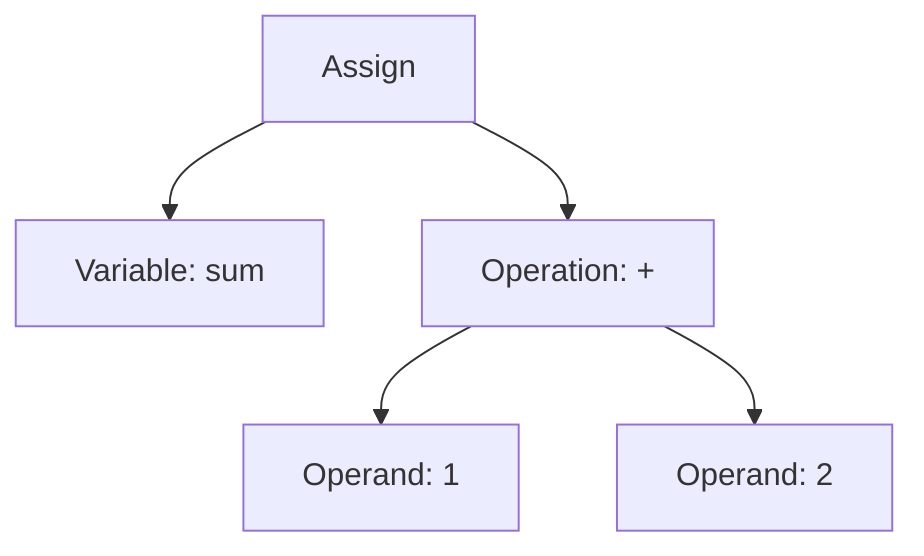

## 19.2. Understanding the Abstract Syntax Tree (AST)

As expert software engineers and architects, understanding the Abstract Syntax Tree (AST) is crucial for mastering metaprogramming in Elixir. The AST is a powerful tool that allows us to manipulate code as data, enabling advanced programming techniques and optimizations. In this section, we will explore how Elixir represents code internally, how to manipulate the AST using `quote` and `unquote`, and how to inspect code structures for better understanding and debugging.

### Elixir’s Code Representation

In Elixir, code is represented internally as an Abstract Syntax Tree (AST). This tree-like structure is a hierarchical representation of the code, where each node corresponds to a construct occurring in the source code. Understanding this representation is key to leveraging Elixir's metaprogramming capabilities.

#### What is an Abstract Syntax Tree?

An Abstract Syntax Tree is a data structure widely used in compilers to represent the structure of program code. It abstracts away the syntactic details and focuses on the logical structure of the code. In Elixir, the AST is a nested tuple structure where each tuple represents a syntactic construct.

#### Example of Elixir Code Representation

Let's consider a simple Elixir expression:

```elixir
sum = 1 + 2
```

The AST representation of this expression can be visualized as:

```elixir
{:assign, [line: 1], [{:sum, [line: 1], nil}, {:+, [line: 1], [1, 2]}]}
```

Here, the AST is a tuple with three elements: the operation (`:assign`), metadata (such as line numbers), and the operands (in this case, the variable `sum` and the addition operation `1 + 2`).

#### Visualizing the AST

To better understand the structure of an AST, let's visualize it using a tree diagram:



This diagram illustrates how the AST breaks down the expression into its constituent parts.

### Manipulating the AST

Elixir provides powerful constructs for manipulating the AST, namely `quote` and `unquote`. These constructs allow us to transform code into its AST representation and vice versa, enabling dynamic code generation and manipulation.

#### Using `quote`

The `quote` construct is used to convert Elixir code into its AST representation. This is useful for inspecting and manipulating code programmatically.

```elixir
quoted = quote do
  sum = 1 + 2
end

IO.inspect(quoted)
```

The output will be the AST representation of the code block:

```elixir
{:assign, [line: 1], [{:sum, [line: 1], nil}, {:+, [line: 1], [1, 2]}]}
```

#### Using `unquote`

The `unquote` construct allows us to inject values or expressions into a quoted expression. This is essential for dynamic code generation, where parts of the code need to be evaluated at runtime.

```elixir
a = 1
b = 2

quoted = quote do
  sum = unquote(a) + unquote(b)
end

IO.inspect(quoted)
```

The `unquote` function replaces the placeholders with the actual values of `a` and `b`, resulting in the AST for `sum = 1 + 2`.

#### Combining `quote` and `unquote`

By combining `quote` and `unquote`, we can create powerful macros that generate code dynamically. This is a cornerstone of metaprogramming in Elixir.

```elixir
defmodule Math do
  defmacro add(a, b) do
    quote do
      unquote(a) + unquote(b)
    end
  end
end

IO.inspect(Math.add(1, 2))
```

In this example, the `add` macro generates code that adds two numbers, demonstrating how `quote` and `unquote` work together to manipulate the AST.

### Inspecting Code

Inspecting the AST is a valuable technique for understanding and debugging Elixir code. By analyzing the structure of the AST, we can gain insights into how the code is interpreted and executed.

#### Analyzing Code Structure

To analyze the structure of an AST, we can use the `Macro.to_string/1` function, which converts an AST back into a human-readable string representation.

```elixir
quoted = quote do
  sum = 1 + 2
end

IO.puts(Macro.to_string(quoted))
```

This will output:

```
sum = 1 + 2
```

#### Debugging with AST

When debugging complex macros or metaprogramming constructs, inspecting the AST can help identify issues or unexpected behavior. By examining the AST, we can verify that the generated code matches our expectations.

### Practical Applications of AST Manipulation

Understanding and manipulating the AST has several practical applications in Elixir development, including:

- **Code Generation**: Automatically generating repetitive code patterns.
- **Domain-Specific Languages (DSLs)**: Creating custom languages tailored to specific problem domains.
- **Code Analysis**: Analyzing code for optimization or transformation.
- **Testing and Debugging**: Verifying the correctness of generated code.

### Try It Yourself

To deepen your understanding of the AST, try modifying the code examples provided. Experiment with different expressions and observe how the AST changes. Consider creating a simple macro that generates code based on input parameters.

### Key Takeaways

- The Abstract Syntax Tree (AST) is a hierarchical representation of Elixir code.
- Elixir provides `quote` and `unquote` constructs for manipulating the AST.
- Inspecting the AST is useful for understanding, debugging, and optimizing code.
- Mastering the AST enables advanced metaprogramming techniques in Elixir.

### Embrace the Journey

Remember, mastering the AST is just the beginning of your metaprogramming journey in Elixir. As you progress, you'll unlock new possibilities for code generation, optimization, and transformation. Keep experimenting, stay curious, and enjoy the journey!

## Quiz: Understanding the Abstract Syntax Tree (AST)



### What is an Abstract Syntax Tree (AST) in Elixir?

- [x] A hierarchical representation of code structure
- [ ] A list of all functions in a module
- [ ] A database of syntax errors
- [ ] A graphical user interface for code editing

> **Explanation:** An AST is a tree-like structure that represents the logical structure of code.

### Which Elixir construct is used to convert code into its AST representation?

- [x] `quote`
- [ ] `unquote`
- [ ] `inspect`
- [ ] `eval`

> **Explanation:** The `quote` construct is used to transform code into its AST representation.

### What does the `unquote` construct do in Elixir?

- [x] Injects values or expressions into a quoted expression
- [ ] Converts AST back to code
- [ ] Compiles code into bytecode
- [ ] Generates documentation

> **Explanation:** `unquote` is used to insert values or expressions into a quoted expression.

### How can you convert an AST back into a human-readable string?

- [x] `Macro.to_string/1`
- [ ] `String.to_atom/1`
- [ ] `Enum.join/1`
- [ ] `IO.inspect/1`

> **Explanation:** `Macro.to_string/1` converts an AST into a string representation.

### What is a practical application of AST manipulation in Elixir?

- [x] Code Generation
- [x] Domain-Specific Languages (DSLs)
- [ ] File I/O Operations
- [ ] Network Communication

> **Explanation:** AST manipulation is used for code generation and creating DSLs, among other applications.

### What is the output of `Macro.to_string(quote do: 1 + 2)`?

- [x] `"1 + 2"`
- [ ] `"{:+, [], [1, 2]}"`
- [ ] `"3"`
- [ ] `"sum = 1 + 2"`

> **Explanation:** `Macro.to_string/1` converts the AST back to its string representation, which is `"1 + 2"`.

### Which of the following is NOT a use case for AST manipulation?

- [ ] Code Analysis
- [ ] Testing and Debugging
- [x] File Encryption
- [ ] Code Generation

> **Explanation:** File encryption is not related to AST manipulation.

### What is the role of metadata in an AST node?

- [x] Provides additional information such as line numbers
- [ ] Stores the result of code execution
- [ ] Contains the compiled bytecode
- [ ] Holds user input data

> **Explanation:** Metadata in an AST node includes information like line numbers and other annotations.

### How does the AST help in debugging Elixir code?

- [x] By allowing inspection of code structure
- [ ] By automatically fixing syntax errors
- [ ] By providing a visual interface
- [ ] By generating test cases

> **Explanation:** Inspecting the AST helps understand the code structure and identify issues.

### True or False: The AST is unique to Elixir and not used in other programming languages.

- [ ] True
- [x] False

> **Explanation:** The AST is a common concept used in many programming languages for code representation.




