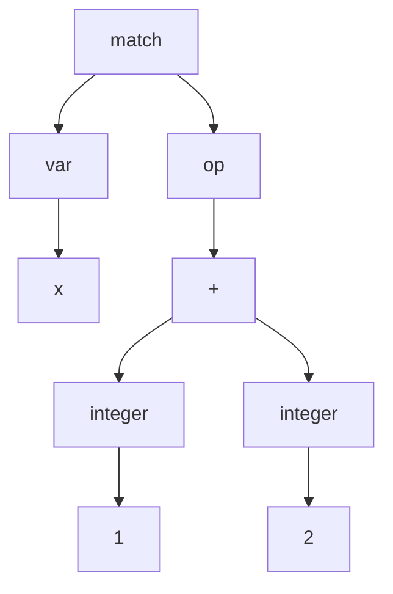

## 19.2. Understanding the Abstract Syntax Tree (AST)

In Elixir, metaprogramming is a powerful tool that allows developers to write code that can generate and manipulate other code. At the heart of this capability is the Abstract Syntax Tree (AST), which is Elixir's internal representation of code. Understanding the AST is crucial for leveraging Elixir's metaprogramming features effectively. In this section, we will delve into how Elixir represents code internally, how to manipulate the AST using constructs like `quote` and `unquote`, and how to inspect code for debugging and understanding.

### Elixir’s Code Representation

Elixir, like many other programming languages, uses an Abstract Syntax Tree (AST) to represent code. The AST is a tree-like structure that captures the syntactic structure of the code in a way that is easy for the compiler to process. In Elixir, every piece of code is represented as a tuple, which typically consists of three elements: the operation, metadata, and arguments.

#### How Elixir Represents Code Internally

Let's start by examining a simple Elixir expression and how it is represented in the AST:

```elixir
# Simple Elixir expression
x = 1 + 2
```

This expression is internally represented in the AST as:

```elixir
{:match, [], [{:var, [line: 1], :x}, {:op, [line: 1], :+, {:integer, [line: 1], 1}, {:integer, [line: 1], 2}}]}
```

- **Operation**: The first element of the tuple (`:match`) indicates the operation being performed.
- **Metadata**: The second element (`[]`) is a list of metadata, such as line numbers, which can be used for debugging.
- **Arguments**: The third element is a list of arguments involved in the operation. In this case, it includes the variable `x` and the addition operation `1 + 2`.

#### Visualizing the AST Structure

To better understand the structure of an AST, let's visualize it using a tree diagram:


```mermaid
graph TD;
    A[match] --> B[var]
    A --> C[op]
    B --> D[x]
    C --> E[+]
    E --> F[integer]
    E --> G[integer]
    F --> H[1]
    G --> I[2]
```

**Diagram Description**: This diagram represents the AST for the expression `x = 1 + 2`. The root node is the `match` operation, which has two child nodes: `var` for the variable `x` and `op` for the operation `1 + 2`.

### Manipulating the AST

Elixir provides powerful constructs to manipulate the AST, namely `quote` and `unquote`. These constructs allow developers to transform code into its AST representation and vice versa, enabling dynamic code generation and manipulation.

#### Using the `quote` Construct

The `quote` construct is used to convert Elixir code into its AST representation. This is particularly useful for metaprogramming, as it allows you to inspect and manipulate code programmatically.

```elixir
# Using quote to get the AST
ast = quote do
  x = 1 + 2
end

IO.inspect(ast)
```

**Output**:
```elixir
{:match, [], [{:var, [], :x}, {:op, [], :+, {:integer, [], 1}, {:integer, [], 2}}]}
```

#### Using the `unquote` Construct

The `unquote` construct is used within a `quote` block to inject values or expressions into the quoted code. It allows for dynamic code generation by evaluating the unquoted expression and inserting its result into the AST.

```elixir
# Using unquote to inject a value
value = 10
ast = quote do
  x = unquote(value) + 2
end

IO.inspect(ast)
```

**Output**:
```elixir
{:match, [], [{:var, [], :x}, {:op, [], :+, {:integer, [], 10}, {:integer, [], 2}}]}
```

#### Combining `quote` and `unquote`

By combining `quote` and `unquote`, you can create flexible and dynamic code structures. This is a common technique in metaprogramming to generate code templates that can be customized at runtime.

```elixir
defmodule Math do
  defmacro add(a, b) do
    quote do
      unquote(a) + unquote(b)
    end
  end
end

# Using the macro
result = Math.add(3, 5)
IO.puts(result) # Output: 8
```

### Inspecting Code

Inspecting the AST is a valuable technique for understanding and debugging Elixir code. By analyzing the structure of the AST, you can gain insights into how the code is interpreted by the compiler and identify potential issues.

#### Analyzing Code Structure

To analyze the structure of the AST, you can use the `Macro.to_string/1` function to convert the AST back into a human-readable format. This is useful for verifying that your code transformations are correct.

```elixir
ast = quote do
  x = 1 + 2
end

# Convert AST back to string
code_string = Macro.to_string(ast)
IO.puts(code_string) # Output: "x = 1 + 2"
```

#### Debugging with AST

When debugging complex metaprogramming code, inspecting the AST can help you understand how your macros are transforming the code. By examining the AST at different stages of transformation, you can pinpoint where things might be going wrong.

```elixir
defmodule Debug do
  defmacro debug_add(a, b) do
    ast = quote do
      unquote(a) + unquote(b)
    end

    IO.inspect(ast, label: "AST before transformation")
    transformed_ast = transform_ast(ast)
    IO.inspect(transformed_ast, label: "AST after transformation")

    transformed_ast
  end

  defp transform_ast(ast) do
    # Example transformation: replace addition with multiplication
    Macro.postwalk(ast, fn
      {:op, meta, :+, left, right} -> {:op, meta, :*, left, right}
      other -> other
    end)
  end
end

# Using the debug macro
result = Debug.debug_add(3, 5)
IO.puts(result) # Output: 15
```

### Try It Yourself

To deepen your understanding of the AST, try modifying the code examples above. For instance, experiment with different operations in the `quote` and `unquote` constructs, or try creating a macro that performs a different transformation on the AST.

### Key Takeaways

- The Abstract Syntax Tree (AST) is Elixir's internal representation of code, structured as tuples.
- The `quote` construct is used to convert code into its AST representation, while `unquote` is used to inject values or expressions into the AST.
- Inspecting and manipulating the AST is essential for advanced metaprogramming techniques in Elixir.
- Understanding the AST helps in debugging and verifying code transformations.

### Further Reading

For more information on Elixir's metaprogramming capabilities, consider exploring the following resources:

- [Elixir's Official Documentation on Macros](https://hexdocs.pm/elixir/Kernel.SpecialForms.html#quote/2)
- [Metaprogramming Elixir: Write Less Code, Get More Done (and Have Fun!) by Chris McCord](https://pragprog.com/titles/cmelixir/metaprogramming-elixir/)

## Quiz Time!



### What is the Abstract Syntax Tree (AST) in Elixir?

- [x] It is Elixir's internal representation of code.
- [ ] It is a tool for compiling Elixir code.
- [ ] It is a library for managing Elixir dependencies.
- [ ] It is a framework for building web applications.

> **Explanation:** The AST is Elixir's internal representation of code, structured as tuples.

### What does the `quote` construct do in Elixir?

- [x] Converts code into its AST representation.
- [ ] Executes the code immediately.
- [ ] Converts AST back to a string.
- [ ] Compiles the code into a binary.

> **Explanation:** The `quote` construct is used to convert code into its AST representation.

### How can you inject values into a quoted expression?

- [x] Using the `unquote` construct.
- [ ] Using the `inject` function.
- [ ] Using the `eval` function.
- [ ] Using the `Macro.to_string/1` function.

> **Explanation:** The `unquote` construct is used to inject values or expressions into a quoted expression.

### What is the purpose of the `Macro.to_string/1` function?

- [x] Converts an AST back to a human-readable string.
- [ ] Converts a string into an AST.
- [ ] Executes a macro.
- [ ] Compiles Elixir code.

> **Explanation:** The `Macro.to_string/1` function converts an AST back to a human-readable string.

### Which of the following is NOT a typical element of an AST tuple in Elixir?

- [ ] Operation
- [ ] Metadata
- [ ] Arguments
- [x] Documentation

> **Explanation:** An AST tuple typically consists of an operation, metadata, and arguments, but not documentation.

### What does the `Macro.postwalk/2` function do?

- [x] Traverses and transforms an AST.
- [ ] Converts a string into an AST.
- [ ] Compiles Elixir code.
- [ ] Executes a macro.

> **Explanation:** The `Macro.postwalk/2` function traverses and transforms an AST.

### What is the output of the following code: `IO.inspect(quote do: 1 + 2)`?

- [x] `{:op, [], :+, {:integer, [], 1}, {:integer, [], 2}}`
- [ ] `3`
- [ ] `{:integer, [], 3}`
- [ ] `{:match, [], [{:var, [], :x}, {:op, [], :+, {:integer, [], 1}, {:integer, [], 2}}]}`

> **Explanation:** The output is the AST representation of the expression `1 + 2`.

### How can you debug a macro transformation in Elixir?

- [x] By inspecting the AST before and after transformation.
- [ ] By compiling the code with debug flags.
- [ ] By using the `Logger` module.
- [ ] By writing tests for the macro.

> **Explanation:** Inspecting the AST before and after transformation helps in debugging macro transformations.

### What is the primary use of the `unquote` construct?

- [x] To inject values or expressions into a quoted expression.
- [ ] To convert an AST back to a string.
- [ ] To compile Elixir code.
- [ ] To traverse an AST.

> **Explanation:** The `unquote` construct is used to inject values or expressions into a quoted expression.

### True or False: The AST is unique to Elixir and not used in other programming languages.

- [ ] True
- [x] False

> **Explanation:** The AST is a common concept used in many programming languages to represent code internally.



Remember, mastering the AST and metaprogramming in Elixir opens up a world of possibilities for writing dynamic and efficient code. Keep experimenting, stay curious, and enjoy the journey!
