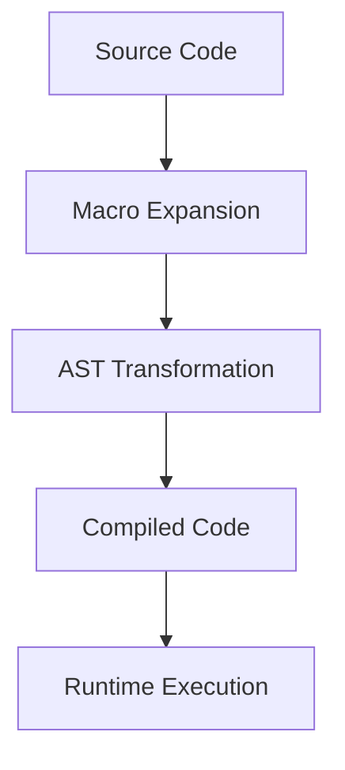

## 19.3. Writing and Using Macros Safely

In the world of Elixir, macros are powerful tools that allow developers to extend the language and perform metaprogramming. They enable us to write code that writes code, providing a way to manipulate the abstract syntax tree (AST) at compile time. However, with great power comes great responsibility. Writing and using macros safely is crucial to maintaining code clarity, avoiding bugs, and ensuring maintainability. In this section, we will delve into the intricacies of defining macros, ensuring macro hygiene, and testing strategies for macro correctness.

### Defining Macros

Macros in Elixir are defined using the `defmacro` construct. They are similar to functions but operate at compile time, transforming the code before it is executed. Let's explore how to define macros and understand their structure.

#### Using `defmacro` to Create Macros

To define a macro, we use `defmacro` followed by the macro name and its parameters. The body of the macro should return a quoted expression, which represents the code to be generated.

```elixir
defmodule MyMacros do
  defmacro say_hello(name) do
    quote do
      IO.puts("Hello, #{unquote(name)}!")
    end
  end
end
```

In this example, `say_hello` is a macro that takes a `name` parameter and generates code to print a greeting. The `quote` block captures the code as a data structure, and `unquote` is used to inject the value of `name` into the quoted expression.

#### Key Concepts in Macro Definition

1. **Quoting and Unquoting**: 
   - **Quote**: Captures code as data, allowing manipulation of the AST.
   - **Unquote**: Inserts values or expressions into the quoted code.

2. **Compile-Time Execution**: 
   - Macros are executed at compile time, transforming the code before runtime.

3. **AST Manipulation**: 
   - Macros operate on the AST, providing flexibility to generate complex code structures.

#### Example: Creating a Simple Logger Macro

Let's create a simple logger macro that logs messages with a timestamp.

```elixir
defmodule LoggerMacros do
  defmacro log_message(message) do
    quote do
      IO.puts("[#{:os.system_time(:seconds)}] #{unquote(message)}")
    end
  end
end
```

Usage:

```elixir
require LoggerMacros
LoggerMacros.log_message("This is a log message.")
```

This macro generates code to print a message with the current timestamp, demonstrating how macros can simplify repetitive tasks.

### Macro Hygiene

Macro hygiene is a concept that ensures macros do not inadvertently interfere with the surrounding code. It prevents variable clashes and maintains the integrity of the code.

#### Avoiding Variable Clashes with Hygienic Macros

Elixir macros are hygienic by default, meaning they automatically avoid variable clashes. However, there are scenarios where explicit control is necessary.

#### Ensuring Hygiene with `var!`

When you need to intentionally manipulate a variable in the caller's context, use `var!` to bypass hygiene.

```elixir
defmodule HygieneExample do
  defmacro increment(var) do
    quote do
      var!(unquote(var)) = var!(unquote(var)) + 1
    end
  end
end
```

In this example, `var!` is used to modify the variable in the caller's context, ensuring the macro's intention is clear and controlled.

#### Best Practices for Macro Hygiene

1. **Limit Scope**: 
   - Keep macro logic simple and focused to minimize potential clashes.

2. **Use `var!` Sparingly**: 
   - Only use `var!` when necessary to manipulate caller variables.

3. **Document Intent**: 
   - Clearly document the macro's behavior and any side effects.

### Testing Macros

Testing macros is essential to ensure they behave as expected and do not introduce errors into the codebase.

#### Strategies for Ensuring Macro Correctness

1. **Unit Testing**: 
   - Write tests for the generated code to verify its correctness.

2. **Compile-Time Assertions**: 
   - Use compile-time assertions to validate macro behavior during compilation.

3. **Code Coverage**: 
   - Ensure macros are covered by tests to catch edge cases and unexpected behavior.

#### Example: Testing a Macro

Let's test the `log_message` macro we defined earlier.

```elixir
defmodule LoggerMacrosTest do
  use ExUnit.Case
  import LoggerMacros

  test "log_message macro outputs correct format" do
    assert capture_io(fn ->
      log_message("Test message")
    end) =~ ~r/\d+ Test message/
  end
end
```

In this test, we use `capture_io` to capture the output of the `log_message` macro and assert that it matches the expected format.

### Visualizing Macro Execution

To better understand how macros work, let's visualize the process of macro execution and AST transformation.



**Diagram Description**: This flowchart illustrates the process of macro execution in Elixir. The source code undergoes macro expansion, transforming the AST before being compiled into executable code.

### Try It Yourself

Experiment with the `log_message` macro by modifying the timestamp format or adding additional information to the log message. This exercise will help you understand how macros can be customized to fit specific needs.

### References and Further Reading

- [Elixir Macros Guide](https://elixir-lang.org/getting-started/meta/macros.html)
- [Metaprogramming Elixir Book](https://pragprog.com/titles/cmelixir/metaprogramming-elixir/)

### Knowledge Check

- What is the purpose of `quote` and `unquote` in macros?
- How does macro hygiene prevent variable clashes?
- Why is testing macros important?

### Embrace the Journey

Remember, mastering macros is a journey. As you explore their capabilities, you'll unlock new ways to enhance your Elixir applications. Keep experimenting, stay curious, and enjoy the process of learning and growing as a developer.

## Quiz: Writing and Using Macros Safely



### What is the primary purpose of Elixir macros?

- [x] To manipulate the AST at compile time
- [ ] To execute code at runtime
- [ ] To replace functions
- [ ] To handle errors

> **Explanation:** Elixir macros are used to manipulate the abstract syntax tree (AST) at compile time, allowing for code generation and transformation.

### How do you define a macro in Elixir?

- [x] Using `defmacro`
- [ ] Using `def`
- [ ] Using `defmodule`
- [ ] Using `defp`

> **Explanation:** Macros in Elixir are defined using the `defmacro` construct, which allows for compile-time code generation.

### What is the role of `quote` in macros?

- [x] To capture code as data
- [ ] To execute code immediately
- [ ] To handle errors
- [ ] To define functions

> **Explanation:** The `quote` construct captures code as a data structure, allowing for manipulation of the AST.

### How can you ensure macro hygiene in Elixir?

- [x] By using `var!` when necessary
- [ ] By avoiding `defmacro`
- [ ] By using `defp`
- [ ] By executing macros at runtime

> **Explanation:** Macro hygiene is ensured by default, but `var!` can be used to intentionally manipulate variables in the caller's context.

### Why is testing macros important?

- [x] To ensure they behave as expected
- [ ] To execute them at runtime
- [ ] To replace functions
- [ ] To handle errors

> **Explanation:** Testing macros is crucial to ensure they generate the correct code and do not introduce errors into the codebase.

### What is the purpose of `unquote` in macros?

- [x] To insert values into quoted code
- [ ] To capture code as data
- [ ] To define functions
- [ ] To handle errors

> **Explanation:** `unquote` is used to insert values or expressions into quoted code, allowing for dynamic code generation.

### What is a key benefit of using macros?

- [x] Code generation and transformation
- [ ] Runtime execution
- [ ] Error handling
- [ ] Function replacement

> **Explanation:** Macros provide the ability to generate and transform code at compile time, enhancing flexibility and reducing repetition.

### How can you test the output of a macro?

- [x] Using `capture_io` in tests
- [ ] By executing it at runtime
- [ ] By using `defp`
- [ ] By avoiding `defmacro`

> **Explanation:** `capture_io` can be used in tests to capture and assert the output of macros, ensuring they produce the expected results.

### What is the default behavior of Elixir macros regarding hygiene?

- [x] They are hygienic by default
- [ ] They require manual hygiene
- [ ] They are non-hygienic
- [ ] They execute at runtime

> **Explanation:** Elixir macros are hygienic by default, meaning they automatically avoid variable clashes with the surrounding code.

### True or False: Macros in Elixir are executed at runtime.

- [ ] True
- [x] False

> **Explanation:** Macros in Elixir are executed at compile time, transforming the code before it is run.



By understanding and applying these concepts, you can harness the full power of macros in Elixir while ensuring your code remains safe, maintainable, and efficient.
