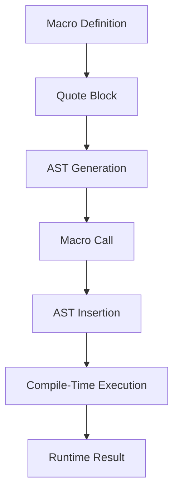

## 19.3. Writing and Using Macros Safely

Metaprogramming in Elixir is an advanced and powerful feature that allows developers to write code that writes code. This capability is primarily facilitated through the use of macros. Macros in Elixir enable you to extend the language with new constructs, optimize performance by reducing runtime computation, and create domain-specific languages (DSLs). However, with great power comes great responsibility. Writing and using macros safely is crucial to maintain code readability, maintainability, and correctness.

### Defining Macros

Macros are defined using the `defmacro` keyword in Elixir. They are similar to functions but operate on the abstract syntax tree (AST) of the code, allowing them to transform code before it is compiled.

#### Using `defmacro` to Create Macros

To define a macro, you use `defmacro` followed by the macro name and its parameters. The body of the macro should return a quoted expression, which represents the code that will be inserted where the macro is called.

**Example: Defining a Simple Macro**

```elixir
defmodule MyMacros do
  defmacro say_hello(name) do
    quote do
      IO.puts("Hello, #{unquote(name)}!")
    end
  end
end

# Using the macro
defmodule Greeting do
  require MyMacros

  def greet do
    MyMacros.say_hello("Elixir")
  end
end

Greeting.greet()
# Output: Hello, Elixir!
```

In this example, `say_hello` is a macro that takes a name and outputs a greeting. The `quote` block captures the code as an AST, and `unquote` is used to inject the value of `name` into the quoted expression.

**Key Concepts:**

- **Quote:** The `quote` function captures code as an AST, allowing you to manipulate it.
- **Unquote:** The `unquote` function is used to insert values into a quoted expression.

### Macro Hygiene

Macro hygiene refers to the practice of avoiding variable clashes and unexpected behavior in macros. Elixir macros are hygienic by default, meaning they automatically avoid variable name conflicts by renaming variables internally.

#### Avoiding Variable Clashes with Hygienic Macros

When writing macros, it's important to ensure that the variables introduced by the macro do not interfere with those in the surrounding code. Elixir handles this by automatically generating unique names for variables within a macro.

**Example: Hygienic Macro**

```elixir
defmodule SafeMacros do
  defmacro increment(var) do
    quote do
      unquote(var) = unquote(var) + 1
    end
  end
end

defmodule Counter do
  require SafeMacros

  def count do
    x = 0
    SafeMacros.increment(x)
    IO.puts(x) # Output: 1
  end
end

Counter.count()
```

In this example, the macro `increment` safely modifies the variable `x` without causing any variable clashes, thanks to Elixir's hygienic macro system.

**Key Concepts:**

- **Hygienic Macros:** Automatically prevent variable name conflicts by renaming variables internally.
- **Variable Scoping:** Ensure that variables introduced by macros do not interfere with existing variables in the calling context.

### Testing Macros

Testing macros is crucial to ensure their correctness and reliability. Since macros operate at compile-time, testing strategies differ from those used for regular functions.

#### Strategies for Ensuring Macro Correctness

1. **Unit Testing with Assertions:**
   - Use Elixir's `ExUnit` framework to write tests that assert the expected behavior of macros.
   - Test both the output and side effects of macros.

**Example: Testing a Macro**

```elixir
defmodule MyMacrosTest do
  use ExUnit.Case
  require MyMacros

  test "say_hello macro outputs correct greeting" do
    assert capture_io(fn -> MyMacros.say_hello("World") end) == "Hello, World!\n"
  end
end
```

2. **Compile-Time Assertions:**
   - Use compile-time assertions to ensure that macros produce the correct AST.
   - Verify that the generated code behaves as expected when compiled.

**Example: Compile-Time Assertion**

```elixir
defmodule CompileTimeTest do
  require MyMacros

  def test_macro do
    assert Macro.to_string(MyMacros.say_hello("Compile")) == "IO.puts(\"Hello, Compile!\")"
  end
end
```

3. **Code Coverage:**
   - Ensure that all branches and paths within macros are tested.
   - Use tools like `excoveralls` to measure and improve macro code coverage.

**Key Concepts:**

- **ExUnit:** Elixir's built-in testing framework for writing and running tests.
- **CaptureIO:** A utility for capturing and asserting console output in tests.
- **Macro.to_string:** Converts an AST back to a string representation for comparison.

### Visualizing Macro Execution

Understanding how macros transform code can be challenging. Visualizing the process can help clarify how macros work and how they affect the code.

**Mermaid.js Diagram: Macro Execution Flow**


```mermaid
graph TD;
    A[Macro Definition] --> B[Quote Block];
    B --> C[AST Generation];
    C --> D[Macro Call];
    D --> E[AST Insertion];
    E --> F[Compile-Time Execution];
    F --> G[Runtime Result];
```

**Diagram Description:**

- **Macro Definition:** The process starts with defining a macro using `defmacro`.
- **Quote Block:** The macro's body is captured as an AST using a `quote` block.
- **AST Generation:** The quoted expression is transformed into an AST.
- **Macro Call:** The macro is called in the code, triggering the AST insertion.
- **AST Insertion:** The generated AST is inserted into the calling code at compile-time.
- **Compile-Time Execution:** The inserted code is compiled and executed.
- **Runtime Result:** The final result is produced at runtime.

### Best Practices for Writing Safe Macros

1. **Maintain Simplicity:**
   - Keep macros simple and focused on a single task.
   - Avoid complex logic that can be handled by regular functions.

2. **Document Macros Thoroughly:**
   - Provide clear documentation for each macro, including its purpose, parameters, and expected behavior.
   - Use comments to explain complex parts of the macro.

3. **Limit Macro Usage:**
   - Use macros sparingly and only when necessary.
   - Prefer functions over macros for most tasks to maintain code readability.

4. **Ensure Macro Hygiene:**
   - Leverage Elixir's hygienic macro system to prevent variable clashes.
   - Use unique variable names when necessary to avoid conflicts.

5. **Test Macros Extensively:**
   - Write comprehensive tests to cover all possible scenarios and edge cases.
   - Use compile-time assertions to verify the correctness of generated code.

6. **Avoid Side Effects:**
   - Design macros to be pure and free of side effects.
   - Ensure that macros do not modify global state or rely on external resources.

### Elixir Unique Features

Elixir offers several unique features that make writing and using macros safer and more efficient:

- **Hygienic Macros:** Elixir's hygienic macro system automatically prevents variable clashes, reducing the risk of errors.
- **Powerful AST Manipulation:** Elixir provides robust tools for manipulating the AST, allowing for complex code transformations.
- **Compile-Time Safety:** Macros operate at compile-time, ensuring that errors are caught early in the development process.

### Differences and Similarities

Macros in Elixir are similar to macros in other languages like Lisp but differ significantly from preprocessor macros in languages like C. Unlike C macros, Elixir macros operate on the AST and are hygienic by default, preventing variable clashes and ensuring safer code transformations.

### Try It Yourself

Now that we've covered the basics of writing and using macros safely, let's experiment with some code examples. Try modifying the `say_hello` macro to include a customizable greeting message. Experiment with adding new parameters and logic to the macro.

**Exercise: Customizable Greeting Macro**

1. Modify the `say_hello` macro to accept a custom greeting message.
2. Test the modified macro to ensure it behaves as expected.
3. Experiment with adding additional logic to the macro, such as conditional greetings based on the time of day.

### Knowledge Check

Before we conclude, let's review some key concepts and test your understanding of writing and using macros safely in Elixir.

- What is the primary purpose of macros in Elixir?
- How does Elixir ensure macro hygiene?
- What are some best practices for writing safe macros?
- How can you test the correctness of a macro?

### Embrace the Journey

Remember, mastering macros is an ongoing journey. As you continue to explore Elixir's metaprogramming capabilities, you'll discover new ways to extend the language and optimize your code. Keep experimenting, stay curious, and enjoy the journey of writing and using macros safely in Elixir!

## Quiz Time!



### What is the primary purpose of macros in Elixir?

- [x] To extend the language with new constructs and optimize performance by reducing runtime computation.
- [ ] To replace functions for all tasks.
- [ ] To handle error management.
- [ ] To manage state in applications.

> **Explanation:** Macros in Elixir allow developers to extend the language with new constructs and optimize performance by reducing runtime computation.

### How does Elixir ensure macro hygiene?

- [x] By automatically generating unique names for variables within a macro.
- [ ] By requiring developers to manually rename variables.
- [ ] By using a separate namespace for macros.
- [ ] By avoiding the use of variables in macros.

> **Explanation:** Elixir ensures macro hygiene by automatically generating unique names for variables within a macro, preventing variable clashes.

### What function is used to capture code as an AST in Elixir macros?

- [x] `quote`
- [ ] `unquote`
- [ ] `capture`
- [ ] `macro`

> **Explanation:** The `quote` function is used to capture code as an AST in Elixir macros.

### What is a key benefit of using macros in Elixir?

- [x] They allow for compile-time code transformation.
- [ ] They simplify error handling.
- [ ] They are easier to write than functions.
- [ ] They automatically handle concurrency.

> **Explanation:** Macros allow for compile-time code transformation, enabling developers to optimize performance and extend the language.

### Which of the following is a best practice for writing safe macros?

- [x] Maintain simplicity and focus on a single task.
- [ ] Use macros for all tasks instead of functions.
- [ ] Avoid testing macros extensively.
- [ ] Use complex logic within macros.

> **Explanation:** A best practice for writing safe macros is to maintain simplicity and focus on a single task, avoiding complex logic.

### How can you test the correctness of a macro?

- [x] By writing unit tests with assertions using ExUnit.
- [ ] By relying solely on manual testing.
- [ ] By using macros in production code without testing.
- [ ] By avoiding the use of macros altogether.

> **Explanation:** You can test the correctness of a macro by writing unit tests with assertions using Elixir's ExUnit framework.

### What is the role of the `unquote` function in macros?

- [x] To insert values into a quoted expression.
- [ ] To capture code as an AST.
- [ ] To define a macro.
- [ ] To handle error management.

> **Explanation:** The `unquote` function is used to insert values into a quoted expression within a macro.

### Why should macros be used sparingly?

- [x] To maintain code readability and avoid unnecessary complexity.
- [ ] Because they are difficult to write.
- [ ] Because they are less efficient than functions.
- [ ] Because they cannot be tested.

> **Explanation:** Macros should be used sparingly to maintain code readability and avoid unnecessary complexity.

### What tool can be used to measure macro code coverage in Elixir?

- [x] `excoveralls`
- [ ] `dialyzer`
- [ ] `credo`
- [ ] `benchee`

> **Explanation:** `excoveralls` is a tool that can be used to measure macro code coverage in Elixir.

### True or False: Elixir macros are similar to preprocessor macros in C.

- [ ] True
- [x] False

> **Explanation:** Elixir macros are different from preprocessor macros in C; they operate on the AST and are hygienic by default, preventing variable clashes.


