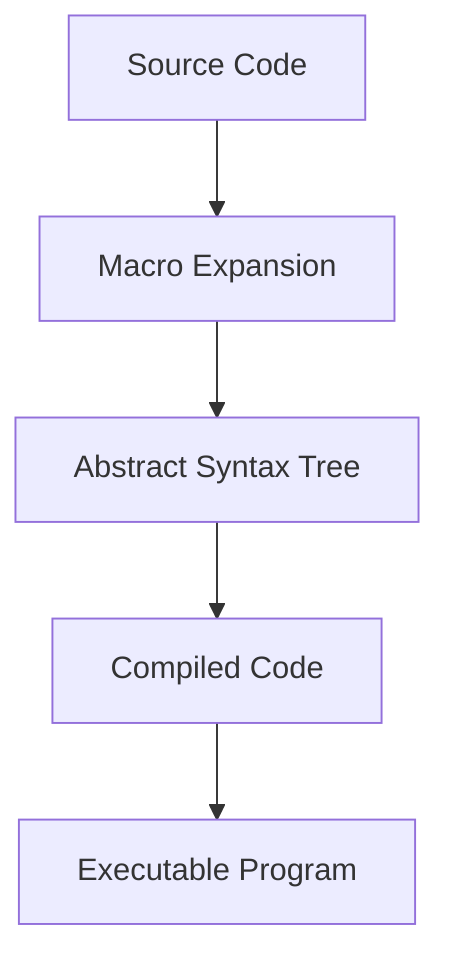

## 19.4. Compile-Time Code Generation

In the realm of Elixir programming, compile-time code generation stands as a powerful technique that leverages the capabilities of metaprogramming to create dynamic and efficient code. By generating code at compile time, developers can optimize performance, reduce runtime overhead, and create more flexible and maintainable applications. In this section, we'll delve into the intricacies of compile-time code generation, exploring its benefits, applications, and practical examples.

### Generating Code at Compile Time

Compile-time code generation in Elixir is primarily achieved through the use of macros. Macros allow us to transform abstract syntax trees (AST) during compilation, enabling the creation of functions, modules, and other constructs dynamically. This process can lead to significant performance improvements by moving computation and code generation from runtime to compile time.

#### Creating Functions and Modules Dynamically

One of the key advantages of compile-time code generation is the ability to create functions and modules dynamically. This capability allows developers to write more generic and reusable code, reducing duplication and enhancing maintainability. Let's explore how we can achieve this in Elixir.

**Example: Dynamic Function Generation**

Suppose we want to create a series of functions that perform arithmetic operations on a given number. Instead of writing each function manually, we can use a macro to generate these functions dynamically:

```elixir
defmodule Arithmetic do
  defmacro generate_operations(operations) do
    Enum.map(operations, fn {name, op} ->
      quote do
        def unquote(name)(a, b) do
          a unquote(op) b
        end
      end
    end)
  end
end

defmodule Calculator do
  require Arithmetic

  Arithmetic.generate_operations([
    {:add, :+},
    {:subtract, :-},
    {:multiply, :*},
    {:divide, :/}
  ])
end

IO.puts Calculator.add(5, 3)      # Output: 8
IO.puts Calculator.subtract(5, 3) # Output: 2
IO.puts Calculator.multiply(5, 3) # Output: 15
IO.puts Calculator.divide(6, 3)   # Output: 2.0
```

In this example, the `Arithmetic` module defines a macro `generate_operations` that takes a list of operations and generates corresponding functions. The `Calculator` module then uses this macro to create arithmetic functions dynamically.

### Benefits of Compile-Time Code Generation

The benefits of compile-time code generation are manifold, particularly in terms of performance and flexibility:

1. **Performance Improvements**: By generating code at compile time, we can eliminate the need for certain computations during runtime, leading to faster execution and reduced resource consumption.

2. **Reduced Runtime Overhead**: Compile-time code generation allows us to move complex logic and computations to the compilation phase, minimizing the overhead during execution.

3. **Enhanced Flexibility**: Developers can create highly dynamic and adaptable code structures, enabling easier customization and extension of functionality.

4. **Improved Maintainability**: By reducing code duplication and leveraging macros, we can write cleaner and more maintainable codebases.

### Practical Examples of Compile-Time Code Generation

Let's explore some practical applications of compile-time code generation in Elixir, illustrating how this technique can be used to create resource-specific functions and API clients.

#### Example: Creating Resource-Specific Functions

Consider a scenario where we need to interact with multiple resources in a RESTful API. Instead of writing repetitive code for each resource, we can use compile-time code generation to create resource-specific functions dynamically.

```elixir
defmodule API do
  defmacro define_resource(resource) do
    quote do
      def unquote(:"get_#{resource}")(id) do
        IO.puts("Fetching #{unquote(resource)} with ID: #{id}")
        # Simulate API call
      end

      def unquote(:"create_#{resource}")(params) do
        IO.puts("Creating #{unquote(resource)} with params: #{inspect(params)}")
        # Simulate API call
      end
    end
  end
end

defmodule MyApp.API do
  require API

  API.define_resource(:user)
  API.define_resource(:product)
end

MyApp.API.get_user(1)           # Output: Fetching user with ID: 1
MyApp.API.create_product(%{name: "Widget"}) # Output: Creating product with params: %{name: "Widget"}
```

In this example, the `API` module defines a macro `define_resource` that generates functions for fetching and creating resources. The `MyApp.API` module then uses this macro to define functions for `user` and `product` resources.

#### Example: Generating API Clients

Another common use case for compile-time code generation is creating API clients. By generating client functions dynamically, we can simplify the process of interacting with external services and ensure consistency across different endpoints.

```elixir
defmodule HTTPClient do
  defmacro define_client(endpoints) do
    Enum.map(endpoints, fn {name, path} ->
      quote do
        def unquote(name)(params) do
          IO.puts("Making request to #{unquote(path)} with params: #{inspect(params)}")
          # Simulate HTTP request
        end
      end
    end)
  end
end

defmodule MyApp.HTTPClient do
  require HTTPClient

  HTTPClient.define_client([
    {:get_users, "/users"},
    {:get_products, "/products"},
    {:get_orders, "/orders"}
  ])
end

MyApp.HTTPClient.get_users(%{page: 1}) # Output: Making request to /users with params: %{page: 1}
```

In this example, the `HTTPClient` module defines a macro `define_client` that generates functions for making HTTP requests to specified endpoints. The `MyApp.HTTPClient` module then uses this macro to create client functions for various API endpoints.

### Visualizing Compile-Time Code Generation

To better understand the process of compile-time code generation, let's visualize the transformation of code using a Mermaid.js diagram. This diagram illustrates how a macro transforms input code into an abstract syntax tree (AST) during compilation.



**Diagram Description**: This diagram represents the flow of compile-time code generation in Elixir. The source code is transformed by macros into an abstract syntax tree (AST), which is then compiled into executable code.

### Key Considerations for Compile-Time Code Generation

When using compile-time code generation, it's important to consider the following:

- **Complexity**: While macros offer powerful capabilities, they can also introduce complexity. It's essential to use them judiciously and ensure that generated code is readable and maintainable.

- **Debugging**: Debugging macros can be challenging due to their transformation of code. Tools like `ExUnit` and `IO.inspect` can help in inspecting generated code and understanding macro behavior.

- **Performance**: While compile-time code generation can improve performance, it's crucial to measure and validate the impact on your specific application.

### Elixir Unique Features

Elixir's metaprogramming capabilities are built on top of the Erlang VM, providing unique features such as:

- **Macros**: Elixir macros allow for powerful compile-time transformations, enabling developers to create dynamic and efficient code.

- **AST Manipulation**: Elixir provides a straightforward way to manipulate abstract syntax trees, making it easier to implement complex transformations.

- **Hygienic Macros**: Elixir macros are hygienic, meaning they avoid variable name clashes and ensure safe code generation.

### Differences and Similarities with Other Languages

Elixir's compile-time code generation shares similarities with metaprogramming in other languages like Lisp and Ruby. However, Elixir's focus on functional programming and concurrency provides a unique context for using these techniques.

- **Similarities**: Like Lisp, Elixir uses macros to transform code at compile time. Both languages emphasize the power of code-as-data and provide robust metaprogramming capabilities.

- **Differences**: Unlike Ruby, which uses runtime metaprogramming, Elixir focuses on compile-time transformations, allowing for more efficient and predictable code generation.

### Knowledge Check

As we conclude this section, let's reinforce our understanding with a few questions and exercises:

- **Question**: What are the primary benefits of compile-time code generation in Elixir?
- **Exercise**: Modify the `Arithmetic` example to include a division function that handles division by zero gracefully.

### Embrace the Journey

Compile-time code generation in Elixir opens up a world of possibilities for creating dynamic, efficient, and maintainable applications. As you explore this powerful technique, remember to experiment, stay curious, and enjoy the journey of mastering metaprogramming in Elixir.

### Quiz Time!



### What is the primary purpose of compile-time code generation in Elixir?

- [x] To optimize performance by reducing runtime overhead
- [ ] To increase the complexity of code
- [ ] To allow runtime changes to the code structure
- [ ] To replace all functions with macros

> **Explanation:** Compile-time code generation optimizes performance by moving computations from runtime to compile time, reducing runtime overhead.

### Which Elixir construct is primarily used for compile-time code generation?

- [x] Macros
- [ ] Functions
- [ ] Modules
- [ ] Processes

> **Explanation:** Macros in Elixir are used for compile-time code generation, allowing transformations of the abstract syntax tree.

### What is a key benefit of using compile-time code generation?

- [x] Enhanced flexibility and maintainability
- [ ] Increased runtime complexity
- [ ] Slower execution speed
- [ ] More verbose code

> **Explanation:** Compile-time code generation enhances flexibility and maintainability by enabling dynamic code creation and reducing duplication.

### How does Elixir ensure safe code generation with macros?

- [x] By using hygienic macros
- [ ] By using runtime checks
- [ ] By avoiding variable names
- [ ] By compiling code twice

> **Explanation:** Elixir uses hygienic macros to prevent variable name clashes and ensure safe code generation.

### What is a common use case for compile-time code generation in Elixir?

- [x] Creating API clients dynamically
- [ ] Writing static HTML pages
- [ ] Compiling binary files
- [ ] Managing database connections

> **Explanation:** Compile-time code generation is commonly used to create API clients dynamically, simplifying interaction with external services.

### Which of the following is NOT a benefit of compile-time code generation?

- [ ] Performance improvements
- [ ] Reduced runtime overhead
- [ ] Enhanced flexibility
- [x] Increased code duplication

> **Explanation:** Compile-time code generation reduces code duplication by enabling dynamic and reusable code structures.

### What is the role of the abstract syntax tree (AST) in compile-time code generation?

- [x] It represents the code structure during compilation
- [ ] It executes the code at runtime
- [ ] It stores variables in memory
- [ ] It manages network requests

> **Explanation:** The abstract syntax tree (AST) represents the code structure during compilation, enabling transformations by macros.

### How can developers inspect generated code in Elixir?

- [x] Using `IO.inspect` and `ExUnit`
- [ ] Using `Logger` and `GenServer`
- [ ] Using `ETS` and `DETS`
- [ ] Using `Task` and `Agent`

> **Explanation:** Developers can use `IO.inspect` and `ExUnit` to inspect generated code and understand macro behavior.

### What is a potential challenge when using macros for compile-time code generation?

- [x] Increased complexity and debugging difficulty
- [ ] Lack of performance improvements
- [ ] Limited flexibility
- [ ] Inability to create dynamic functions

> **Explanation:** Macros can introduce complexity and make debugging more challenging due to their transformation of code.

### True or False: Elixir's compile-time code generation is similar to runtime metaprogramming in Ruby.

- [ ] True
- [x] False

> **Explanation:** Unlike Ruby, which uses runtime metaprogramming, Elixir focuses on compile-time transformations for efficiency and predictability.



By mastering compile-time code generation, you can unlock new levels of performance and flexibility in your Elixir applications. Keep exploring and pushing the boundaries of what's possible with metaprogramming!
