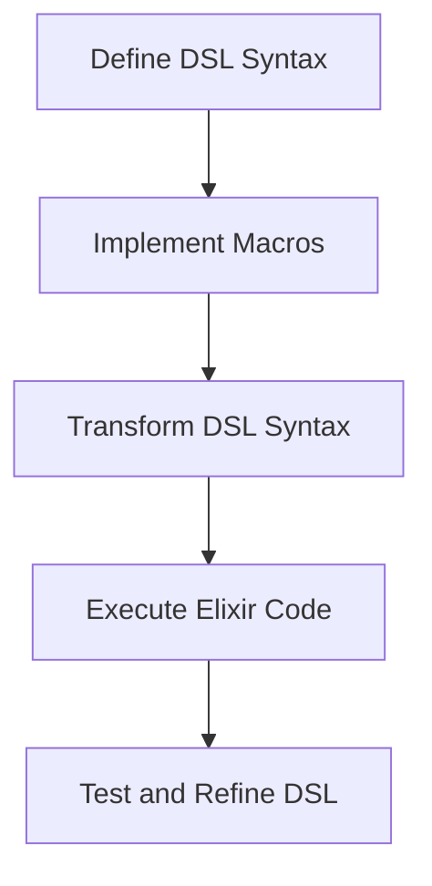

## 19.5. Creating Domain-Specific Languages (DSLs)

In the world of software development, Domain-Specific Languages (DSLs) are powerful tools that allow developers to express solutions in a language that is tailored to a specific problem domain. In Elixir, the creation of DSLs is facilitated by its robust metaprogramming capabilities, particularly through the use of macros. This section will guide you through the process of creating DSLs in Elixir, from understanding their purpose to designing expressive syntax and exploring real-world examples.

### Purpose of DSLs

The primary purpose of a DSL is to simplify complex tasks by providing a specialized syntax that is more intuitive and expressive for a particular domain. DSLs can significantly enhance productivity by allowing developers to write code that closely resembles the problem space, rather than the solution space. This can lead to more readable, maintainable, and efficient code.

#### Key Benefits of DSLs

- **Expressiveness**: DSLs allow developers to write code that is closer to human language, making it easier to understand and communicate.
- **Abstraction**: By abstracting complex logic into a simpler syntax, DSLs reduce the cognitive load on developers.
- **Reusability**: DSLs can encapsulate common patterns and practices, promoting code reuse across projects.
- **Domain Alignment**: DSLs align closely with the domain they are designed for, making them ideal for solving domain-specific problems.

### Designing DSLs

Designing a DSL involves identifying the needs of the domain and creating a syntax that is both expressive and intuitive. This process requires a deep understanding of the domain and the problems it presents.

#### Steps to Design a DSL

1. **Identify the Domain**: Clearly define the domain and the specific problems the DSL will address.
2. **Gather Requirements**: Understand the needs of the users and the tasks they perform within the domain.
3. **Design Expressive Syntax**: Create a syntax that is easy to read and write, while accurately representing the domain concepts.
4. **Implement Using Macros**: Utilize Elixir's metaprogramming capabilities to implement the DSL, leveraging macros to transform the DSL syntax into executable code.
5. **Iterate and Refine**: Continuously refine the DSL based on user feedback and evolving domain requirements.

### Examples of DSLs in Elixir

Elixir provides several examples of successful DSLs that have become integral parts of its ecosystem. These examples demonstrate the power and flexibility of DSLs in simplifying complex tasks.

#### Ecto's Query Syntax

Ecto, Elixir's database library, provides a DSL for building queries. This DSL allows developers to construct complex database queries using a syntax that is both expressive and easy to understand.

```elixir
# Example of Ecto's query syntax
import Ecto.Query

query = from u in "users",
  where: u.age > 18,
  select: u.name

Repo.all(query)
```

In this example, the DSL allows developers to express database queries in a way that closely resembles SQL, but with the added benefits of Elixir's syntax and compile-time checks.

#### Testing Frameworks

Elixir's testing frameworks, such as ExUnit, also utilize DSLs to provide a clean and expressive syntax for writing tests.

```elixir
# Example of ExUnit's DSL
defmodule MathTest do
  use ExUnit.Case

  test "addition" do
    assert 1 + 1 == 2
  end
end
```

The DSL provided by ExUnit allows developers to define test cases and assertions in a concise and readable manner.

#### Configuration Files

Elixir's configuration files often use DSLs to define application settings in a structured and readable format.

```elixir
# Example of a configuration file DSL
use Mix.Config

config :my_app, MyApp.Repo,
  username: "user",
  password: "pass",
  database: "my_db",
  hostname: "localhost"
```

This DSL provides a simple way to define configuration settings, making it easy to manage and update application configurations.

### Implementing DSLs in Elixir

Implementing a DSL in Elixir involves leveraging its metaprogramming capabilities, particularly macros, to transform the DSL syntax into executable code. Let's explore the process of implementing a simple DSL in Elixir.

#### Step 1: Define the DSL Syntax

The first step in implementing a DSL is to define the syntax that users will interact with. This involves deciding on the keywords and constructs that will make up the DSL.

```elixir
# Define a simple DSL for arithmetic operations
defmodule ArithmeticDSL do
  defmacro add(a, b) do
    quote do
      unquote(a) + unquote(b)
    end
  end

  defmacro subtract(a, b) do
    quote do
      unquote(a) - unquote(b)
    end
  end
end
```

In this example, we define a simple DSL for arithmetic operations, with `add` and `subtract` as the primary constructs.

#### Step 2: Implement the DSL Using Macros

Next, we implement the DSL using macros. Macros allow us to transform the DSL syntax into Elixir code that can be executed at runtime.

```elixir
# Use the DSL in a module
defmodule Calculator do
  import ArithmeticDSL

  def calculate do
    add(5, 3) - subtract(10, 4)
  end
end

IO.puts Calculator.calculate() # Output: 4
```

Here, we use the DSL to perform arithmetic operations, demonstrating how the DSL syntax is transformed into executable Elixir code.

#### Step 3: Test and Refine the DSL

Finally, we test the DSL to ensure it behaves as expected and refine it based on user feedback and evolving requirements.

### Visualizing DSL Implementation

To better understand the process of implementing a DSL in Elixir, let's visualize the transformation of DSL syntax into executable code using a flowchart.



This flowchart illustrates the key steps in implementing a DSL, from defining the syntax to executing the transformed Elixir code.

### Elixir Unique Features for DSLs

Elixir's unique features, such as its powerful metaprogramming capabilities and functional programming paradigm, make it an ideal language for creating DSLs. The use of macros allows developers to define custom syntax and transform it into efficient, executable code, while the functional nature of Elixir ensures that DSLs are both expressive and performant.

### Differences and Similarities with Other Languages

While DSLs can be implemented in many programming languages, Elixir's approach is unique due to its emphasis on functional programming and metaprogramming. Unlike object-oriented languages, where DSLs often rely on classes and inheritance, Elixir DSLs leverage functions and macros to achieve similar goals. This results in DSLs that are more concise and easier to reason about.

### Design Considerations

When designing a DSL in Elixir, it's important to consider the following:

- **Simplicity**: Keep the DSL syntax simple and intuitive to encourage adoption and ease of use.
- **Consistency**: Ensure that the DSL syntax is consistent with Elixir's syntax and conventions to minimize the learning curve.
- **Performance**: Optimize the DSL implementation to ensure that it performs well, even for complex tasks.
- **Extensibility**: Design the DSL to be easily extensible, allowing for future enhancements and modifications.

### Try It Yourself

Now that we've explored the process of creating DSLs in Elixir, it's time to try it yourself. Experiment with the examples provided and consider modifying them to create your own DSLs. Here are a few ideas to get you started:

- Create a DSL for defining state machines.
- Implement a DSL for building HTML templates.
- Design a DSL for configuring network settings.

### Knowledge Check

Before we wrap up, let's reinforce what we've learned with a few questions:

- What are the key benefits of using DSLs in software development?
- How does Elixir's metaprogramming capabilities facilitate the creation of DSLs?
- What are some real-world examples of DSLs in the Elixir ecosystem?

### Summary

In this section, we've explored the concept of Domain-Specific Languages (DSLs) and how they can be implemented in Elixir using its powerful metaprogramming capabilities. We've discussed the purpose of DSLs, the process of designing and implementing them, and examined real-world examples from the Elixir ecosystem. By leveraging Elixir's unique features, developers can create expressive and efficient DSLs that simplify complex tasks and enhance productivity.

Remember, creating DSLs is an iterative process that requires a deep understanding of the domain and the needs of its users. As you continue to experiment and refine your DSLs, you'll gain valuable insights into the art of designing expressive and intuitive languages.

## Quiz: Creating Domain-Specific Languages (DSLs)



### What is the primary purpose of a Domain-Specific Language (DSL)?

- [x] To simplify complex tasks with specialized syntax.
- [ ] To replace general-purpose programming languages.
- [ ] To increase the complexity of code.
- [ ] To provide a universal solution for all domains.

> **Explanation:** The primary purpose of a DSL is to simplify complex tasks by providing a specialized syntax that is more intuitive and expressive for a particular domain.

### Which Elixir feature is most commonly used to implement DSLs?

- [x] Macros
- [ ] Structs
- [ ] Protocols
- [ ] GenServers

> **Explanation:** Macros are the most commonly used feature in Elixir for implementing DSLs, as they allow developers to transform custom syntax into executable code.

### What is a key benefit of using DSLs?

- [x] They provide expressiveness and abstraction.
- [ ] They make code harder to read.
- [ ] They increase the amount of boilerplate code.
- [ ] They are only useful for large projects.

> **Explanation:** DSLs provide expressiveness and abstraction, allowing developers to write code that is closer to human language and easier to understand.

### Which of the following is an example of a DSL in Elixir?

- [x] Ecto's query syntax
- [ ] Elixir's pattern matching
- [ ] Erlang's process model
- [ ] Phoenix's router

> **Explanation:** Ecto's query syntax is an example of a DSL in Elixir, providing an expressive way to build database queries.

### What is the first step in designing a DSL?

- [x] Identify the domain
- [ ] Implement macros
- [ ] Test the DSL
- [ ] Optimize performance

> **Explanation:** The first step in designing a DSL is to identify the domain and the specific problems the DSL will address.

### How does Elixir's functional programming paradigm benefit DSL creation?

- [x] It ensures DSLs are expressive and performant.
- [ ] It makes DSLs more complex.
- [ ] It limits the use of DSLs.
- [ ] It requires more boilerplate code.

> **Explanation:** Elixir's functional programming paradigm ensures that DSLs are both expressive and performant, making them easier to reason about.

### What is a common design consideration when creating a DSL?

- [x] Simplicity
- [ ] Complexity
- [ ] Inconsistency
- [ ] Obfuscation

> **Explanation:** Simplicity is a common design consideration when creating a DSL, as it encourages adoption and ease of use.

### What is the role of macros in DSL implementation?

- [x] To transform DSL syntax into executable code
- [ ] To define data structures
- [ ] To manage processes
- [ ] To handle concurrency

> **Explanation:** Macros play a crucial role in DSL implementation by transforming DSL syntax into executable Elixir code.

### Which of the following is NOT a benefit of using DSLs?

- [ ] Expressiveness
- [ ] Abstraction
- [ ] Domain alignment
- [x] Increased complexity

> **Explanation:** DSLs aim to reduce complexity by providing a more intuitive and expressive syntax for specific domains.

### True or False: DSLs are only useful for large-scale applications.

- [ ] True
- [x] False

> **Explanation:** DSLs are useful for applications of all sizes, as they simplify complex tasks and enhance productivity, regardless of the scale of the application.



Remember, this is just the beginning. As you progress, you'll build more complex and interactive DSLs. Keep experimenting, stay curious, and enjoy the journey!
