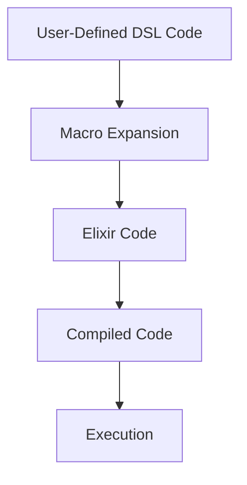

## 19.5. Creating Domain-Specific Languages (DSLs)

In the world of software engineering, Domain-Specific Languages (DSLs) play a crucial role in simplifying complex tasks by providing specialized syntax tailored to specific domains. In Elixir, the power of metaprogramming and macros makes it an ideal language for creating expressive and efficient DSLs. This guide will delve into the purpose of DSLs, how to design them, and provide real-world examples to illustrate their use in Elixir.

### Purpose of DSLs

Domain-Specific Languages are designed to address specific problems within a particular domain, allowing developers to express solutions more naturally and succinctly. The main purposes of DSLs include:

- **Simplifying Complex Tasks**: By providing a higher-level abstraction, DSLs make it easier to perform complex operations without delving into low-level details.
- **Enhancing Readability and Maintainability**: DSLs use a syntax that closely resembles the problem domain, making code more intuitive and easier to understand.
- **Increasing Productivity**: With a DSL, developers can write less code to achieve the same functionality, speeding up the development process.
- **Encouraging Domain Experts' Involvement**: DSLs allow domain experts, who may not be programmers, to contribute directly to the software development process.

### Designing DSLs

Creating a DSL involves several steps, from identifying the needs of the domain to designing an expressive syntax that fulfills those needs. Here’s a step-by-step guide to designing DSLs in Elixir:

#### 1. Identify the Domain Needs

To create a successful DSL, start by understanding the specific needs of the domain. Engage with domain experts and gather requirements to identify the key operations and concepts that the DSL should support.

#### 2. Define the Syntax

Design a syntax that is both expressive and intuitive. The syntax should be easy to read and write, closely resembling the language used by domain experts. Consider the following when designing the syntax:

- **Clarity**: Ensure that the syntax is clear and unambiguous.
- **Consistency**: Use consistent naming conventions and structures.
- **Expressiveness**: Allow users to express complex ideas succinctly.

#### 3. Implement the DSL

Leverage Elixir's metaprogramming capabilities to implement the DSL. Use macros to transform the DSL code into standard Elixir code that the compiler can understand. Here’s a basic structure for implementing a DSL in Elixir:

```elixir
defmodule MyDSL do
  defmacro my_syntax(do: block) do
    # Transform the block into Elixir code
    quote do
      # Transformed Elixir code
    end
  end
end
```

#### 4. Test and Refine

Test the DSL with real-world scenarios to ensure it meets the domain's needs. Gather feedback from users and refine the syntax and implementation to improve usability and performance.

### Examples of DSLs in Elixir

Elixir's ecosystem provides several examples of DSLs that demonstrate the power and flexibility of the language. Here are a few notable examples:

#### Ecto's Query Syntax

Ecto, Elixir's database wrapper and query generator, uses a DSL to allow developers to build queries in a concise and readable manner. Here's an example of Ecto's query syntax:

```elixir
import Ecto.Query

query = from u in "users",
        where: u.age > 18,
        select: u.name

Repo.all(query)
```

This DSL allows developers to construct complex SQL queries using Elixir's syntax, making it easier to read and maintain.

#### Testing Frameworks

Elixir's testing frameworks, such as ExUnit, use DSLs to define test cases and assertions. Here's an example of a test case written using ExUnit's DSL:

```elixir
defmodule MyTest do
  use ExUnit.Case

  test "the truth" do
    assert 1 + 1 == 2
  end
end
```

The DSL provides a clear and concise way to define tests, making it easy to write and understand test cases.

#### Configuration Files

Elixir uses DSLs for configuration files, allowing developers to define application configurations in a structured and readable format. Here's an example of a configuration file using Elixir's DSL:

```elixir
use Mix.Config

config :my_app, MyModule,
  key: "value",
  another_key: 123
```

This DSL provides a straightforward way to manage application configurations, enhancing readability and maintainability.

### Creating Your Own DSL

Let's walk through the process of creating a simple DSL in Elixir. We'll create a DSL for defining workflows, allowing users to specify a sequence of tasks with conditions.

#### Step 1: Define the Syntax

We'll design a syntax that allows users to define tasks and conditions in a readable format:

```elixir
workflow do
  task :task1 do
    # Task implementation
  end

  task :task2, if: :condition do
    # Task implementation
  end
end
```

#### Step 2: Implement the DSL

We'll implement the DSL using Elixir's macros. Here's how we can define the `workflow` and `task` macros:

```elixir
defmodule WorkflowDSL do
  defmacro workflow(do: block) do
    quote do
      Enum.each(unquote(block), fn task ->
        # Execute each task
      end)
    end
  end

  defmacro task(name, opts \\ [], do: block) do
    condition = Keyword.get(opts, :if, true)

    quote do
      if unquote(condition) do
        IO.puts("Executing #{unquote(name)}")
        unquote(block)
      end
    end
  end
end
```

#### Step 3: Use the DSL

Here's how you can use the DSL to define a workflow:

```elixir
import WorkflowDSL

workflow do
  task :task1 do
    IO.puts("Task 1 executed")
  end

  task :task2, if: false do
    IO.puts("Task 2 executed")
  end
end
```

In this example, only `task1` will be executed because the condition for `task2` is `false`.

### Visualizing DSL Creation

To better understand the process of creating a DSL, let's visualize the transformation of DSL code into Elixir code using a flowchart.


```mermaid
graph TD;
    A[User-Defined DSL Code] --> B[Macro Expansion];
    B --> C[Elixir Code];
    C --> D[Compiled Code];
    D --> E[Execution];
```

**Figure 1**: This flowchart illustrates the transformation of user-defined DSL code into executable Elixir code through macro expansion and compilation.

### Key Considerations

When creating DSLs in Elixir, keep the following considerations in mind:

- **Performance**: Ensure that the DSL does not introduce significant performance overhead.
- **Error Handling**: Provide meaningful error messages to help users debug issues with their DSL code.
- **Documentation**: Document the DSL thoroughly to help users understand how to use it effectively.

### Elixir Unique Features

Elixir's metaprogramming capabilities, particularly macros, make it uniquely suited for creating DSLs. The ability to manipulate the Abstract Syntax Tree (AST) allows developers to design flexible and powerful DSLs that integrate seamlessly with Elixir's syntax.

### Differences and Similarities

DSLs in Elixir are similar to those in other languages in that they aim to simplify domain-specific tasks. However, Elixir's functional nature and metaprogramming capabilities provide unique advantages, such as immutability and concurrency support, which can enhance the design and implementation of DSLs.

### Try It Yourself

To get hands-on experience with creating DSLs in Elixir, try modifying the workflow DSL example. Add new features, such as task dependencies or error handling, to see how the DSL can be extended and improved.

### Knowledge Check

- What are the main purposes of DSLs?
- How can macros be used to implement DSLs in Elixir?
- What are some examples of DSLs in the Elixir ecosystem?
- What are the key considerations when designing a DSL?

### Embrace the Journey

Creating DSLs in Elixir is a rewarding journey that allows you to leverage the language's powerful features to simplify complex tasks. Remember, this is just the beginning. As you progress, you'll discover new ways to enhance your DSLs and make them even more expressive and efficient. Keep experimenting, stay curious, and enjoy the journey!

## Quiz Time!



### What is the primary purpose of a Domain-Specific Language (DSL)?

- [x] To simplify complex tasks within a specific domain
- [ ] To replace general-purpose programming languages
- [ ] To increase the complexity of code
- [ ] To provide a universal syntax for all programming tasks

> **Explanation:** DSLs are designed to simplify complex tasks within a specific domain by providing specialized syntax.

### Which Elixir feature is primarily used to implement DSLs?

- [x] Macros
- [ ] Structs
- [ ] Protocols
- [ ] GenServer

> **Explanation:** Macros are used in Elixir to implement DSLs by transforming custom syntax into standard Elixir code.

### What is an example of a DSL in the Elixir ecosystem?

- [x] Ecto's query syntax
- [ ] GenServer
- [ ] Phoenix Channels
- [ ] Mix

> **Explanation:** Ecto's query syntax is a DSL that allows developers to construct database queries using Elixir's syntax.

### What is a key consideration when designing a DSL?

- [x] Ensuring the syntax is clear and expressive
- [ ] Making the syntax as complex as possible
- [ ] Avoiding documentation
- [ ] Excluding domain experts from the process

> **Explanation:** A key consideration when designing a DSL is to ensure that the syntax is clear and expressive, making it easy for users to understand and use.

### How can you test a DSL in Elixir?

- [x] By using real-world scenarios and gathering feedback
- [ ] By ignoring user feedback
- [ ] By avoiding testing altogether
- [ ] By only using theoretical examples

> **Explanation:** Testing a DSL involves using real-world scenarios and gathering feedback to ensure it meets the domain's needs.

### What is the role of macros in DSL creation?

- [x] Transforming DSL code into standard Elixir code
- [ ] Compiling Elixir code
- [ ] Managing application state
- [ ] Handling concurrency

> **Explanation:** Macros transform DSL code into standard Elixir code that the compiler can understand.

### Which of the following is NOT a benefit of using DSLs?

- [ ] Simplifying complex tasks
- [ ] Enhancing readability
- [x] Increasing code complexity
- [ ] Encouraging domain experts' involvement

> **Explanation:** DSLs aim to simplify complex tasks, enhance readability, and encourage domain experts' involvement, not increase code complexity.

### What is a common pitfall when creating DSLs?

- [x] Introducing significant performance overhead
- [ ] Making the syntax too simple
- [ ] Providing too much documentation
- [ ] Involving too many domain experts

> **Explanation:** A common pitfall when creating DSLs is introducing significant performance overhead.

### How can you extend a DSL in Elixir?

- [x] By adding new features and refining the syntax
- [ ] By removing existing features
- [ ] By making the syntax less expressive
- [ ] By avoiding user feedback

> **Explanation:** You can extend a DSL by adding new features and refining the syntax to improve usability.

### True or False: DSLs in Elixir can only be used for database queries.

- [ ] True
- [x] False

> **Explanation:** DSLs in Elixir can be used for various purposes, including database queries, testing frameworks, configuration files, and more.


