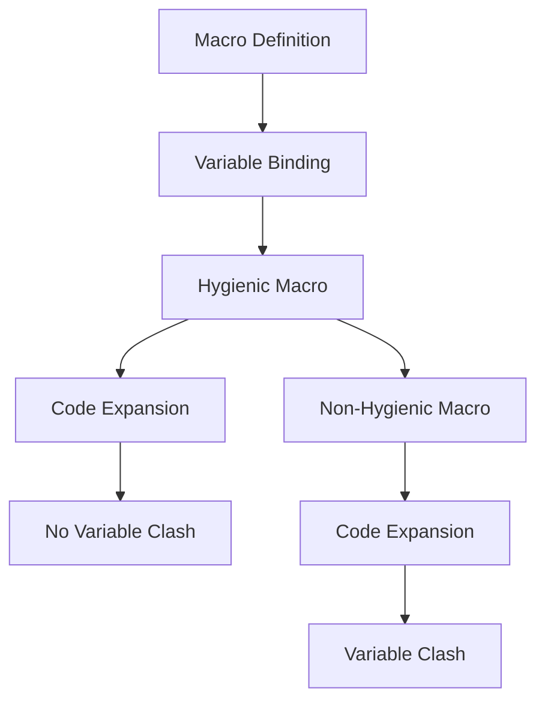

## 19.6. Macro Hygiene and Best Practices

In the world of Elixir, metaprogramming is a powerful tool that allows developers to write code that writes code. This capability is primarily facilitated through macros, which can transform and generate code at compile time. However, with great power comes great responsibility. Macros, if not used carefully, can lead to code that is difficult to understand, maintain, and debug. This section will delve into the concept of macro hygiene and best practices to ensure that your macros are clean, efficient, and maintainable.

### Ensuring Clean Code

#### Using Hygienic Macros to Prevent Unintended Side Effects

Macro hygiene is a concept that ensures macros do not unintentionally interfere with the surrounding code. In Elixir, hygienic macros are designed to avoid variable name clashes and other unintended side effects. Let's explore how hygienic macros work and how to implement them effectively.

**Understanding Macro Hygiene**

Macro hygiene refers to the practice of preventing macros from inadvertently capturing or altering variables in the code where they are invoked. This is crucial because macros operate at the syntactic level, and without hygiene, they can introduce subtle bugs by unintentionally modifying the lexical scope.

**Example of a Non-Hygienic Macro**

Consider the following example of a non-hygienic macro:

```elixir
defmodule NonHygienic do
  defmacro increment(var) do
    quote do
      var = var + 1
    end
  end
end

defmodule Example do
  require NonHygienic

  def test do
    var = 10
    NonHygienic.increment(var)
    IO.puts(var) # This will output 10, not 11
  end
end
```

In this example, the `increment` macro attempts to increment the variable `var`. However, due to the lack of hygiene, it does not affect the `var` in the `Example` module as intended.

**Implementing Hygienic Macros**

To implement a hygienic macro, we can use the `unquote` mechanism to ensure that the macro operates on the intended variables without capturing external ones:

```elixir
defmodule Hygienic do
  defmacro increment(var) do
    quote do
      unquote(var) = unquote(var) + 1
    end
  end
end

defmodule Example do
  require Hygienic

  def test do
    var = 10
    Hygienic.increment(var)
    IO.puts(var) # This will output 11
  end
end
```

In this version, the `increment` macro correctly increments the `var` variable by using `unquote` to ensure that the correct variable is being manipulated.

### Best Practices

#### Keeping Macros Simple and Documenting Clearly

When writing macros, simplicity is key. Complex macros can become difficult to understand and maintain, leading to potential errors and confusion. Here are some best practices to follow:

1. **Limit Complexity**: Keep macros as simple as possible. If a macro becomes too complex, consider breaking it down into smaller, more manageable pieces or using functions instead.

2. **Document Thoroughly**: Provide clear documentation for your macros. Explain what the macro does, how it should be used, and any potential side effects. This will help other developers (and your future self) understand the macro's purpose and usage.

3. **Use Descriptive Names**: Choose meaningful names for your macros that clearly convey their functionality. This makes it easier for others to understand what the macro does at a glance.

4. **Test Extensively**: Write tests for your macros to ensure they behave as expected. Testing macros can be challenging, but it's essential for maintaining code quality.

5. **Avoid Overuse**: Use macros sparingly. While they are powerful, overusing them can lead to code that is difficult to read and maintain. Consider whether a function or module attribute might be a better choice.

### Avoiding Common Pitfalls

#### Not Overusing Macros and Keeping Code Maintainable

Macros are a double-edged sword. While they offer powerful capabilities, they can also introduce complexity and maintenance challenges. Here are some common pitfalls to avoid:

1. **Avoid Overcomplicating Logic**: Macros should not be used to implement complex logic. If a macro becomes too intricate, it may be better to refactor the logic into functions.

2. **Beware of Scope Issues**: Pay attention to variable scope when writing macros. Ensure that macros do not unintentionally capture or modify variables from the surrounding code.

3. **Prevent Code Duplication**: Macros can lead to code duplication if not used carefully. Strive to write reusable and modular macros that can be applied in different contexts.

4. **Consider Compile-Time Overhead**: Macros are expanded at compile time, which can increase compilation time if overused. Be mindful of the performance implications of using macros extensively.

5. **Maintain Readability**: Prioritize code readability. Macros can obscure the flow of code, making it harder to understand. Ensure that your macros enhance, rather than hinder, code clarity.

### Visualizing Macro Hygiene

To better understand macro hygiene, let's visualize how macros interact with the surrounding code. The following diagram illustrates the concept of macro hygiene and how it prevents variable name clashes:



**Diagram Explanation**: The diagram shows two paths: one for hygienic macros and one for non-hygienic macros. Hygienic macros ensure that variable bindings do not clash with the surrounding code, while non-hygienic macros can lead to variable clashes.

### Try It Yourself

Now that we've covered the basics of macro hygiene and best practices, it's time to experiment with your own macros. Try modifying the code examples provided to see how changes affect the behavior of the macros. Here are some suggestions:

- **Experiment with Variable Scoping**: Modify the `increment` macro to see how changes in variable scoping affect its behavior.
- **Create a New Macro**: Write a macro that performs a different operation, such as decrementing a variable or logging a message.
- **Test Edge Cases**: Test your macros with different inputs and edge cases to ensure they handle all scenarios correctly.

### References and Links

For further reading on macros and metaprogramming in Elixir, consider exploring the following resources:

- [Elixir Official Documentation on Macros](https://elixir-lang.org/getting-started/meta/macros.html)
- [Metaprogramming Elixir: Write Less Code, Get More Done (and Have Fun!) by Chris McCord](https://pragprog.com/titles/cmelixir/metaprogramming-elixir/)
- [Elixir Forum: Discussions on Macros and Metaprogramming](https://elixirforum.com/)

### Knowledge Check

To reinforce your understanding of macro hygiene and best practices, consider the following questions:

1. What is macro hygiene, and why is it important in Elixir?
2. How can you ensure that a macro is hygienic?
3. What are some best practices for writing macros in Elixir?
4. What are the potential pitfalls of overusing macros?
5. How can you test macros effectively?

### Embrace the Journey

Remember, mastering macros and metaprogramming in Elixir is a journey. As you continue to explore and experiment, you'll gain a deeper understanding of how to use macros effectively and responsibly. Keep experimenting, stay curious, and enjoy the journey!

### Quiz: Macro Hygiene and Best Practices



### What is macro hygiene in Elixir?

- [x] A practice to prevent macros from interfering with surrounding code
- [ ] A method to optimize macro performance
- [ ] A technique to write macros faster
- [ ] A way to document macros

> **Explanation:** Macro hygiene ensures that macros do not unintentionally capture or alter variables in the surrounding code.

### How can you make a macro hygienic?

- [x] By using `unquote` to ensure correct variable manipulation
- [ ] By avoiding the use of variables
- [ ] By writing macros in a separate module
- [ ] By using functions instead of macros

> **Explanation:** Using `unquote` helps ensure that the macro operates on the intended variables without capturing external ones.

### What is a best practice for writing macros?

- [x] Keep macros simple and document them clearly
- [ ] Use macros for all repetitive code
- [ ] Avoid testing macros
- [ ] Write complex logic inside macros

> **Explanation:** Keeping macros simple and well-documented helps maintain code clarity and ease of understanding.

### What is a common pitfall of using macros?

- [x] Overcomplicating logic within macros
- [ ] Using macros for simple tasks
- [ ] Documenting macros
- [ ] Testing macros

> **Explanation:** Overcomplicating logic within macros can lead to code that is difficult to understand and maintain.

### Why should macros be used sparingly?

- [x] To maintain code readability and avoid complexity
- [ ] To reduce the number of lines of code
- [ ] To increase compilation time
- [ ] To avoid using functions

> **Explanation:** Using macros sparingly helps maintain code readability and prevents unnecessary complexity.

### What is the role of `unquote` in macros?

- [x] It ensures correct variable manipulation within macros
- [ ] It optimizes macro performance
- [ ] It documents the macro
- [ ] It prevents macros from being used

> **Explanation:** `unquote` is used to ensure that macros operate on the intended variables without capturing external ones.

### How can you test macros effectively?

- [x] Write tests to ensure macros behave as expected
- [ ] Avoid testing macros to save time
- [ ] Use macros in production code without testing
- [ ] Test macros only in development environments

> **Explanation:** Writing tests for macros is essential to ensure they behave as expected and maintain code quality.

### What is a benefit of using hygienic macros?

- [x] They prevent variable name clashes
- [ ] They increase macro performance
- [ ] They reduce the need for documentation
- [ ] They simplify macro writing

> **Explanation:** Hygienic macros prevent variable name clashes, ensuring that macros do not interfere with surrounding code.

### What should you avoid when writing macros?

- [x] Overcomplicating logic and creating scope issues
- [ ] Using descriptive names
- [ ] Documenting macros
- [ ] Testing macros

> **Explanation:** Avoid overcomplicating logic and creating scope issues to maintain code clarity and prevent errors.

### True or False: Macros should be used for all repetitive code.

- [ ] True
- [x] False

> **Explanation:** Macros should not be used for all repetitive code. They should be used sparingly to maintain code readability and avoid unnecessary complexity.



By following these guidelines and best practices, you'll be well-equipped to harness the power of macros in Elixir while maintaining clean, efficient, and maintainable code.
