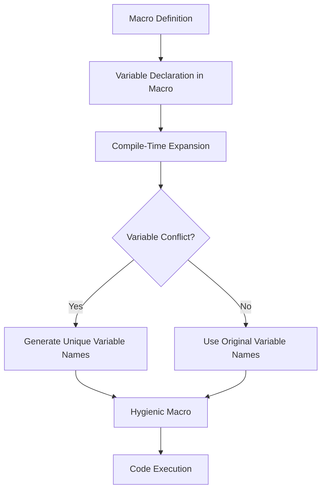

## 19.6. Macro Hygiene and Best Practices

Metaprogramming in Elixir is a powerful tool that allows developers to write code that writes code. This capability is primarily facilitated through the use of macros. While macros can significantly enhance code expressiveness and reduce redundancy, they come with their own set of challenges, particularly concerning macro hygiene. In this section, we will explore the concept of macro hygiene, provide best practices for writing macros, and discuss common pitfalls to avoid.

### Ensuring Clean Code

Macros in Elixir are designed to transform abstract syntax trees (ASTs) at compile time, allowing for dynamic code generation. However, without proper hygiene, macros can inadvertently capture or interfere with variables in the surrounding code, leading to unexpected behavior and difficult-to-debug issues.

#### Using Hygienic Macros

Hygienic macros help prevent unintended side effects by ensuring that variables within a macro do not clash with those in the calling context. Elixir macros are hygienic by default, meaning that they automatically avoid variable capture unless explicitly instructed otherwise. This is achieved through the use of unique variable names during macro expansion.

```elixir
defmodule SafeMacro do
  defmacro hygienic_example do
    quote do
      x = 1
      IO.puts("Inside macro: x = #{x}")
    end
  end
end

defmodule Test do
  require SafeMacro

  def run do
    x = 10
    SafeMacro.hygienic_example()
    IO.puts("Outside macro: x = #{x}")
  end
end

Test.run()
```

In this example, the variable `x` inside the macro does not interfere with the `x` in the `Test` module, demonstrating macro hygiene.

### Best Practices

To write effective and maintainable macros, it is essential to adhere to certain best practices. These practices ensure that macros are clean, understandable, and do not introduce unexpected behaviors.

#### Keeping Macros Simple

1. **Limit Complexity**: Keep macros as simple as possible. Complex logic within macros can lead to difficult debugging and maintenance challenges. Instead, delegate complex logic to functions whenever possible.

2. **Use Functions for Logic**: Place as much logic as possible in regular functions rather than macros. Macros should primarily handle code generation and transformation.

3. **Document Clearly**: Always document macros thoroughly. Include information about the macro's purpose, expected inputs, and any side effects. This documentation is crucial for other developers who might use or maintain the macro.

#### Example of a Simple Macro

```elixir
defmodule LoggerMacro do
  defmacro log_message(message) do
    quote do
      IO.puts("Log: #{unquote(message)}")
    end
  end
end

defmodule Example do
  require LoggerMacro

  def run do
    LoggerMacro.log_message("Hello, World!")
  end
end

Example.run()
```

This macro is straightforward and well-documented, making it easy to understand and use.

### Avoiding Common Pitfalls

While macros are powerful, they can also introduce complexity and maintenance challenges if not used judiciously. Here are some common pitfalls to avoid:

#### Not Overusing Macros

1. **Avoid Macros for Everything**: Do not use macros for tasks that can be accomplished with functions. Macros should be reserved for scenarios where compile-time code generation is necessary.

2. **Consider Readability**: Overusing macros can make code harder to read and understand. Prioritize readability and maintainability over clever macro usage.

3. **Evaluate Necessity**: Before writing a macro, evaluate whether it is truly necessary. Often, the same functionality can be achieved with functions, which are easier to test and debug.

#### Keeping Code Maintainable

1. **Test Extensively**: Ensure that macros are thoroughly tested. Since macros operate at compile time, they can introduce subtle bugs that are difficult to diagnose.

2. **Use Macro Expansion**: Utilize the `Macro.expand/2` function to inspect the expanded code of a macro. This can help understand what the macro is doing and identify potential issues.

3. **Avoid Side Effects**: Design macros to be free of side effects. Side effects can lead to unpredictable behavior and make debugging challenging.

### Visualizing Macro Hygiene

To better understand macro hygiene, let's visualize how Elixir handles variable scoping within macros using a flowchart.


```mermaid
flowchart TD
  A[Macro Definition] --> B[Variable Declaration in Macro]
  B --> C[Compile-Time Expansion]
  C --> D{Variable Conflict?}
  D -- Yes --> E[Generate Unique Variable Names]
  D -- No --> F[Use Original Variable Names]
  E --> G[Hygienic Macro]
  F --> G[Hygienic Macro]
  G --> H[Code Execution]
```

**Figure 1: Macro Hygiene Flowchart** - This diagram illustrates the process Elixir uses to ensure macro hygiene by avoiding variable conflicts during compile-time expansion.

### References and Links

For further reading on Elixir macros and metaprogramming, consider these resources:

- [Elixir Official Documentation on Macros](https://elixir-lang.org/getting-started/meta/macros.html)
- [Metaprogramming Elixir Book](https://pragprog.com/titles/cmelixir/metaprogramming-elixir/)
- [Elixir Forum Discussion on Macro Hygiene](https://elixirforum.com/)

### Knowledge Check

To reinforce your understanding of macro hygiene and best practices, consider the following questions:

1. What is macro hygiene, and why is it important in Elixir?
2. How does Elixir ensure that macros are hygienic by default?
3. What are some best practices for writing maintainable macros?
4. Why should you avoid using macros for tasks that can be accomplished with functions?
5. How can you inspect the expanded code of a macro?

### Try It Yourself

Experiment with the code examples provided in this section. Try modifying the `SafeMacro` example to see how variable conflicts are handled. Consider writing your own macros and test them to ensure they adhere to the principles of macro hygiene.

### Embrace the Journey

Remember, mastering macros in Elixir is a journey. As you gain experience, you'll be able to leverage macros to write more expressive and efficient code. Keep experimenting, stay curious, and enjoy the process of learning and growing as a developer.

## Quiz Time!



### What is macro hygiene in Elixir?

- [x] A feature that prevents variable conflicts between macros and surrounding code
- [ ] A method to optimize macro performance
- [ ] A way to document macros
- [ ] A tool for debugging macros

> **Explanation:** Macro hygiene ensures that variables within a macro do not clash with those in the calling context, preventing unintended side effects.

### How does Elixir ensure macros are hygienic by default?

- [x] By generating unique variable names during macro expansion
- [ ] By using a special syntax for macros
- [ ] By requiring explicit variable declarations
- [ ] By limiting the scope of macros

> **Explanation:** Elixir generates unique variable names during macro expansion to avoid conflicts, ensuring macro hygiene.

### What is a best practice for writing maintainable macros?

- [x] Keep macros simple and document them clearly
- [ ] Use macros for all repetitive tasks
- [ ] Avoid using functions within macros
- [ ] Write complex logic directly in macros

> **Explanation:** Keeping macros simple and well-documented ensures they are easy to understand and maintain.

### Why should macros be used sparingly?

- [x] They can make code harder to read and maintain
- [ ] They are slower than functions
- [ ] They are not supported in all Elixir versions
- [ ] They require more memory

> **Explanation:** Overusing macros can lead to code that is difficult to read and maintain, so they should be used sparingly.

### How can you inspect the expanded code of a macro?

- [x] Use the `Macro.expand/2` function
- [ ] Use the `IO.inspect/1` function
- [ ] Use the `Enum.map/2` function
- [ ] Use the `String.split/2` function

> **Explanation:** The `Macro.expand/2` function allows you to inspect the expanded code of a macro, helping you understand its behavior.

### What should be avoided when writing macros?

- [x] Introducing side effects
- [ ] Using functions
- [ ] Documenting the macro
- [ ] Testing the macro

> **Explanation:** Side effects in macros can lead to unpredictable behavior and should be avoided.

### What is a common pitfall when using macros?

- [x] Overusing macros for tasks that can be done with functions
- [ ] Using macros in small projects
- [ ] Writing macros in Elixir scripts
- [ ] Using macros in production code

> **Explanation:** Overusing macros for tasks that can be done with functions can make code harder to maintain.

### What is the primary purpose of a macro?

- [x] To transform code at compile time
- [ ] To execute code at runtime
- [ ] To optimize code performance
- [ ] To replace functions

> **Explanation:** Macros are used to transform code at compile time, enabling dynamic code generation.

### True or False: Macros are always necessary for metaprogramming in Elixir.

- [ ] True
- [x] False

> **Explanation:** While macros are a powerful tool for metaprogramming, they are not always necessary. Many tasks can be accomplished using functions.

### What should you do before writing a macro?

- [x] Evaluate if the task can be accomplished with a function
- [ ] Write the macro without testing
- [ ] Use macros for all code transformations
- [ ] Avoid documenting the macro

> **Explanation:** Before writing a macro, evaluate if the task can be accomplished with a function, as functions are easier to test and debug.


