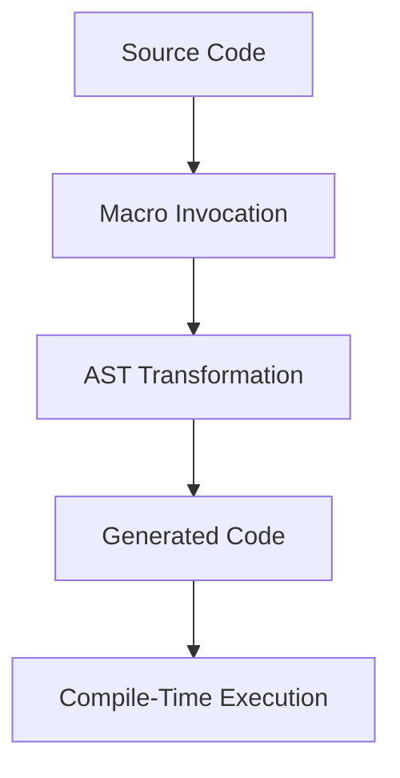

## 19.7. Advanced Macro Techniques

In this section, we delve into the advanced macro techniques in Elixir, a powerful feature that allows developers to write code that writes code. This capability is central to metaprogramming, enabling the creation of domain-specific languages (DSLs), compile-time optimizations, and more. We'll explore metaprogramming patterns, recursive macros, and the use of module attributes for compile-time configurations.

### Metaprogramming Patterns

Metaprogramming in Elixir involves writing code that can transform or generate other code. This is achieved through macros, which operate on the Abstract Syntax Tree (AST) of the code. Let's explore some common patterns used in metaprogramming.

#### Using Macros for Code Transformations

Macros in Elixir are used to transform code at compile time. This allows developers to implement features that would otherwise require runtime evaluation, improving performance and enabling more expressive code.

**Example: Creating a Simple Logger Macro**

```elixir
defmodule LoggerMacro do
  defmacro log(message) do
    quote do
      IO.puts("[LOG] #{unquote(message)}")
    end
  end
end

defmodule MyApp do
  require LoggerMacro

  def run do
    LoggerMacro.log("Application started")
    # Other application logic
  end
end
```

In this example, the `log` macro takes a message and outputs it with a `[LOG]` prefix. The `quote` block captures the code structure, and `unquote` injects the evaluated message into the quoted expression.

**Try It Yourself:**

- Modify the `log` macro to include a timestamp.
- Create a macro that logs messages only if a certain environment variable is set.

### Recursive Macros

Recursive macros are a powerful tool for building complex abstractions. They allow you to define macros that call themselves, enabling the generation of repetitive or nested code structures.

#### Building Powerful Abstractions

Recursive macros can be used to create constructs like state machines, complex data structures, or even entire DSLs.

**Example: Recursive Macro for Nested Data Structures**

```elixir
defmodule NestedData do
  defmacro build_nested(list) do
    quote do
      Enum.reduce(unquote(list), %{}, fn {key, value}, acc ->
        Map.put(acc, key, value)
      end)
    end
  end
end

defmodule MyApp do
  require NestedData

  def run do
    nested_map = NestedData.build_nested([{:a, 1}, {:b, 2}, {:c, 3}])
    IO.inspect(nested_map)
  end
end
```

In this example, the `build_nested` macro recursively constructs a map from a list of key-value tuples. This pattern can be extended to more complex data transformations.

**Try It Yourself:**

- Extend the `build_nested` macro to support nested lists.
- Implement a recursive macro that generates a nested HTML structure.

### Module Attributes and Compile-Time Configurations

Module attributes in Elixir serve multiple purposes, including storing metadata, configuring compile-time options, and defining constants. They are a crucial part of advanced macro techniques.

#### Using `@attributes` for Compile-Time Customization

Module attributes can be leveraged to customize behavior at compile time, providing flexibility and efficiency.

**Example: Compile-Time Configuration with Module Attributes**

```elixir
defmodule Configurable do
  @default_timeout 5000

  defmacro with_timeout(timeout \\ @default_timeout) do
    quote do
      Process.sleep(unquote(timeout))
    end
  end
end

defmodule MyApp do
  require Configurable

  def run do
    Configurable.with_timeout(3000)
    IO.puts("Operation completed with custom timeout")
  end
end
```

Here, the `with_timeout` macro uses a module attribute to define a default timeout, which can be overridden at compile time. This pattern is useful for setting default configurations that can be adjusted as needed.

**Try It Yourself:**

- Create a macro that uses module attributes to configure logging levels.
- Implement a compile-time feature toggle using module attributes.

### Visualizing Macro Transformations

To better understand how macros transform code, let's visualize the process using a flowchart.



**Diagram Description:**

- **Source Code:** The original code written by the developer.
- **Macro Invocation:** The point where the macro is called.
- **AST Transformation:** The macro transforms the code into an Abstract Syntax Tree.
- **Generated Code:** The transformed code that results from the macro.
- **Compile-Time Execution:** The final code is executed at compile time.

### Key Considerations and Best Practices

When using advanced macro techniques, it's important to consider the following:

- **Readability:** Macros can make code harder to read. Ensure that the benefits of using macros outweigh the potential loss of clarity.
- **Debugging:** Debugging macros can be challenging. Use tools like `Macro.expand/2` to inspect macro expansions.
- **Performance:** While macros can improve performance by shifting work to compile time, they can also introduce complexity. Use them judiciously.
- **Hygiene:** Ensure that macros do not unintentionally capture variables from the surrounding context. Use `var!` to manage variable scope.

### Elixir Unique Features

Elixir's macro system is built on top of the Erlang VM, providing unique features such as:

- **Hygienic Macros:** Elixir macros are hygienic by default, preventing accidental variable capture.
- **AST Manipulation:** Direct manipulation of the AST allows for powerful code transformations.
- **Integration with Erlang:** Elixir macros can seamlessly interact with Erlang code, leveraging the strengths of both languages.

### Differences and Similarities

Macros in Elixir are similar to those in Lisp-like languages, but with added features like hygiene and seamless integration with the Erlang ecosystem. Unlike C preprocessor macros, Elixir macros operate on the AST, providing more control and safety.

### Knowledge Check

- **What are the benefits of using macros for code transformations?**
- **How can recursive macros be used to build complex abstractions?**
- **What role do module attributes play in compile-time configurations?**

### Embrace the Journey

Remember, mastering advanced macro techniques in Elixir is a journey. As you explore these concepts, you'll unlock new possibilities for writing expressive, efficient, and maintainable code. Keep experimenting, stay curious, and enjoy the process!

## Quiz: Advanced Macro Techniques



### What is a primary benefit of using macros in Elixir?

- [x] Code transformation at compile time
- [ ] Runtime performance improvement
- [ ] Simplifying syntax errors
- [ ] Reducing code size

> **Explanation:** Macros allow for code transformation at compile time, enabling more expressive and efficient code.

### How do recursive macros enhance code abstraction?

- [x] By allowing nested or repetitive code generation
- [ ] By improving runtime performance
- [ ] By simplifying error handling
- [ ] By reducing memory usage

> **Explanation:** Recursive macros enable the generation of nested or repetitive code structures, enhancing abstraction.

### What is the purpose of module attributes in Elixir?

- [x] Storing metadata and configuring compile-time options
- [ ] Improving runtime performance
- [ ] Simplifying syntax
- [ ] Reducing code size

> **Explanation:** Module attributes are used for storing metadata and configuring compile-time options.

### How can you inspect macro expansions in Elixir?

- [x] Using `Macro.expand/2`
- [ ] Using `IO.inspect/2`
- [ ] Using `Enum.map/2`
- [ ] Using `List.flatten/1`

> **Explanation:** `Macro.expand/2` is used to inspect macro expansions in Elixir.

### What is a key feature of Elixir macros?

- [x] Hygienic by default
- [ ] Faster runtime execution
- [ ] Simplified syntax
- [ ] Reduced memory usage

> **Explanation:** Elixir macros are hygienic by default, preventing accidental variable capture.

### How can module attributes be used in macros?

- [x] For compile-time customization
- [ ] For runtime performance improvement
- [ ] For syntax simplification
- [ ] For reducing code size

> **Explanation:** Module attributes can be used for compile-time customization in macros.

### What is a potential drawback of using macros?

- [x] Reduced code readability
- [ ] Improved runtime performance
- [ ] Simplified error handling
- [ ] Increased memory usage

> **Explanation:** Macros can reduce code readability, making it harder to understand the code.

### What tool can help debug macros in Elixir?

- [x] `Macro.expand/2`
- [ ] `IO.inspect/2`
- [ ] `Enum.map/2`
- [ ] `List.flatten/1`

> **Explanation:** `Macro.expand/2` helps in debugging macros by inspecting their expansions.

### What is a unique feature of Elixir's macro system?

- [x] Integration with Erlang
- [ ] Faster runtime execution
- [ ] Simplified syntax
- [ ] Reduced memory usage

> **Explanation:** Elixir's macro system integrates seamlessly with Erlang, leveraging the strengths of both languages.

### True or False: Elixir macros operate on the Abstract Syntax Tree (AST).

- [x] True
- [ ] False

> **Explanation:** Elixir macros operate on the AST, allowing for powerful code transformations.


