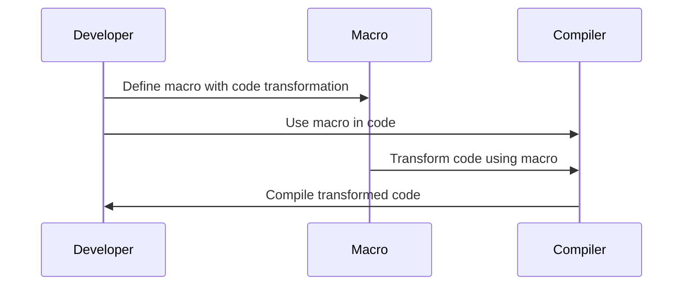
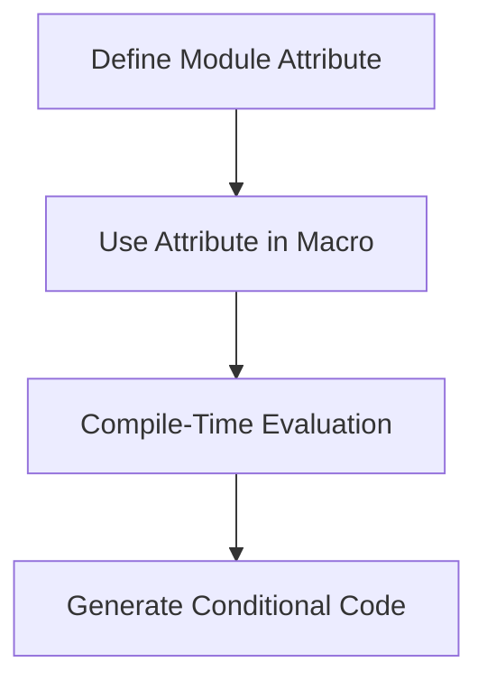

## 19.7. Advanced Macro Techniques

Metaprogramming in Elixir allows developers to write code that writes code, offering powerful capabilities for abstraction and code transformation. In this section, we delve into advanced macro techniques, focusing on metaprogramming patterns, recursive macros, and compile-time configurations using module attributes. By mastering these techniques, you can create more expressive and efficient Elixir applications.

### Metaprogramming Patterns

Metaprogramming in Elixir is primarily achieved through macros, which are constructs that allow you to transform and generate code during compilation. This section explores how to use macros for code transformations effectively.

#### Using Macros for Code Transformations

Macros in Elixir enable you to manipulate the Abstract Syntax Tree (AST) directly. This allows you to implement code transformations that can simplify complex patterns or introduce new language constructs.

**Example: Creating a Custom Control Structure**

Let's create a macro that introduces a custom control structure for logging. This macro will automatically log the entry and exit of a block of code.

```elixir
defmodule LoggerMacro do
  defmacro log_block(do: block) do
    quote do
      IO.puts("Entering block")
      result = unquote(block)
      IO.puts("Exiting block")
      result
    end
  end
end

# Usage
require LoggerMacro

LoggerMacro.log_block do
  IO.puts("Inside block")
  :ok
end
```

**Explanation:**

- The `log_block` macro takes a block of code as an argument.
- It uses the `quote` construct to generate code that logs messages before and after executing the block.
- The `unquote` function is used to insert the original block of code into the generated code.

#### Visualizing Code Transformation

To better understand how macros transform code, let's visualize the process:


```mermaid
sequenceDiagram
    participant Developer
    participant Macro
    participant Compiler
    Developer->>Macro: Define macro with code transformation
    Developer->>Compiler: Use macro in code
    Macro->>Compiler: Transform code using macro
    Compiler->>Developer: Compile transformed code
```

**Caption:** This diagram illustrates the interaction between the developer, macro, and compiler during code transformation.

### Recursive Macros

Recursive macros allow you to build powerful abstractions by enabling macros to call themselves. This technique is useful for generating repetitive code patterns or implementing domain-specific languages (DSLs).

#### Building Powerful Abstractions

Consider a scenario where you need to generate a series of functions that perform similar operations. Recursive macros can simplify this task by automating the generation process.

**Example: Generating Getter Functions**

Suppose we want to generate getter functions for a list of attributes in a module. We can use a recursive macro to achieve this.

```elixir
defmodule GetterMacro do
  defmacro generate_getters(attrs) do
    Enum.map(attrs, fn attr ->
      quote do
        def unquote(:"get_#{attr}")(), do: unquote(attr)
      end
    end)
  end
end

# Usage
defmodule User do
  require GetterMacro
  GetterMacro.generate_getters([:name, :age, :email])
end

# This will generate:
# def get_name(), do: :name
# def get_age(), do: :age
# def get_email(), do: :email
```

**Explanation:**

- The `generate_getters` macro takes a list of attributes and generates getter functions for each attribute.
- `Enum.map` is used to iterate over the list of attributes, and `quote` is used to generate the function definitions.
- `unquote` is used to dynamically insert the attribute names into the function names and bodies.

#### Recursive Macros in Action

Recursive macros can also be used to implement more complex patterns, such as nested data structures or tree-like constructs.

**Example: Building a Nested Data Structure**

```elixir
defmodule TreeMacro do
  defmacro build_tree(data) do
    case data do
      {key, value} when is_list(value) ->
        quote do
          %{unquote(key) => unquote(build_tree(value))}
        end

      {key, value} ->
        quote do
          %{unquote(key) => unquote(value)}
        end
    end
  end
end

# Usage
tree = TreeMacro.build_tree({:root, [{:child1, 1}, {:child2, [{:grandchild, 2}]}]})
IO.inspect(tree)
```

**Explanation:**

- The `build_tree` macro recursively processes a nested data structure, generating a nested map.
- It handles both leaf nodes (key-value pairs) and inner nodes (key-list pairs).

### Module Attributes and Compile-Time Configurations

Module attributes in Elixir serve various purposes, including compile-time configurations and metadata storage. They are particularly useful in macros for customizing behavior at compile time.

#### Using `@attributes` for Compile-Time Customization

Module attributes can be used to store configuration values that influence macro behavior during compilation.

**Example: Configurable Logging Level**

Let's create a macro that uses a module attribute to control the logging level.

```elixir
defmodule ConfigurableLogger do
  @log_level :info

  defmacro log(message, level) do
    quote do
      if unquote(level) >= unquote(@log_level) do
        IO.puts(unquote(message))
      end
    end
  end
end

# Usage
require ConfigurableLogger

ConfigurableLogger.log("This is an info message", :info)
ConfigurableLogger.log("This is a debug message", :debug)
```

**Explanation:**

- The `@log_level` attribute is used to set the minimum logging level.
- The `log` macro checks the log level at compile time and only includes the logging code if the message level is greater than or equal to the configured level.

#### Visualizing Compile-Time Configuration

Let's visualize how module attributes influence macro behavior at compile time:


```mermaid
flowchart TD
    A[Define Module Attribute] --> B[Use Attribute in Macro]
    B --> C[Compile-Time Evaluation]
    C --> D[Generate Conditional Code]
```

**Caption:** This diagram shows how module attributes are used in macros to generate conditional code based on compile-time configurations.

### Try It Yourself

Experiment with the code examples provided in this section. Try modifying the macros to add new functionality or change their behavior. For instance, you can:

- Extend the `log_block` macro to include timestamps.
- Modify the `generate_getters` macro to include setter functions.
- Change the `build_tree` macro to support additional data structures.

### Key Takeaways

- **Macros** in Elixir allow you to perform code transformations and introduce new language constructs.
- **Recursive macros** enable powerful abstractions by automating repetitive code patterns.
- **Module attributes** provide a mechanism for compile-time configurations, influencing macro behavior.
- **Experimentation** with macros can lead to more expressive and efficient code.

### References and Further Reading

- [Elixir's Official Documentation on Macros](https://elixir-lang.org/getting-started/meta/macros.html)
- [Metaprogramming Elixir by Chris McCord](https://pragprog.com/titles/cmelixir/metaprogramming-elixir/)
- [Elixir School: Metaprogramming](https://elixirschool.com/en/lessons/advanced/metaprogramming/)

## Quiz Time!



### What is the primary purpose of macros in Elixir?

- [x] To perform code transformations during compilation
- [ ] To execute code at runtime
- [ ] To manage application state
- [ ] To handle concurrency

> **Explanation:** Macros in Elixir are used to transform code during compilation, allowing developers to introduce new language constructs and simplify complex patterns.

### What is a recursive macro used for?

- [x] Building powerful abstractions by calling itself
- [ ] Managing application state
- [ ] Handling errors
- [ ] Executing code at runtime

> **Explanation:** Recursive macros enable powerful abstractions by allowing a macro to call itself, which is useful for generating repetitive code patterns.

### How are module attributes used in macros?

- [x] For compile-time configurations and metadata storage
- [ ] For managing runtime state
- [ ] For handling errors
- [ ] For executing code

> **Explanation:** Module attributes are used in macros for compile-time configurations, allowing developers to customize macro behavior during compilation.

### What does the `quote` function do in a macro?

- [x] It generates code from the given expression
- [ ] It executes the given expression
- [ ] It logs the given expression
- [ ] It handles errors in the given expression

> **Explanation:** The `quote` function in a macro generates code from the given expression, allowing the macro to transform and manipulate the AST.

### What is the role of the `unquote` function in a macro?

- [x] It inserts evaluated expressions into quoted code
- [ ] It executes the quoted code
- [ ] It logs the quoted code
- [ ] It handles errors in the quoted code

> **Explanation:** The `unquote` function inserts evaluated expressions into quoted code, enabling dynamic code generation within macros.

### Which of the following is a benefit of using macros?

- [x] Simplifying repetitive code patterns
- [ ] Managing application state
- [ ] Handling errors
- [ ] Executing code at runtime

> **Explanation:** Macros simplify repetitive code patterns by allowing developers to generate code dynamically during compilation.

### What is the `@log_level` attribute used for in the `ConfigurableLogger` example?

- [x] To set the minimum logging level for the macro
- [ ] To manage runtime state
- [ ] To handle errors
- [ ] To execute code at runtime

> **Explanation:** The `@log_level` attribute is used to set the minimum logging level for the macro, influencing which logging code is included during compilation.

### Which function is used to iterate over a list of attributes in the `generate_getters` macro?

- [x] Enum.map
- [ ] Enum.each
- [ ] Enum.reduce
- [ ] Enum.filter

> **Explanation:** The `Enum.map` function is used to iterate over a list of attributes in the `generate_getters` macro, generating getter functions for each attribute.

### What does the `build_tree` macro generate in the provided example?

- [x] A nested map data structure
- [ ] A list of functions
- [ ] A series of log messages
- [ ] A runtime error handler

> **Explanation:** The `build_tree` macro generates a nested map data structure, processing both leaf nodes and inner nodes recursively.

### True or False: Macros can be used to execute code at runtime.

- [ ] True
- [x] False

> **Explanation:** Macros are used for code transformations during compilation, not for executing code at runtime.



Remember, this is just the beginning. As you progress, you'll build more complex and interactive Elixir applications. Keep experimenting, stay curious, and enjoy the journey!
