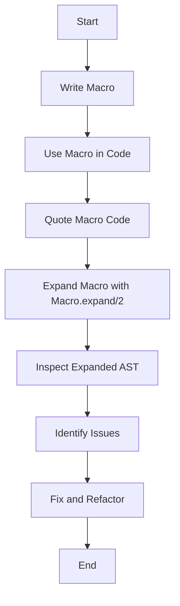

## 19.8. Debugging Macros

In the realm of Elixir, macros are powerful tools that allow developers to extend the language and perform metaprogramming. However, with great power comes the potential for complex bugs and errors that can be challenging to debug. This section will guide you through the process of debugging macros in Elixir, focusing on macro expansion, using IEx helpers, and identifying common errors in macro definitions.

### Introduction to Macros

Before diving into debugging, let's briefly revisit what macros are. Macros in Elixir are a way to write code that writes code. They allow you to transform abstract syntax trees (AST) at compile time, enabling you to create domain-specific languages (DSLs) and perform code generation.

### Macro Expansion

Macro expansion is the process of transforming macro calls into their expanded forms. Understanding how macros expand is crucial for debugging because it reveals what the macro actually does at compile time.

#### Using `Macro.expand/2`

The `Macro.expand/2` function is a powerful tool for understanding macro behavior. It takes two arguments: the AST of the macro call and the environment. This function returns the expanded form of the macro, allowing you to see the code that will be executed.

Here's a simple example to illustrate macro expansion:

```elixir
defmodule MyMacros do
  defmacro say_hello(name) do
    quote do
      IO.puts("Hello, #{unquote(name)}!")
    end
  end
end

# Usage
defmodule Example do
  require MyMacros
  MyMacros.say_hello("World")
end
```

To see the expanded form of the `say_hello` macro, you can use `Macro.expand/2` in an IEx session:

```elixir
iex> require MyMacros
iex> ast = quote do: MyMacros.say_hello("World")
iex> expanded_ast = Macro.expand(ast, __ENV__)
iex> IO.inspect(expanded_ast)
```

This will output the expanded AST, showing you the actual code that will be executed.

### Using IEx Helpers

IEx, the interactive Elixir shell, provides several helpers that can assist in debugging macros. These tools allow you to inspect and understand the behavior of your macros.

#### IEx.Helpers.h/1

The `IEx.Helpers.h/1` function provides documentation for modules and functions. While it doesn't directly help with macro debugging, it can be useful for understanding the context in which a macro is used.

```elixir
iex> h MyMacros.say_hello
```

This command will display the documentation for the `say_hello` macro, helping you understand its intended use.

#### IEx.Helpers.i/1

The `IEx.Helpers.i/1` function provides detailed information about a given data type or variable. While not specific to macros, it can be useful for inspecting the values that are passed to or returned from macros.

```elixir
iex> name = "World"
iex> i name
```

This command will display information about the `name` variable, including its type and value.

### Common Errors in Macros

Debugging macros often involves identifying and fixing common errors. Here are some typical issues you might encounter:

#### Unintended Code Execution

Macros can inadvertently execute code at compile time if not carefully constructed. Ensure that any code within a macro is properly quoted and unquoted only when necessary.

#### Incorrect Quoting

Improper use of `quote` and `unquote` can lead to unexpected behavior. Always ensure that you are quoting the correct parts of your macro and unquoting only when you need to inject values.

#### Variable Hygiene

Macros can introduce variable conflicts if not properly managed. Use the `var!` construct to ensure variable hygiene and avoid conflicts with variables in the calling context.

#### Example of a Common Error

Consider the following macro that attempts to define a function:

```elixir
defmodule MyMacros do
  defmacro def_hello do
    quote do
      def hello do
        IO.puts("Hello, world!")
      end
    end
  end
end

defmodule Example do
  require MyMacros
  MyMacros.def_hello()
end
```

If you try to call `Example.hello()`, you might encounter an error if the macro was not properly expanded or if there was a conflict with existing functions.

### Debugging Techniques

Here are some techniques to help you debug macros effectively:

#### Step-by-Step Expansion

Use `Macro.expand/2` to expand your macros step by step. This allows you to see each transformation and identify where things might be going wrong.

#### Inspecting ASTs

Use `IO.inspect/1` to print out the ASTs at various points in your macro. This can help you understand how your macro is transforming the code.

#### Testing in Isolation

Test your macros in isolation before integrating them into larger projects. This helps you identify issues early and ensures that your macros behave as expected.

### Visualizing Macro Expansion

To better understand macro expansion, let's visualize the process using a flowchart. This diagram illustrates the steps involved in expanding a macro:



This flowchart provides a high-level overview of the macro expansion process, helping you visualize the steps involved in debugging macros.

### Try It Yourself

To solidify your understanding of macro debugging, try modifying the `say_hello` macro to include a customizable greeting. Experiment with different inputs and observe how the macro expands.

### References and Further Reading

For more information on macros and debugging in Elixir, consider exploring the following resources:

- [Elixir Official Documentation](https://elixir-lang.org/docs.html)
- [Metaprogramming Elixir by Chris McCord](https://pragprog.com/titles/cmelixir/metaprogramming-elixir/)
- [Elixir Forum](https://elixirforum.com/)

### Knowledge Check

To reinforce your understanding, consider the following questions:

- What is the purpose of `Macro.expand/2`?
- How can `IEx.Helpers.h/1` assist in debugging macros?
- What are some common errors encountered when writing macros?

### Embrace the Journey

Debugging macros can be challenging, but with practice and the right tools, you'll become proficient in identifying and resolving issues. Remember, this is just the beginning. As you progress, you'll build more complex macros and gain a deeper understanding of Elixir's metaprogramming capabilities. Keep experimenting, stay curious, and enjoy the journey!

## Quiz: Debugging Macros



### What is the primary purpose of `Macro.expand/2` in Elixir?

- [x] To transform macro calls into their expanded forms.
- [ ] To execute macros at runtime.
- [ ] To compile Elixir code.
- [ ] To document macros.

> **Explanation:** `Macro.expand/2` is used to transform macro calls into their expanded forms, allowing developers to see the code that will be executed.

### Which IEx helper provides documentation for modules and functions?

- [x] `IEx.Helpers.h/1`
- [ ] `IEx.Helpers.i/1`
- [ ] `IEx.Helpers.t/1`
- [ ] `IEx.Helpers.d/1`

> **Explanation:** `IEx.Helpers.h/1` provides documentation for modules and functions, helping developers understand their usage.

### What common error can occur if macros are not properly quoted?

- [x] Unintended code execution.
- [ ] Syntax errors.
- [ ] Compilation failures.
- [ ] Runtime exceptions.

> **Explanation:** Improper quoting can lead to unintended code execution, as macros may execute code at compile time if not carefully constructed.

### How can you ensure variable hygiene in macros?

- [x] Use the `var!` construct.
- [ ] Avoid using variables.
- [ ] Use global variables.
- [ ] Use local variables only.

> **Explanation:** The `var!` construct ensures variable hygiene by avoiding conflicts with variables in the calling context.

### What is a recommended technique for debugging macros?

- [x] Step-by-step expansion using `Macro.expand/2`.
- [ ] Directly executing macros.
- [ ] Ignoring errors.
- [ ] Using global variables.

> **Explanation:** Step-by-step expansion using `Macro.expand/2` helps identify where things might be going wrong in macro transformations.

### Which tool can be used to inspect the values passed to or returned from macros?

- [x] `IEx.Helpers.i/1`
- [ ] `IEx.Helpers.h/1`
- [ ] `IEx.Helpers.t/1`
- [ ] `IEx.Helpers.d/1`

> **Explanation:** `IEx.Helpers.i/1` provides detailed information about a given data type or variable, useful for inspecting values in macros.

### What is the role of `quote` in macros?

- [x] To create an abstract syntax tree (AST) for code.
- [ ] To execute code at runtime.
- [ ] To document macros.
- [ ] To compile Elixir code.

> **Explanation:** `quote` is used to create an abstract syntax tree (AST) for code, allowing macros to manipulate code structures.

### What should you do if you encounter a variable conflict in a macro?

- [x] Use the `var!` construct to ensure variable hygiene.
- [ ] Ignore the conflict.
- [ ] Use global variables.
- [ ] Use local variables only.

> **Explanation:** Using the `var!` construct ensures variable hygiene and avoids conflicts with variables in the calling context.

### What is a common pitfall when writing macros?

- [x] Incorrect quoting and unquoting.
- [ ] Using too many functions.
- [ ] Writing too much documentation.
- [ ] Avoiding variable usage.

> **Explanation:** Incorrect quoting and unquoting can lead to unexpected behavior in macros, as they may not transform code as intended.

### True or False: Macros in Elixir are executed at runtime.

- [ ] True
- [x] False

> **Explanation:** Macros in Elixir are executed at compile time, not runtime. They transform code before it is compiled.


