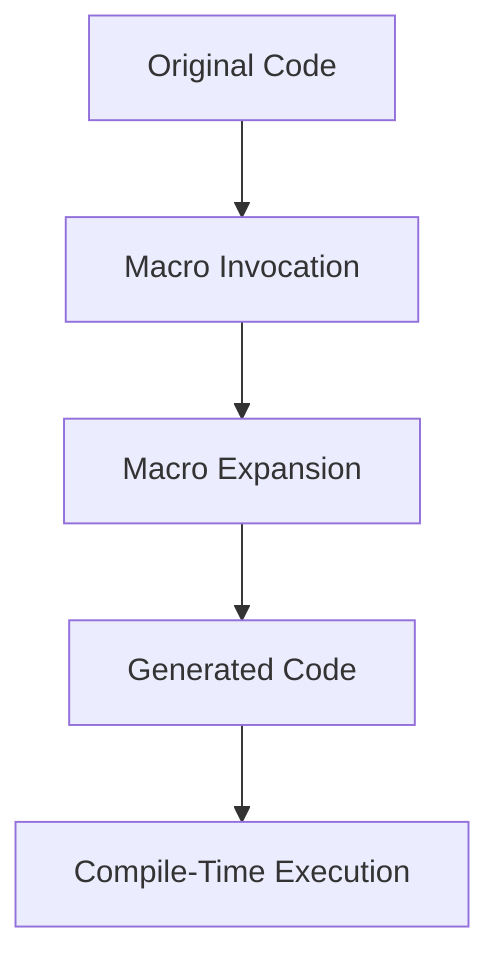

## 19.8. Debugging Macros

Macros in Elixir are powerful tools that allow developers to manipulate code as data, enabling compile-time code generation and transformation. However, with great power comes the potential for complex bugs and errors that can be difficult to diagnose. In this section, we will explore techniques for debugging macros, including macro expansion, using IEx helpers, and identifying common errors. By mastering these techniques, you can enhance your metaprogramming skills and write more robust Elixir code.

### Macro Expansion

Macro expansion is a crucial step in understanding how macros work. It allows you to see the code that a macro generates, helping you identify potential issues and understand the macro's behavior.

#### Using `Macro.expand/2`

The `Macro.expand/2` function is an essential tool for macro expansion. It takes an abstract syntax tree (AST) and an environment, returning the expanded form of the macro.

```elixir
defmodule MyMacro do
  defmacro my_macro do
    quote do
      IO.puts("Hello from macro!")
    end
  end
end

defmodule Example do
  require MyMacro

  def test_macro do
    MyMacro.my_macro()
  end
end

# Expanding the macro
expanded = Macro.expand(quote(do: MyMacro.my_macro()), __ENV__)
IO.inspect(expanded)
```

In this example, `Macro.expand/2` is used to reveal the code generated by `my_macro`. This can help you verify that the macro behaves as expected.

#### Visualizing Macro Expansion

To better understand macro expansion, let's visualize the process using a flowchart.


```mermaid
flowchart TD
    A[Original Code] --> B[Macro Invocation]
    B --> C[Macro Expansion]
    C --> D[Generated Code]
    D --> E[Compile-Time Execution]
```

**Figure 1**: The process of macro expansion from invocation to compile-time execution.

### Using IEx Helpers

Interactive Elixir (IEx) provides several helpers that can assist in debugging macros. These tools allow you to inspect and understand macro behavior interactively.

#### `IEx.Helpers.h/1`

The `h/1` helper in IEx is used to display documentation for a given module or function. This can be particularly useful for understanding the intended use and behavior of macros.

```elixir
iex> h MyMacro.my_macro
```

This command will show the documentation for `my_macro`, helping you understand its purpose and usage.

#### `IEx.Helpers.i/1`

The `i/1` helper provides detailed information about a value, including its type, size, and memory usage. While not specific to macros, it can be useful for inspecting the results of macro expansion.

```elixir
iex> result = MyMacro.my_macro()
iex> i result
```

This command will display detailed information about the result of the macro invocation.

### Common Errors

Debugging macros often involves identifying and fixing common errors. Understanding these errors can help you write more robust macros and avoid potential pitfalls.

#### Syntax Errors

Syntax errors in macros can occur when the quoted code is not syntactically correct. These errors can be challenging to diagnose because they occur at compile time.

```elixir
defmacro faulty_macro do
  quote do
    IO.puts("Missing end"
  end
end
```

In this example, the missing `end` keyword will cause a syntax error. Using `Macro.expand/2` can help you identify such issues.

#### Hygiene Issues

Hygiene issues arise when macros inadvertently capture or interfere with variables in the caller's context. Elixir's macro system is designed to prevent these issues, but they can still occur in complex macros.

```elixir
defmacro unhygienic_macro do
  quote do
    var = 42
  end
end
```

In this example, the variable `var` may conflict with a variable in the caller's context. Using `Macro.var/2` can help you avoid such conflicts by creating unique variable names.

### Design Considerations

When designing macros, it's essential to consider their impact on code readability and maintainability. Overusing macros can lead to complex and hard-to-debug code. Here are some best practices to keep in mind:

- **Use macros sparingly**: Only use macros when necessary, such as when you need compile-time code generation or transformation.
- **Document macros thoroughly**: Provide clear documentation and examples to help other developers understand how to use your macros.
- **Test macros extensively**: Write tests to verify that your macros behave as expected in various scenarios.

### Elixir Unique Features

Elixir's macro system is built on top of the Erlang Abstract Format, allowing for powerful code transformations. Elixir's emphasis on immutability and functional programming makes its macro system unique compared to other languages.

- **Hygienic Macros**: Elixir's macros are hygienic by default, meaning they avoid variable capture and conflicts.
- **Quote and Unquote**: The `quote` and `unquote` mechanisms provide a flexible way to manipulate code as data.

### Differences and Similarities

Macros in Elixir are similar to those in other Lisp-like languages, such as Clojure, in that they allow for code manipulation at compile time. However, Elixir's macros are designed to work seamlessly with its functional programming paradigm and immutable data structures.

### Try It Yourself

To deepen your understanding of macro debugging, try the following exercises:

1. **Modify the `MyMacro` example** to include a variable in the quoted code. Use `Macro.var/2` to ensure hygiene.
2. **Create a macro** that generates a function with a dynamic name. Use `Macro.expand/2` to verify the generated code.
3. **Experiment with `IEx` helpers** to inspect the results of macro invocations and understand their behavior.

### Knowledge Check

- **What is macro expansion, and why is it important?**
- **How can `Macro.expand/2` help in debugging macros?**
- **What are some common errors in macro definitions?**
- **How do hygienic macros prevent variable capture?**
- **What tools does IEx provide for debugging macros?**

### Embrace the Journey

Debugging macros can be challenging, but it's also an opportunity to deepen your understanding of Elixir's metaprogramming capabilities. Remember, this is just the beginning. As you progress, you'll build more complex and powerful macros. Keep experimenting, stay curious, and enjoy the journey!

## Quiz Time!



### What is the primary purpose of macro expansion in Elixir?

- [x] To understand the code generated by a macro
- [ ] To execute a macro at runtime
- [ ] To optimize macros for performance
- [ ] To convert macros into functions

> **Explanation:** Macro expansion allows you to see the code generated by a macro, helping you understand its behavior and identify potential issues.

### Which function is used for macro expansion in Elixir?

- [x] `Macro.expand/2`
- [ ] `Macro.expand_once/2`
- [ ] `Macro.to_string/1`
- [ ] `Macro.escape/1`

> **Explanation:** `Macro.expand/2` is used to expand macros, revealing the code they generate.

### What is the role of `IEx.Helpers.h/1` in debugging macros?

- [x] To display documentation for a macro
- [ ] To expand a macro
- [ ] To execute a macro
- [ ] To inspect the result of a macro

> **Explanation:** `IEx.Helpers.h/1` displays documentation for a macro, helping you understand its purpose and usage.

### How can hygiene issues in macros be avoided?

- [x] By using `Macro.var/2` to create unique variable names
- [ ] By avoiding the use of variables in macros
- [ ] By using `quote` without `unquote`
- [ ] By expanding macros at runtime

> **Explanation:** `Macro.var/2` helps create unique variable names, avoiding conflicts with variables in the caller's context.

### What is a common cause of syntax errors in macros?

- [x] Incorrectly quoted code
- [ ] Using too many variables
- [ ] Expanding macros at runtime
- [ ] Using `unquote` incorrectly

> **Explanation:** Syntax errors often occur when the quoted code is not syntactically correct.

### Which IEx helper provides detailed information about a value?

- [x] `IEx.Helpers.i/1`
- [ ] `IEx.Helpers.h/1`
- [ ] `IEx.Helpers.r/1`
- [ ] `IEx.Helpers.v/1`

> **Explanation:** `IEx.Helpers.i/1` provides detailed information about a value, including its type and memory usage.

### What is a key feature of Elixir's macro system?

- [x] Hygienic macros
- [ ] Runtime code generation
- [ ] Variable capture
- [ ] Dynamic typing

> **Explanation:** Elixir's macros are hygienic, meaning they avoid variable capture and conflicts.

### How can you verify the code generated by a macro?

- [x] By using `Macro.expand/2`
- [ ] By executing the macro at runtime
- [ ] By reading the macro's documentation
- [ ] By using `IEx.Helpers.h/1`

> **Explanation:** `Macro.expand/2` reveals the code generated by a macro, allowing you to verify its behavior.

### What is the benefit of using macros sparingly?

- [x] Improved code readability and maintainability
- [ ] Faster execution at runtime
- [ ] Easier variable capture
- [ ] More dynamic code generation

> **Explanation:** Using macros sparingly helps maintain code readability and prevent complexity.

### True or False: Elixir macros are similar to those in Clojure.

- [x] True
- [ ] False

> **Explanation:** Elixir macros are similar to those in other Lisp-like languages, such as Clojure, in that they allow for code manipulation at compile time.


