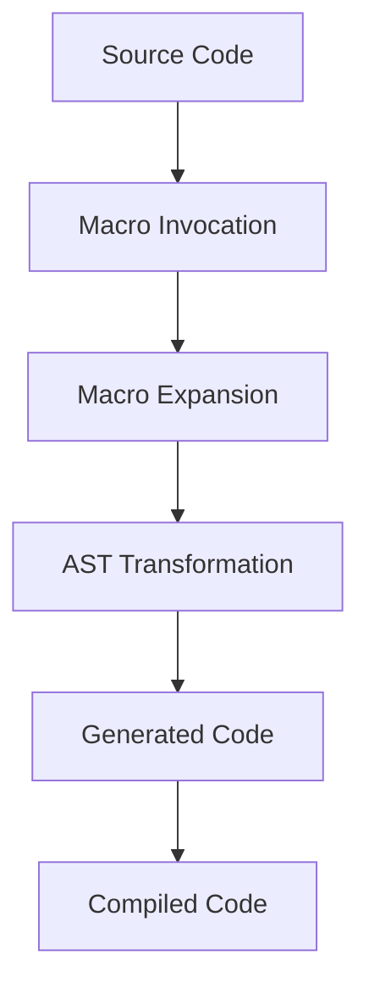

## 19.9. Practical Applications of Metaprogramming

Metaprogramming in Elixir is a powerful technique that allows developers to write code that can generate and manipulate other code. This capability is particularly useful for automating repetitive tasks, creating domain-specific languages (DSLs), and enhancing the flexibility and expressiveness of your codebase. In this section, we will delve into the practical applications of metaprogramming in Elixir, focusing on code generation, template engines, and annotations.

### Understanding Metaprogramming

Before we dive into practical applications, let's briefly revisit what metaprogramming is. Metaprogramming refers to the practice of writing programs that can read, generate, analyze, or transform other programs, and even modify themselves while running. In Elixir, this is primarily achieved through macros, which allow you to inject code at compile time.

#### Key Concepts

- **Macros**: Functions that receive code as input and return code as output. They are executed at compile time, allowing you to manipulate the abstract syntax tree (AST) of your program.
- **Abstract Syntax Tree (AST)**: A tree representation of the abstract syntactic structure of source code. Each node in the tree denotes a construct occurring in the source code.
- **Compile-Time Code Generation**: The process of generating code during the compilation phase, which can lead to more efficient and optimized runtime performance.

### Code Generation

One of the most common applications of metaprogramming is code generation. This involves writing macros that automate the creation of boilerplate code, reducing redundancy and potential errors.

#### Automating Repetitive Code Tasks

Imagine you have a set of similar functions that perform operations on different data types. Instead of writing each function manually, you can use macros to generate them automatically.

```elixir
defmodule MathOperations do
  defmacro generate_operations(operations) do
    Enum.map(operations, fn {name, op} ->
      quote do
        def unquote(name)(a, b) do
          a unquote(op) b
        end
      end
    end)
  end
end

defmodule Calculator do
  require MathOperations

  MathOperations.generate_operations([
    {:add, :+},
    {:subtract, :-},
    {:multiply, :*},
    {:divide, :/}
  ])
end

IO.puts Calculator.add(1, 2) # Output: 3
IO.puts Calculator.subtract(5, 3) # Output: 2
```

In this example, the `generate_operations` macro takes a list of operations and generates corresponding functions for each operation. This approach not only saves time but also ensures consistency across similar functions.

#### Try It Yourself

Experiment with the code above by adding more operations or modifying existing ones. For instance, try adding a modulus operation or changing the implementation of an existing function.

### Template Engines

Metaprogramming can also be used to create custom template engines. Template engines are used to generate text output based on templates and data models. They are commonly used in web development for rendering HTML pages.

#### Building Custom Templating Solutions

Let's create a simple template engine using macros. This engine will allow us to define templates with placeholders that can be replaced with actual data at runtime.

```elixir
defmodule SimpleTemplate do
  defmacro deftemplate(name, template) do
    quote do
      def unquote(name)(bindings) do
        unquote(template)
        |> String.replace(~r/\{\{(\w+)\}\}/, fn _, key ->
          Map.get(bindings, String.to_atom(key), "")
        end)
      end
    end
  end
end

defmodule MyTemplates do
  require SimpleTemplate

  SimpleTemplate.deftemplate :greeting, "Hello, {{name}}!"
end

IO.puts MyTemplates.greeting(%{name: "Alice"}) # Output: Hello, Alice!
```

In this example, the `deftemplate` macro defines a function that takes a map of bindings and replaces placeholders in the template with corresponding values from the map.

#### Try It Yourself

Modify the template to include additional placeholders, or create new templates with different structures. Experiment with different data types in the bindings map.

### Annotation and Reflection

Annotations and reflection are powerful tools in metaprogramming that allow you to add metadata to your code and inspect it at runtime.

#### Adding Metadata to Functions and Modules

Annotations can be used to add metadata to functions and modules, which can then be accessed and used at runtime. This is particularly useful for implementing features like logging, validation, or access control.

```elixir
defmodule Annotated do
  defmacro annotate(metadata) do
    quote do
      Module.put_attribute(__MODULE__, :annotations, unquote(metadata))
    end
  end

  defmacro defannotated(name, do: block) do
    quote do
      def unquote(name)() do
        IO.inspect Module.get_attribute(__MODULE__, :annotations)
        unquote(block)
      end
    end
  end
end

defmodule MyModule do
  require Annotated

  Annotated.annotate(author: "John Doe", version: "1.0")

  Annotated.defannotated :my_function do
    IO.puts "Executing my_function"
  end
end

MyModule.my_function()
```

In this example, the `annotate` macro adds metadata to the module, and the `defannotated` macro defines a function that prints the metadata before executing its body.

#### Try It Yourself

Add more metadata to the annotations or create additional annotated functions. Consider how you might use annotations for logging or access control in a real-world application.

### Visualizing Metaprogramming Concepts

To better understand the flow of metaprogramming in Elixir, let's visualize the process of macro expansion and code generation.



**Diagram Description:** This diagram illustrates the process of metaprogramming in Elixir. The source code invokes a macro, which expands into an abstract syntax tree (AST). The AST is transformed into generated code, which is then compiled into executable code.

### References and Further Reading

- [Elixir Lang - Metaprogramming](https://elixir-lang.org/getting-started/meta/macros.html)
- [Programming Elixir ≥ 1.6](https://pragprog.com/titles/elixir16/programming-elixir-1-6/)
- [Metaprogramming Elixir: Write Less Code, Get More Done (and Have Fun!)](https://pragprog.com/titles/cmelixir/metaprogramming-elixir/)

### Knowledge Check

- What are the benefits of using metaprogramming in Elixir?
- How can macros be used to automate repetitive code tasks?
- What is the role of the abstract syntax tree (AST) in metaprogramming?
- How can annotations be used to add metadata to functions and modules?

### Embrace the Journey

Remember, metaprogramming is a powerful tool that can greatly enhance the flexibility and expressiveness of your code. As you experiment with macros and explore their potential, you'll discover new ways to streamline your development process and create more dynamic applications. Keep experimenting, stay curious, and enjoy the journey!

## Quiz: Practical Applications of Metaprogramming



### What is a primary benefit of using metaprogramming in Elixir?

- [x] Automating repetitive code tasks
- [ ] Increasing runtime performance
- [ ] Simplifying syntax errors
- [ ] Enhancing security features

> **Explanation:** Metaprogramming allows for the automation of repetitive code tasks, reducing redundancy and potential errors.

### How does the `deftemplate` macro work in the provided example?

- [x] It defines a function that replaces placeholders with actual data.
- [ ] It compiles templates into binary code.
- [ ] It generates HTML templates from JSON data.
- [ ] It creates a new module for each template.

> **Explanation:** The `deftemplate` macro defines a function that takes a map of bindings and replaces placeholders in the template with corresponding values.

### What is the purpose of the `annotate` macro in the example?

- [x] To add metadata to a module
- [ ] To create a new function
- [ ] To optimize code execution
- [ ] To handle errors

> **Explanation:** The `annotate` macro adds metadata to a module, which can be accessed and used at runtime.

### In metaprogramming, what does AST stand for?

- [x] Abstract Syntax Tree
- [ ] Automated Syntax Transformation
- [ ] Advanced Scripting Technique
- [ ] Application State Transfer

> **Explanation:** AST stands for Abstract Syntax Tree, which is a tree representation of the abstract syntactic structure of source code.

### Which of the following is a practical application of metaprogramming?

- [x] Code generation
- [ ] Memory management
- [ ] Network communication
- [ ] User interface design

> **Explanation:** Code generation is a practical application of metaprogramming, allowing for the automation of repetitive code tasks.

### What does the `quote` keyword do in Elixir macros?

- [x] It captures code as data.
- [ ] It executes code immediately.
- [ ] It logs code execution.
- [ ] It encrypts code for security.

> **Explanation:** The `quote` keyword captures code as data, allowing it to be manipulated within a macro.

### How can annotations be used in a real-world application?

- [x] For logging or access control
- [ ] For memory optimization
- [ ] For network configuration
- [ ] For user interface styling

> **Explanation:** Annotations can be used for logging or access control by adding metadata to functions and modules.

### What is the role of macros in metaprogramming?

- [x] To manipulate code at compile time
- [ ] To execute code at runtime
- [ ] To handle user input
- [ ] To manage memory allocation

> **Explanation:** Macros manipulate code at compile time, allowing for code generation and transformation.

### What is a key advantage of using template engines?

- [x] They allow for dynamic content generation.
- [ ] They improve network speed.
- [ ] They enhance database security.
- [ ] They simplify user authentication.

> **Explanation:** Template engines allow for dynamic content generation by replacing placeholders with actual data.

### True or False: Metaprogramming can be used to create domain-specific languages (DSLs).

- [x] True
- [ ] False

> **Explanation:** True. Metaprogramming can be used to create domain-specific languages (DSLs), enhancing the expressiveness of your code.


