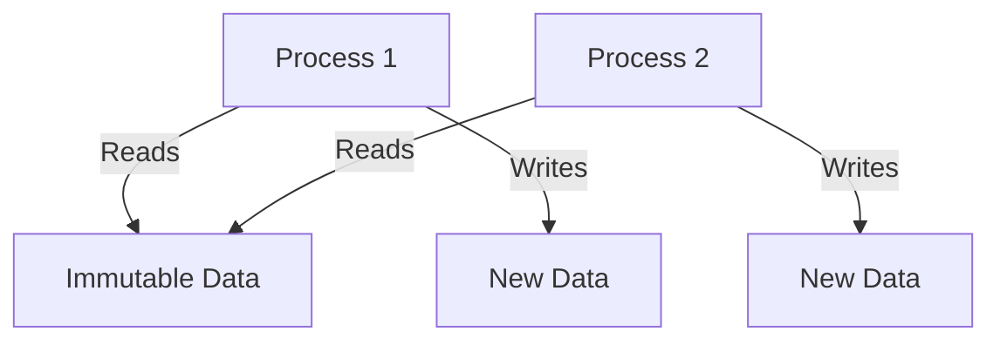
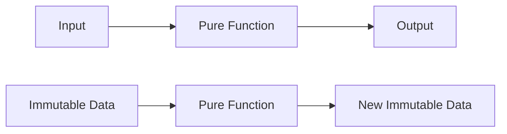

## 2.1. Immutability and Pure Functions

In the realm of functional programming, two foundational concepts stand out: immutability and pure functions. These principles are not only central to Elixir but also pivotal in crafting robust, maintainable, and scalable applications. In this section, we will delve into the intricacies of these concepts, explore their benefits, and provide practical guidance on their application in Elixir.

### Understanding Immutability

Immutability refers to the inability to change data after it has been created. In Elixir, data structures are immutable by default. This characteristic is a cornerstone of functional programming, offering numerous advantages, particularly in concurrent and parallel computations.

#### How Immutable Data Structures Prevent Unintended Side Effects

Immutable data structures ensure that once a value is assigned, it cannot be altered. This prevents unintended side effects, which are changes in state that occur outside the local environment of a function. By eliminating side effects, immutability enhances predictability and reliability in code.

Consider the following Elixir example:

```elixir
# Define an immutable list
original_list = [1, 2, 3]

# Attempt to modify the list
new_list = List.replace_at(original_list, 1, 4)

IO.inspect(original_list) # Output: [1, 2, 3]
IO.inspect(new_list)      # Output: [1, 4, 3]
```

In this example, `original_list` remains unchanged, demonstrating immutability. The `List.replace_at/3` function returns a new list with the desired modification, leaving the original list intact.

#### The Impact on Concurrent and Parallel Computations

Immutability is particularly beneficial in concurrent and parallel computations. Since immutable data cannot be altered, there is no risk of race conditions or data corruption when multiple processes access the same data simultaneously. This leads to safer and more efficient concurrent programming.

**Visualizing Immutability in Concurrent Systems**



In the diagram above, multiple processes read from the same immutable data without interference. Any modifications result in new data structures, ensuring thread safety.

### Pure Functions

Pure functions are another fundamental concept in functional programming. A pure function is one that, given the same input, will always produce the same output and has no side effects.

#### Definition and Characteristics of Pure Functions

Pure functions adhere to the following characteristics:

- **Deterministic**: The output is solely determined by the input values.
- **No Side Effects**: They do not alter any external state or interact with the outside world (e.g., no I/O operations).

Here's an example of a pure function in Elixir:

```elixir
# Define a pure function
defmodule Math do
  def add(a, b) do
    a + b
  end
end

IO.inspect(Math.add(2, 3)) # Output: 5
```

The `add/2` function is pure because it consistently returns the same result for the same inputs and does not modify any external state.

#### Advantages in Testing and Reasoning About Code

Pure functions simplify testing and reasoning about code. Since they are deterministic and free of side effects, they can be tested in isolation, leading to more straightforward and reliable unit tests.

```elixir
# Example test for a pure function
defmodule MathTest do
  use ExUnit.Case

  test "addition of two numbers" do
    assert Math.add(2, 3) == 5
  end
end
```

This test is simple and effective because the `add/2` function's behavior is predictable and consistent.

### Practical Applications

Understanding and applying immutability and pure functions can significantly enhance the quality of your Elixir applications. Let's explore how to write side-effect-free functions and manage necessary side effects.

#### Writing Side-Effect-Free Functions

To write side-effect-free functions, focus on ensuring that your functions do not alter any external state or perform I/O operations. Instead, return new data structures or values.

```elixir
# Side-effect-free function example
defmodule StringManipulator do
  def reverse_and_upcase(string) do
    string
    |> String.reverse()
    |> String.upcase()
  end
end

IO.inspect(StringManipulator.reverse_and_upcase("hello")) # Output: "OLLEH"
```

In this example, the `reverse_and_upcase/1` function transforms the input string without altering any external state.

#### Strategies for Dealing with Necessary Side Effects

While pure functions are ideal, some side effects are unavoidable, such as reading from or writing to a database. In such cases, consider the following strategies:

- **Isolate Side Effects**: Encapsulate side effects in specific modules or functions, keeping the rest of your codebase pure.
- **Use Monads or Contexts**: Employ constructs like monads or contexts to manage side effects in a controlled manner.
- **Leverage Elixir's Concurrency**: Use processes to handle side effects asynchronously, minimizing their impact on the main application logic.

```elixir
# Example of isolating side effects
defmodule FileHandler do
  def read_file(file_path) do
    case File.read(file_path) do
      {:ok, content} -> {:ok, process_content(content)}
      {:error, reason} -> {:error, reason}
    end
  end

  defp process_content(content) do
    # Pure function to process file content
    String.split(content, "\n")
  end
end
```

In this example, `read_file/1` handles the side effect of reading a file, while `process_content/1` remains pure.

### Visualizing Pure Functions and Immutability



This diagram illustrates the flow of data through pure functions and the creation of new immutable data structures.

### References and Links

- [Elixir's Official Documentation](https://elixir-lang.org/docs.html)
- [Functional Programming Concepts](https://www.manning.com/books/functional-programming-in-elixir)
- [Concurrency in Elixir](https://pragprog.com/titles/elixir16/programming-elixir-1-6/)

### Knowledge Check

- Why is immutability important in concurrent programming?
- How do pure functions simplify testing?
- What strategies can be used to manage side effects in Elixir?

### Embrace the Journey

Remember, mastering immutability and pure functions is just the beginning. As you progress, you'll build more complex and reliable Elixir applications. Keep experimenting, stay curious, and enjoy the journey!

### Quiz: Immutability and Pure Functions



### What is a key benefit of immutability in Elixir?

- [x] Prevents unintended side effects
- [ ] Increases memory usage
- [ ] Decreases code readability
- [ ] Slows down execution

> **Explanation:** Immutability prevents unintended side effects by ensuring data cannot be altered once created.

### Which of the following is a characteristic of pure functions?

- [x] No side effects
- [ ] Alters external state
- [ ] Depends on global variables
- [ ] Produces different outputs for the same inputs

> **Explanation:** Pure functions have no side effects and produce the same output for the same inputs.

### How does immutability benefit concurrent programming?

- [x] Eliminates race conditions
- [ ] Increases complexity
- [ ] Requires more synchronization
- [ ] Reduces performance

> **Explanation:** Immutability eliminates race conditions by ensuring data cannot be altered, making concurrent programming safer.

### What is a strategy for managing side effects in Elixir?

- [x] Isolate side effects in specific modules
- [ ] Use global variables
- [ ] Avoid using processes
- [ ] Perform side effects in every function

> **Explanation:** Isolating side effects in specific modules helps manage them effectively while keeping the rest of the codebase pure.

### Which of the following is NOT a characteristic of pure functions?

- [ ] Deterministic
- [x] Alters external state
- [ ] No side effects
- [ ] Consistent output for the same input

> **Explanation:** Pure functions do not alter external state; they are deterministic and have no side effects.

### What is the impact of immutability on memory usage?

- [ ] Decreases memory usage
- [x] May increase memory usage
- [ ] Has no impact on memory usage
- [ ] Reduces memory allocation

> **Explanation:** Immutability may increase memory usage as new data structures are created instead of modifying existing ones.

### How can pure functions improve code testing?

- [x] By making tests more predictable
- [ ] By increasing test complexity
- [ ] By requiring more test cases
- [ ] By making tests less reliable

> **Explanation:** Pure functions make tests more predictable because they consistently produce the same output for the same input.

### What is a common misconception about pure functions?

- [ ] They have no side effects
- [ ] They are deterministic
- [x] They can alter global state
- [ ] They produce consistent outputs

> **Explanation:** A common misconception is that pure functions can alter global state, but they do not.

### Which Elixir feature helps manage side effects asynchronously?

- [x] Processes
- [ ] Atoms
- [ ] Tuples
- [ ] Strings

> **Explanation:** Processes in Elixir help manage side effects asynchronously, minimizing their impact on the main application logic.

### True or False: Immutability is only beneficial in functional programming.

- [ ] True
- [x] False

> **Explanation:** Immutability is beneficial in various programming paradigms, not just functional programming, as it enhances predictability and safety.




