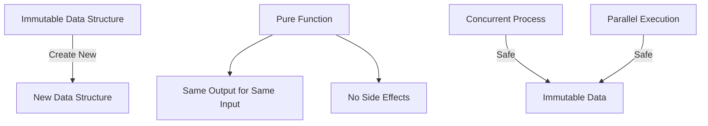

## 2.1. Immutability and Pure Functions

In this section, we delve into two foundational principles of functional programming in Elixir: **immutability** and **pure functions**. These concepts are not only central to Elixir's design but also play a crucial role in building robust, scalable, and maintainable applications. Let's explore these concepts, understand their significance, and see how they can be applied effectively in your Elixir projects.

### Understanding Immutability

Immutability is a core tenet of functional programming, and Elixir embraces it wholeheartedly. In simple terms, immutability means that once a data structure is created, it cannot be changed. Instead of modifying existing data, new data structures are created with the desired changes.

#### How Immutable Data Structures Prevent Unintended Side Effects

In traditional object-oriented programming, mutable state can lead to unintended side effects, especially in concurrent environments. Consider the following:

- **Shared State**: When multiple threads or processes access and modify the same data, it can lead to race conditions and unpredictable behavior.
- **Side Effects**: Functions that modify global state or external variables can produce side effects, making them difficult to understand and test.

**Immutability** eliminates these issues by ensuring that data cannot be altered after it is created. This leads to more predictable and reliable code.

#### The Impact on Concurrent and Parallel Computations

Elixir is built on the Erlang VM, which is designed for highly concurrent systems. Immutability plays a vital role in this architecture:

- **Concurrency**: Immutable data structures allow processes to run concurrently without worrying about data corruption. Each process can work with its own copy of data, ensuring isolation and safety.
- **Parallelism**: Immutability enables safe parallel execution of code. Since data cannot change, operations can be performed in parallel without synchronization overhead.

Let's look at a simple example to illustrate immutability in Elixir:

```elixir
# Define an immutable list
list = [1, 2, 3]

# Attempt to modify the list
new_list = [0 | list]

IO.inspect(list)     # Output: [1, 2, 3]
IO.inspect(new_list) # Output: [0, 1, 2, 3]
```

In this example, the original `list` remains unchanged, and a new list `new_list` is created with the additional element.

### Pure Functions

Pure functions are another cornerstone of functional programming. A pure function is a function that:

1. **Produces the same output for the same input**: Given the same arguments, a pure function will always return the same result.
2. **Has no side effects**: Pure functions do not modify any external state or variables.

#### Definition and Characteristics of Pure Functions

Pure functions are deterministic and side-effect-free. They are easier to understand, test, and reason about because they operate solely on their inputs and produce outputs without altering the state of the system.

Here’s a simple example of a pure function in Elixir:

```elixir
defmodule Math do
  # A pure function that adds two numbers
  def add(a, b) do
    a + b
  end
end

IO.inspect(Math.add(2, 3)) # Output: 5
```

This function `add/2` is pure because it always returns the same result for the same inputs and does not affect any external state.

#### Advantages in Testing and Reasoning About Code

Pure functions offer several advantages:

- **Ease of Testing**: Since pure functions do not depend on or modify external state, they can be tested in isolation.
- **Predictability**: Pure functions behave consistently, making it easier to predict their behavior and reason about the code.
- **Composability**: Pure functions can be composed together to build more complex functionality without introducing side effects.

### Practical Applications

Now that we understand the concepts of immutability and pure functions, let's explore how they can be applied in practice.

#### Writing Side-Effect-Free Functions

To write side-effect-free functions, follow these guidelines:

- **Avoid Global State**: Do not rely on or modify global variables within your functions.
- **Use Function Arguments**: Pass all necessary data as arguments to your functions.
- **Return New Data**: Instead of modifying existing data, return new data structures with the desired changes.

Here's an example of a side-effect-free function that processes a list of numbers:

```elixir
defmodule ListProcessor do
  # A pure function that doubles each element in a list
  def double_elements(list) do
    Enum.map(list, fn x -> x * 2 end)
  end
end

original_list = [1, 2, 3]
doubled_list = ListProcessor.double_elements(original_list)

IO.inspect(original_list)  # Output: [1, 2, 3]
IO.inspect(doubled_list)   # Output: [2, 4, 6]
```

In this example, `double_elements/1` is a pure function that returns a new list with each element doubled, leaving the original list unchanged.

#### Strategies for Dealing with Necessary Side Effects

In real-world applications, side effects are sometimes unavoidable, such as when performing IO operations or interacting with external systems. Here are some strategies to handle them:

- **Isolate Side Effects**: Keep side effects at the boundaries of your system. Use pure functions for core logic and confine side effects to specific modules or functions.
- **Use Monads or Effect Systems**: In some languages, monads or effect systems are used to manage side effects. While Elixir does not have built-in support for monads, you can use similar patterns to encapsulate side effects.
- **Leverage OTP**: Use Elixir's OTP (Open Telecom Platform) to manage processes and side effects in a structured way.

Here's an example of isolating side effects using a separate module:

```elixir
defmodule FileHandler do
  # Function to read a file and return its contents
  def read_file(path) do
    case File.read(path) do
      {:ok, content} -> {:ok, process_content(content)}
      {:error, reason} -> {:error, reason}
    end
  end

  # A pure function to process file content
  defp process_content(content) do
    String.upcase(content)
  end
end

# Attempt to read and process a file
result = FileHandler.read_file("example.txt")
IO.inspect(result)
```

In this example, `read_file/1` handles the side effect of reading a file, while `process_content/1` is a pure function that processes the content.

### Visualizing Immutability and Pure Functions

To better understand the concepts of immutability and pure functions, let's visualize them using a diagram:


```mermaid
flowchart TD
  A[Immutable Data Structure] -->|Create New| B[New Data Structure]
  C[Pure Function] --> D[Same Output for Same Input]
  C --> E[No Side Effects]
  F[Concurrent Process] -->|Safe| G[Immutable Data]
  H[Parallel Execution] -->|Safe| G
```

**Diagram Description**: This diagram illustrates how immutable data structures lead to the creation of new data structures, ensuring safe concurrent and parallel execution. It also highlights the characteristics of pure functions, which produce the same output for the same input and have no side effects.

### References and Links

For further reading on immutability and pure functions, consider the following resources:

- [Elixir Official Documentation](https://elixir-lang.org/docs.html)
- [Functional Programming Concepts](https://www.manning.com/books/functional-programming-in-elixir)
- [Erlang and Elixir for Imperative Programmers](https://pragprog.com/titles/elixir16/elixir-for-programmers/)

### Knowledge Check

Before we conclude, let's test your understanding with a few questions:

1. What is immutability, and why is it important in Elixir?
2. How do pure functions differ from impure functions?
3. What are some strategies for dealing with side effects in Elixir?
4. Why are pure functions easier to test than impure functions?
5. How does immutability benefit concurrent and parallel computations?

### Embrace the Journey

Remember, mastering immutability and pure functions is just the beginning of your journey in functional programming with Elixir. These principles will help you build more reliable and maintainable applications. Keep experimenting, stay curious, and enjoy the process of learning and applying these concepts in your projects!

## Quiz Time!



### What is immutability in the context of Elixir?

- [x] Data structures cannot be changed after they are created.
- [ ] Data structures can be changed at any time.
- [ ] Functions can modify global variables.
- [ ] Processes share mutable state.

> **Explanation:** Immutability means that once a data structure is created, it cannot be changed. This is a core concept in functional programming and Elixir.

### Which of the following is a characteristic of a pure function?

- [x] Produces the same output for the same input.
- [ ] Modifies global state.
- [ ] Depends on external variables.
- [ ] Has side effects.

> **Explanation:** A pure function always produces the same output for the same input and has no side effects, making it easier to test and reason about.

### How does immutability benefit concurrent computations?

- [x] It prevents data corruption by ensuring data isolation.
- [ ] It allows shared mutable state between processes.
- [ ] It requires complex synchronization mechanisms.
- [ ] It increases the risk of race conditions.

> **Explanation:** Immutability ensures that data cannot be changed, allowing processes to run concurrently without data corruption or race conditions.

### What is a common strategy for handling side effects in Elixir?

- [x] Isolate side effects at the boundaries of the system.
- [ ] Use global variables to manage side effects.
- [ ] Avoid using pure functions.
- [ ] Allow side effects in core logic.

> **Explanation:** Side effects should be isolated at the boundaries of the system, keeping the core logic pure and side-effect-free.

### Why are pure functions easier to test?

- [x] They do not depend on or modify external state.
- [ ] They require complex setup and teardown.
- [ ] They can modify global variables.
- [ ] They produce different outputs for the same input.

> **Explanation:** Pure functions do not depend on or modify external state, making them easier to test in isolation.

### Which of the following is NOT a benefit of pure functions?

- [x] They modify external state.
- [ ] They are easier to reason about.
- [ ] They are composable.
- [ ] They are predictable.

> **Explanation:** Pure functions do not modify external state, which is one of their key benefits.

### What is a pure function's relationship with side effects?

- [x] Pure functions have no side effects.
- [ ] Pure functions always have side effects.
- [ ] Pure functions depend on side effects.
- [ ] Pure functions modify external state.

> **Explanation:** Pure functions have no side effects, meaning they do not modify external state or depend on it.

### How can you ensure a function is pure?

- [x] Avoid using or modifying global variables.
- [ ] Rely on external state for computations.
- [ ] Use side effects to change function behavior.
- [ ] Allow the function to modify its input.

> **Explanation:** To ensure a function is pure, avoid using or modifying global variables and ensure it does not have side effects.

### What is a key advantage of immutability in Elixir?

- [x] It allows safe concurrent and parallel execution.
- [ ] It requires complex locking mechanisms.
- [ ] It encourages shared mutable state.
- [ ] It leads to unpredictable code behavior.

> **Explanation:** Immutability allows safe concurrent and parallel execution by ensuring data cannot be changed, eliminating the need for complex locking mechanisms.

### True or False: Immutability and pure functions are only relevant in Elixir.

- [ ] True
- [x] False

> **Explanation:** Immutability and pure functions are fundamental concepts in functional programming and are relevant in many programming languages, not just Elixir.



By mastering immutability and pure functions, you're well on your way to becoming an expert in functional programming with Elixir. Keep exploring these concepts, and you'll unlock the full potential of Elixir's powerful concurrency model and functional paradigm.
