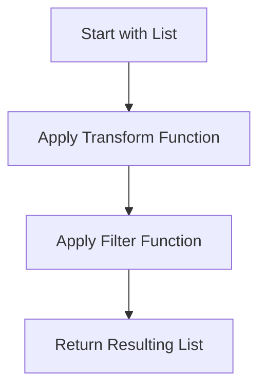

## 2.2. First-Class and Higher-Order Functions

In the realm of functional programming, the concepts of first-class and higher-order functions are fundamental. They empower developers to write more flexible, reusable, and composable code. In Elixir, these concepts are not only supported but are integral to the language's design. Let's delve into these concepts and explore how they can be effectively utilized in Elixir.

### Functions as First-Class Citizens

In Elixir, functions are first-class citizens. This means functions can be treated like any other data type. They can be passed as arguments to other functions, returned as values from functions, and stored in variables or data structures. This capability is a cornerstone of functional programming, enabling powerful abstractions and code reuse.

#### Passing Functions as Arguments

One of the most common uses of first-class functions is passing them as arguments to other functions. This allows for dynamic behavior and customization of function execution.

```elixir
defmodule Math do
  def apply_operation(a, b, operation) do
    operation.(a, b)
  end
end

# Usage
add = fn a, b -> a + b end
subtract = fn a, b -> a - b end

IO.puts Math.apply_operation(5, 3, add)      # Output: 8
IO.puts Math.apply_operation(5, 3, subtract) # Output: 2
```

In this example, `apply_operation/3` takes a function `operation` as an argument, which allows us to pass different operations like addition or subtraction.

#### Returning Functions from Other Functions

Elixir also allows functions to return other functions. This is useful for creating function factories or closures that capture the environment in which they were created.

```elixir
defmodule Greeter do
  def greet(name) do
    fn -> "Hello, #{name}!" end
  end
end

# Usage
greeting = Greeter.greet("Alice")
IO.puts greeting.() # Output: Hello, Alice!
```

Here, `greet/1` returns a function that, when called, will greet the specified name. This demonstrates how functions can capture and use variables from their defining scope.

#### Storing Functions in Variables and Data Structures

Functions can be stored in variables or even in data structures like lists or maps, allowing for dynamic and flexible code execution.

```elixir
operations = [
  add: fn a, b -> a + b end,
  multiply: fn a, b -> a * b end
]

IO.puts operations[:add].(2, 3)       # Output: 5
IO.puts operations[:multiply].(2, 3)  # Output: 6
```

This example shows how functions can be stored in a map and accessed dynamically, providing a flexible way to manage different operations.

### Higher-Order Functions

Higher-order functions are functions that take other functions as arguments or return them as results. They are a powerful abstraction tool in functional programming, enabling the creation of more generic and reusable code.

#### Common Higher-Order Functions in Elixir

Elixir's standard library provides a rich set of higher-order functions, particularly in the `Enum` and `Stream` modules. These functions allow for elegant and expressive data manipulation.

- **`Enum.map/2`**: Applies a given function to each element of a collection, returning a new collection with the results.

  ```elixir
  Enum.map([1, 2, 3], fn x -> x * 2 end) # Output: [2, 4, 6]
  ```

- **`Enum.reduce/3`**: Reduces a collection to a single value by iteratively applying a function to an accumulator and each element.

  ```elixir
  Enum.reduce([1, 2, 3], 0, fn x, acc -> x + acc end) # Output: 6
  ```

- **`Enum.filter/2`**: Filters elements of a collection based on a predicate function.

  ```elixir
  Enum.filter([1, 2, 3, 4], fn x -> rem(x, 2) == 0 end) # Output: [2, 4]
  ```

These functions demonstrate how higher-order functions can simplify common data processing tasks.

#### Creating Custom Higher-Order Functions

Creating your own higher-order functions can lead to more reusable and composable code. Let's explore how to design such functions.

##### Designing Reusable and Composable Functions

When designing higher-order functions, aim for reusability and composability. This means creating functions that can be easily combined with others to form more complex operations.

```elixir
defmodule ListUtils do
  def transform_and_filter(list, transform, filter) do
    list
    |> Enum.map(transform)
    |> Enum.filter(filter)
  end
end

# Usage
transform = fn x -> x * 2 end
filter = fn x -> x > 5 end

IO.inspect ListUtils.transform_and_filter([1, 2, 3, 4], transform, filter) # Output: [6, 8]
```

In this example, `transform_and_filter/3` is a higher-order function that takes two functions as arguments, allowing for flexible transformation and filtering of a list.

##### Examples and Best Practices

When creating higher-order functions, consider the following best practices:

- **Keep functions small and focused**: Each function should do one thing well, making it easier to test and reuse.
- **Use descriptive names**: Clearly name your functions and parameters to convey their purpose and usage.
- **Document your functions**: Provide clear documentation and examples to help others understand how to use your functions.

### Visualizing Higher-Order Functions

To better understand how higher-order functions work, let's visualize the process of applying a higher-order function to a list.



This diagram illustrates the flow of data through a higher-order function that transforms and filters a list. Each step represents a function application, showcasing the composability of higher-order functions.

### References and Links

For further reading on first-class and higher-order functions, consider the following resources:

- [Elixir Official Documentation](https://elixir-lang.org/docs.html)
- [Functional Programming Concepts](https://www.manning.com/books/functional-programming-in-elixir)
- [Higher-Order Functions in Programming](https://en.wikipedia.org/wiki/Higher-order_function)

### Knowledge Check

To reinforce your understanding of first-class and higher-order functions, consider the following questions:

1. What are the benefits of treating functions as first-class citizens?
2. How can higher-order functions improve code reusability?
3. What are some common higher-order functions in Elixir's standard library?
4. How can you create a custom higher-order function in Elixir?

### Embrace the Journey

Remember, mastering first-class and higher-order functions is a journey. As you continue to explore these concepts, you'll discover new ways to write more expressive and efficient code. Keep experimenting, stay curious, and enjoy the journey!

### Quiz: First-Class and Higher-Order Functions



### What is a first-class function?

- [x] A function that can be treated like any other data type
- [ ] A function that is always executed first
- [ ] A function that cannot be passed as an argument
- [ ] A function that is only used in object-oriented programming

> **Explanation:** First-class functions can be passed as arguments, returned from other functions, and assigned to variables.

### Which of the following is a higher-order function in Elixir?

- [x] `Enum.map/2`
- [ ] `IO.puts/1`
- [ ] `Kernel.+/2`
- [ ] `String.length/1`

> **Explanation:** `Enum.map/2` is a higher-order function because it takes a function as an argument.

### What does `Enum.reduce/3` do?

- [x] It reduces a collection to a single value using a function
- [ ] It maps a function over a collection
- [ ] It filters elements from a collection
- [ ] It sorts a collection

> **Explanation:** `Enum.reduce/3` iteratively applies a function to an accumulator and each element of a collection.

### How can you store a function in a variable in Elixir?

- [x] By assigning it to a variable using the `fn` keyword
- [ ] By using the `def` keyword
- [ ] By using the `let` keyword
- [ ] By using the `function` keyword

> **Explanation:** Functions can be assigned to variables using the `fn` keyword in Elixir.

### What is the purpose of a closure?

- [x] To capture and use variables from its defining scope
- [ ] To close a file after reading
- [ ] To terminate a process
- [ ] To create a new process

> **Explanation:** Closures capture variables from their defining scope, allowing them to be used later.

### Which of the following is NOT a characteristic of higher-order functions?

- [ ] They can take other functions as arguments
- [ ] They can return functions as results
- [x] They can only operate on numbers
- [ ] They enable code reuse

> **Explanation:** Higher-order functions are not limited to operating on numbers; they can work with any data type.

### What is the result of `Enum.map([1, 2, 3], fn x -> x * 2 end)`?

- [x] `[2, 4, 6]`
- [ ] `[1, 2, 3]`
- [ ] `[3, 6, 9]`
- [ ] `[0, 1, 2]`

> **Explanation:** `Enum.map/2` applies the function to each element, doubling the values.

### How do higher-order functions contribute to functional programming?

- [x] By enabling more abstract and reusable code
- [ ] By enforcing strict typing
- [ ] By limiting the use of recursion
- [ ] By requiring object-oriented principles

> **Explanation:** Higher-order functions allow for more abstract and reusable code, a key aspect of functional programming.

### What is a common use case for returning a function from another function?

- [x] Creating closures that capture the environment
- [ ] Sorting a list of numbers
- [ ] Printing to the console
- [ ] Reading from a file

> **Explanation:** Returning functions can create closures that capture and use the environment in which they were created.

### True or False: In Elixir, functions cannot be stored in data structures.

- [ ] True
- [x] False

> **Explanation:** Functions can be stored in data structures like lists and maps in Elixir.


