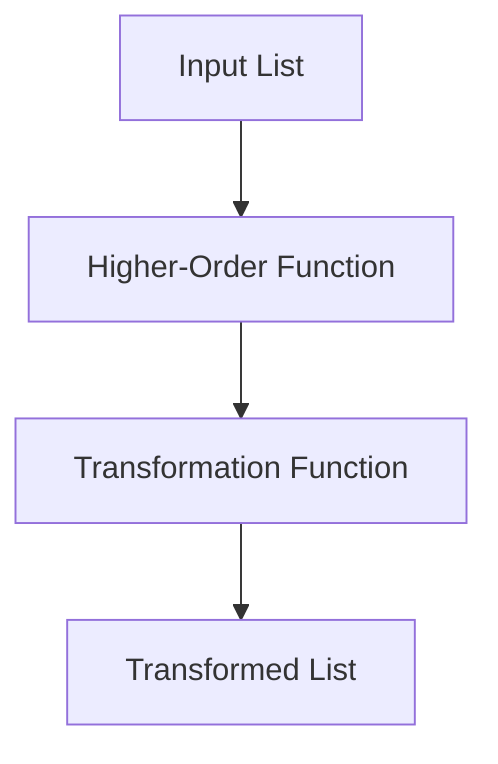

## 2.2. First-Class and Higher-Order Functions

In the realm of functional programming, Elixir stands out with its robust support for first-class and higher-order functions. Understanding these concepts is crucial for harnessing the full power of Elixir to create scalable, maintainable, and efficient applications. In this section, we will delve into the intricacies of first-class and higher-order functions, exploring their definitions, applications, and how they can be utilized to create elegant and reusable code.

### Functions as First-Class Citizens

In Elixir, functions are first-class citizens. This means that functions can be treated like any other data type. They can be passed as arguments to other functions, returned from functions, and stored in variables or data structures. This flexibility allows for a more modular and expressive codebase.

#### Passing Functions as Arguments and Returning Them

One of the most powerful features of first-class functions is their ability to be passed as arguments and returned from other functions. This capability enables a high level of abstraction and reusability.

```elixir
defmodule MathOperations do
  # A function that takes another function as an argument
  def calculate(a, b, operation) do
    operation.(a, b)
  end
end

# Define some basic operations
add = fn a, b -> a + b end
subtract = fn a, b -> a - b end

# Use the calculate function with different operations
IO.puts MathOperations.calculate(5, 3, add)       # Output: 8
IO.puts MathOperations.calculate(5, 3, subtract)  # Output: 2
```

In this example, we define a `calculate/3` function that takes two numbers and a function as arguments. The function is then invoked within `calculate/3`, demonstrating how functions can be passed and executed dynamically.

#### Storing Functions in Variables and Data Structures

Functions in Elixir can also be stored in variables and data structures, allowing for dynamic function execution and flexible code organization.

```elixir
# Store functions in a map
operations = %{
  add: fn a, b -> a + b end,
  subtract: fn a, b -> a - b end
}

# Access and execute the functions
IO.puts operations[:add].(10, 5)        # Output: 15
IO.puts operations[:subtract].(10, 5)   # Output: 5
```

By storing functions in a map, we can easily manage and execute different operations based on dynamic conditions or user input.

### Higher-Order Functions

Higher-order functions are functions that operate on or return other functions. They are a cornerstone of functional programming, enabling powerful abstractions and code reuse.

#### Common Higher-Order Functions in Elixir’s Standard Library

Elixir’s standard library provides a plethora of higher-order functions, particularly in the `Enum` and `Stream` modules. These functions simplify common tasks such as mapping, filtering, and reducing collections.

- **`Enum.map/2`**: Transforms each element in a collection using a provided function.

```elixir
list = [1, 2, 3, 4]
squared = Enum.map(list, fn x -> x * x end)
IO.inspect squared  # Output: [1, 4, 9, 16]
```

- **`Enum.reduce/3`**: Reduces a collection to a single value using an accumulator and a function.

```elixir
sum = Enum.reduce(list, 0, fn x, acc -> x + acc end)
IO.puts sum  # Output: 10
```

These functions exemplify how higher-order functions can simplify and condense code, making it more readable and maintainable.

#### Creating Custom Higher-Order Functions

Creating custom higher-order functions involves designing functions that can accept other functions as arguments or return them as results. This design pattern promotes code reusability and modularity.

##### Designing Reusable and Composable Functions

When designing custom higher-order functions, aim for reusability and composability. This involves creating functions that can be easily combined or extended to perform complex operations.

```elixir
defmodule Transformer do
  # A higher-order function that applies a transformation to each element
  def transform_list(list, transformer) do
    Enum.map(list, transformer)
  end
end

# Define a transformation function
double = fn x -> x * 2 end

# Apply the transformation
result = Transformer.transform_list([1, 2, 3], double)
IO.inspect result  # Output: [2, 4, 6]
```

In this example, `transform_list/2` is a higher-order function that applies a given transformation to each element of a list. The `double` function is passed as an argument, demonstrating how custom higher-order functions can be created and utilized.

##### Examples and Best Practices

When creating higher-order functions, consider the following best practices:

1. **Keep Functions Pure**: Ensure that your functions do not have side effects. This makes them easier to test and reason about.

2. **Use Descriptive Names**: Clearly name your functions and arguments to convey their purpose and usage.

3. **Leverage Pattern Matching**: Use pattern matching to handle different cases and simplify your code.

4. **Document Your Code**: Provide clear documentation and examples for your functions, especially when they involve complex logic or abstractions.

### Visualizing Higher-Order Function Flow

To better understand how higher-order functions work, let's visualize the flow of data through a series of transformations using a flowchart.


```mermaid
flowchart TD
    A[Input List] --> B[Higher-Order Function]
    B --> C[Transformation Function]
    C --> D[Transformed List]
```

In this diagram, the input list is passed to a higher-order function, which applies a transformation function to each element, resulting in a transformed list.

### References and Links

For further reading on first-class and higher-order functions in Elixir, consider exploring the following resources:

- [Elixir's Official Documentation](https://elixir-lang.org/docs.html)
- [Learn You Some Erlang for Great Good!](https://learnyousomeerlang.com/)
- [Functional Programming in Elixir](https://pragprog.com/titles/elixir/functional-programming-in-elixir/)

### Knowledge Check

To reinforce your understanding of first-class and higher-order functions, consider the following questions and exercises:

- **What is a first-class function, and how does it differ from a higher-order function?**
- **Create a custom higher-order function that filters a list based on a given predicate.**
- **Modify the `transform_list/2` function to apply multiple transformations in sequence.**

### Embrace the Journey

Remember, mastering first-class and higher-order functions is a journey. As you continue to explore these concepts, you'll discover new ways to write more efficient and expressive code. Keep experimenting, stay curious, and enjoy the process!

### Quiz Time!



### What is a first-class function in Elixir?

- [x] A function that can be passed as an argument, returned from a function, and assigned to a variable.
- [ ] A function that can only be used within a module.
- [ ] A function that cannot be stored in data structures.
- [ ] A function that must be executed immediately.

> **Explanation:** First-class functions in Elixir can be treated like any other data type, allowing them to be passed as arguments, returned from other functions, and stored in variables or data structures.

### What is a higher-order function?

- [x] A function that takes one or more functions as arguments or returns a function as a result.
- [ ] A function that can only operate on numbers.
- [ ] A function that cannot return a value.
- [ ] A function that is only used for mathematical calculations.

> **Explanation:** Higher-order functions are those that can take other functions as arguments or return them as results, enabling powerful abstractions and code reuse.

### Which of the following is a common higher-order function in Elixir's standard library?

- [x] `Enum.map/2`
- [ ] `IO.puts/2`
- [ ] `String.length/1`
- [ ] `Kernel.if/2`

> **Explanation:** `Enum.map/2` is a higher-order function that applies a given function to each element in a collection, transforming it.

### How can you store a function in a variable?

- [x] By assigning a function to a variable using the `fn` keyword.
- [ ] By using the `store` keyword.
- [ ] By creating a new module.
- [ ] By using a special function storage syntax.

> **Explanation:** In Elixir, you can assign a function to a variable using the `fn` keyword, allowing you to store and later execute the function.

### What is the output of the following code snippet?

```elixir
multiply = fn a, b -> a * b end
result = multiply.(4, 5)
IO.puts result
```

- [x] 20
- [ ] 9
- [ ] 45
- [ ] 15

> **Explanation:** The `multiply` function multiplies its two arguments, so `multiply.(4, 5)` results in 20, which is printed by `IO.puts`.

### What is a key benefit of using higher-order functions?

- [x] They enable code reuse and abstraction.
- [ ] They make code run faster.
- [ ] They simplify variable declarations.
- [ ] They eliminate the need for modules.

> **Explanation:** Higher-order functions allow for code reuse and abstraction by enabling functions to be passed around and composed in flexible ways.

### Which of the following best describes the `Enum.reduce/3` function?

- [x] It reduces a collection to a single value using an accumulator and a function.
- [ ] It duplicates each element in a collection.
- [ ] It filters elements based on a condition.
- [ ] It sorts a collection in ascending order.

> **Explanation:** `Enum.reduce/3` is a higher-order function that reduces a collection to a single value by applying a function to an accumulator and each element.

### How can you create a custom higher-order function in Elixir?

- [x] By defining a function that takes another function as an argument or returns a function.
- [ ] By using the `higher_order` keyword.
- [ ] By importing a special library.
- [ ] By defining a function with no arguments.

> **Explanation:** Custom higher-order functions are created by defining functions that accept other functions as arguments or return functions as results.

### What does the `Enum.map/2` function do?

- [x] Transforms each element in a collection using a provided function.
- [ ] Filters elements based on a condition.
- [ ] Adds elements to a collection.
- [ ] Removes duplicates from a collection.

> **Explanation:** `Enum.map/2` is a higher-order function that applies a given function to each element in a collection, transforming it.

### True or False: In Elixir, functions cannot be stored in data structures.

- [ ] True
- [x] False

> **Explanation:** False. In Elixir, functions can be stored in data structures such as lists, maps, and tuples, allowing for dynamic execution and flexible code organization.


