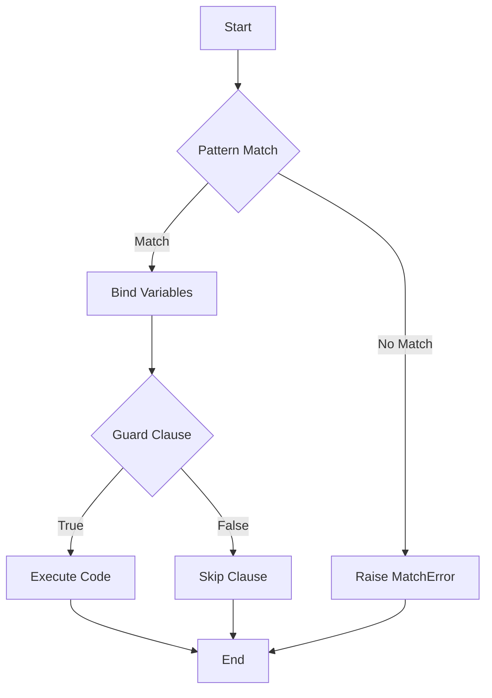

## 2.3. Pattern Matching and Guards

Pattern matching and guards are two of the most powerful features in Elixir, enabling developers to write concise, readable, and expressive code. These features are integral to the functional programming paradigm and are used extensively throughout Elixir applications. In this section, we will delve into the basics of pattern matching, explore the use of guards, and examine advanced techniques to harness the full potential of these features.

### Basics of Pattern Matching

Pattern matching in Elixir is a fundamental concept that allows you to match data structures against patterns. It is not merely a comparison but a way to destructure data and bind variables to values. Let's explore the basics:

#### Matching Against Data Structures

In Elixir, you can match against various data structures such as lists, tuples, and maps. This is often used in variable assignments and function heads.

```elixir
# Matching a tuple
{status, message} = {:ok, "Success"}
IO.puts(status)  # Output: ok
IO.puts(message) # Output: Success

# Matching a list
[first, second | rest] = [1, 2, 3, 4, 5]
IO.puts(first)   # Output: 1
IO.puts(second)  # Output: 2
IO.inspect(rest) # Output: [3, 4, 5]

# Matching a map
%{name: name, age: age} = %{name: "Alice", age: 30}
IO.puts(name)    # Output: Alice
IO.puts(age)     # Output: 30
```

In these examples, pattern matching is used to destructure tuples, lists, and maps, allowing you to extract values easily.

#### Deconstructing Complex Data Types

Pattern matching is particularly useful for deconstructing complex data types, making it easier to work with nested structures.

```elixir
# Nested pattern matching
person = %{name: "Bob", address: %{city: "New York", zip: "10001"}}
%{name: name, address: %{city: city}} = person
IO.puts(name)  # Output: Bob
IO.puts(city)  # Output: New York
```

Here, we match a nested map structure to extract the `name` and `city` fields directly.

### Using Guards

Guards in Elixir provide a way to add conditional logic to pattern matches. They are used to refine matches with additional constraints.

#### Adding Conditional Logic

Guards are expressions that follow the `when` keyword in function definitions, `case`, and `cond` statements. They allow you to specify conditions that must be true for a pattern match to succeed.

```elixir
# Function with guard clauses
defmodule Math do
  def divide(a, b) when b != 0 do
    a / b
  end

  def divide(_, 0) do
    :infinity
  end
end

IO.puts(Math.divide(10, 2))  # Output: 5.0
IO.puts(Math.divide(10, 0))  # Output: infinity
```

In this example, the `divide` function uses a guard to ensure that division by zero is handled gracefully.

#### Guard Expressions and Allowed Functions

Guards support a limited set of expressions and functions. These include:

- Comparison operators: `==`, `!=`, `>`, `<`, `>=`, `<=`
- Boolean operators: `and`, `or`, `not`
- Type-checking functions: `is_integer/1`, `is_float/1`, `is_atom/1`, etc.
- Arithmetic operations: `+`, `-`, `*`, `/`
- Other functions: `length/1`, `hd/1`, `tl/1`, etc.

```elixir
# Using type-checking functions in guards
defmodule Checker do
  def check(value) when is_integer(value) do
    "It's an integer!"
  end

  def check(value) when is_float(value) do
    "It's a float!"
  end

  def check(_) do
    "It's something else!"
  end
end

IO.puts(Checker.check(10))     # Output: It's an integer!
IO.puts(Checker.check(3.14))   # Output: It's a float!
IO.puts(Checker.check("text")) # Output: It's something else!
```

### Advanced Pattern Matching Techniques

Elixir's pattern matching capabilities extend beyond basic usage, offering advanced techniques for more complex scenarios.

#### Utilizing the Pin Operator (`^`)

The pin operator (`^`) is used to match against existing values rather than binding new variables.

```elixir
x = 10
^x = 10  # This will match because x is already bound to 10

# Attempting to match against a different value will cause an error
# ^x = 20  # This will raise a MatchError
```

The pin operator is particularly useful in function clauses and `case` statements where you want to ensure a variable matches a specific value.

#### Pattern Matching in Case Statements

Pattern matching can be used in `case` statements to handle different scenarios based on the structure of the data.

```elixir
defmodule Greeter do
  def greet(person) do
    case person do
      %{name: name, age: age} when age >= 18 ->
        "Hello, #{name}! You are an adult."

      %{name: name, age: age} when age < 18 ->
        "Hi, #{name}! You are a minor."

      _ ->
        "Hello, stranger!"
    end
  end
end

IO.puts(Greeter.greet(%{name: "Alice", age: 20})) # Output: Hello, Alice! You are an adult.
IO.puts(Greeter.greet(%{name: "Bob", age: 15}))   # Output: Hi, Bob! You are a minor.
```

In this example, the `greet` function uses a `case` statement with pattern matching and guards to provide customized greetings based on the person's age.

#### Using `cond` and `with` Constructs

The `cond` construct is similar to a series of `if` statements, but it uses pattern matching to determine which branch to execute.

```elixir
defmodule Temperature do
  def describe(temp) do
    cond do
      temp < 0 -> "Freezing"
      temp < 10 -> "Cold"
      temp < 20 -> "Cool"
      temp < 30 -> "Warm"
      true -> "Hot"
    end
  end
end

IO.puts(Temperature.describe(5))  # Output: Cold
IO.puts(Temperature.describe(25)) # Output: Warm
```

The `with` construct is used for chaining pattern matches and is particularly useful for handling complex workflows.

```elixir
defmodule Workflow do
  def process(data) do
    with {:ok, step1} <- step_one(data),
         {:ok, step2} <- step_two(step1),
         {:ok, result} <- step_three(step2) do
      {:ok, result}
    else
      {:error, reason} -> {:error, reason}
    end
  end

  defp step_one(data), do: {:ok, data + 1}
  defp step_two(data), do: {:ok, data * 2}
  defp step_three(data), do: {:ok, data - 3}
end

IO.inspect(Workflow.process(5)) # Output: {:ok, 9}
```

In this example, the `with` construct is used to chain multiple operations, each returning `{:ok, result}` or `{:error, reason}`. If any step fails, the `else` block handles the error.

### Visualizing Pattern Matching and Guards

To better understand how pattern matching and guards work, let's visualize the flow of a pattern matching operation using a Mermaid.js flowchart.



**Caption:** This flowchart illustrates the process of pattern matching in Elixir, including variable binding and guard clause evaluation.

### References and Links

For further reading on pattern matching and guards in Elixir, consider exploring the following resources:

- [Elixir Official Documentation on Pattern Matching](https://elixir-lang.org/getting-started/pattern-matching.html)
- [Elixir Official Documentation on Guards](https://elixir-lang.org/getting-started/case-cond-and-if.html#guards)
- [Learn You Some Erlang for Great Good!](http://learnyousomeerlang.com/syntax-in-functions#guards)

### Knowledge Check

To reinforce your understanding of pattern matching and guards, consider the following questions:

1. What is the purpose of the pin operator (`^`) in pattern matching?
2. How can guards be used to refine pattern matches in function clauses?
3. What are some common functions allowed in guard expressions?
4. How does the `with` construct differ from a `case` statement?

### Embrace the Journey

Remember, mastering pattern matching and guards is a journey. As you progress, you'll find these features invaluable for writing clean and efficient Elixir code. Keep experimenting, stay curious, and enjoy the journey!

### Quiz: Pattern Matching and Guards



### What is the primary purpose of pattern matching in Elixir?

- [x] To destructure data and bind variables to values
- [ ] To compare two values for equality
- [ ] To iterate over collections
- [ ] To perform arithmetic operations

> **Explanation:** Pattern matching in Elixir is used to destructure data and bind variables to values, allowing for concise and expressive code.

### Which keyword is used to introduce guard clauses in Elixir?

- [ ] if
- [ ] else
- [x] when
- [ ] match

> **Explanation:** The `when` keyword is used to introduce guard clauses in Elixir, allowing for additional conditions in pattern matches.

### What does the pin operator (`^`) do in pattern matching?

- [x] Matches against existing values
- [ ] Binds a new variable
- [ ] Performs a logical AND operation
- [ ] Negates a boolean expression

> **Explanation:** The pin operator (`^`) is used to match against existing values rather than binding new variables.

### Which of the following is NOT a valid guard expression?

- [ ] is_integer/1
- [ ] length/1
- [ ] hd/1
- [x] IO.puts/1

> **Explanation:** `IO.puts/1` is not a valid guard expression because it is not a pure function and has side effects.

### How does the `with` construct handle errors in a chain of operations?

- [x] By using an `else` block to handle errors
- [ ] By raising an exception
- [ ] By ignoring errors
- [ ] By logging errors to the console

> **Explanation:** The `with` construct uses an `else` block to handle errors in a chain of operations, allowing for graceful error handling.

### What is the output of the following code snippet?

```elixir
x = 5
case x do
  ^x -> "Matched"
  _ -> "Not Matched"
end
```

- [x] "Matched"
- [ ] "Not Matched"
- [ ] "Error"
- [ ] "Undefined"

> **Explanation:** The pin operator (`^`) ensures that the value of `x` is matched, resulting in "Matched".

### Which construct is similar to a series of `if` statements but uses pattern matching?

- [ ] case
- [x] cond
- [ ] with
- [ ] match

> **Explanation:** The `cond` construct is similar to a series of `if` statements but uses pattern matching to determine which branch to execute.

### What is the result of the following pattern match?

```elixir
{a, b} = {1, 2, 3}
```

- [ ] {1, 2}
- [ ] {1, 2, 3}
- [x] MatchError
- [ ] Undefined

> **Explanation:** The pattern match will result in a `MatchError` because the tuple on the right has more elements than the pattern on the left.

### Which of the following is a valid use of guards in a function clause?

- [x] def foo(x) when is_integer(x) do
- [ ] def foo(x) when IO.puts(x) do
- [ ] def foo(x) when x = 5 do
- [ ] def foo(x) when x + 1 do

> **Explanation:** `def foo(x) when is_integer(x) do` is a valid use of guards, as it uses a type-checking function.

### True or False: Pattern matching can be used in both function heads and variable assignments.

- [x] True
- [ ] False

> **Explanation:** Pattern matching can be used in both function heads and variable assignments, making it a versatile feature in Elixir.


