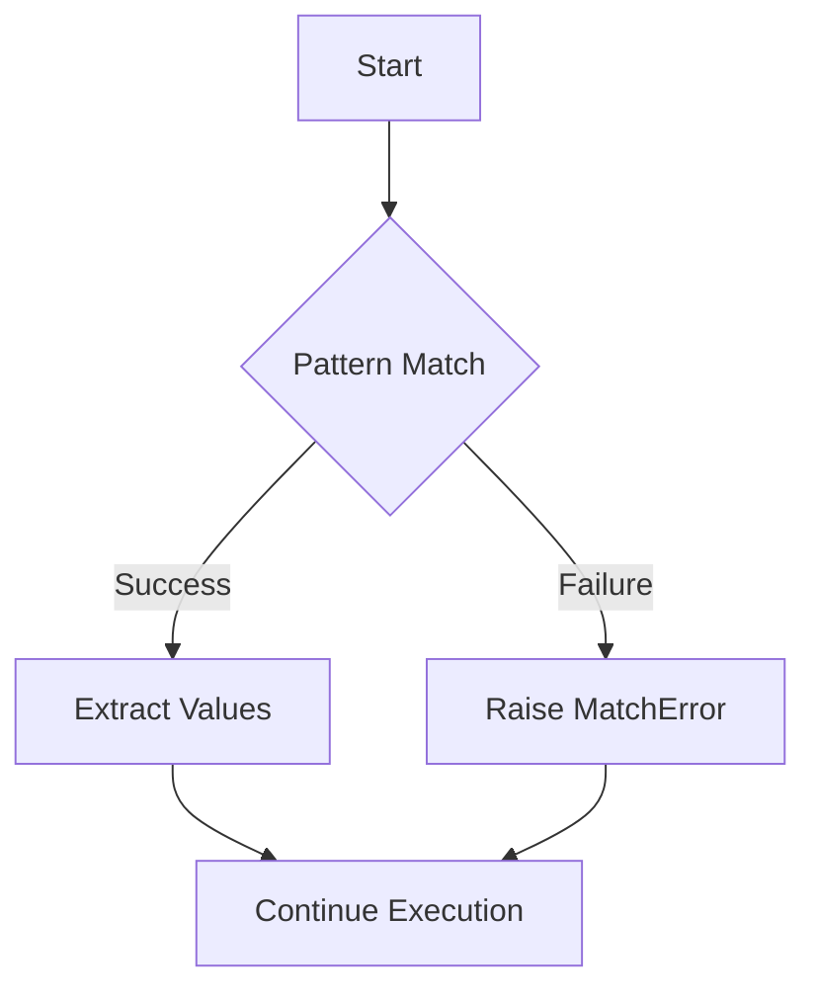

## 2.3. Pattern Matching and Guards

Pattern matching and guards are two of the most powerful features in Elixir, providing developers with a concise and expressive way to handle data and control flow. In this section, we will explore these concepts in-depth, demonstrating how they can be used to write cleaner, more maintainable code.

### Basics of Pattern Matching

Pattern matching is a fundamental feature of Elixir that allows you to match against data structures in variable assignments and function heads. It provides a declarative way to deconstruct complex data types and extract values.

#### Matching Against Data Structures

In Elixir, pattern matching is used extensively in variable assignments. When you assign a value to a variable, you are actually performing a pattern match. For instance:

```elixir
# Assigning a tuple to a variable
{a, b, c} = {1, 2, 3}
# a = 1, b = 2, c = 3

# Matching a list
[head | tail] = [1, 2, 3, 4]
# head = 1, tail = [2, 3, 4]
```

In the above examples, Elixir deconstructs the data structures and assigns the values to the corresponding variables. If the structure on the left side doesn't match the right side, an error will occur.

#### Deconstructing Complex Data Types

Pattern matching shines when dealing with complex data types, such as maps and structs. Consider the following example:

```elixir
# Matching a map
%{name: name, age: age} = %{name: "Alice", age: 30}
# name = "Alice", age = 30

# Matching a struct
defmodule User do
  defstruct name: nil, age: nil
end

%User{name: user_name} = %User{name: "Bob", age: 25}
# user_name = "Bob"
```

In these examples, pattern matching allows you to easily extract values from maps and structs without needing to manually access each field.

### Using Guards

Guards add conditional logic to pattern matches, allowing you to refine your matches with additional constraints. They are used in function heads, case expressions, and other constructs.

#### Adding Conditional Logic

Guards are specified using the `when` keyword and can include a variety of expressions:

```elixir
defmodule Math do
  def zero?(x) when x == 0 do
    true
  end

  def zero?(_x) do
    false
  end
end

IO.puts Math.zero?(0)  # true
IO.puts Math.zero?(1)  # false
```

In this example, the `zero?/1` function uses guards to check if a number is zero. If the guard condition is met, the corresponding function clause is executed.

#### Guard Expressions and Allowed Functions

Elixir provides a set of built-in functions that can be used in guards, such as:

- Comparison operators (`==`, `!=`, `>`, `<`, `>=`, `<=`)
- Boolean operators (`and`, `or`, `not`)
- Type checks (`is_integer/1`, `is_float/1`, `is_atom/1`, etc.)
- Arithmetic operations (`+`, `-`, `*`, `/`)
- Other functions like `length/1`, `in/2`, etc.

Guards must be side-effect-free, meaning they cannot perform operations that modify state or have side effects.

### Advanced Pattern Matching Techniques

As you become more familiar with pattern matching, you'll discover advanced techniques that can further enhance your code.

#### Utilizing the Pin Operator (`^`)

The pin operator (`^`) is used to match against existing values rather than reassigning them. This is useful in scenarios where you want to ensure a variable matches a specific value:

```elixir
x = 1
^x = 1  # Matches successfully
^x = 2  # Raises a MatchError
```

In this example, the pin operator ensures that `x` retains its value of `1` during the match.

#### Pattern Matching in Case Statements

Elixir's `case` construct allows you to pattern match against multiple conditions:

```elixir
case {1, 2, 3} do
  {1, x, 3} -> "Matched with x = #{x}"
  _ -> "No match"
end
```

Here, the `case` statement matches the tuple against the pattern `{1, x, 3}`, and if successful, binds `x` to `2`.

#### Using the `case`, `cond`, and `with` Constructs

Pattern matching is also integral to Elixir's `case`, `cond`, and `with` constructs, each providing unique ways to handle control flow:

- **Case**: Matches against multiple patterns, executing the first successful match.
- **Cond**: Evaluates conditions in sequence, similar to an if-else chain.
- **With**: Chains multiple pattern matches, allowing for concise handling of complex logic.

Here's an example using `with`:

```elixir
with {:ok, file} <- File.open("path/to/file"),
     {:ok, content} <- File.read(file),
     do: IO.puts(content)
```

In this example, `with` chains multiple operations, executing the `do` block only if all matches succeed.

### Visualizing Pattern Matching and Guards

To better understand these concepts, let's visualize the flow of a pattern matching operation using a Mermaid.js diagram:


```mermaid
graph TD;
    A[Start] --> B{Pattern Match}
    B -->|Success| C[Extract Values]
    B -->|Failure| D[Raise MatchError]
    C --> E[Continue Execution]
    D --> E
```

This diagram illustrates the decision-making process during a pattern match, highlighting the paths for successful matches and errors.

### References and Links

For further reading on pattern matching and guards in Elixir, consider the following resources:

- [Elixir Documentation on Pattern Matching](https://elixir-lang.org/getting-started/pattern-matching.html)
- [Elixir Documentation on Guards](https://elixir-lang.org/getting-started/case-cond-and-if.html#guards)

### Knowledge Check

Let's test your understanding of pattern matching and guards with a few questions:

1. What is the purpose of the pin operator (`^`) in pattern matching?
2. How do guards enhance pattern matching in Elixir?
3. Can you use any function in a guard expression? Why or why not?
4. Describe a scenario where pattern matching in a `case` statement would be beneficial.
5. How does the `with` construct differ from `case` and `cond`?

### Embrace the Journey

Remember, mastering pattern matching and guards is just the beginning of your journey with Elixir. As you continue to explore these features, you'll discover new ways to write cleaner, more efficient code. Keep experimenting, stay curious, and enjoy the journey!

### Quiz Time!



### What is the primary purpose of pattern matching in Elixir?

- [x] To deconstruct data structures and extract values
- [ ] To perform arithmetic operations
- [ ] To manage state in processes
- [ ] To handle concurrency

> **Explanation:** Pattern matching is used to deconstruct data structures and extract values in Elixir.

### Which operator is used to match against existing values in Elixir?

- [x] The pin operator (`^`)
- [ ] The pipe operator (`|>`)
- [ ] The match operator (`=`)

> **Explanation:** The pin operator (`^`) is used to match against existing values in Elixir.

### Can you use any function in a guard expression?

- [ ] Yes, any function can be used
- [x] No, only a specific set of functions can be used
- [ ] Only functions with side effects can be used

> **Explanation:** Only a specific set of functions that are side-effect-free can be used in guard expressions.

### What does the `with` construct do in Elixir?

- [x] Chains multiple pattern matches and executes a block if all succeed
- [ ] Matches a single pattern against a value
- [ ] Evaluates conditions in sequence

> **Explanation:** The `with` construct chains multiple pattern matches and executes a block if all succeed.

### How does the `case` construct differ from `cond`?

- [x] `case` matches patterns, while `cond` evaluates conditions
- [ ] `case` evaluates conditions, while `cond` matches patterns
- [ ] Both are used for the same purpose

> **Explanation:** `case` matches patterns, while `cond` evaluates conditions in sequence.

### What is a common use case for guards in Elixir?

- [x] Adding conditional logic to function clauses
- [ ] Performing arithmetic operations
- [ ] Managing process state

> **Explanation:** Guards are commonly used to add conditional logic to function clauses.

### What happens if a pattern match fails in Elixir?

- [x] A `MatchError` is raised
- [ ] The program continues with a default value
- [ ] The match is ignored

> **Explanation:** If a pattern match fails, a `MatchError` is raised in Elixir.

### Which Elixir construct is similar to an if-else chain?

- [ ] `case`
- [x] `cond`
- [ ] `with`

> **Explanation:** The `cond` construct is similar to an if-else chain in Elixir.

### What is the role of the `when` keyword in Elixir?

- [x] It introduces guard clauses
- [ ] It defines a function
- [ ] It starts a pattern match

> **Explanation:** The `when` keyword is used to introduce guard clauses in Elixir.

### True or False: Pattern matching in Elixir can be used to match against maps and structs.

- [x] True
- [ ] False

> **Explanation:** Pattern matching in Elixir can be used to match against maps and structs.




