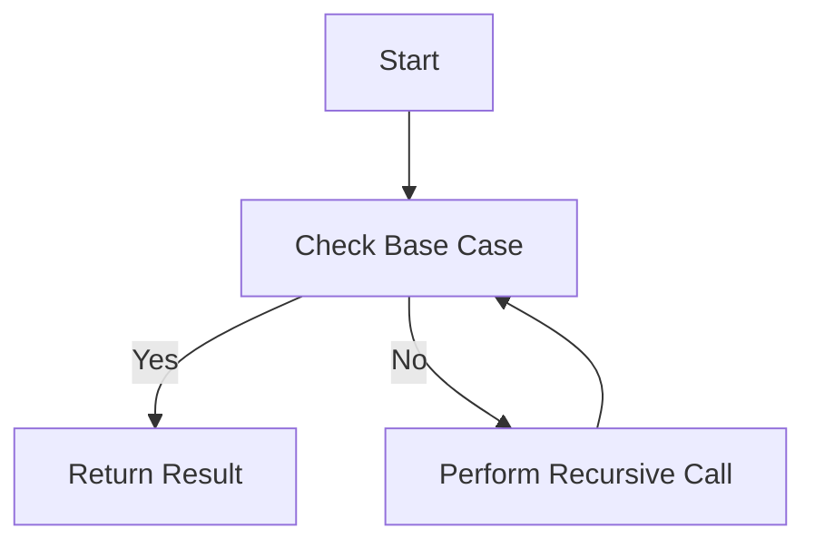

## 2.4. Recursion and Tail Call Optimization

In the realm of functional programming, recursion is a fundamental concept that replaces traditional iterative constructs like loops. Elixir, being a functional language, embraces recursion as a primary mechanism for iteration. This section delves into the intricacies of recursion and tail call optimization (TCO) in Elixir, providing expert insights and practical examples.

### Recursive Function Design

Recursion involves a function calling itself to solve smaller instances of the same problem. This approach is particularly powerful in functional programming, where immutability and statelessness are key principles.

#### Replacing Loops with Recursion in Elixir

In imperative languages, loops are commonly used for iteration. However, in Elixir, recursion is the preferred method. Let's explore how to replace loops with recursion:

```elixir
# Traditional loop in an imperative language
for i <- 1..10 do
  IO.puts(i)
end

# Recursive function in Elixir
defmodule LoopExample do
  def print_numbers(0), do: :ok
  def print_numbers(n) when n > 0 do
    IO.puts(n)
    print_numbers(n - 1)
  end
end

# Usage
LoopExample.print_numbers(10)
```

In this example, the `print_numbers/1` function recursively prints numbers from `n` down to `1`. The base case is when `n` is `0`, at which point the recursion stops.

#### Breaking Down Problems into Base and Recursive Cases

A recursive function typically consists of two parts: the base case and the recursive case.

- **Base Case:** The condition under which the recursion stops. It prevents infinite recursion and usually returns a simple value.
- **Recursive Case:** The part of the function that calls itself with a modified argument, moving towards the base case.

Consider the factorial function, a classic example of recursion:

```elixir
defmodule Factorial do
  def calculate(0), do: 1
  def calculate(n) when n > 0 do
    n * calculate(n - 1)
  end
end

# Usage
Factorial.calculate(5) # Output: 120
```

Here, the base case is `calculate(0)`, which returns `1`. The recursive case multiplies `n` by the factorial of `n - 1`.

### Tail Call Optimization (TCO)

Tail call optimization is a crucial concept in functional programming that allows recursive functions to execute without growing the call stack. This optimization is possible when the recursive call is the last operation in the function.

#### Ensuring Recursive Calls Are in the Tail Position

For a function to be tail-recursive, the recursive call must be the final action performed. This allows the Elixir runtime to optimize the call, reusing the current function's stack frame instead of creating a new one.

Consider the following example:

```elixir
defmodule TailRecursiveFactorial do
  def calculate(n), do: calculate(n, 1)

  defp calculate(0, acc), do: acc
  defp calculate(n, acc) when n > 0 do
    calculate(n - 1, n * acc)
  end
end

# Usage
TailRecursiveFactorial.calculate(5) # Output: 120
```

In this tail-recursive version of the factorial function, the recursive call `calculate(n - 1, n * acc)` is the last operation, allowing for tail call optimization.

#### Examples of Tail-Recursive Functions

Let's explore another example, the Fibonacci sequence, using tail recursion:

```elixir
defmodule TailRecursiveFibonacci do
  def calculate(n), do: calculate(n, 0, 1)

  defp calculate(0, a, _), do: a
  defp calculate(n, a, b) when n > 0 do
    calculate(n - 1, b, a + b)
  end
end

# Usage
TailRecursiveFibonacci.calculate(10) # Output: 55
```

In this example, the function `calculate/3` is tail-recursive, with the recursive call being the last operation.

### Practical Considerations

While recursion is powerful, it's essential to consider when to use it and be aware of potential pitfalls.

#### When to Use Recursion Versus Other Iteration Methods

Recursion is ideal for problems that can be naturally divided into smaller subproblems, such as tree traversal, graph algorithms, and mathematical computations like factorials and Fibonacci numbers. However, for simple iterations over lists or ranges, Elixir's `Enum` and `Stream` modules provide efficient and readable alternatives.

#### Potential Pitfalls and How to Avoid Them

- **Stack Overflow:** Non-tail-recursive functions can lead to stack overflow errors for large inputs. Always strive for tail recursion when possible.
- **Complexity:** Recursive solutions can be less intuitive and harder to debug. Ensure your base and recursive cases are clearly defined.
- **Performance:** While recursion is elegant, it may not always be the most performant solution. Consider the problem's nature and explore alternatives like `Enum` and `Stream`.

### Visualizing Recursion and Tail Call Optimization

To better understand recursion and tail call optimization, let's visualize the process using a flowchart.



**Caption:** This flowchart illustrates the recursive process, where the function checks the base case and either returns a result or performs a recursive call.

### Try It Yourself

Experiment with the provided code examples by modifying the base and recursive cases. Try implementing other recursive algorithms, such as calculating the greatest common divisor (GCD) or solving the Towers of Hanoi problem.

### References and Links

- [Elixir Documentation on Recursion](https://elixir-lang.org/getting-started/recursion.html)
- [Tail Call Optimization Explained](https://en.wikipedia.org/wiki/Tail_call)
- [Functional Programming Concepts](https://www.geeksforgeeks.org/functional-programming-paradigm/)

### Knowledge Check

- What is the difference between a base case and a recursive case?
- Why is tail call optimization important in functional programming?
- How can you ensure a function is tail-recursive?

### Embrace the Journey

Remember, mastering recursion and tail call optimization is a journey. As you progress, you'll develop a deeper understanding of functional programming principles. Keep experimenting, stay curious, and enjoy the process!

## Quiz: Recursion and Tail Call Optimization



### What is the primary purpose of recursion in Elixir?

- [x] To replace traditional loops with a functional approach
- [ ] To increase the complexity of code
- [ ] To make code execution slower
- [ ] To avoid using functions

> **Explanation:** Recursion in Elixir is used to replace traditional loops, providing a functional approach to iteration.

### What is a base case in recursion?

- [x] The condition under which recursion stops
- [ ] The first recursive call
- [ ] A case that increases recursion depth
- [ ] A case that never returns

> **Explanation:** The base case is the condition under which recursion stops, preventing infinite recursion.

### How does tail call optimization benefit recursive functions?

- [x] It prevents stack overflow by reusing the current stack frame
- [ ] It makes recursion slower
- [ ] It increases memory usage
- [ ] It complicates the code

> **Explanation:** Tail call optimization prevents stack overflow by reusing the current stack frame, making recursion more efficient.

### Which of the following is a tail-recursive function?

- [x] A function where the recursive call is the last operation
- [ ] A function with multiple recursive calls
- [ ] A function that never returns
- [ ] A function with no base case

> **Explanation:** A tail-recursive function is one where the recursive call is the last operation, allowing for optimization.

### What is a potential pitfall of non-tail-recursive functions?

- [x] Stack overflow for large inputs
- [ ] Increased performance
- [ ] Simplified debugging
- [ ] Reduced code complexity

> **Explanation:** Non-tail-recursive functions can lead to stack overflow errors for large inputs.

### When should you consider using Elixir's `Enum` and `Stream` modules instead of recursion?

- [x] For simple iterations over lists or ranges
- [ ] For complex mathematical computations
- [ ] For tree traversal algorithms
- [ ] For graph algorithms

> **Explanation:** Elixir's `Enum` and `Stream` modules are efficient for simple iterations over lists or ranges.

### What is the role of the accumulator in tail-recursive functions?

- [x] To carry forward the result of each recursive call
- [ ] To increase recursion depth
- [ ] To complicate the function
- [ ] To reduce memory usage

> **Explanation:** The accumulator carries forward the result of each recursive call, enabling tail recursion.

### How can you visualize the recursive process?

- [x] Using a flowchart to illustrate base and recursive cases
- [ ] By writing complex code
- [ ] By avoiding diagrams
- [ ] By ignoring the base case

> **Explanation:** A flowchart can effectively illustrate the recursive process, showing base and recursive cases.

### What is the significance of the base case in recursion?

- [x] It prevents infinite recursion and returns a simple value
- [ ] It increases recursion depth
- [ ] It complicates the function
- [ ] It is optional

> **Explanation:** The base case prevents infinite recursion and returns a simple value, ensuring the function terminates.

### True or False: Tail call optimization is only applicable to functional programming languages.

- [x] True
- [ ] False

> **Explanation:** Tail call optimization is primarily applicable to functional programming languages, where recursion is a common pattern.


