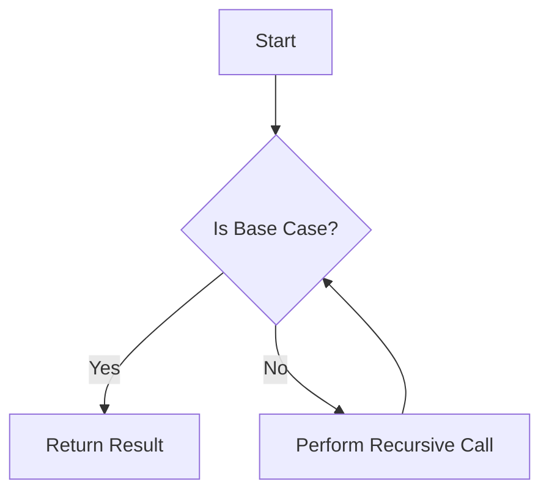

## 2.4. Recursion and Tail Call Optimization

In the realm of functional programming, recursion is a fundamental concept that replaces traditional loops found in imperative languages. Elixir, as a functional language, embraces recursion, offering powerful techniques for handling repetitive tasks. This section delves into recursion and tail call optimization (TCO), providing expert insights into designing efficient recursive functions in Elixir.

### Recursive Function Design

Recursion involves a function calling itself to solve smaller instances of a problem. In Elixir, recursion is often used to iterate over data structures like lists. The key to effective recursion is breaking down problems into base and recursive cases.

#### Replacing Loops with Recursion in Elixir

In imperative languages, loops are the go-to construct for iteration. However, in Elixir, recursion is preferred. Let's explore how to replace a simple loop with recursion.

Consider the task of summing a list of numbers:

```elixir
# Imperative style (not Elixir)
sum = 0
for number <- numbers do
  sum = sum + number
end
```

In Elixir, we achieve this using recursion:

```elixir
defmodule RecursiveSum do
  # Public function to start the recursion
  def sum(list), do: sum(list, 0)

  # Base case: empty list
  defp sum([], acc), do: acc

  # Recursive case: add head to accumulator and recurse on the tail
  defp sum([head | tail], acc), do: sum(tail, acc + head)
end

# Usage
RecursiveSum.sum([1, 2, 3, 4, 5]) # => 15
```

**Explanation:**

- **Base Case**: When the list is empty (`[]`), return the accumulator `acc`.
- **Recursive Case**: Add the head of the list to the accumulator and recurse on the tail.

#### Breaking Down Problems into Base and Recursive Cases

To design recursive functions, identify:

1. **Base Case**: The simplest instance of the problem, which can be solved directly.
2. **Recursive Case**: A step that reduces the problem size, moving towards the base case.

**Example: Factorial Calculation**

```elixir
defmodule Factorial do
  def calculate(0), do: 1 # Base case
  def calculate(n) when n > 0 do
    n * calculate(n - 1) # Recursive case
  end
end

# Usage
Factorial.calculate(5) # => 120
```

**Explanation:**

- **Base Case**: `factorial(0) = 1`
- **Recursive Case**: `factorial(n) = n * factorial(n - 1)`

### Tail Call Optimization (TCO)

Tail call optimization is a technique that allows recursive functions to execute in constant stack space, preventing stack overflow errors. This optimization is crucial for functional programming languages like Elixir.

#### Ensuring Recursive Calls are in the Tail Position

A recursive call is in the tail position if it is the last operation in the function. This allows the Elixir runtime to optimize the call, reusing the current function's stack frame.

**Example: Tail-Recursive Factorial**

```elixir
defmodule TailRecursiveFactorial do
  def calculate(n), do: calculate(n, 1)

  defp calculate(0, acc), do: acc # Base case
  defp calculate(n, acc) when n > 0 do
    calculate(n - 1, acc * n) # Tail-recursive call
  end
end

# Usage
TailRecursiveFactorial.calculate(5) # => 120
```

**Explanation:**

- The recursive call to `calculate/2` is the last operation, enabling TCO.

#### Examples of Tail-Recursive Functions

Let's explore more examples to solidify our understanding of tail recursion.

**Example: Fibonacci Sequence**

```elixir
defmodule TailRecursiveFibonacci do
  def calculate(n), do: calculate(n, 0, 1)

  defp calculate(0, a, _), do: a
  defp calculate(n, a, b) when n > 0 do
    calculate(n - 1, b, a + b)
  end
end

# Usage
TailRecursiveFibonacci.calculate(10) # => 55
```

**Explanation:**

- **Base Case**: When `n` is zero, return `a`.
- **Recursive Case**: Calculate the next Fibonacci number using tail recursion.

### Practical Considerations

While recursion is powerful, it's essential to consider when to use it and be aware of potential pitfalls.

#### When to Use Recursion Versus Other Iteration Methods

Recursion is ideal when:

- The problem naturally fits a recursive structure (e.g., tree traversal).
- Tail call optimization can be applied to avoid stack overflow.

However, consider using other methods (e.g., `Enum` module) when:

- The problem can be solved more efficiently using built-in iteration functions.
- Readability and maintainability are a priority.

**Example: Using Enum for Summation**

```elixir
Enum.sum([1, 2, 3, 4, 5]) # => 15
```

#### Potential Pitfalls and How to Avoid Them

- **Stack Overflow**: Ensure recursive calls are in the tail position to leverage TCO.
- **Complexity**: Avoid overly complex recursive logic that can be difficult to understand.
- **Performance**: Consider the performance implications of recursion, especially with large data sets.

### Visualizing Recursion and Tail Call Optimization

To better understand recursion and TCO, let's visualize the process using Mermaid.js diagrams.


```mermaid
graph TD;
    A[Start] --> B{Is Base Case?}
    B -->|Yes| C[Return Result]
    B -->|No| D[Perform Recursive Call]
    D --> B
```

**Diagram Description:**

- **Start**: Begin the recursive function.
- **Base Case**: Check if the base case is met. If yes, return the result.
- **Recursive Call**: If not, perform the recursive call and repeat the process.

### Try It Yourself

Experiment with the code examples provided. Try modifying the base and recursive cases to see how changes affect the function's behavior. Consider implementing other recursive algorithms, such as:

- Calculating the greatest common divisor (GCD).
- Traversing binary trees.

### References and Links

For further reading on recursion and tail call optimization, consider the following resources:

- [Elixir School: Recursion](https://elixirschool.com/en/lessons/basics/recursion/)
- [Erlang and Elixir Forum: Tail Call Optimization](https://elixirforum.com/t/tail-call-optimization/)

### Knowledge Check

Before moving on, ensure you understand the following:

- How to identify base and recursive cases.
- The importance of tail call optimization.
- When to use recursion versus other iteration methods.

### Embrace the Journey

Remember, mastering recursion and tail call optimization is just the beginning. As you progress, you'll build more complex and efficient Elixir applications. Keep experimenting, stay curious, and enjoy the journey!

## Quiz Time!



### What is the primary advantage of using recursion in Elixir?

- [x] It replaces loops with a functional approach.
- [ ] It allows for mutable state.
- [ ] It simplifies the code by avoiding function calls.
- [ ] It automatically optimizes memory usage.

> **Explanation:** Recursion replaces loops, aligning with functional programming principles.

### What is a base case in recursion?

- [x] The simplest instance of the problem that can be solved directly.
- [ ] A case where the function calls itself.
- [ ] A method to optimize memory usage.
- [ ] The last operation in a function.

> **Explanation:** The base case is the simplest instance of the problem that can be solved directly.

### What is tail call optimization?

- [x] A technique that allows recursive functions to execute in constant stack space.
- [ ] An optimization for loops in functional programming.
- [ ] A method to increase recursion depth.
- [ ] A way to avoid function calls.

> **Explanation:** Tail call optimization allows recursive functions to execute without increasing stack depth.

### When is a recursive call in the tail position?

- [x] When it is the last operation in the function.
- [ ] When it is the first operation in the function.
- [ ] When it occurs in the base case.
- [ ] When it involves a loop.

> **Explanation:** A recursive call is in the tail position if it is the last operation in the function.

### Which of the following is a potential pitfall of recursion?

- [x] Stack overflow if not optimized.
- [ ] Automatic memory optimization.
- [ ] Simplified code structure.
- [ ] Enhanced readability.

> **Explanation:** Without tail call optimization, recursion can lead to stack overflow.

### What is the role of the accumulator in a tail-recursive function?

- [x] To carry the result through recursive calls.
- [ ] To increase recursion depth.
- [ ] To replace the base case.
- [ ] To simplify the recursive logic.

> **Explanation:** The accumulator carries the result through recursive calls, enabling tail call optimization.

### How does tail call optimization benefit recursive functions?

- [x] By allowing them to run in constant stack space.
- [ ] By automatically solving base cases.
- [ ] By increasing recursion depth.
- [ ] By simplifying the code.

> **Explanation:** Tail call optimization allows recursive functions to run without increasing stack depth.

### What is an example of when to use recursion in Elixir?

- [x] When traversing a tree structure.
- [ ] When performing simple arithmetic.
- [ ] When using loops.
- [ ] When handling mutable state.

> **Explanation:** Recursion is ideal for traversing tree structures, which naturally fit a recursive pattern.

### Which of the following is NOT a benefit of recursion?

- [ ] Aligns with functional programming principles.
- [ ] Can replace loops in Elixir.
- [x] Automatically optimizes all code.
- [ ] Enables elegant solutions for complex problems.

> **Explanation:** While recursion aligns with functional programming, it does not automatically optimize all code.

### True or False: Tail call optimization is automatically applied to all recursive functions in Elixir.

- [ ] True
- [x] False

> **Explanation:** Tail call optimization is only applied when recursive calls are in the tail position.




