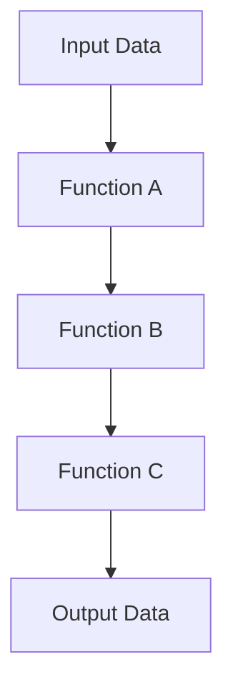
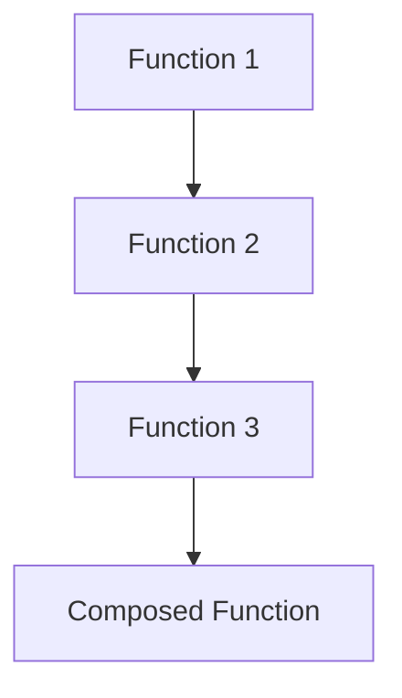

## 2.5. Pipelines and Function Composition

In the world of functional programming, Elixir stands out with its elegant syntax and powerful features that promote clean, readable, and maintainable code. Among these features, pipelines and function composition are two of the most potent tools in an Elixir developer's toolkit. They allow us to write code that is not only easy to understand but also easy to extend and maintain. In this section, we will delve deep into these concepts, exploring their benefits, best practices, and common pitfalls.

### The Pipe Operator (`|>`)

The pipe operator (`|>`) is one of the most distinctive and beloved features of Elixir. It allows us to transform nested function calls into a series of operations that are easier to read and follow. Let's explore how the pipe operator works and how it can simplify your code.

#### Simplifying Nested Function Calls Through Piping

In many programming languages, deeply nested function calls can become difficult to read and understand. Consider the following example:

```elixir
result = function_c(function_b(function_a(value)))
```

This code snippet is not only hard to read but also challenging to debug. The pipe operator offers a more readable alternative:

```elixir
result = value
|> function_a()
|> function_b()
|> function_c()
```

With the pipe operator, each function call is on its own line, making the flow of data through the functions clear and easy to follow.

#### Enhancing Code Readability and Flow

The primary benefit of using the pipe operator is improved readability. By structuring code in a linear, top-to-bottom fashion, we can more easily understand the sequence of operations being performed. This is particularly useful in data transformation pipelines, where each step in the process is clearly delineated.

**Example:**

Let's consider a real-world example where we process a list of user data:

```elixir
users = [
  %{name: "Alice", age: 30},
  %{name: "Bob", age: 25},
  %{name: "Charlie", age: 35}
]

adult_names = users
|> Enum.filter(fn user -> user.age >= 30 end)
|> Enum.map(fn user -> user.name end)
|> Enum.sort()
```

In this example, we filter out users under 30, extract their names, and sort them alphabetically. The pipe operator allows us to express this sequence of operations in a clear and concise manner.

### Function Composition

Function composition is another powerful concept in functional programming. It involves combining simple functions to create more complex operations. This modular approach to design promotes code reuse and simplifies testing and maintenance.

#### Combining Simple Functions to Build More Complex Operations

In Elixir, functions are first-class citizens, meaning they can be passed around and combined just like any other data type. Function composition allows us to build complex operations by chaining together simpler functions.

**Example:**

Let's define a series of simple functions and compose them into a more complex operation:

```elixir
defmodule Math do
  def add(x, y), do: x + y
  def multiply(x, y), do: x * y
end

add_and_multiply = fn x, y, z ->
  x
  |> Math.add(y)
  |> Math.multiply(z)
end

result = add_and_multiply.(2, 3, 4) # Result: 20
```

In this example, we define two simple functions, `add` and `multiply`, and compose them into a new function, `add_and_multiply`, which first adds two numbers and then multiplies the result by a third number.

#### Benefits of Modular Design

Function composition promotes modular design, which has several benefits:

- **Reusability:** By breaking down complex operations into simpler functions, we can reuse these functions in different contexts.
- **Testability:** Smaller, focused functions are easier to test and debug.
- **Maintainability:** Modular code is easier to understand and modify, reducing the risk of introducing bugs when making changes.

### Examples and Best Practices

To fully harness the power of pipelines and function composition, it's important to follow best practices and be aware of common pitfalls.

#### Real-World Scenarios Using Pipelines

Pipelines are particularly useful in scenarios where data needs to be transformed through a series of steps. Here are some examples:

1. **Data Processing:**

   ```elixir
   data = [1, 2, 3, 4, 5]

   processed_data = data
   |> Enum.map(&(&1 * 2))
   |> Enum.filter(&(&1 > 5))
   |> Enum.sum()
   ```

   In this example, we double each number, filter out numbers less than or equal to 5, and then sum the remaining numbers.

2. **Web Request Handling:**

   ```elixir
   def handle_request(request) do
     request
     |> parse_headers()
     |> authenticate_user()
     |> fetch_data()
     |> render_response()
   end
   ```

   Here, a web request is processed through a series of functions that parse headers, authenticate the user, fetch data, and render a response.

#### Common Mistakes and How to Avoid Them

While pipelines and function composition are powerful tools, there are some common mistakes to watch out for:

- **Overusing Pipelines:** While pipelines improve readability, overusing them can lead to overly complex and hard-to-follow code. Aim for a balance between readability and simplicity.
- **Ignoring Function Return Values:** Ensure that each function in a pipeline returns a value that the next function can accept. Mismatched return types can lead to runtime errors.
- **Complex Function Composition:** Avoid composing too many functions into a single operation. Break down complex operations into smaller, more manageable pieces.

### Visualizing Pipelines and Function Composition

To better understand the flow of data through pipelines and function composition, let's visualize these concepts using Mermaid.js diagrams.

#### Pipeline Flow



**Description:** This diagram illustrates the flow of data through a series of functions in a pipeline. Each function transforms the data before passing it to the next function.

#### Function Composition



**Description:** This diagram shows how simple functions are combined to form a more complex composed function.

### Try It Yourself

To deepen your understanding of pipelines and function composition, try modifying the examples provided. Experiment with different functions and data to see how the pipeline and composition change the results. Here are some suggestions:

- Modify the `adult_names` example to filter users by a different age.
- Create a new composed function that performs a series of mathematical operations.
- Experiment with different data processing pipelines to see how they affect the output.

### References and Links

For further reading on pipelines and function composition in Elixir, consider the following resources:

- [Elixir's Official Documentation](https://elixir-lang.org/docs.html)
- [Functional Programming in Elixir](https://pragprog.com/titles/elixir/functional-programming-in-elixir/)
- [Elixir School: Pipe Operator](https://elixirschool.com/en/lessons/basics/pipe_operator/)

### Knowledge Check

Before moving on, take a moment to review what you've learned. Consider the following questions:

- How does the pipe operator improve code readability?
- What are the benefits of function composition in Elixir?
- How can you avoid common pitfalls when using pipelines?

### Embrace the Journey

Remember, mastering pipelines and function composition is just the beginning of your journey with Elixir. As you continue to explore the language, you'll discover even more powerful features and patterns that will enhance your coding skills. Keep experimenting, stay curious, and enjoy the journey!

## Quiz: Pipelines and Function Composition



### What is the primary benefit of using the pipe operator in Elixir?

- [x] Improved code readability
- [ ] Increased execution speed
- [ ] Reduced memory usage
- [ ] Enhanced security

> **Explanation:** The pipe operator improves code readability by transforming nested function calls into a linear sequence of operations.

### How does function composition benefit modular design?

- [x] It promotes code reuse and simplifies testing.
- [ ] It increases code execution speed.
- [ ] It reduces the number of functions needed.
- [ ] It enhances security features.

> **Explanation:** Function composition promotes modular design by allowing simple functions to be combined into more complex operations, which enhances code reuse and simplifies testing.

### Which of the following is a common mistake when using pipelines?

- [x] Overusing pipelines leading to complex code
- [ ] Using too few functions in a pipeline
- [ ] Ignoring function documentation
- [ ] Not using enough comments

> **Explanation:** Overusing pipelines can lead to complex and hard-to-follow code, which is a common mistake to avoid.

### What should you ensure when chaining functions in a pipeline?

- [x] Each function returns a value that the next function can accept.
- [ ] Each function has a unique name.
- [ ] Each function is defined in a separate module.
- [ ] Each function is documented.

> **Explanation:** It's important to ensure that each function in a pipeline returns a value that the next function can accept to avoid runtime errors.

### What is a key characteristic of function composition?

- [x] Combining simple functions to create complex operations
- [ ] Reducing the number of lines of code
- [ ] Increasing the speed of execution
- [ ] Enhancing security features

> **Explanation:** Function composition involves combining simple functions to create more complex operations, which is a key characteristic.

### How can you avoid overusing pipelines?

- [x] Balance readability with simplicity.
- [ ] Use fewer functions in a pipeline.
- [ ] Avoid using the pipe operator altogether.
- [ ] Only use pipelines in small projects.

> **Explanation:** To avoid overusing pipelines, it's important to balance readability with simplicity.

### What is the role of the pipe operator in data transformation?

- [x] It allows data to flow through a series of functions.
- [ ] It increases the speed of data processing.
- [ ] It reduces the amount of data processed.
- [ ] It enhances data security.

> **Explanation:** The pipe operator allows data to flow through a series of functions, facilitating data transformation.

### What is a benefit of modular design in Elixir?

- [x] Easier code maintenance and modification
- [ ] Faster code execution
- [ ] Reduced memory usage
- [ ] Enhanced security features

> **Explanation:** Modular design makes code easier to maintain and modify, which is a significant benefit.

### Which of the following is an example of function composition?

- [x] Combining `add` and `multiply` functions to create `add_and_multiply`
- [ ] Using the pipe operator to chain functions
- [ ] Writing a single complex function
- [ ] Using anonymous functions

> **Explanation:** Combining `add` and `multiply` functions to create `add_and_multiply` is an example of function composition.

### True or False: The pipe operator can only be used with functions that take a single argument.

- [x] True
- [ ] False

> **Explanation:** The pipe operator is typically used with functions that take a single argument, as it passes the result of one function as the first argument to the next.


