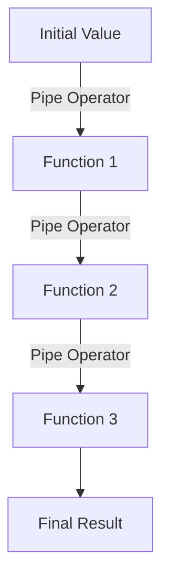

## 2.5. Pipelines and Function Composition

In the world of Elixir, pipelines and function composition are fundamental concepts that can significantly enhance the readability and maintainability of your code. By leveraging these powerful tools, you can transform complex nested function calls into elegant, linear sequences of operations. This section will guide you through the intricacies of pipelines and function composition, providing you with the knowledge to harness their full potential in your Elixir applications.

### The Pipe Operator (`|>`)

The pipe operator (`|>`) is a unique feature in Elixir that allows you to pass the result of an expression as the first argument to the next function. This operator is instrumental in simplifying nested function calls and improving code readability.

#### Simplifying Nested Function Calls Through Piping

Consider a scenario where you have a series of function calls, each taking the result of the previous one as an argument. Without the pipe operator, this can quickly become cumbersome and difficult to read:

```elixir
result = function3(function2(function1(initial_value)))
```

With the pipe operator, you can rewrite the above code in a more readable and linear fashion:

```elixir
result = 
  initial_value
  |> function1()
  |> function2()
  |> function3()
```

This transformation not only makes the code easier to read but also aligns with the natural flow of data processing, making it easier to follow the sequence of operations.

#### Enhancing Code Readability and Flow

The pipe operator enhances code readability by reducing the cognitive load required to understand nested function calls. It allows developers to focus on the sequence of operations rather than the intricacies of function nesting. This is particularly beneficial in functional programming, where data transformations are common.

**Example:**

Let's consider a practical example where we process a list of numbers by filtering out even numbers, doubling the remaining numbers, and then summing them up:

```elixir
numbers = [1, 2, 3, 4, 5, 6]

sum_of_doubled_odds = 
  numbers
  |> Enum.filter(&rem(&1, 2) != 0)
  |> Enum.map(&(&1 * 2))
  |> Enum.sum()

IO.inspect(sum_of_doubled_odds) # Output: 18
```

In this example, the pipe operator allows us to express the sequence of operations in a clear and concise manner, making the code easy to read and understand.

### Function Composition

Function composition is the process of combining simple functions to build more complex operations. In Elixir, function composition is a powerful technique that promotes modular design, allowing you to create reusable and maintainable code.

#### Combining Simple Functions to Build More Complex Operations

Function composition involves creating a new function by combining two or more functions. This approach encourages the development of small, focused functions that can be reused and composed in various ways to achieve more complex functionality.

**Example:**

Suppose you have two simple functions: one that increments a number and another that doubles it. You can compose these functions to create a new function that increments and then doubles a number:

```elixir
increment = fn x -> x + 1 end
double = fn x -> x * 2 end

increment_and_double = fn x ->
  x
  |> increment.()
  |> double.()
end

IO.inspect(increment_and_double.(3)) # Output: 8
```

In this example, `increment_and_double` is a composed function that combines the `increment` and `double` functions to perform a more complex operation.

#### Benefits of Modular Design

Function composition promotes modular design by encouraging the creation of small, reusable functions. This modularity leads to several benefits:

- **Reusability:** Composed functions can be reused across different parts of your application, reducing code duplication.
- **Maintainability:** Small, focused functions are easier to understand, test, and maintain.
- **Testability:** Individual functions can be tested in isolation, making it easier to identify and fix bugs.

### Examples and Best Practices

In this section, we will explore real-world scenarios where pipelines and function composition can be applied effectively. We will also discuss common mistakes and how to avoid them.

#### Real-World Scenarios Using Pipelines

Pipelines are particularly useful in scenarios where you need to process data through a series of transformations. Let's consider a real-world example where we process a list of user data to extract the names of users who are over 18 years old and sort them alphabetically:

```elixir
users = [
  %{name: "Alice", age: 20},
  %{name: "Bob", age: 17},
  %{name: "Charlie", age: 22}
]

adult_names = 
  users
  |> Enum.filter(&(&1.age > 18))
  |> Enum.map(& &1.name)
  |> Enum.sort()

IO.inspect(adult_names) # Output: ["Alice", "Charlie"]
```

In this example, the pipe operator allows us to express the sequence of data transformations in a clear and concise manner.

#### Common Mistakes and How to Avoid Them

While pipelines and function composition are powerful tools, there are common mistakes that developers should be aware of:

- **Overusing the Pipe Operator:** While the pipe operator enhances readability, overusing it can lead to complex and hard-to-follow code. Use it judiciously and consider breaking down complex pipelines into smaller functions.
- **Ignoring Function Arity:** The pipe operator passes the result of the previous expression as the first argument to the next function. Ensure that the functions in your pipeline have the correct arity.
- **Lack of Error Handling:** Pipelines can obscure error handling. Ensure that you handle errors appropriately within your pipelines to prevent unexpected behavior.

### Visualizing Pipelines and Function Composition

To further enhance your understanding of pipelines and function composition, let's visualize the process using a flowchart.


```mermaid
graph TD;
    A[Initial Value] -->|Pipe Operator| B[Function 1];
    B -->|Pipe Operator| C[Function 2];
    C -->|Pipe Operator| D[Function 3];
    D --> E[Final Result];
```

**Description:** This flowchart illustrates the flow of data through a series of functions using the pipe operator. Each function takes the result of the previous function as its input, resulting in a clear and linear sequence of operations.

### References and Links

For further reading on pipelines and function composition in Elixir, consider exploring the following resources:

- [Elixir Official Documentation](https://elixir-lang.org/docs.html)
- [Elixir School - Pipe Operator](https://elixirschool.com/en/lessons/basics/pipe_operator/)
- [Elixir School - Function Composition](https://elixirschool.com/en/lessons/advanced/functions/#composition)

### Knowledge Check

Before we conclude, let's reinforce your understanding of pipelines and function composition with a few questions and exercises.

- **Question:** What is the primary benefit of using the pipe operator in Elixir?
- **Exercise:** Refactor a nested function call in your codebase using the pipe operator.

### Embrace the Journey

Remember, mastering pipelines and function composition is just the beginning. As you continue to explore Elixir, you'll discover even more powerful tools and techniques to enhance your applications. Keep experimenting, stay curious, and enjoy the journey!

### Quiz Time!



### What is the primary purpose of the pipe operator (`|>`) in Elixir?

- [x] To pass the result of an expression as the first argument to the next function.
- [ ] To concatenate strings.
- [ ] To define anonymous functions.
- [ ] To create new modules.

> **Explanation:** The pipe operator (`|>`) is used to pass the result of an expression as the first argument to the next function, simplifying nested function calls and enhancing code readability.

### How does function composition benefit modular design?

- [x] By encouraging the creation of small, reusable functions.
- [ ] By making code more complex.
- [ ] By reducing the need for documentation.
- [ ] By eliminating the need for testing.

> **Explanation:** Function composition promotes modular design by encouraging the creation of small, reusable functions, which enhances reusability, maintainability, and testability.

### Which of the following is a common mistake when using pipelines?

- [x] Overusing the pipe operator.
- [ ] Using the pipe operator for string concatenation.
- [ ] Passing multiple arguments to the pipe operator.
- [ ] Using the pipe operator in anonymous functions.

> **Explanation:** Overusing the pipe operator can lead to complex and hard-to-follow code. It's important to use it judiciously and consider breaking down complex pipelines into smaller functions.

### What does the following pipeline do: `numbers |> Enum.filter(&rem(&1, 2) != 0) |> Enum.map(&(&1 * 2)) |> Enum.sum()`?

- [x] Filters odd numbers, doubles them, and sums the result.
- [ ] Filters even numbers, doubles them, and sums the result.
- [ ] Filters numbers greater than 2, doubles them, and sums the result.
- [ ] Filters numbers less than 2, doubles them, and sums the result.

> **Explanation:** The pipeline filters odd numbers, doubles them, and then sums the result.

### What is a key advantage of using function composition in Elixir?

- [x] It allows the creation of new functions by combining existing ones.
- [ ] It eliminates the need for modules.
- [ ] It simplifies string manipulation.
- [ ] It reduces the number of lines of code.

> **Explanation:** Function composition allows the creation of new functions by combining existing ones, promoting modularity and reusability.

### Which operator is used for function composition in Elixir?

- [x] The `|>` operator.
- [ ] The `++` operator.
- [ ] The `--` operator.
- [ ] The `<>` operator.

> **Explanation:** The `|>` operator is used for function composition in Elixir, allowing the result of one function to be passed as the first argument to the next function.

### What should you ensure when using the pipe operator in a pipeline?

- [x] That the functions have the correct arity to accept the piped value.
- [ ] That the functions are defined in the same module.
- [ ] That the functions are anonymous.
- [ ] That the functions return strings.

> **Explanation:** When using the pipe operator, ensure that the functions have the correct arity to accept the piped value, as it is passed as the first argument.

### What does function composition encourage in code design?

- [x] The development of small, focused functions.
- [ ] The use of global variables.
- [ ] The elimination of error handling.
- [ ] The use of complex nested functions.

> **Explanation:** Function composition encourages the development of small, focused functions, which enhances code reusability and maintainability.

### What is a potential downside of overusing the pipe operator?

- [x] It can lead to complex and hard-to-follow code.
- [ ] It can make code too simple.
- [ ] It can eliminate the need for comments.
- [ ] It can reduce code performance.

> **Explanation:** Overusing the pipe operator can lead to complex and hard-to-follow code, so it's important to use it judiciously.

### True or False: The pipe operator can only be used with functions that take a single argument.

- [ ] True
- [x] False

> **Explanation:** The pipe operator can be used with functions that take multiple arguments, but it passes the result of the previous expression as the first argument to the next function.



By mastering pipelines and function composition, you are well on your way to writing clean, efficient, and maintainable Elixir code. Keep exploring these concepts in your projects, and you'll continue to grow as an Elixir developer.
