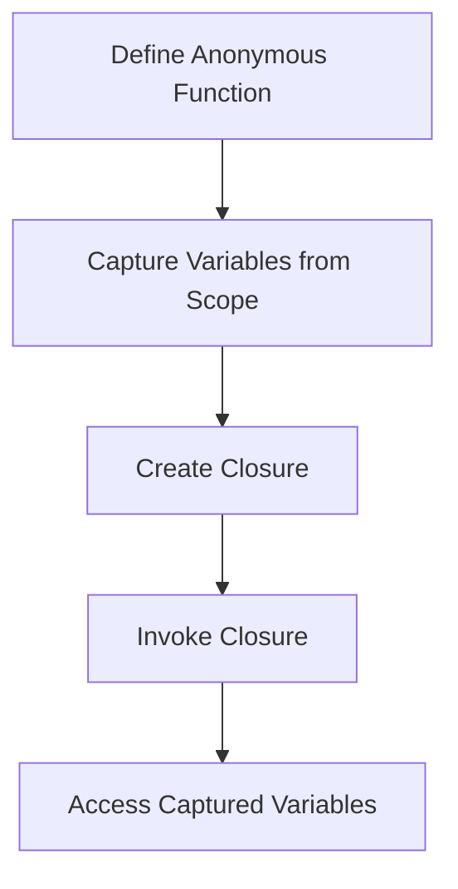

## 2.6. Anonymous Functions and Closures

In the realm of functional programming, anonymous functions and closures are powerful constructs that enable developers to write concise, expressive, and flexible code. In Elixir, these features are integral to crafting elegant solutions that leverage the language's functional nature. This section delves into the intricacies of anonymous functions and closures, providing expert insights and practical examples to enhance your Elixir programming skills.

### Defining Anonymous Functions

Anonymous functions, also known as lambdas or function literals, are functions that are defined without a name. They are often used for short-lived operations or when a function is needed only once. In Elixir, anonymous functions are defined using the `fn` keyword and the `->` operator, and they are closed with the `end` keyword.

#### Syntax and Use Cases for Anonymous Functions

The basic syntax for defining an anonymous function in Elixir is as follows:

```elixir
add = fn a, b -> a + b end
IO.puts(add.(2, 3))  # Output: 5
```

In this example, `add` is an anonymous function that takes two arguments and returns their sum. Notice the use of the dot `.` operator to invoke the function, which is a requirement for anonymous functions in Elixir.

Anonymous functions are versatile and can be used in various scenarios:

- **Short-lived operations**: When you need a quick, one-off function.
- **Higher-order functions**: Passing functions as arguments to other functions.
- **Callbacks and event handlers**: Defining behavior dynamically.

#### Passing Anonymous Functions as Arguments

One of the strengths of anonymous functions is their ability to be passed as arguments to other functions. This feature is a cornerstone of functional programming, enabling higher-order functions and promoting code reuse.

Consider the following example, where an anonymous function is passed to the `Enum.map/2` function:

```elixir
squared_numbers = Enum.map([1, 2, 3, 4], fn x -> x * x end)
IO.inspect(squared_numbers)  # Output: [1, 4, 9, 16]
```

In this case, the anonymous function `fn x -> x * x end` is applied to each element of the list, returning a new list with each element squared.

### Closures

Closures are a special type of anonymous function that capture and retain access to variables from their enclosing scope. This capability allows closures to maintain state across invocations, making them a powerful tool for managing state in a functional programming context.

#### Capturing and Retaining Access to Variables

When a closure is defined, it "closes over" the environment in which it was created, capturing any variables that are in scope at the time. These variables are then accessible whenever the closure is invoked, even if the original scope has since been exited.

Here's an example demonstrating closures in Elixir:

```elixir
defmodule Counter do
  def new_counter(initial_value) do
    fn step -> initial_value + step end
  end
end

counter = Counter.new_counter(10)
IO.puts(counter.(5))  # Output: 15
IO.puts(counter.(10)) # Output: 20
```

In this example, the `new_counter` function returns a closure that captures the `initial_value` variable. Each time the closure is called, it retains access to `initial_value`, allowing it to compute a new value based on the provided `step`.

#### Practical Applications of Closures in Elixir

Closures are particularly useful in scenarios where you need to maintain state or configuration across multiple function calls. Some practical applications include:

- **Stateful computations**: Retaining state in a stateless environment.
- **Configuration**: Capturing configuration settings for use in multiple contexts.
- **Encapsulation**: Hiding implementation details while exposing a simple interface.

### Use Cases

Anonymous functions and closures are widely used in Elixir for various purposes, including event handling, callbacks, and custom iterators.

#### Event Handlers and Callbacks

In event-driven programming, anonymous functions are often used as event handlers or callbacks, allowing developers to define behavior dynamically. For example, in a web application, you might use an anonymous function to handle incoming HTTP requests:

```elixir
handle_request = fn request ->
  case request do
    %{method: "GET"} -> "Handling GET request"
    %{method: "POST"} -> "Handling POST request"
    _ -> "Unknown request method"
  end
end

IO.puts(handle_request.(%{method: "GET"}))  # Output: Handling GET request
```

#### Custom Iterators

Anonymous functions can also be used to create custom iterators, providing a flexible way to traverse and manipulate data structures. Consider the following example, where an anonymous function is used to filter a list:

```elixir
filter_even = fn x -> rem(x, 2) == 0 end
even_numbers = Enum.filter([1, 2, 3, 4, 5, 6], filter_even)
IO.inspect(even_numbers)  # Output: [2, 4, 6]
```

### Visualizing Anonymous Functions and Closures

To better understand how anonymous functions and closures work, let's visualize their operation using a flowchart.



**Figure 1**: This flowchart illustrates the process of defining an anonymous function, capturing variables from the enclosing scope, creating a closure, and invoking the closure to access the captured variables.

### Try It Yourself

To deepen your understanding of anonymous functions and closures, try modifying the examples provided:

1. **Modify the `add` function** to perform a different arithmetic operation, such as subtraction or multiplication.
2. **Create a new closure** that captures a list of numbers and returns a function to compute the sum of the list with an additional number.
3. **Experiment with event handlers** by defining an anonymous function that handles different types of events, such as mouse clicks or keyboard inputs.

### References and Links

For further reading on anonymous functions and closures in Elixir, consider the following resources:

- [Elixir Official Documentation](https://elixir-lang.org/docs.html)
- [Functional Programming Concepts](https://en.wikipedia.org/wiki/Functional_programming)
- [Higher-Order Functions in Elixir](https://elixir-lang.org/getting-started/enumerables-and-streams.html)

### Knowledge Check

To reinforce your understanding of anonymous functions and closures, consider the following questions:

1. What is the primary purpose of an anonymous function in Elixir?
2. How do closures retain access to variables from their enclosing scope?
3. In what scenarios might you use a closure in Elixir?

### Embrace the Journey

Remember, mastering anonymous functions and closures is just one step in your journey to becoming an expert Elixir developer. Keep experimenting, stay curious, and enjoy the process of learning and discovery. As you continue to explore the world of functional programming, you'll find new and exciting ways to leverage these powerful constructs in your projects.

## Quiz: Anonymous Functions and Closures



### What is an anonymous function in Elixir?

- [x] A function defined without a name
- [ ] A function that cannot be passed as an argument
- [ ] A function that is always recursive
- [ ] A function that is only used in modules

> **Explanation:** An anonymous function is defined without a name and is often used for short-lived operations or when a function is needed only once.

### How do you invoke an anonymous function in Elixir?

- [x] Using the dot `.` operator
- [ ] Using the `call` keyword
- [ ] By simply writing the function name
- [ ] By using the `invoke` keyword

> **Explanation:** Anonymous functions in Elixir are invoked using the dot `.` operator followed by parentheses containing any arguments.

### What is a closure in Elixir?

- [x] A function that captures variables from its enclosing scope
- [ ] A function that cannot be passed as an argument
- [ ] A function that is always recursive
- [ ] A function that is only used in modules

> **Explanation:** A closure is a special type of anonymous function that captures and retains access to variables from its enclosing scope.

### What is the primary benefit of using closures?

- [x] They allow functions to maintain state across invocations
- [ ] They make code more complex
- [ ] They are faster than regular functions
- [ ] They cannot be used in higher-order functions

> **Explanation:** Closures allow functions to maintain state across invocations by capturing variables from their enclosing scope.

### In what scenarios might you use an anonymous function?

- [x] Event handlers
- [x] Callbacks
- [x] Custom iterators
- [ ] Only in modules

> **Explanation:** Anonymous functions are versatile and can be used in various scenarios, including event handlers, callbacks, and custom iterators.

### How do closures capture variables?

- [x] By closing over the environment in which they were created
- [ ] By copying the entire scope
- [ ] By using the `capture` keyword
- [ ] By creating a new scope

> **Explanation:** Closures capture variables by closing over the environment in which they were created, retaining access to those variables even after the original scope has exited.

### What is the syntax for defining an anonymous function in Elixir?

- [x] `fn -> end`
- [ ] `function -> end`
- [ ] `def -> end`
- [ ] `lambda -> end`

> **Explanation:** Anonymous functions in Elixir are defined using the `fn` keyword, the `->` operator, and are closed with the `end` keyword.

### Can anonymous functions be passed as arguments in Elixir?

- [x] Yes
- [ ] No

> **Explanation:** Anonymous functions can be passed as arguments to other functions, enabling higher-order functions and promoting code reuse.

### What is a practical application of closures in Elixir?

- [x] Stateful computations
- [x] Configuration
- [x] Encapsulation
- [ ] Only in modules

> **Explanation:** Closures are useful for stateful computations, capturing configuration settings, and encapsulating implementation details.

### True or False: Closures in Elixir can only capture variables that are immutable.

- [x] True
- [ ] False

> **Explanation:** In Elixir, all variables are immutable, so closures can only capture and retain access to immutable variables.


