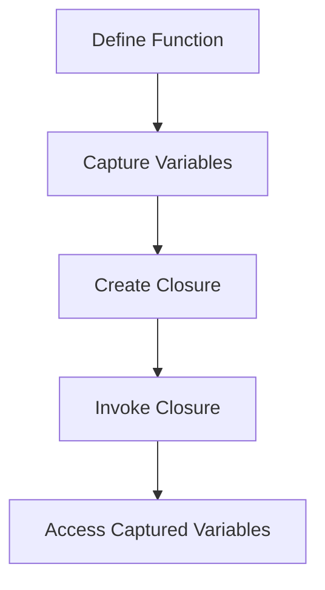

## 2.6. Anonymous Functions and Closures

In the realm of Elixir and functional programming, anonymous functions and closures are fundamental concepts that empower developers to write expressive, flexible, and reusable code. This section will guide you through understanding these concepts, illustrating their syntax, use cases, and practical applications in Elixir.

### Defining Anonymous Functions

Anonymous functions, often referred to as lambdas or function literals, are functions defined without a name. They are first-class citizens in Elixir, meaning they can be assigned to variables, passed as arguments, and returned from other functions.

#### Syntax and Use Cases for Anonymous Functions

In Elixir, anonymous functions are defined using the `fn` keyword, followed by a list of parameters, an arrow (`->`), and the function body. Here's a basic example:

```elixir
# Define an anonymous function that adds two numbers
add = fn (a, b) -> a + b end

# Call the anonymous function
result = add.(3, 5)
IO.puts(result) # Output: 8
```

**Key Points:**

- **Syntax**: Anonymous functions are enclosed within `fn` and `end`.
- **Invocation**: They are invoked using a dot (`.`) followed by parentheses.
- **Flexibility**: They can be defined inline and passed around like any other data type.

#### Passing Anonymous Functions as Arguments

One of the powerful features of anonymous functions is their ability to be passed as arguments to other functions. This is particularly useful for creating higher-order functions and callbacks.

```elixir
# Define a function that takes another function as an argument
defmodule Math do
  def calculate(a, b, func) do
    func.(a, b)
  end
end

# Use an anonymous function as an argument
result = Math.calculate(10, 5, fn (x, y) -> x * y end)
IO.puts(result) # Output: 50
```

**Use Cases:**

- **Callbacks**: Passing anonymous functions as callbacks for asynchronous operations.
- **Custom Iterators**: Creating custom iteration logic by passing functions to enumerators.

### Closures

Closures are a natural extension of anonymous functions. They are functions that capture and retain access to variables from their enclosing scope, even after that scope has exited.

#### Capturing and Retaining Access to Variables

When an anonymous function captures a variable from its surrounding context, it forms a closure. This allows the function to access and manipulate the captured variables even when executed outside their original scope.

```elixir
# Define a closure that captures a variable from its surrounding scope
defmodule Counter do
  def create_counter(initial_value) do
    fn () -> initial_value + 1 end
  end
end

counter = Counter.create_counter(10)
IO.puts(counter.()) # Output: 11
```

**Key Points:**

- **State Retention**: Closures allow functions to maintain state across invocations.
- **Encapsulation**: They encapsulate the captured environment, providing a form of data hiding.

#### Practical Applications of Closures in Elixir

Closures are particularly useful in scenarios where you need to maintain state or configuration across multiple function calls. They are often used in:

- **Event Handlers**: Maintaining context between events.
- **Partial Application**: Pre-filling some arguments of a function for later use.

### Use Cases

Anonymous functions and closures have a wide range of applications in Elixir, particularly in functional programming patterns.

#### Event Handlers

In event-driven programming, closures can be used to maintain context between events. For example, when handling user interactions in a web application, closures can retain user-specific data across multiple events.

```elixir
# Define an event handler using a closure
defmodule EventHandler do
  def handle_event(event, user_data) do
    fn () -> IO.puts("Handling #{event} for #{user_data}") end
  end
end

handler = EventHandler.handle_event("click", "User123")
handler.() # Output: Handling click for User123
```

#### Callbacks

Anonymous functions are commonly used as callbacks, allowing you to define custom behavior that can be executed at a later time or in response to certain events.

```elixir
# Define a callback function
callback = fn (result) -> IO.puts("Operation completed with result: #{result}") end

# Simulate an asynchronous operation
Task.async(fn -> :timer.sleep(1000); 42 end)
|> Task.await()
|> callback.()
```

#### Custom Iterators

By passing anonymous functions to enumerators, you can define custom iteration logic, making your code more expressive and reusable.

```elixir
# Define a custom iterator using an anonymous function
list = [1, 2, 3, 4, 5]
Enum.each(list, fn x -> IO.puts(x * 2) end)
```

### Visualizing Anonymous Functions and Closures

To better understand how anonymous functions and closures work, let's visualize their structure and behavior using a diagram.


```mermaid
graph TD;
    A[Define Function] --> B[Capture Variables];
    B --> C[Create Closure];
    C --> D[Invoke Closure];
    D --> E[Access Captured Variables];
```

**Diagram Description:** This flowchart illustrates the process of defining an anonymous function, capturing variables from the surrounding scope to create a closure, and then invoking the closure to access the captured variables.

### Try It Yourself

Experimenting with anonymous functions and closures is a great way to deepen your understanding. Try modifying the examples above:

- Change the captured variables in a closure and observe the effect.
- Pass different anonymous functions to the `Math.calculate/3` function.
- Create a closure that maintains a counter state and increments it with each call.

### References and Links

For further reading on anonymous functions and closures in Elixir, consider the following resources:

- [Elixir's Official Documentation on Functions](https://elixir-lang.org/getting-started/basic-types.html#anonymous-functions)
- [Functional Programming Concepts in Elixir](https://elixir-lang.org/getting-started/functional-programming.html)

### Knowledge Check

Before moving on, take a moment to reflect on what you've learned about anonymous functions and closures. Consider the following questions:

- How do anonymous functions differ from named functions in Elixir?
- What are some practical applications of closures in functional programming?
- How can you leverage closures to maintain state across function calls?

### Embrace the Journey

Remember, mastering anonymous functions and closures is just one step in your journey to becoming an expert Elixir developer. Keep experimenting, stay curious, and enjoy the process of learning and discovery!

## Quiz Time!



### What is the correct syntax for defining an anonymous function in Elixir?

- [x] `fn (a, b) -> a + b end`
- [ ] `function(a, b) { return a + b; }`
- [ ] `lambda(a, b) { a + b }`
- [ ] `def anonymous(a, b) do a + b end`

> **Explanation:** Anonymous functions in Elixir are defined using the `fn` keyword followed by parameters and the function body, ending with `end`.

### How do you invoke an anonymous function in Elixir?

- [x] Using a dot (`.`) followed by parentheses, e.g., `function.(args)`
- [ ] Using the `call` method, e.g., `function.call(args)`
- [ ] Directly like a named function, e.g., `function(args)`
- [ ] Using the `invoke` keyword, e.g., `invoke function(args)`

> **Explanation:** Anonymous functions in Elixir are invoked with a dot (`.`) followed by parentheses containing arguments.

### What is a closure in Elixir?

- [x] A function that captures variables from its surrounding scope
- [ ] A function that cannot access external variables
- [ ] A function that is defined within another function
- [ ] A function that returns another function

> **Explanation:** A closure is a function that captures and retains access to variables from its enclosing scope.

### What is a common use case for closures in Elixir?

- [x] Maintaining state across function calls
- [ ] Defining global variables
- [ ] Creating infinite loops
- [ ] Running asynchronous tasks

> **Explanation:** Closures are often used to maintain state or configuration across multiple function calls.

### How can anonymous functions be used in event handlers?

- [x] By capturing context data and using it in response to events
- [ ] By defining them globally
- [ ] By using them to create infinite loops
- [ ] By preventing state changes

> **Explanation:** Anonymous functions can capture context data, making them useful in event handlers to maintain state between events.

### Which keyword is used to define an anonymous function in Elixir?

- [x] `fn`
- [ ] `function`
- [ ] `lambda`
- [ ] `def`

> **Explanation:** The `fn` keyword is used to define anonymous functions in Elixir.

### How can you pass an anonymous function as an argument in Elixir?

- [x] By directly passing the function variable, e.g., `function_name.(args)`
- [ ] By converting it to a string
- [ ] By using the `call` method
- [ ] By defining it within the function call

> **Explanation:** Anonymous functions can be passed as arguments by directly referencing the function variable.

### What is the output of the following code?
```elixir
add = fn (a, b) -> a + b end
IO.puts(add.(2, 3))
```

- [x] 5
- [ ] 2
- [ ] 3
- [ ] 6

> **Explanation:** The anonymous function adds the two numbers, resulting in 5.

### Can closures modify the captured variables from their enclosing scope?

- [ ] True
- [x] False

> **Explanation:** In Elixir, closures can access but not modify the captured variables from their enclosing scope, as Elixir enforces immutability.

### What is a benefit of using anonymous functions in Elixir?

- [x] They allow for more concise and flexible code
- [ ] They replace all named functions
- [ ] They automatically optimize performance
- [ ] They prevent any form of state retention

> **Explanation:** Anonymous functions provide flexibility and conciseness, allowing developers to write more expressive code.



By understanding and mastering anonymous functions and closures, you are well on your way to leveraging the full power of Elixir's functional programming paradigm. Keep exploring, and you'll find endless possibilities to enhance your code!
